# 第一章 绪论

## 1.1 数据结构的基本概念

**数据：** 数据是信息的载体，是描述客观事物属性的数、字符及所有能输入到计算机中并被计算机程序识别和处理的符号的集合。数据是计算机程序加工的原料。

**数据元素：** 是数据的基本单位，通常作为一个整体进行考虑和处理。

**数据项：** 一个数据元素可由若干数据项组成，数据项是构成数据元素的不可分割的最小单位。

**数据对象：** 是==具有相同性质==的数据元素的集合，是数据的一个子集。

**数据结构：** 是相互之间存在一种或多种==特定关系==的数据元素的集合。**数据结构**是计算机中存储、组织数据的方式。


## 1.2 数据结构的三要素

<center> 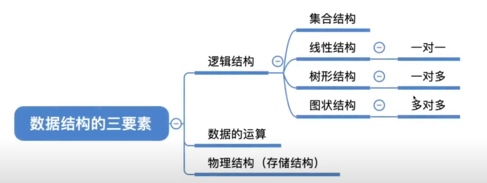 </center>


**集合结构：** 各个元素同属一个集合，别无其他关系

**线性结构：** 数据元素之间是一对一的关系。除了第一个元素，所有元素都有唯一的前驱；除了最后一个元素，所有元素都有唯一的后继。

**树形结构：** 数据元素之间是一对多的关系。

**图状结构：** 数据元素之间是多对多的关系。


**数据的运算：** 对于每一种特定的数据结构，定义出相应的数据操作。（例如：增删改查等）

**物理结构：** 数据在计算机内存中的实际存储方法，主要包括==顺序存储、链式存储、索引存储、散列存储==。数据的存储结构会影响存储空间分配的方便程度，会影响数据运算的速度。


## 1.3 数据类型、抽象数据类型

**数据类型：** 是一个==值的集合==和定义在此集合上的==一组操作==的总称。

- 原子类型，其值不可再分的数据类型。（例如：bool，int）
- 结构类型，其值可以再分的数据类型。（例如：struct结构体）

**抽象数据类型（Abstract Data Type）：** 是抽象数据组织及与之相关的操作。定义一个ADT实际上就是定义一个数据结构。


## 1.4 算法的基本概念

**算法：** 是对特定问题求解步骤的一种描述，它是指令的有限序列。

**算法的特性：** （有一个不满足，则不称之为算法）

- 有穷性 （在有限的步骤和时间内可以得到结果）
- 确定性 （对同一个输入，必须有同一个输出）
- 可行性 （算法可以通过编程来实现）
- 输入 （有0个或多个输入）
- 输出 （有1个或多个输出）


**“好算法”的特质：** 

- 正确性 （正确的求解问题）
- 可读性 （易于理解）
- 健壮性 （耐操，对非法输入能够正确的处理）
- 高效率和低存储量 （时间复杂度和空间复杂度低）


## 1.5 算法的时间复杂度

**什么是时间复杂度：** 算法的时间复杂度是一个函数，它定性的描述该算法的运行时间。

<center> 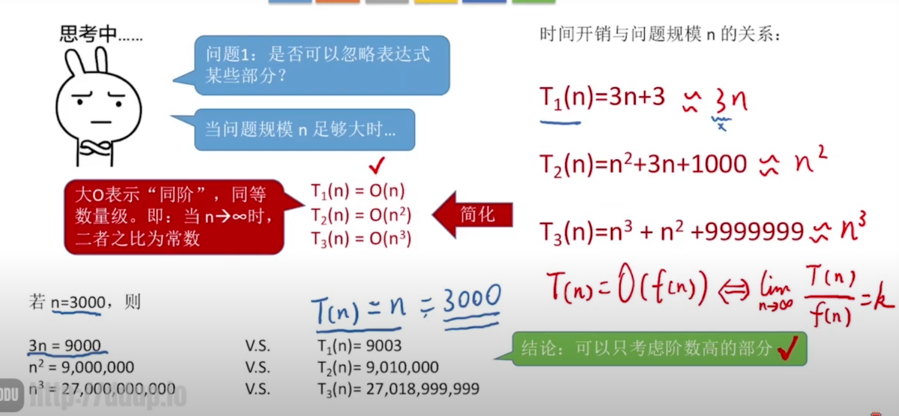</center>


- 加法规则：
    $$
    T(n) = T_1(n) + T_2(n)=O(f(n))+O(g(n))=O(max(f(n),g(n)))
    $$

- 乘法规则：
    $$
    T(n) = T_1(n)*T_2(n)=O(f(n))*O(g(n))=O(f(n)*g(n))
    $$
    

**算法的时间复杂度：** $O(1) < O(log_2n) < O(n) < O(nlog_2n) < O(n^2) < O(n^3) < O(2^n) < O(n!) < O(n^n)$

<center>
    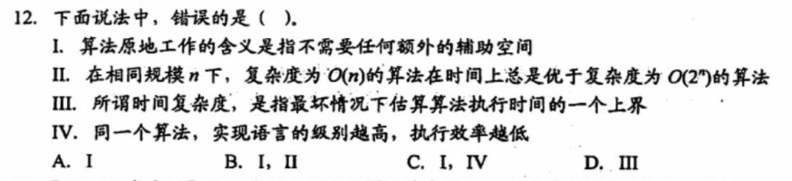
    <br>
    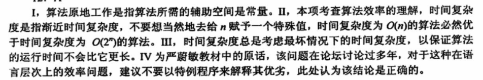
</center>


## 1.6 算法的空间复杂度

**算法原地工作：**指算法的空间复杂度为常数级。

案例：

<center> 
    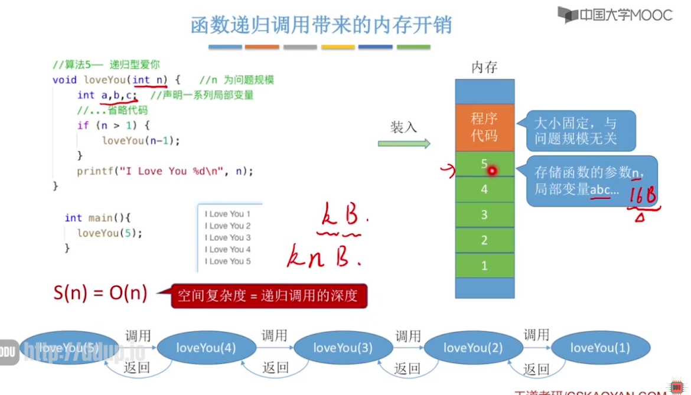
    <br><br>
    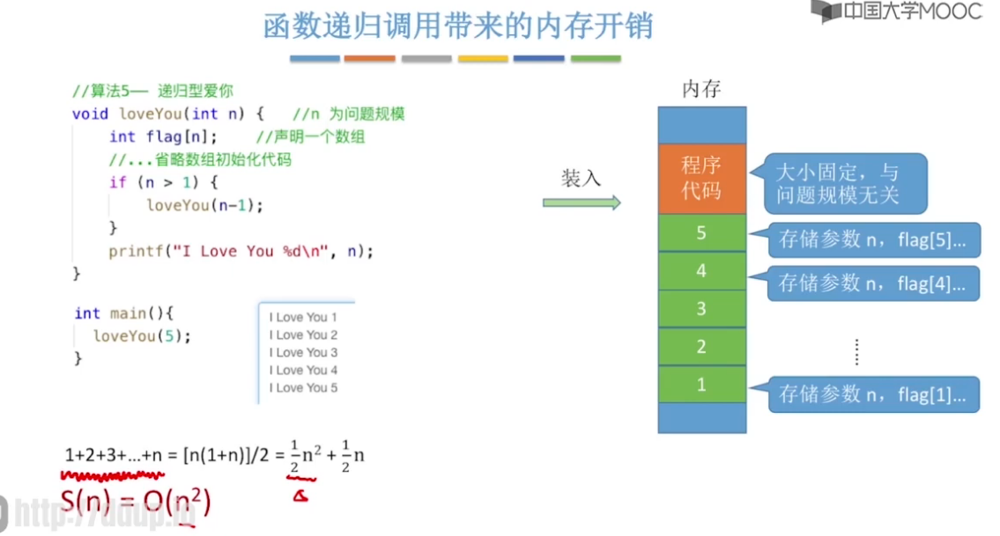
</center>


​    

# 第二章 线性表

## 2.1 线性表的定义

**定义：** 线性表是==具有相同数据类型==的n个数据元素的==有限序列==，其中n为表长。

- 每个元素所占用的空间一样大

- 有次序，且有限

Eg: 所有整数按递增次序排列是线性表吗？ 答：不是，因为不是有限。


## 2.2 顺序表

### 2.2.1 顺序表的定义

**定义:** 顺序表是指用顺序存储的方式实现线性表。

**顺序存储**指的是把逻辑上相邻的元素存储在物理位置上也相邻的存储单元中。

如果说线性表的定义是从逻辑结构的角度出发，那么顺序表的定义就是从物理结构的角度出发。


**顺序表的特点：** 

1. 随机存取，可以在$O(1)$时间内找到第$i$个元素
2. 存储密度高
3. 拓展容量不方便
4. 插入、删除操作不方便，需要移动大量元素

**补充：** 随机存取，亦称直接访问，代表同一时间访问一组序列中的一个随意元素。


### 2.2.2 顺序表的实现

<center> 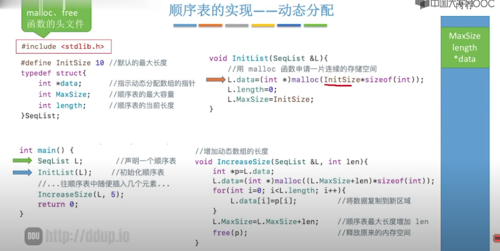</center>


### 2.2.3 顺序表的插入和删除

<center>
    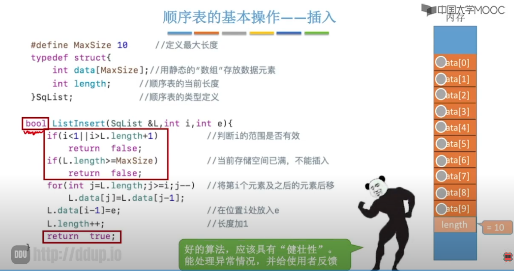
    <br>
    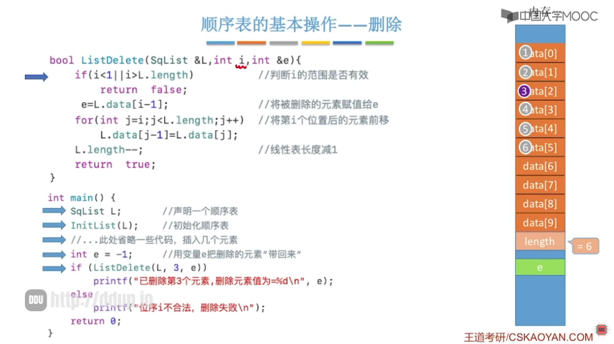
</center>


## 2.3 单链表

### 2.3.1 单链表的定义

**定义:** 单链表是指用链式存储的方式实现线性表。

 

**单链表的特点：** 

1. 不要求大片的连续空间，改变容量方便。
2. 不可随机存取
3. 需要耗费空间来存储指针


### 2.3.2 单链表的初始化

**初始化单链表：** 可以分为==带头结点的单链表==和==不带头结点的单链表==

```c++
// 带头结点的单链表
typedef struct LNode{
    ElemType data;
    struct LNode *next;
}LNode, *LinkList;

bool InitList(LinkList &L) { // 初始化
	/*  (DLinklist &L)这种写法是C++的引用变量声明，虽然(DLinklist <=> DNode *) 等价，但是不能写成(DNode * &L)因为这不是合法的声明变量形式。
		(int &a)是c++中声明引用变量的方式，这里的&不表示取地址。
		如果非得写成DNode * 的格式，则必须使用双指针。
	*/
    L = (LNode *) malloc(sizeof(LNode));
    if (L == NULL) {
        return false;
    }
    L -> next = NULL;
    return true;
}

bool Empty(LinkList L) { // 判空
    return (L -> next == NULL);
}
```


```c++
// 不带头结点的单链表
typedef struct LNode{
    ElemType data;
    struct LNode *next;
}LNode, *LinkList;

bool InitList(LinkList &L) {
    L = NULL;
    return true;
}

bool Empty(LinkList L) {
    return L == NULL;
}
```


### 2.3.3 单链表的插入

**单链表的插入操作：**可以分为前插操作和后插操作。其中后插操作比较简单，而前插操作稍微复杂一点。

**前插操作的两种实现方式：**（假设p结点为需要前插的结点）

1. 遍历单链表，找到P结点的前一个结点，对前一个结点进行后插操作
2. 创建一个新的结点，对p结点进行后插操作，然后将p结点的内容复制到新的结点中，将要插入的内容加到p结点上。

<center>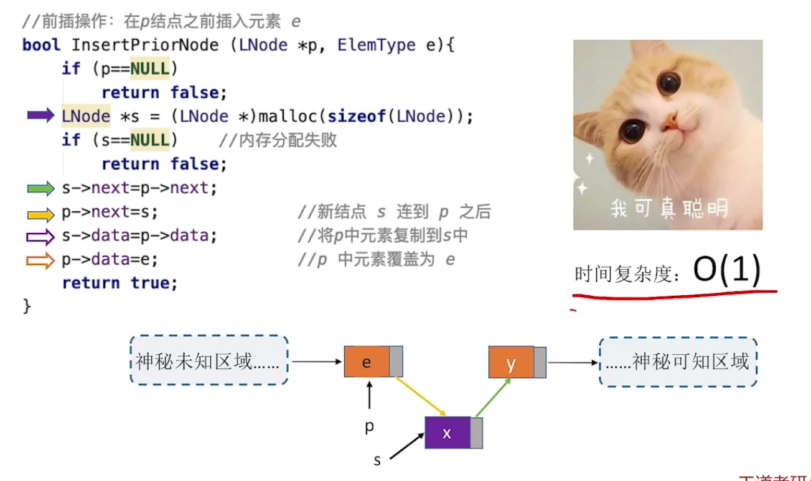</center>


### 2.3.4 单链表的删除操作

<center>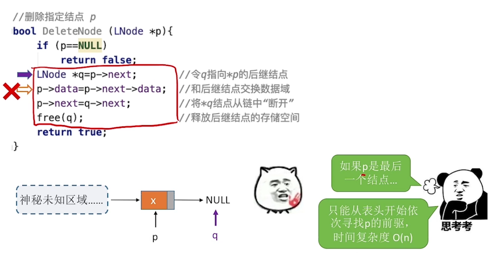</center>

**注意：**这种方式对最后一个节点的删除操作不适用。

### 2.3.5 单链表的建立

**尾插法建立单链表：**

<center>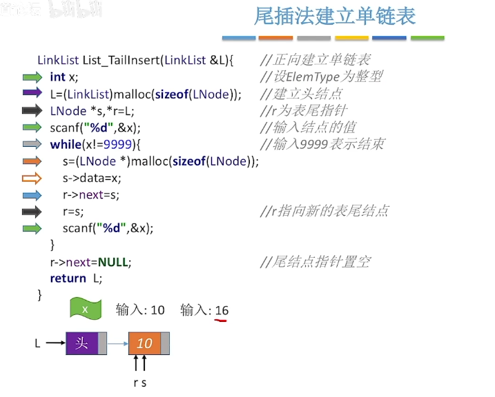</center>

**头插法建立单链表：** 重要应用是==单链表的逆置==

<center>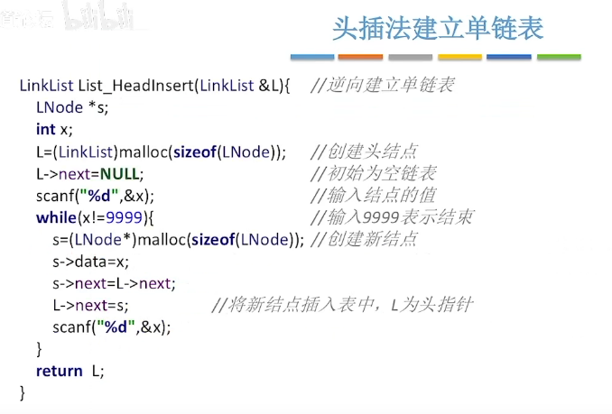</center>


```c
// 单链表的原地逆置操作
LinkList Reverse(LinkList l)
{
    ListNode* p;
    ListNode* s;
    p=l->next;
    s=p->next;
    l->next=NULL;
    while(p!=NULL)
    {
        p->next=l->next;
        l->next=p;
        p=s;
        if(p!=NULL)
           s=p->next;
    }
    return l;
}
```


##  2.4 双链表

### 2.4.1 双链表的初始化

**带头结点的双链表**

```c++
typedef struct DNode {
    ElemType data;
    struct DNode *prior, *next;
}DNode, *DLinklist;

bool InitDLinklist(DLinklist &L) { 
    L = (DNode *) malloc(sizeof(DNode));
    if (L == NULL) {
        return false;
    }
    L -> prior = NULL;
    L -> next = NULL;
    return true;
}

bool Empty(DLinklist L) {
    if (L -> next == NULL) {
        return true;
    }
    return false;
}

void testDLinklist() {
	DLinklist L;
    InitDLinklist(L);
}
```


### 2.4.2 双链表的插入

<center>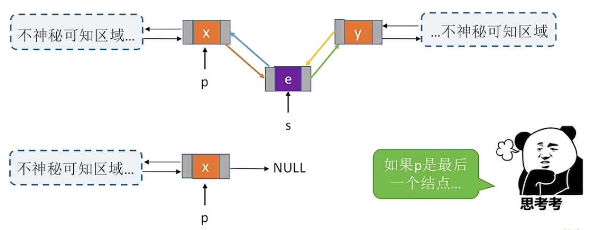</center>

**后插操作：**

```c++
bool InsertNextDNode(DNode *p, DNode *s) {
    if (p == NULL || s == NULL) {
        return false;
    }
    s -> next = p -> next;
    if (p -> next != NULL) { // 针对在最后一个结点插入的特殊情况。
        p -> next -> prior = s;
    }
    s -> prior = p;
    p -> next = s;
    return true;
}
```


**前插操作：**

双链表的前插操作可以充分利用双链表的特性，首先，利用前向指针找到前一个结点，然后对前一个结点执行后插操作即可。


### 2.4.3 双链表的删除

<center>
    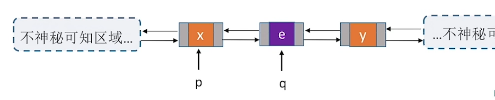
	<br><br>
    
    <br><br>
    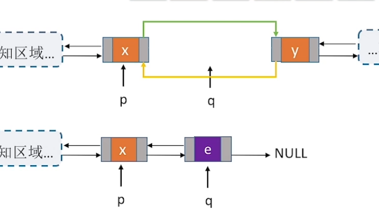</center> 

```c++
// 删除p结点的后继节点
bool DeleteNextDNode(DNode *p) {
    if (p == NULL) {
        return false;
    }
    DNode *q = p -> next;
    if (q == NULL) {
        return false;
    }
    p -> next = q -> next;
    if (q -> next != NULL) { // 针对删除最后一个结点的特殊情况。
        q -> next -> prior = p;
    }
    free(q);
    return true;
}

// 双链表的销毁
bool DestoryList(DLinklist &L) {
    while(L -> next != NULL) {
        DeleteNextDNode(L);
    }
    free(L);
    L = NULL;
}
```


## 2.5 循环链表

### 2.5.1 循环单链表

#### 2.5.1.1 初始化及判空

循环单链表的初始化操作和单链表的初始化操作类似，只不过单链表初始化时头结点的next指针指向NULL，而循环单链表的头结点的next指针指向自身。

<center>
    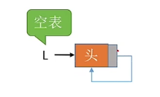
    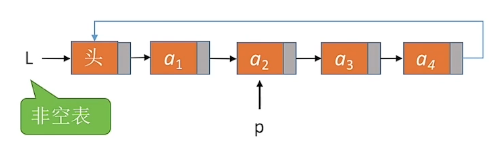
</center>


```c++
typedef struct LNode {
	ElemType data;
    struct LNode *next;
}LNode, *LinkList;

bool InitList(LinkList &L) {
    L = (LNode *) malloc(sizeof(LNode));
    if (L == NULL) {
        return false;
    }
    L -> next = L;
    return true;
}

bool Empty(LinkList L) {
    if (L -> next == L) {
        return true;
    }
    return false;
}
```


### 2.5.2 循环双链表

#### 2.5.2.1 初始化及判空

<center>
    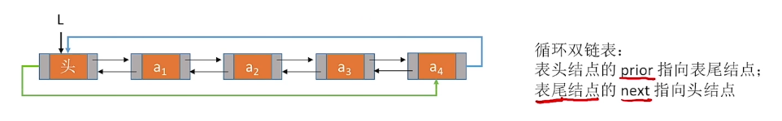
</center>

```c++
typedef struct DNode {
    ElemType data;
    struct DNode *prior, *next;
}DNode, *DLinklist;

bool InitDLinklist(DLinklist &L) { 
    L = (DNode *) malloc(sizeof(DNode));
    if (L == NULL) {
        return false;
    }
    L -> prior = L;
    L -> next = L;
    return true;
}

bool Empty(DLinklist L) {
    if (L -> next == L) {
        return true;
    }
    return false;
}
```


#### 2.5.2.2 插入和删除操作

在双链表的插入和删除中，我们均需要对==最后一个结点==进行特殊的处理，但是在循环双链表中，则不需要对其特殊处理

<center>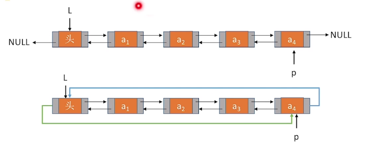</center>

```c++
bool InsertNextDNode(DNode *p, DNode *s) { // 将s结点插入到p结点之后
    s -> next = p -> next;
    s -> next -> prior = s;
    s -> prior = p;
    p -> next = s;
}
```

<center>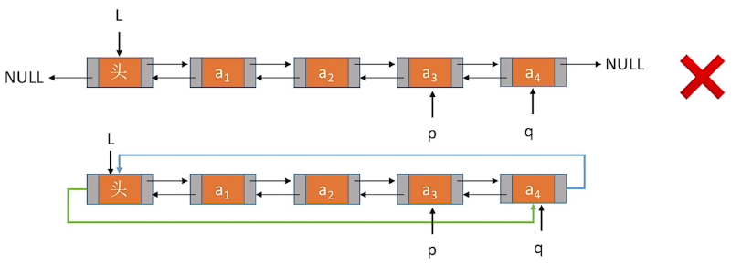</center>

```c++
bool DeleteNextNode(DNode *p) { // 删除p结点的后继结点q
    DNode *q = p -> next;
    p -> next = q -> next;
    q -> next -> prior = p;
    free(q);
}
```


## 2.6 静态链表

### 2.6.1 静态链表的定义

**静态链表是用数组的方式实现的链表**

优点：增删操作不需要大量移动元素

缺点：不能随机存取，只能从头结点开始依次往后查找；容量固定不可变

适用场景：

1. 不支持指针的低级语言
2. 数据元素数量固定不变的场景

<center>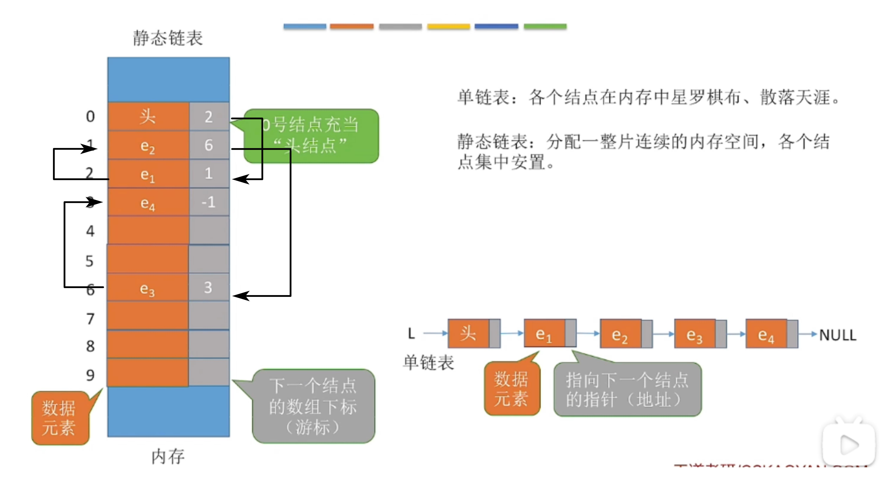</center>

```c++
# define MaxSize 10
struct Node{
    ElemType data;
    int next;
};

void testSLinkList() {
    struct Node a[MaxSize];
    // 后续代码
}

// 另外一种等价方式
# define MaxSize 10
typedef struct Node{
    ElemType data;
    int next;
} SLinkList[MaxSize];

void testSLinkList() {
    SLinkList a;
    // 后续代码
}

// 也就是说 struct Node a[MaxSize] <==> SLinkList a;
```


### 2.6.2 静态链表的操作

<center>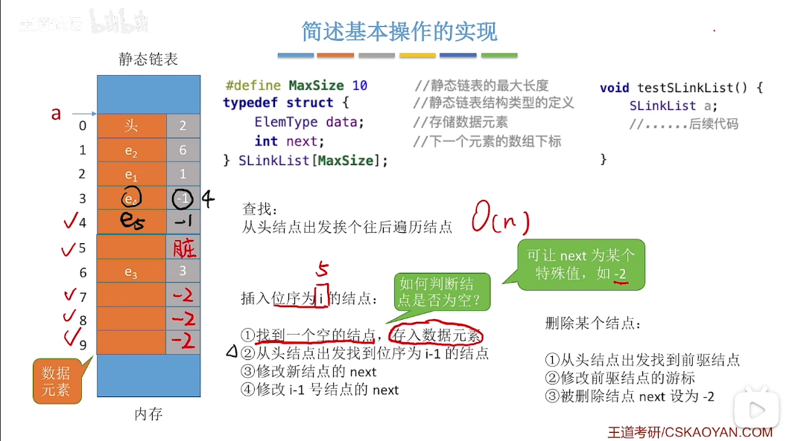</center>


## 2.7 小结

顺序表和链表的==逻辑结构==都是线性结构，都属于线性表。但是两者的==存储结构==不同：顺序表采用顺序存储，具有随机存取和存储密度高的优点，同时也有改变容量不方便的缺点；链表采用链式存储，具有改变容量方便的优点，同时也有不可随机存取和存储密度低的缺点。

由于采用不同的存储结构，因此两者的基本操作的实现效率也有所不同：

1. 初始化：
    - 顺序表需要预分配大片连续空间，若分配空间过小则后期拓容不便，若分配空间过大则浪费内存资源
    - 链表只需分配一个头结点，之后方便拓展
2. 销毁
    - 采用静态分配的顺序表使用完之后由系统自动回收空间，采用动态分配的顺序表需要手动free
    - 链表则需要依次删除各个结点
3. 增删
    - 顺序表插入和删除元素都需要将后续元素进行移动，时间复杂度为O(n)
    - 链表插入和删除元素只需要修改指针即可，虽然时间复杂度也为O(n)，但是主要来自查找目标元素上。
4. 查找
    - 顺序表按位查找的时间复杂度为O(1)，按值查找的时间复杂度为O(n)
    - 链表按位查找和按值查找的时间复杂度均为O(n)

**当表长难以估计、经常需要增删元素时---------> 链表**

**当表长可以估计、经常需要查询元素时---------> 顺序表**


# 第三章 栈和队列

## 3.1 栈的基本概念

### 3.1.1 栈的定义

**栈**是只允许在一端进行插入和删除操作的线性表。

栈顶：允许插入和删除的一端

栈底：不允许插入和删除的一端

栈的特点：后进先出（LIFO）

### 3.1.2 栈的基本操作

<center> 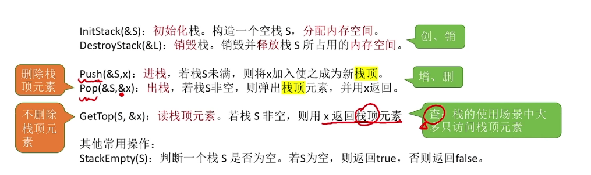</center>


🎈Tip: n个不同元素进栈，出栈元素的不同排列的个数为$\frac{1}{n+1}C^n_{2n}$


## 3.2 顺序栈

### 3.2.1 顺序栈的初始化

```c++
#define MaxSize 10
typedef struct {
	ElemType data[MaxSize];
    int top;
} SqStack;

void InitStack(SqStack &S) {  // 初始化栈顶指针
    S.top = -1;
}

bool StackEmpty(SqStack S) { // 判断栈空
    return S.top == -1;
}

void testStack() {
    SqStack S;
    InitStack(S);
}
```


### 3.2.2 进栈、出栈操作

```c++
bool Push(SqStack &S, ElemType x) {
    if (S.top == MaxSize - 1) {
        return false;
    }
    S.data[++S.top] = x;
    return true;
}

bool Pop(SqStack &S, ElemType &x) {
    if (S.top == -1) {
        return false;
    }
    x = S.data[S.top--];
    return true;
}
```


### 3.2.3 共享栈

<center>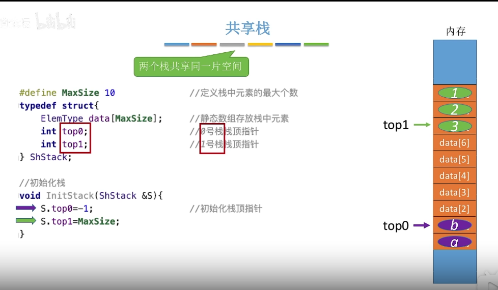</center>


## 3.3 链栈

用链式存储的栈本质上就是一个==单链表==，只不过我们要求它只能够对==头结点==进行插入和删除操作。


### 3.3.1 带头结点的链栈

```c++
typedef struct SNode {
    ElemType data;
    struct SNode *next;
} SNode, *LinkStack;

bool InitStack(LinkStack &L) { // 初始化
    L = (SNode *)malloc(sizeof(SNode));
    if (L == NULL) {
        return false;
    }
    L -> next = NULL;
    return true;
}

bool StackEmpty(LinkStack L) { // 判断栈空
    return L -> next == NULL;
}

bool Push(LinkStack &L, ElemType x) { // 进栈
    SNode *S = (SNode *)malloc(sizeof(SNode));
    if (S == NULL) {
        return false;
    }
    S -> data = x;
    S -> next = L -> next;
    L -> next = S;
    return true;
}

bool Pop(LinkStack &L, ElemType &x) { // 出栈操作
    if (StackEmpty(L)) {
        return false;
    }
    SNode *p = L -> next;
    x = p -> data;
    L -> next = p -> next;
    free(p);
    return true;
}

bool GetTop(LinkStack L, ElemType &x) { //获取栈顶元素
    if (StackEmpty(L)) {
        return false;
    }
    x = L -> next -> data;
    return true;
}
```


### 3.3.2 不带头结点的栈

```c++
typedef struct SNode {
    ElemType data;
    struct SNode *next;
} SNode, *LinkStack;

bool InitStack(LinkStack &L) {
    L = NULL;
    return true;
}

bool StackEmpty(LinkStack L) {
    return L == NULL;
}

bool Push(LinkStack &L, ElemType x) {
    SNode *S = (SNode *)malloc(sizeof(SNode));
    if (S == NULL) {
        return false;
    }
    S -> data = x;
    S -> next = L;
    L = S;
    return true;
}

bool Pop(LinkStack &L, ElemType &x) {
    if (StackEmpty(L)) {
        return false;
    }
    SNode *p = L;
    x = L -> data;
    L = L -> next;
    free(p);
    return true;
}

bool GetTop(LinkStack L, ElemType x) {
    if (StackEmpty(L)) {
        return false;
    }
    x = L -> data;
    return true;
}
```


## 3.4 栈在括号匹配中的应用

<center>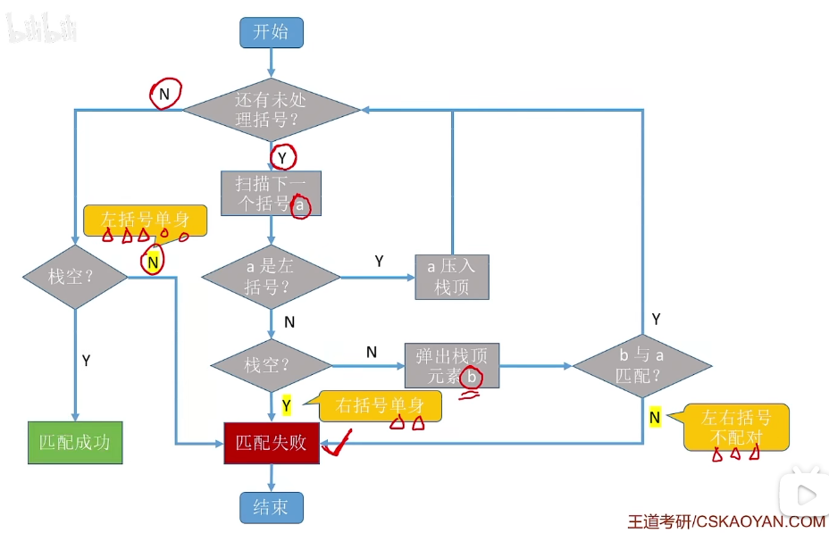</center>

```c++
#define MaxSize 20

typedef struct {
    char data[MaxSize];
    int top;
} Stack;

void InitStack(Stack &S) {
    S.top = -1;
}

bool IsEmpty(Stack S) {
    return S.top == -1;
}

bool Push(Stack &S, char x) {
    if (S.top == MaxSize - 1) {
        return false;
    }
    S.data[++S.top] = x;
    return true;
}

bool Pop(Stack &S, char &x) {
    if (IsEmpty(S)) {
        return false;
    }
    x = S.data[S.top--];
    return true;
}

bool bracketCheck(char str[], int length) {
    Stack S;
    InitStack(S);
    for (int i = 0; i < length; ++i) {
        if (str[i] == '{' || str[i] == '(' || str[i] == '[') { // 遇到左括号就进栈
            Push(S, str[i]);
        } else {
            if (IsEmpty(S)) { // 遇到右括号，但是栈已空，说明无法匹配
                return false;
            } else { // 遇到右括号，且栈未空，弹出栈顶元素
                char temp;
                Pop(S, temp);
                if (temp == '(' && str[i] != ')') { // 如果栈顶元素和str[i]不匹配，则失败
                    return false;
                } else if (temp == '[' && str[i] != ']') { // 如果栈顶元素和str[i]不匹配，则失败
                    return false;
                } else if (temp == '{' && str[i] != '}') { // 如果栈顶元素和str[i]不匹配，则失败
                    return false;
                }
            }
        }
    }
    return IsEmpty(S); // 匹配成功
}
```


## 3.5 栈在表达式求值中的应用

- 中缀表达式：a+b+c*d
- 后缀表达式（逆波兰式）：ab+cd*+
- 前缀表达式（波兰式）：++ab*cd


### 3.5.1 后缀表达式的获取与计算

<center>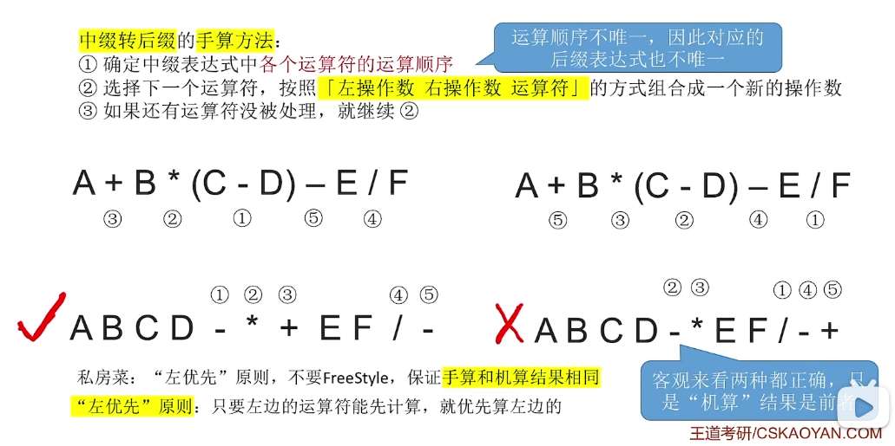</center>

<center>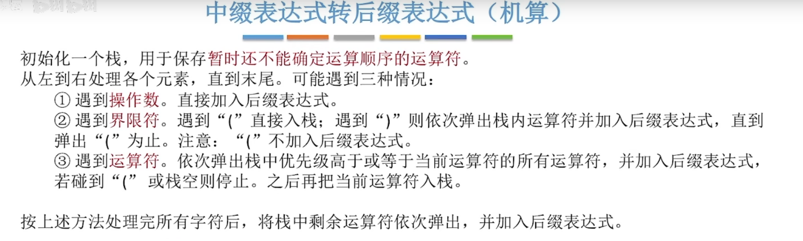</center>

<center>
    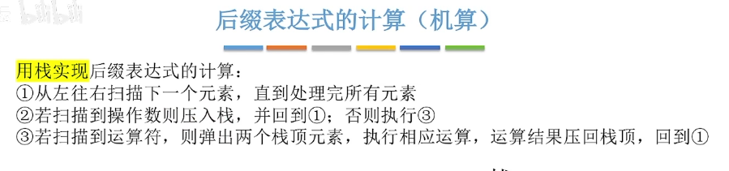
    <br>
    <b><font size = 5 color = "green">注意，先出栈的是右操作数</font></b>
</center>


### 3.5.2 前缀表达式的获取与计算

<center>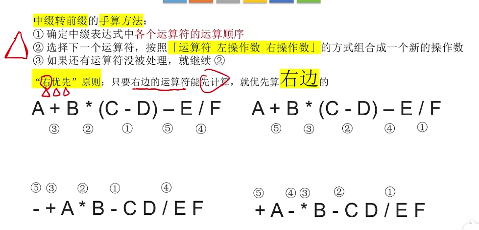</center>

<center>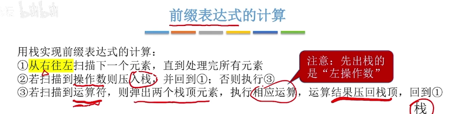
<br>
    <b><font size = 5 color = "green">注意，先出栈的是左操作数</font></b>
</center>


### 3.5.3 中缀表达式的计算

<center>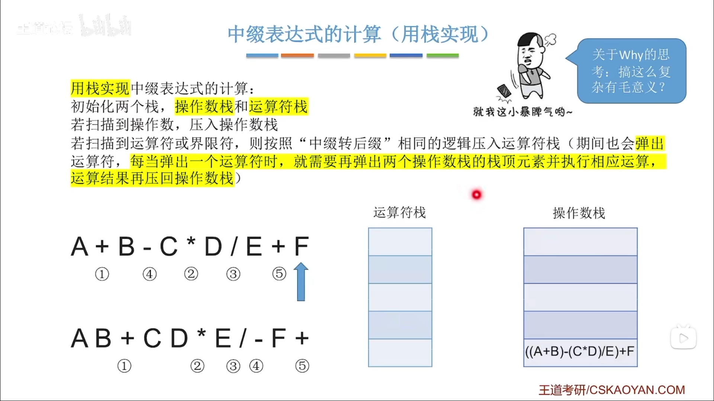</center>


## 3.6 栈在递归中的应用

**递归算法的思想：** 把原始问题转化成**属性相同，但规模较小**的问题。

<center>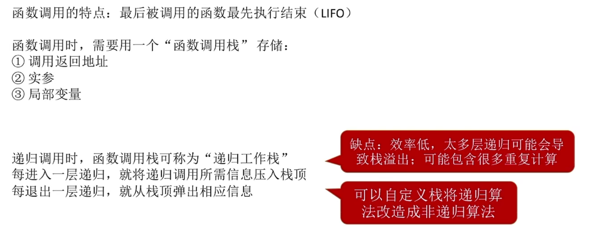</center>


## 3.7 队列的基本概念

### 3.7.1 队列的定义

**队列**是只允许在一端进行插入，在另一端删除的==线性表==。

队列的特点：先进先出(FIFO)


### 3.7.2 队列的基本操作

<center>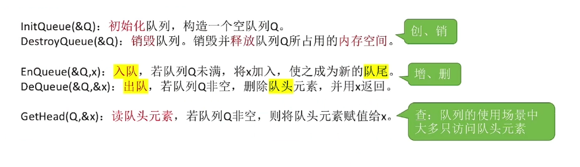</center>


## 3.8 顺序队列

### 3.8.1 顺序队列的初始化

```c++
#define MaxSize 10

typedef struct {
    ElemType data[MaxSize];
    int front, rear;
} SqQueue;

void InitQueue(SqQueue &Q) { // 初始化
    Q -> front = 0;
    Q -> rear = 0;
}

bool QueueEmpty(SqQueue Q) { // 判空
    return Q -> front == Q -> rear;
}
```


### 3.8.2 入队、出队操作

<center>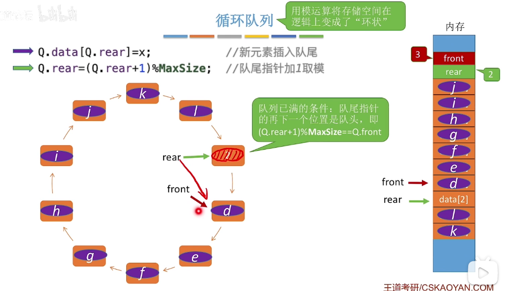</center>

当我们对队列进行入队和出队操作时，不免会出现如下图所示的情况，这样就产生了几个问题：

1. 当rear指向最后一个存储空间时(如下图b所示)，如果继续入队(假设队列未满)，此时该如何调整rear指针的指向？
2. 如何判断一个队列存满？

针对如上问题，分析如下：

1. 当rear指针指向8时，我们如果再添加元素，则此时rear指针应该指向0。针对这种需求，我们只要对rear + 1然后让其==对MaxSize取余==即可满足需要。
2. 我们在初始化队列时，确定了判断队空的条件为`front == rear`，那么当队满的时候该如何判断呢？我们规定当`rear + 1 == front`时队满，如下图d所示，不难看出此时静态数组中还有一个剩余空间，但是这种浪费是有必要的。因为如果将其存满，则`rear == front`，这就与队空的条件一致，这样做的后果就是无法区分队空和队满。

<center></center>


```c++
bool QueueFull(SqQueue Q) { // 判满
    if ((Q.rear + 1) % MaxSize == Q.front) {
        return true;
    }
    return false;
}

bool EnQueue(SqQueue &Q, ElemType x) { // 入队操作
    if (QueueFull(Q)) {
        return false;
    }
    Q.data[Q.rear] = x;
    Q.rear = (Q.rear + 1) % MaxSize;
    return true;
}

bool DeQueue(SqQueue &Q, ElemType &x) { // 出队操作
    if (QueueEmpty(Q)) {
        return false;
    }
    x = Q.data[Q.front];
    Q.front = (Q.front + 1) % MaxSize;
    return true;
}
```


### 3.8.3 求取队列中元素的个数

```c++
int Count(SqQueue Q) { // 求取队列中元素的个数
    return (Q.rear + MaxSize - Q.front) % MaxSize;
}
```


### 3.8.4 判空、判满的其他方式

在上面的代码中，我们为了区分判空和判满的条件，不得不舍弃一个存储空间。那么有没有一种方法可以避免这种浪费呢？

答：有，且不止一个。

第一种方式，请看如下代码：

```c++
#define MaxSize 10

typedef struct {
    ElemType data[MaxSize];
    int front, rear;
    int size; // 队列当前长度,当插入成功时size++,当删除成功时size--
} SqQueue;

void InitQueue(SqQueue &Q) { // 初始化
    Q -> front = 0;
    Q -> rear = 0;
    Q -> size = 0;
}

bool QueueEmpty(SqQueue Q) { // 判空
    if (Q.front == Q.rear && Q.size == 0) {
        return true;
    }
    return false;
}

bool QueueFull(SqQueue Q) { // 判满
    if (Q.front == Q.rear && Q.size == MaxSize) {
        return true;
    }
    return false;
}
```


第二种方式，懒得写代码了，请看图：

<center></center>


### 3.8.5 顺序队列的另一种实现方式⭐

<center>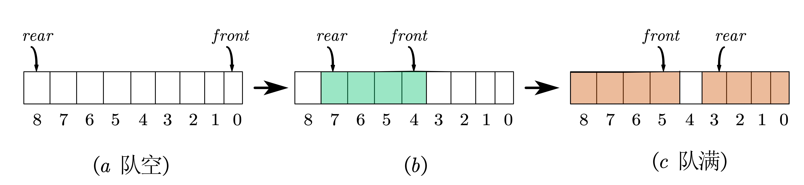</center>

此时判断队空和队满的方式有了些许改变，但是也存在着浪费空间和不浪费空间的几种方法。

```c++
#define MaxSize 10

typedef struct {
    ElemType data[MaxSize];
    int front, rear;
} SqQueue;

void InitQueue(SqQueue &Q) { // 初始化
    Q -> front = 0;
    Q -> rear = MaxSize - 1;
}

bool QueueEmpty(SqQueue Q) { // 判空
    if ((Q.rear + 1) % MaxSize == Q.front) {
        return true;
    }
    return false;
}

bool QueueFull(SqQueue Q) { // 判满
    if ((Q.rear + 2) % MaxSize == Q.front) {
        return true;
    }
    return false;
}
```


## 3.9 链式队列

用链式存储的队列本质上也是一个==单链表==，只不过我们要求它只能够对==头结点==进行删除操作，对==尾结点==进行插入操作。

此时我们要思考一个问题：为什么不能是对头结点进行插入操作，对尾结点进行删除操作呢？其实在刚开始我还真是这么想的，但是敲了一遍代码后(尤其是出队操作)发现，事情不是这么简单。原因就在于对链表的尾结点进行删除操作它的时间复杂度为$O(n)$，请参见**2.3.4**

### 3.9.1 带头结点的链式队列

```c++
typedef struct LinkNode{
    ElemType data;
    struct LinkNode *next;
} LinkNode;

typedef struct {
    LinkNode *front, *rear;
} LinkQueue;

void InitQueue(LinkQueue &Q) {
    Q.front = Q.rear = (LinkNode *) malloc(sizeof (LinkNode));
    Q.front->next = NULL;
}

bool IsEmpty(LinkQueue Q) {
    if (Q.front == Q.rear) {
        return true;
    }
    return false;
}

bool EnQueue(LinkQueue &Q, ElemType x) { // 入队，头删尾插，rear指向链尾，front指向链头
    LinkNode *s = (LinkNode *) malloc(sizeof (LinkNode));
    if (s == NULL) {
        return false;
    }
    s->data = x;
    s->next = Q.rear->next;
    Q.rear->next = s;
    Q.rear = s;
    return true;
}

bool DeQueue(LinkQueue &Q, ElemType &x) {
    if (IsEmpty(Q)) {
        return false;
    }
    LinkNode *p = Q.front->next;
    x = p->data;
    Q.front->next = p->next;
    free(p);
    return true;
}

```


### 3.9.2 不带头结点的链式队列

```c++
typedef struct LinkNode{
    ElemType data;
    struct LinkNode *next;
} LinkNode;

typedef struct {
    LinkNode *front, *rear;
} LinkQueue;

void InitQueue(LinkQueue &Q) {
    Q.front = NULL;
    Q.rear = NULL;
}

bool IsEmpty(LinkQueue Q) {
    if (Q.front == NULL) {
        return true;
    }
    return false;
}

bool EnQueue(LinkQueue &Q, ElemType x) { // 入队
    LinkNode *s = (LinkNode *) malloc(sizeof (LinkNode));
    if (s == NULL) {
        return false;
    }
    s->data = x;
    s->next = NULL;
    if (Q.front == NULL) { // 第一个结点入队
        Q.front = s;
        Q.rear = s;
    } else {
        Q.rear->next = s;
        Q.rear = s;
    }
    return true;
}

bool DeQueue(LinkQueue &Q, ElemType &x) {
    if (IsEmpty(Q)) {
        return false;
    }
    LinkNode *p = Q.front;
    x = p->data;
    Q.front = p->next;
    if (Q.rear == p) { // 最后一个结点出队
        Q.front = NULL;
        Q.rear = NULL;
    }
    free(p);
    return true;
}
```


## 3.10 双端队列

<center>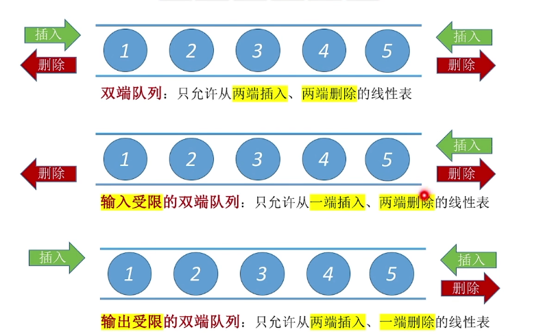</center>

双端队列的一个常见问题是：判断输出序列的合法性

对于双端队列来说，<u>只要栈能满足的序列则双端队列一定可以满足</u>，因此我们可以先用栈来初步确定输出序列是否合法。但是栈不满足的序列，在双端序列中则不一定。


# 第四章 特殊矩阵的压缩存储

## 4.1 一维数组的存储结构

<center>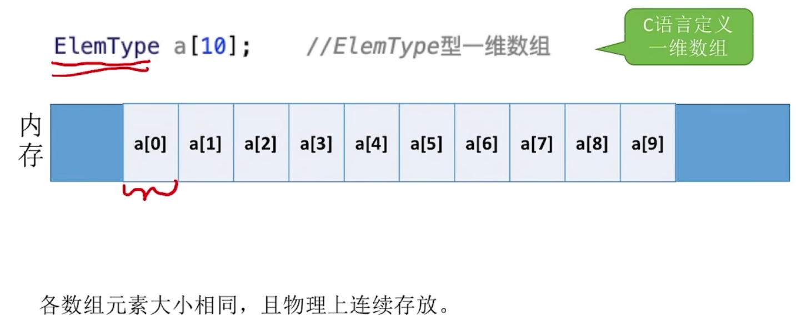</center>

## 4.2 二维数组的存储结构

<center>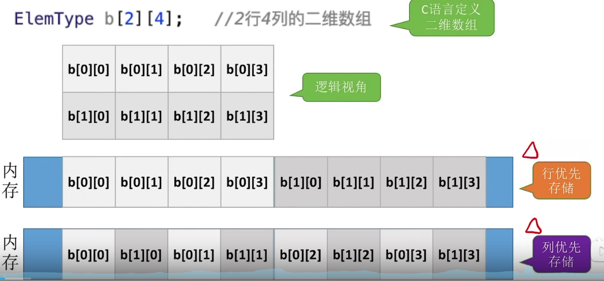</center>

- 在$M*N$的二维数组中，若按照==行优先==存储，则`b[i][j]`的物理地址为：$LOC + (i*N + j)*sizeof(ElemType)$
- 在$M*N$的二维数组中，若按照==列优先==存储，则`b[i][j]`的物理地址为：$LOC + (j*M + i)*sizeof(ElemType)$


## 4.3 对称矩阵的压缩存储

**对称矩阵的定义**： 若n阶方阵中，任意一个元素$a_{i,j}$有$a_{i,j} = a_[j, i]$, 则称该矩阵为对称矩阵

<center>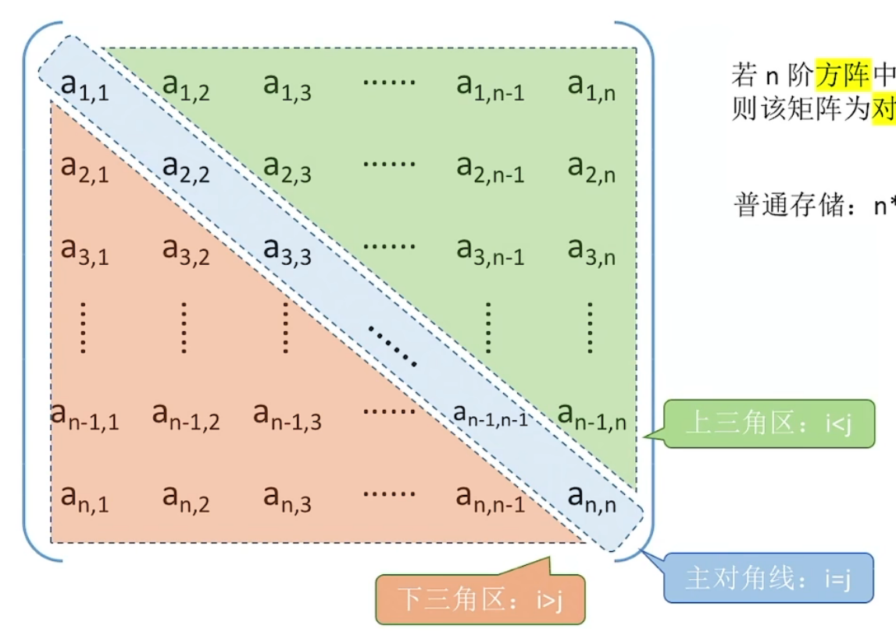</center>

**存储策略：** (具体情况具体分析，下面的式子只是举一个例子)

1. 只存储主对角线和下三角区
    - 按照行优先原则，将各个元素存储到一维数组中
        - 一维数组长度设置为：$\dfrac{(n+1)*n}{2}$
        - $a_{i,j}$是第几个元素：$\dfrac{i*(i - 1)}{2} + j$
        - 如果一维数组下标从0开始，则$a_{i,j}$将存放在$\dfrac{i*(i - 1)}{2} + j - 1$的位置上
    - 按照==列优先==原则，将各个元素存储到一维数组中
        - $a_{i,j}$是第几个元素：$[n + (n - 1) + .... + (n - j + 2)] + (i - j) + 1$
2. 只存储主对角线和上三角区
    - 按照行优先原则，将各个元素存储到一维数组中
    - 按照列优先原则，将各个元素存储到一维数组中


## 4.4 三角矩阵的压缩存储

<center>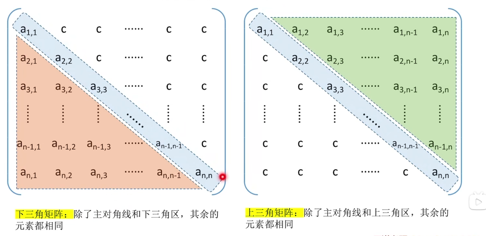</center>

**存储策略：**

- 按行优先原则存储下三角区
    - 一维数组长度设置为：$\dfrac{(n+1)*n}{2} + 1$，多出来的一个存储空间存放常量c
    - $a_{i,j}$​是第几个元素： $k=\begin{cases}\frac{i(i - 1)}{2} + j - 1 & \text{i >= j}\\\frac{n(n+1)}{2} & \text{i < j}\end{cases}$
- 按行优先原则存储上三角区
    - 一维数组长度设置为：$\dfrac{(n+1)*n}{2} + 1$，多出来的一个存储空间存放常量c
    - $a_{i,j}$​是第几个元素： $k=\begin{cases}\frac{(i - 1)(2n - i + 2)}{2} + (j - i) & \text{i <= j}\\\frac{n(n+1)}{2} & \text{i > j}\end{cases}$


## 4.5 三对角矩阵的压缩存储

<center>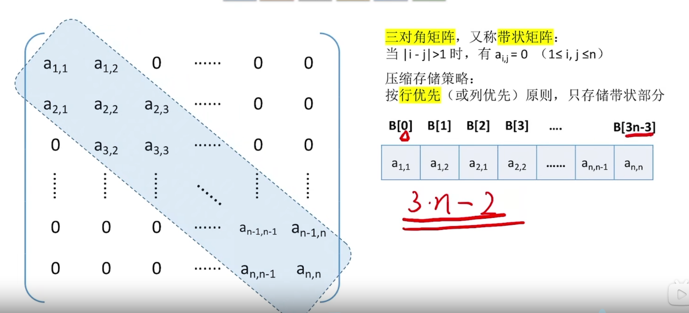</center>

**存储策略：**

按照行优先原则，$a_{i，j}$是第几个元素：

1. 前$i-1$行共有$3(i - 1) - 1$个元素
2. $a_{i,j}$是第$i$行的第$j - i + 2$个元素
3. 所以，$a_{i,j}$是第$2i + j - 2$个元素
4. 因此：$k = 2i + j - 3$

<center></center>


## 4.6 稀疏矩阵的压缩存储

<center>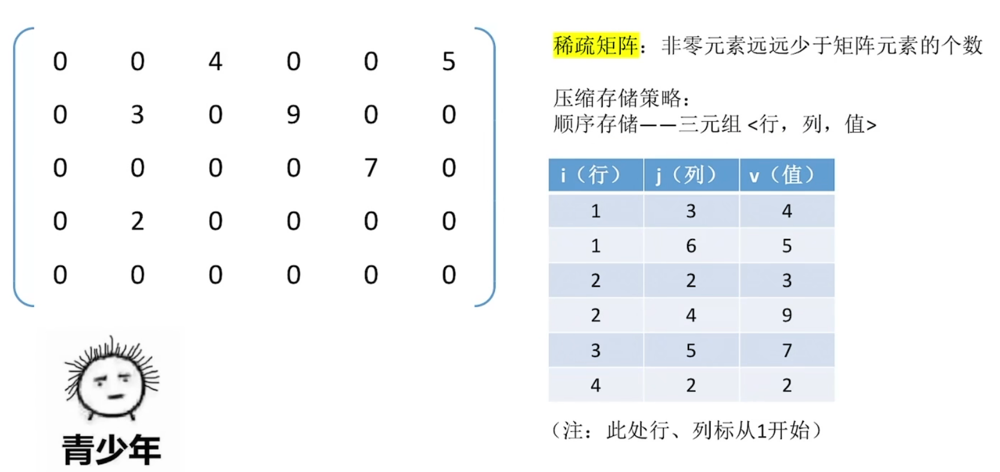</center>

<center>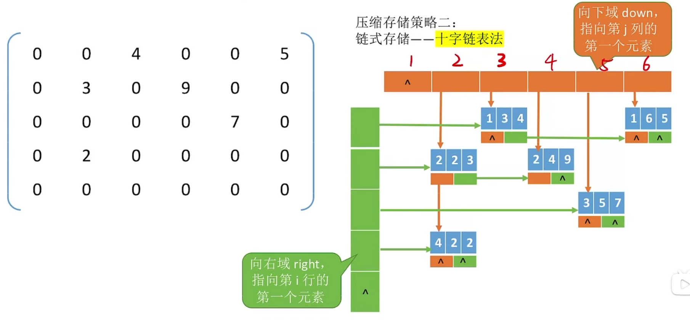</center>


## 4.7 小结

<center>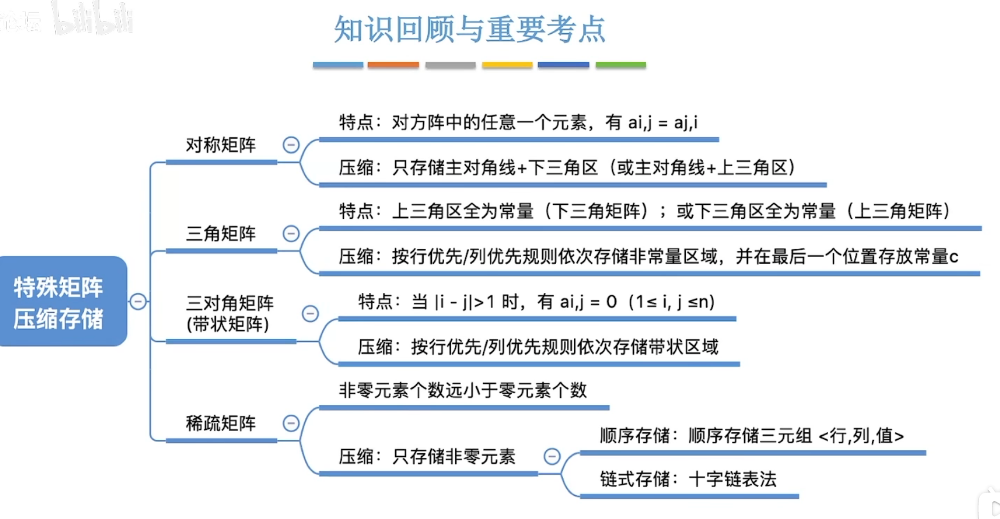</center>


# 第五章 串

## 5.1 串的定义

**串：** 即字符串，是由零个或多个字符组成的有限序列。

**子串:** 串中任意个连续的字符组成的子序列


<center>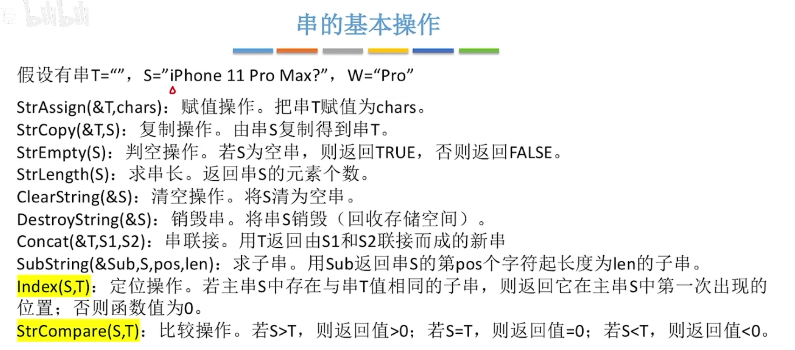</center>


## 5.2 串的顺序存储

<center>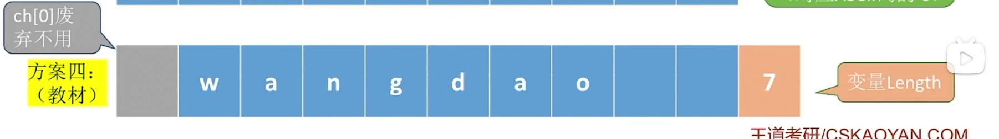</center>

```c++
#define MAXLEN 255

// 静态数组实现（定长顺序存储）
typedef struct {
    char ch[MAXLEN];
    int length;
}SString;

/*
// 动态数组实现（堆分配存储） 需要手动free
typedef struct {
    char *ch;
    int length;
}HString;

HString S;
S.ch = (char *)malloc(MAXLEN * sizeof(char));
S.length = 0;
*/

void StrAssign(SString &S, char chars[], int charLen) {
    int i = 0;
    while (i < charLen) {
        S.ch[i + 1] = chars[i];
        i ++;
        S.length ++;
    }
}

bool SubString(SString &sub, SString S, int pos, int len) { // 求字串
    // 判断字串是否越界
    if (pos + len - 1 > S.length) {
        return false;
    }
    // 将S中的字串复制到sub中
    for (int i = pos; i < pos + len; ++i) {
        sub.ch[i - pos + 1] = S.ch[i];
    }
    sub.length = len;
    return true;
}

int StrCompare(SString S, SString T) { // 比较字符串大小
    for (int i = 1; i <= S.length && i <= T.length; ++i) {
        if (S.ch[i] != T.ch[i]) {
            return S.ch[i] - T.ch[i];
        }
    }
    // 如果扫描过的字符串都相同，则长度更长的字符串更大
    return S.length - T.length;
}

int Index(SString S, SString T) { // 获取T在S中第一次出现的位置
    int pos = 1, len = T.length;
    SString sub;
    while (pos <= S.length - T.length + 1) {
        SubString(sub, S, pos, len);
        if (StrCompare(sub, T) == 0) {
            return pos;
        }
        pos ++;
    }
    return 0;
}

void printString(SString S) {
    for (int i = 1; i <= S.length; ++i) {
        printf("%c", S.ch[i]);
    }
}
```


## 5.3 串的链式存储

<center>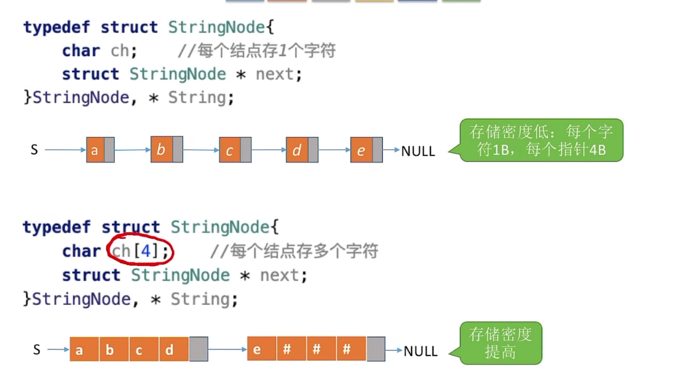</center>


## 5.4 串的朴素模式匹配算法

**算法思想：** 将主串中所有与模式串长度相同的子串找出来，依次与模式串进行匹配，如果有一个字符不匹配则立即放弃该子串，进行下一个子串的匹配。

**算法复杂度分析：**

1. 最坏时间复杂度：若模式串长度为m，主串长度为n，当每个子串的前$m - 1$个字符均匹配上，但是第$m$个字符不匹配时，则直到匹配成功/失败最多需要进行$(n - m + 1)*m$次比较，最坏时间复杂度为$O(nm)$
2. 最好时间复杂度：$O(m)$
3. 比较好的情况：每个子串的第一个字符就与模式串不匹配


<center>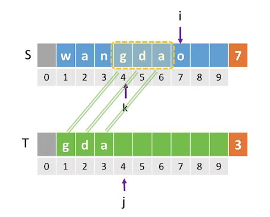</center>

**代码：**

```c++
int Index(SString S, SString T) { // S为主串，T为模式串
    int k = 1;
    int i = k, j = 1;
    while(i <= S.length && j <= T.length) {
        if (S.ch[i] == T.ch[i]) {
            i ++;
            j ++;
        } else {
            k ++;
            i = k;
            j = 1;
        }
    }
    if (j > T.length) {
        return k;
    } else {
        return 0;
    }
}
```


## 5.5 KMP算法

建议照着这篇文章进行学习，在这篇文章中字符数组下标都是从0开始的。[(15 封私信 / 8 条消息) 如何更好地理解和掌握 KMP 算法? - 知乎 (zhihu.com)](https://www.zhihu.com/question/21923021/answer/281346746)

### 5.5.1 概述

==下面所述的算法，字符数组的下标都是从1开始的，不太好理解==

**算法简介：**KMP算法是一种高效的字符串模式匹配算法。它不像朴素模式匹配算法那样需要不断地回溯`i`，而是借助已经匹配成功的部分，保持`i`指针不回溯，通过修改指针`j`，让模式串尽量地移动到有效的位置。对于指针`j`的修改，首先需要针对特定的模式串生成对应的`next[]`数组，然后借助`next[]`数组来决定指针`j`的位置。

<center>
    
    </center>


**时间复杂度：** $O(m+n)$


### 5.5.2 手算next数组

next数组的下标也是从1开始的，next[0]没用

`next[]`数组的**手算方法**：当第j个字符匹配失败，由前$j - 1$个字符组成的串记为S，则：$next[j]=S的最长相等前后缀长度+1$。特别地：$next[1] = 0$

以下图为例：

<center></center>

当第6个字符匹配失败时，前$j-1$个字符组成的串为：$ABCAB$

该串的最长相等前后缀为：$AB$，其长度为2

因此$next[6] = 3$


### 5.5.3 代码实现

计算机实现next数组的生成，代码看起来会比较懵，建议结合这篇文章进行学习：[（原创）详解KMP算法 - 孤~影 - 博客园 (cnblogs.com)](https://www.cnblogs.com/yjiyjige/p/3263858.html)


```c++
// 以下代码中，字符串的下标按1~n来处理，而不是0~n-1
void get_next(SString T, int next[]) {
    int i = 1, j = 0;
    next[1] = 0;
    while(i < T.length) {
        if (j == 0 || T.ch[i] == T.ch[j]) {
            i ++;
            j ++;
            next[i] = j;
        } else {
            j = next[j]; // 如果匹配失败，则模拟KMP的思想，对指针j进行回溯
        }
    }
}

int Index(SString S, SString T) {
    int i = 1, j = 1;
    int next[T.length + 1];
    get_next(T, next); // 求模式串的next数组
    while(i <= S.length && j <= T.length) {
        if (j == 0 || S.ch[i] == T.ch[j]) {
            i ++;
            j ++;
        } else {
            j = next[j]; // 移动模式串
        }
    }
    if (j > T.length) {
        return i - T.length; // 匹配成功
    } else {
        return 0; // 匹配失败
    }
}
```


### 5.5.4 KMP算法优化

<center>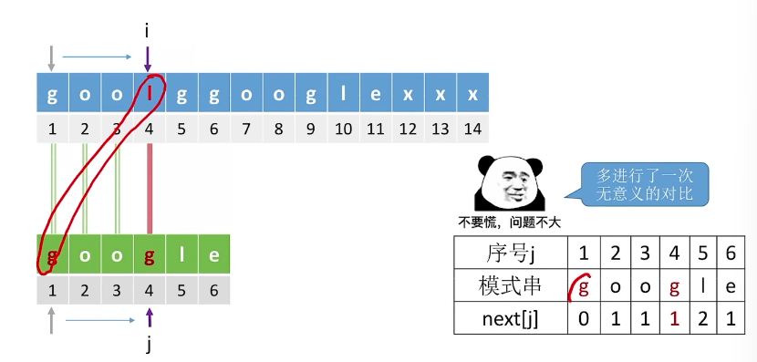</center>

**优化思想：** 如上图所示，主串中的字符$l$与模式串中的字符$g$不匹配，且next[4]指向的字符与字符$g$相同，则next[4]指向的字符也必定与字符$l$不匹配，此时我们直接让next[4] = next[1]即可

```c++
void get_next(SString T, int next[]) {
    int i = 1, j = 0;
    next[1] = 0;
    while(i < T.length) {
        if (j == 0 || T.ch[i] == T.ch[j]) {
            i ++;
            j ++;
            /*
            1.如果此时模式串中p[i] != p[j]，则当进行kmp时，p[i]字符发生了不匹配，只需将j指针指向p[j]即可
            2.如果此时模式串中p[i] == p[j]，则当进行kmp时，p[i]字符发生了不匹配，那么调整之后j指向的				      p[j]也必然发生不匹配，此时需要继续调整j指针的指向。
            */
            if (p[i] == p[j]) {
                next[i] = next[j];
            } else {
                next[i] = j;
            }
        } else {
            j = next[j]; // 如果匹配失败，则模拟KMP的思想，对指针j进行回溯
        }
    }
}
```

以上代码可能不太好理解，我们可以借助next数组，间接生成nextval数组：

<center></center>


# 第六章 树与二叉树

## 6.1 树的基本概念

### 6.1.1 树的定义

**定义：** 树是n个结点的有限集，在任意一棵非空树中：

1. 有且仅有一个根节点
2. 当n>1时，其余结点可分为m个**互不相交**的有限集，其中每一个有限集本身也是一棵树，并且称为根的子树。


非空树的特性：

1. 有且仅有一个根节点
2. 没有后继结点的称为叶子结点
3. 有后继结点的称为分支结点
4. 除了根节点，任何一个结点有且仅有一个前驱结点
5. 每个结点可以有0个或多个后继结点

### 6.1.2 基本术语

**空树：** 结点数为0的树

**结点的层次（深度）：** 从上往下数

**节点的高度：** 从下往上数

**树的高度（深度）：** 总共多少层

⭐**结点的度：** 有几个分支

⭐**树的度：** 各结点的度的最大值


**有序树：** 树中结点的各子树从左到右是有次序的，不能互换

**无序树：** 树中结点的各子树从左到右是无次序的，可以互换


**森林：** 森林是由m(m>=0)棵互不相交的树组成的


## 6.2 树的性质

1. 结点数 = 总度数 + 1
2. 
3. 度为m的树第$i$层之多有$m^{i - 1}$个结点
4. 高度为h的m叉树至多有$\dfrac{m^h - 1}{m-1}$个结点，至少有h个结点
5. 高度为h，度为m的树至少有$h+m-1$个结点
6. 具有n个结点的m叉树的最小高度为$\lceil log_m(n(m-1) + 1) \rceil$

<center></center>


## 6.3 二叉树

### 6.3.1 几种特殊的二叉树

**满二叉树：** 一棵高度为h，且含有$2^h - 1$个结点的二叉树

<center></center>

**完全二叉树：** 当且仅当其每个结点都与高度为k的满二叉树中编号为1~h的结点一一对应时，称为完全二叉树

<center></center>

**二叉排序树：** 左子树上所有结点的关键字均小于根结点的关键字；右子树上所有结点的关键字均大于根结点的关键字。左子树和右子树又各是一个二叉排序树。

<center></center>


**平衡二叉树：** 又称“平衡二叉搜索树”，它首先是一棵二叉搜索树，其次树上任意一个结点的左子树和右子树的深度之差不超过1。平衡二叉树有更高的搜索效率。

<center></center>


### 6.3.2 二叉树的性质

- ⭐设非空二叉树中度为0，1，2的结点的个数分别为$n_0, n_1, n_2$，则有：$n_0 = n_2 + 1$ （即叶子结点比二分结点多1）

    - 推导：
        $$
        设总结点数为n \\
        则有①：n = n_0 + n_1 + n_2 \\
        由于：总结点数=总度数+1 \\
        则有②：n = n_1 + 2n_2 + 1 \\
        ②-①得：n_0 = n_2 + 1
        $$

- ⭐具有n个结点的==完全二叉树==的高度h为$\lceil log_2(n + 1) \rceil$

    - 推导：
        $$
        高度为h的完全二叉树的结点数最多为：\\
        2^h - 1 \\
        最少为： \\
        2^{h-1} \\
        因此，有如下式子：\\
        2^{h-1} - 1< n \le 2^h - 1 \\
        \therefore 2^{h-1} < n + 1 \le 2^h \\
        \therefore h - 1 < log_2(n+1) \le h \\
        \therefore h = \lceil log_2(n + 1) \rceil
        $$

- ⭐对于==完全二叉树==，可以由结点数n来推出度为0，1，2的结点的个数。

    - 若$n=2k$为偶数，则$n_1 = 1, n_0 = k, n_2 = k - 1$

    - 若$n=2k - 1$为奇数，则$n_1 = 0, n_0 = k, n_2 = k - 1$

    - 推导：
        $$
        首先，对于有n个结点的完全二叉树来说，其度为1的结点个数最多为1个 \\
        \therefore n_1 = 0 \ or\ 1 \\
        又因为n_0= n_2+ 1\\
        \therefore n_0 + n_2 = 2n_2 + 1=奇数\\
        \therefore\ 当n = 奇数，n_0=0;\\当n = 偶数，n_0=1; \\
        \therefore 根据n的奇偶，就可以求出n_0, n_1, n_2
        $$
        

## 6.4 二叉树的存储结构

### 6.4.1 顺序存储

<center><br>
</center>

```c++
#define MaxSize 100
struct TreeNode {
    ElemType value;
    bool isEmpty;
} TreeNode;

TreeNode t[MaxSize]; // 定义一个长度为MaxSize的数组t，按照从上到下，从左到右的顺序依次存储完全二叉树的各个结点

bool Init(TreeNode t[]) { // 初始化
    for (int i = 0; i < MaxSize; i ++) {
        t[i].isEmpty = true;
    }
}
```

对于一个顺序存储的==完全二叉树==来说

- 第i个结点的左孩子的位置为：2i
- 第i个结点的右孩子的位置为：2i + 1
- 第i个结点的父结点的位置为：$\lfloor \dfrac{i}{2} \rfloor$
- 第i个结点的父结点的层次为：$\lceil log_2(n + 1) \rceil$
- 若完全二叉树共有n个结点，则
    - 判断i是否有左孩子：$2i \le n$
    - 判断i是否有右孩子：$2i + 1 \le n$
    - 判断i是否为叶子/分支结点：$i> \lfloor \dfrac{n}{2} \rfloor$为叶子结点


**注意：顺序存储比较适合于完全二叉树，对于非完全二叉树来说，顺序存储会产生很多的空间浪费，因此对于一般二叉树来说，通常采用链式存储的方式。**


### 6.4.2 链式存储

```c++
/* 二叉链表 */
typedef struct BiTNode {
    ElemType data;
    struct BiTNode *lchild, *rchild;
}BiTNode, *BiTree;

BiTree root = NULL; // 定义一棵空树

// 插入根结点
root = (BiTree)malloc(sizeof(BiTNode));
root -> data = 0;
root -> lchild = NULL;
root -> rchild = NULL;

// 插入新结点
BiTNode *p = (BiTNode *)malloc(sizeof(BiTNode));
p -> data = 2;
p -> lchild = NULL;
p -> rchild = NULL;
root -> lchild = p;
```


对于二叉链表来说，如果要寻找一个结点的父结点，需要从根结点开始寻找。为了方便查找一个结点的根结点，我们可以采用三叉链表的方式：

```c++
typedef struct BiTNode{
    ElemType data;
    struct BiTNode *lchild, *rchild;
    struct BiTNode *parent;
} BiTNode, *BiTree;
```


## 6.5 二叉树的遍历

### 6.5.1 先序遍历

**先序遍历：**根左右

```c++
typedef struct BiTNode {
    ElemType data;
    struct BiTNode *lchild, *rchild;
}BiTNode, *BiTree;

void PreOrder(BiTree T) {
    if (T == NULL) {
        return;
    }
    visit(T); // 访问根节点
    PreOrder(T -> lchild); // 遍历左子树
    PreOrder(T -> rchild); // 遍历右子树
}
```


### 6.5.2 中序遍历

**中序遍历：**左根右

```c++
void PreOrder(BiTree T) {
    if (T == NULL) {
        return;
    }
    PreOrder(T -> lchild); // 遍历左子树
    visit(T); // 访问根节点
    PreOrder(T -> rchild); // 遍历右子树
}
```


### 6.5.3 后序遍历

**后序遍历：**左右根

```c++
void PreOrder(BiTree T) {
    if (T == NULL) {
        return;
    }
    PreOrder(T -> lchild); // 遍历左子树
    PreOrder(T -> rchild); // 遍历右子树
    visit(T); // 访问根节点
}
```


### 6.5.4 层序遍历

<center></center>

层序遍历，亦称==广度优先搜索==。它借助==队列==来实现了对二叉树每一层的遍历。

```c++
void BFS(BiTree T) {
    LinkQueue Q; // 队列相关内容见3.9.1
    InitQueue(Q);
    if (T == NULL) {
        return;
    }
    EnQueue(Q, T);
    while (!isEmpty(Q)) {
        BiTNode node;
        DeQueue(Q, node);
        visit(node);
        if (node -> lchild != NULL) {
            EnQueue(Q, node -> lchild);
        }
        if (node -> rchild != NULL) {
            EnQueue(Q, node -> rchild);
        }
    }
```


## 6.6 由遍历序列构造二叉树

- 一个中序遍历序列可能对应多种二叉树形态
- 一个前序遍历序列可能对应多种二叉树形态
- 一个后序遍历序列可能对应多种二叉树形态
- 一个层序遍历序列可能对应多种二叉树形态

**因此：** 只给出一棵二叉树的前/中/后/层序遍历序列中的一种，不能唯一确定一颗二叉树，但是给出如下图所示的两种序列组和，可以唯一构造出一棵二叉树。


<center></center>

但是前序、后序、层序序列两两组合是无法唯一确定一棵二叉树的。

### 6.6.1 前序+中序遍历序列

前序遍历序列中，最左边的结点一定是根节点。因此，我们首先可以根据前序遍历序列先确定一个根节点，然后在中序遍历序列中，划分出左子树结点和右子树结点。然后，在根据前序遍历序列确定左子树的根节点，以此类推。

<center></center>


### 6.6.2 后续+中序遍历序列

这个过程大体跟6.6.1差不多，只不过，后序遍历序列最右边的结点是根节点。

<center></center>


### 6.6.3 层序+中序遍历序列

<center></center>


## 6.7 线索二叉树

### 6.7.1 概念

**中序线索二叉树的定义：** 一个二叉树通过如下的方法“穿起来”：所有原本为空的右(孩子)指针改为指向该节点在中序序列中的后继，所有原本为空的左(孩子)指针改为指向该节点的中序序列的前驱。

相应的，我们可以定义出后序线索二叉树和先序线索二叉树。

<center></center>

### 6.7.2 存储结构

```c++
typedef struct ThreadNode {
    ElemType data;
    struct ThreadNode *lchild, *rchild;
    int ltag, rtag; // 左右线索的标志。当tag=0时，child指针指向的是孩子；当tag=1时，child指向的是线索
}ThreadNode, *ThreadTree;
```


### 6.7.3 二叉树的线索化

**二叉树的线索化**以及通过**线索二叉树来寻找前驱后继**的问题，由于涉及的东西比较多，在此我打算另开一篇文章单独介绍这部分内容，详细内容请参考：[线索二叉树的构造及前驱后继的查找 - Xiao·Tong - 博客园 (cnblogs.com)](https://www.cnblogs.com/xiaotong-sun/p/16261584.html)


## 6.8 树的存储结构

### 6.8.1 双亲表示法(顺序存储)

<center></center>

- 插入结点时只需要在数组的空闲处添加数据元素data并且正确写入parent的位置即可。

- 删除结点时，我们首先需要判断该结点是否有孩子，如果没有孩子结点，则直接删除即可；如果有孩子结点，我们还需要查找该结点的所有孩子以及孩子的孩子，然后一并删除。

    **在删除时，我们也有两种选择：**

    - 删除之后，该数组元素保持空缺
    - 删除之后，将最后一个数组元素移动到该位置


**优缺点：**

- 优点：查指定结点的双亲很方便
- 缺点：查指定结点的孩子只能从头遍历


### 6.8.2 孩子表示法(顺序+链式存储)

<center></center>


- 优点：找孩子方便
- 缺点：找父节点不方便


### 6.8.3 孩子兄弟表示法(链式存储)

<center></center>

通过孩子兄弟表示法，我们可以实现==树和二叉树之间的转化==


### 6.8.4 森林和二叉树的转换

<center></center>


## 6.9 树、森林的遍历

### 6.9.1 树的先根遍历

<center></center>


### 6.9.2 树的后根遍历

<center></center>


### 6.9.3 树的层次遍历

<center></center>


### 6.9.4 森林的先序遍历

森林的先序遍历的效果等同于==依次对各个树进行先根遍历==。

此外，我们也可以采用孩子兄弟表示法将森林转化为一棵二叉树，然后对二叉树进行==先序遍历==。

<center>
</center>


### 6.9.5 森林的中序遍历

森林的中序遍历的效果等同于==依次对各个树进行后根遍历==。

我们也可以将森林转化成二叉树，然后对二叉树进行==中序遍历==。


### 6.9.6 小结

|    树    |   森林   |  二叉树  |
| :------: | :------: | :------: |
| 先根遍历 | 先序遍历 | 先序遍历 |
| 后根遍历 | 中序遍历 | 中序遍历 |


## 6.10 二叉排序树

在6.3.1小节中，我们给出了二叉排序树的定义，在本小节中，我们将进一步探讨二叉排序树的具体操作

### 6.10.1 查找

<center></center>


```c++
typedef struct BSTNode {
    ElemTpye key;
    struct BSTNode *lchild, *rchild;
}BSTNode, *BSTree;

BSTNode *BST_Search(BSTree T, ElemType key) {
    while (T != NULL && T -> key != key) {
        if (key < T -> key) {
            T = T -> lchild;
        } else {
            T = T -> rchild;
        }
    }
    return T;
}
```


**查找效率分析：**

查找长度：在查找运算中，需要对比关键字的次数称为查找长度。

<center>
</center>


### 6.10.2 插入

- 若原二叉排序树为空，则直接插入结点；
- 否则，若关键字小于根节点值，则插入到左子树，若关键字大于根节点值，则插入到右子树。

```c++
int BST_Insert(BSTree &T, ElemType key) {
    if (T == NULL) {
        T = (BSTNode *) malloc(sizeof(BSTNode));
        T -> key = key;
        T -> lchild = NULL;
        T -> rchild = NULL;
        return 1;
    } else {
        if (key == T -> key) {
            return 0;
        } else if (key < T -> key) {
            return BST_Insert(T -> lchild, key);
        } else if (key > T -> key) {
            return BST_Insert(T -> rchild, key);
        }
    }
}
```


### 6.10.3 构造

```c++
void CreatBST(BSTree &T, ElemType data[], int n) {
    T = NULL; // 初始时T为空树
    for (int i = 0; i < n; i ++) {
        BST_Insert(T, data[i]); // 将每个元素插入到二叉排序树中
    }
}
```

**注意：** 不同的关键字序列可能得到同款二叉排序树，也可能得到不同款二叉排序树


### 6.10.4 删除

1. 若被删除结点z是叶子结点，则直接删除即可

2. 若结点z只有一棵左子树或右子树，则让z的子树成为z的父节点的子树，代替z的位置

3. 若结点z有左、右两棵子树，则令z的直接后继（或直接前驱）替代z，然后从二叉排序树中删去这个直接后继（或直接前驱），这样就转换成了第一或第二种情况。

    <center>或</center>


## 6.11 平衡二叉树(AVL)

<center></center>

### 6.11.1 LL

<center><br><br>
</center>


### 6.11.2 RR

<center><br><br></center>


### 6.11.3 LR

<center><br><br>
</center>

### 6.11.4 RL

<center><br><br></center>


### 6.11.5 查找效率分析

<center></center>

## 6.12 哈夫曼树

### 6.12.1 基本概念

**结点的带权路径长度：** 从树的根结点到当前结点所经过的路径长度(边数)与该结点权值的乘积

**树的带权路径长度：** 树中所有叶子结点的带权路径长度之和(WPL, Weighted Path Length)

**哈夫曼树：** 带权路径长度最小的二叉树，也称最优二叉树

**前缀编码：** 没有一个编码是另一个编码的前缀

**哈夫曼编码：** ；字符集中每一个字符作为叶子结点，各个字符出现的频度视为结点的权值，构造出哈夫曼树。让哈夫曼树的左分支为0，右分支为1，则可以构造出哈夫曼编码。

### 6.12.2 哈夫曼树的构造

<center></center>


# 第七章 图

## 7.1 图的基本概念

**图的定义：**

<center></center>


**有向图、无向图：**

<center></center>


**简单图：** 1.不存在重复的边 2.不存在顶点到自身的边


**顶点的度、入度、出度：**

<center></center>


**顶点-顶点的关系描述：**

<center></center>


**连通图、强连通图：**

<center></center>


**子图、生成子图：**

<center></center>


**连通分量：** 无向图中的==极大连通子图==称为连通分量。

**极大连通子图：** 子图必须是连通的，并且包含尽可能多的顶点和边

**强连通分量：** 有向图中的==极大强连通子图==称为强连通分量

**极大强连通子图：** 子图必须是强连通的，并且包含尽可能多的边


**生成树：**

<center></center>


**边的权、带权图：**

<center></center>


**完全图：**

<center></center>


**子图、生成子图、导出子图**

- 原图：$G=(V,E)$，其中$V$是所有的顶点，$E$是所有的边
- 子图：$G'=(V', E')$，其中$V' \in V, E' \in E$
- 生成子图：$G'=(V’,E')$，其中$V’$是$G$中的所有顶点==(即$V'=V$)==，$E' \in E$
- 导出子图：$G'=(V', E')$，其中$V' \in V$，$E'$是连接$V'$中所有顶点的所有边


## 7.2 邻接矩阵

<center></center>


<center>
</center>

解释一下：

$A^2[1][4]$ 可以理解为第一个矩阵的第1行×第二个矩阵的第4列。


## 7.3 邻接表

<center></center>

```c++
typedef struct TableNode {
    int data; // 边指向哪个结点
    struct TableNode *next; // 指向下一条边的指针
}TableNode;

typedef struct TableElement {
    Elemtype v; // 顶点信息
    TableNode *first; // 指向第一条边
}TableElement, TElement[Maxsize];

typedef struct Table {
    TElement table;
    int v, e; // 记录边数和顶点数
}
```

<center></center>


## 7.4 十字链表、邻接多重表

<center></center>


<center></center>


<center></center>


## 7.5 图的广度优先搜索

<center></center>

- 同一个图的邻接矩阵表示方式唯一，因此广度优先遍历序列唯一
- 同一个图的邻接表表示方式不唯一，因此广度优先遍历序列不唯一

对于上面的代码实现，存在一个bug，就是当该图为非连通图时，无法遍历完所有结点。

<center>
</center>


**广度优先生成树：** 在广度优先遍历时，我们会沿着一定的路径进行结点的遍历，在这个过程中我们会确定出$n-1$条路径，这些路径就会构成一个广度优先生成树。但是采用邻接表存储的图，它的广度优先生成树取决于邻接表(因此不唯一)

<center><br><br></center>


## 7.6 图的深度优先遍历

<center></center>


## 7.7 最小生成树

**最小生成树：** 对于一个==带权连通无向图==来说，可能有多个生成树，每个生成树的权值(边权之和)也可能不同。其中，==权值最小==的生成树称为最小生成树。

由带权连通无向图获取最小生成树的算法主要有两种：Prim算法、Kruskal算法

### 7.7.1 Prim算法

**简介：** Prim算法的整体思想是围绕着图的顶点进行的。它从某一顶点开始构建生成树，每次将代价最小的顶点纳入生成树，直到顶点全部纳入为止。

**时间复杂度：** $O(|V|^2)$ 适用于边稠密图


<center></center>


### 7.7.2 Kruskal算法

**简介：** Kruskal算法的整体思想是围绕着图的边进行的。它每次选择一条权值最小的边，使这个边两端的顶点相连接（如果这条边两端的顶点已经被连通，那么就不选），直到所有顶点都连通。

**时间复杂度：** $O(|E|log_2|E|)$ 适用于边稀疏图

<center></center>


## 7.8 最短路径问题

<center></center>


### 7.8.1 BFS算法

BFS算法可以用来获取==无权图==的单源最短路径。它的基本思想就是从某一点出发，广度优先搜索无权图，在这个过程中，广度优先搜索的第一层到源点的路径长度为1，之后几层依次加1。

<center></center>

其中，`d[]`记录了从源点到该点的最短路径，路径的形式可以由`path[]`推导出来。


### 7.8.2 Dijkstra算法

Dijkstra算法可以用来获取==带权(非负)图==的单源最短路径。算法过程如下：

<center></center>

<center></center>


**特别强调：**

Dijkstra算法不适用于有==负权值==的带权图

<center></center>


### 7.8.3 Floyd算法

Floyd算法是用来求解==每一对顶点之间的最短路径==问题。

使用==动态规划==的思想 **时间复杂度：$O(|V|^3)$**,**空间复杂度：$O(|V|^2)$**

<center></center>


**特别强调：** Floyd算法可以解决带负权值的图，但是不能解决带有“负权回路”的图。

<center></center>


### 7.8.4 小结

<center></center>


## 7.9 有向无环图

**有向无环图：** 若一个有向图中不存在环路，则称为有向无环图，简称DAG图

<center></center>


<center></center>


## 7.10 拓扑排序

<center></center>


**拓扑排序：** 就是将DAG图中的==活动==按先后顺序进行排序。

拓扑排序的一个基本实现思路：

1. 从AOV网中选择一个没有前驱(入度为0)的顶点并输出。
2. 从AOV网中删除该顶点以及与之相连的有向边。
3. 重复1、2直到AOV网为==空==或==当前网中不存在入度为0的顶点为止==


**性质：** 拓扑排序和逆拓扑排序序列可能不唯一。若图中有环，则不存在(逆)拓扑排序序列


**代码实现：** 时间复杂度(邻接表)：$O(|V| + |E|)$  （邻接矩阵）：$O(|V|^2)$

<center></center>


**逆拓扑排序：** 就是将DAG图中的==活动==按从后向前的顺序进行排序。

逆拓扑排序的一个基本实现思路：

1. 从AOV网中选择一个没有前驱(出度为0)的顶点并输出。
2. 从AOV网中删除该顶点以及与之相连的有向边。
3. 重复1、2直到AOV网为==空==或==当前网中不存在出度为0的顶点为止==


<center></center>


## 7.11 关键路径

<center></center>

在AOE网中，仅有一个入度为0的顶点，称为开始顶点(源点)，表示整个工程的开始。也仅有一个出度为0的顶点，称为结束顶点(汇点)，表示整个工程的结束。

**关键路径：**从源点到汇点的有向路径可能存在多条，其中路径长度最长的称为关键路径，关键路径上的活动称为关键活动。关键路径长度决定了完成这项工程所需要的最短时间。

<center></center>


❓如何找到AOE图中的关键路径？答：先找到AOE图中的关键活动。

❓那么如何找到关键活动呢？答：关键活动的最早开始时间和最迟开始时间应该相同，我们可以借助这个性质来找到关键活动。步骤如下：

1. 求所有事件(顶点)的最早发生时间`ve()`

    <center></center>

2. 求所有事件的最晚发生时间`vl()`

    <center></center>

3. 求所有活动(边)的最早发生时间`e()`

    <center></center>

4. 求所有活动的最晚发生时间`l()`

    <center></center>

5. 求所有活动的时间余量`d() = l() - e()`，余量为0的活动就是关键活动。


**关键路径、关键活动特性:**

- 若关键活动耗时增加，则整个工程的工期将增长。
- 缩短关键活动时间，可以算短工期。
- 当缩短到一定程度时，关键活动可能会变成非关键活动
- 一个工程可能有多个关键路径，此时要缩短工期，需要加快所有关键路径上的关键活动才能达成目的


# 第八章 查找

## 8.1 分块查找

<center><br><br></center>


## 8.2 B树

### 8.2.1 B树的定义

<center></center>


n叉查找树的结点定义：

```c++
struct Node {
    ElemType key[n-1]; // 最多n-1个关键字
    struct Node *child[n]; // 最多n个孩子
    int num; // 记录结点中有几个关键字
}
```


### 8.2.2 核心特性

<center></center>


### 8.2.3 B树的插入删除操作

参考这篇文章：[B树、B+树详解 - Assassinの - 博客园 (cnblogs.com)](https://www.cnblogs.com/lianzhilei/p/11250589.html)


## 8.3 B+树

<center></center>


- 在B+树中，无论查找成功与否，最终一定都要走到最下面一层结点。

<center></center>


## 8.4 散列查找

**散列表(hash table)**，又称哈希表。是一种数据结构，特点是：数据元素的关键字与其存储地址直接相关。

解释一下就是：数据元素的存储地址是由关键字借助哈希函数计算得到的。

- 不同的关键字通过散列函数映射到同一个值，则称它们为“同义词”
- 通过散列函数确定的位置已经存放了其他元素，则称这种情况为“冲突”


**常见的散列函数：**

1. **除留余数法**：$H(key) = key \% p$ 。如果散列表表长为m，取一个不大于m但最接近或等于m的==质数==p。

    为什么要选择质数呢？因为用质数取模，分布更均匀，冲突更少。

2. **直接定址法**：$H(key)=key或H(key)=a*key+b$。这种方法适合关键字分布基本连续的情况，若关键字分布不连续，空位较多，则会造成存储空间的浪费。

3. **数字分析法**：选取数码分布较为均匀的若干位作为散列地址。

4. **平方取中法**：取关键字的平方值的中间几位作为散列地址。


**处理冲突的方法：**

1. **拉链法**

    <center></center>

    $装填因子=\dfrac{表中记录数}{散列表长度}$，装填因子其实也等于查找失败时的平均查找长度。装填因子的大小会直接影响散列表的查找效率。

2. **开放定址法**

    <center></center>

    - 线性探测法：

        当发生冲突时，每==次往后探测相邻的下一个单元==是否为空。线性探测法很容易造成同义词、

        非同义词的“堆积”现象，严重影响查找效率。

        **注意：** 采用“开放定址法”时，删除结点不能简单地将被删结点的空间置为空，否则将截断它在之后填入散列表的同义词结点的查找路径。可以在删除结点时做一个“删除标记”，进行逻辑删除。

        <center></center>

        

    - 平方探测法：

        <center></center>

        使用平方探测法时，散列表的长度m必须是一个可以表示成$4j+3$的素数，才能探测到所有位置。

    - 伪随机序列法：

        <center></center>

3. **再散列法**

    <center></center>


# 第九章 排序

排序这一章可以结合这篇文章进行学习：[十大经典排序算法（动图演示） - 一像素 - 博客园 (cnblogs.com)](https://www.cnblogs.com/onepixel/articles/7674659.html)

<center></center>

## 9.1 基本概念

**算法的稳定性：** 假设待排序表中有两个元素$a,b$它们的值相同，且a排在b之前，如果排序之后，a仍然排在b之前，就说这个算法具有稳定性。

**内部排序：** 数据都存放在内存中，进行排序。

**外部排序：** 数据太多，无法全部放入内存，需要借助外存进行排序。


## 9.2 插入排序

**算法思想：** 每次将一个待排序的记录按照关键字大小插入到前面已经排好序的子序列中，直到全部记录插入完成。

**时间复杂度：**

- 最好时间复杂度(全部有序)：$O(n)$
- 最坏时间复杂度(全部逆序)：$O(n^2)$
- 平均时间复杂度：$O(n^2)$

**算法稳定性：**稳定

```c++
void InsertSort(int A[], int n) {
    int i, j, temp;
    for (i = 1; i < n; i ++) {
        if (A[i] < A[i - 1]) {
            temp = A[i];
            for (j = i - 1; j >= 0 && A[j] > temp; j --) {
                A[j + 1] = A[j];
            }
            A[j + 1] = temp;
        }
    }
}
```


## 9.3 希尔排序

**希尔排序的基本思想是：**先追求表中元素的部分有序，再逐渐逼近全局有序。

<center></center>

**希尔排序的大体过程：**

1. 确定增量d(也就是间隔)，按照增量d将原表拆分成多个子表
2. 对每个子表进行插入排序
3. 缩小增量d(一般对半缩)，重复操作，直到d=1

<center></center>


**时间复杂度：** 

- 最坏时间复杂度：$O(n^2)$   d=1时，退化成直接插入排序
- 平均时间复杂度：未知，但优于直接插入排序

**算法稳定性：**不稳定

**算法适用性：** 仅适用于顺序表


```c++
void ShellSort(int A[], int n) {
    int d, i, j;
    // 用A[0]来暂存数据
    for (d = n/2; d >= 1; d/=2) {
        for (i = d+1; i <= n; i ++) {
            if (A[i] < A[i - d]) {
                A[0] = A[i];
                for (j = i - d; j > 0 && A[0] < A[j]; j -= d) {
                    A[j + d] = A[j];
                }
                A[j + d] = A[0];
            }
        }
    }
}
```


## 9.4 冒泡排序

**算法思想：** 从后往前(或从前往后)两两比较相邻元素的值，若为逆序，则交换它们，直到序列比较完。称这样的过程为“一趟”冒泡排序


**时间复杂度：**

- 最好时间复杂度：$O(n)$  序列顺序排列
- 最坏时间复杂度：$O(n^2)$ 序列逆序排列
- 平均时间复杂度：$O(n^2)$


**算法稳定性：**稳定

**算法适用性：** 适用于顺序表和链表


```c++
void BubbleSort(int A[], int) {
    for (int i = 0; i < n - 1; i ++) {
        bool flag = false;
        for (int j = n - 1; j > i; j --) {
            if (A[j] < A[j - 1]) {
                swap(A[j], A[j-1]);
                flag = true;
            }
        }
        if (flag == flase) { // 如果本趟冒泡未发生交换，就说明序列已经有序。
            return;
        }
    }
}

void swap(int &a, int &b) {
    int temp;
    temp = a;
    a = b;
    b = temp;
}
```


## 9.5 快速排序

**快速排序的基本思想：**通过一趟排序将待排记录分隔成独立的两部分，其中一部分记录的关键字均比另一部分的关键字小，则可分别对这两部分记录继续进行排序，以达到整个序列有序。

快速排序使用分治法来把一个串（list）分为两个子串（sub-lists）。**具体算法描述如下**：

- 从数列中挑出一个元素，称为 “基准”（pivot）；
- 重新排序数列，所有元素比基准值小的摆放在基准前面，所有元素比基准值大的摆在基准的后面（相同的数可以到任一边）。在这个分区退出之后，该基准就处于数列的中间位置。这个称为分区（partition）操作；
- 递归地（recursive）把小于基准值元素的子数列和大于基准值元素的子数列排序。


**时间复杂度：**

- 最好时间复杂度：$O(nlog_2^n)$  每次选的枢轴元素都能将序列划分成均匀的两部分
- 最坏时间复杂度：$O(n^2)$  若序列原本就**有序或逆序**，则时间、空间复杂度最高
- 平均时间复杂度：$O(nlog_2^n)$


**算法稳定性：**不稳定


```c++
void quickSort(int A[], int low, int high) {
    if (low < high) {
        int p = partition(A, low, high); // 划分
        quickSort(A, low, p - 1);  // 递归划分左子表
        quickSort(A, p + 1, high);  // 递归划分右子表
    }
}

int partition(int A[], int low, int high) {
    int temp = A[low]; // 确定枢轴
    while (low < high) {
        while (low < high && A[high] >= temp) {
            high --;
        }
        A[low] = A[high]; // 找到比枢轴小的元素，并移动到左端
        while (low < high && A[low] <= temp) {
            low ++;
        }
        A[high] = A[low];  // 找到比枢轴大的元素，并移动到右端
    }
    A[low] = temp;
    return low; // 返回最终枢轴的存放位置
}
```


**快排的优化思路：**关键在于枢轴元素的选取，要尽量选择可以把数据中分的枢轴元素。

- 可以选择头、中、尾三个位置的元素，取中间值作为枢轴元素。
- 随机选一个元素作为枢轴元素。


## 9.6 简单选择排序

**选择排序：** 每一趟在待排序元素中选取关键字最小或最大的元素加入到有序子序列中


**时间复杂度：** $O(n^2)$

**稳定性:** 不稳定


```c++
void selectSort(int A[], int n) {
    for (int i = 0; i < n - 1; i ++) {
        int min = i;
        for (int j = i + 1; j < n; j ++) {
            if (A[j] < A[min]) {
                min = j
            }
        }
        if (min != i) {
			int temp = A[i];
        	A[i] = A[min];
        	A[min] = temp;
        }
    }
}
```


## 9.7 堆排序⭐

堆排序我打算单独开一篇文章详细写写它的原理和算法。

<center></center>

```java
public class HeapSort implements IArraySort {

    @Override
    public int[] sort(int[] sourceArray) throws Exception {
        // 对 arr 进行拷贝，不改变参数内容
        int[] arr = Arrays.copyOf(sourceArray, sourceArray.length);

        int len = arr.length;

        buildMaxHeap(arr, len);

        for (int i = len - 1; i > 0; i--) {
            swap(arr, 0, i);
            len--;
            heapify(arr, 0, len);
        }
        return arr;
    }

    private void buildMaxHeap(int[] arr, int len) {
        for (int i = (int) Math.floor(len / 2); i >= 0; i--) {
            heapify(arr, i, len);
        }
    }

    private void heapify(int[] arr, int i, int len) {
        int left = 2 * i + 1;
        int right = 2 * i + 2;
        int largest = i;

        if (left < len && arr[left] > arr[largest]) {
            largest = left;
        }

        if (right < len && arr[right] > arr[largest]) {
            largest = right;
        }

        if (largest != i) {
            swap(arr, i, largest);
            heapify(arr, largest, len);
        }
    }

    private void swap(int[] arr, int i, int j) {
        int temp = arr[i];
        arr[i] = arr[j];
        arr[j] = temp;
    }
}
```


## 9.8 归并排序

**基本思想：**归并排序是建立在归并操作上的一种有效的排序算法。该算法是采用分治法（Divide and Conquer）的一个非常典型的应用。将已有序的子序列合并，得到完全有序的序列；即先使每个子序列有序，再使子序列段间有序。若将两个有序表合并成一个有序表，称为2-路归并。

**时间复杂度：** $O(nlog_2^n)$

**稳定性：** 稳定

<center></center>


```c++
int *B = (int *)malloc(n * sizeof(int)); // 辅助数组B

void Merge(int A[], int low, int mid, int high) {
    int i, j, k;
    for (k = low; k <= high; k ++) {
        B[k] = A[k];
    }
    for (i = low, j = mid + 1, k = i; i <= mid && j <= high; k ++) {
        if (B[i] < B[j]) {
            A[k] = B[i ++];
        } else {
            A[k] = B[j ++];
        }
    }
    while (i <= mid) A[k ++] = B[i ++];
    while (j <= high) A[k ++] = B[j ++];
}

void MergeSort(int A[], int low, int high) {
    if (low < high) {
        int mid = (low + high) / 2;
        MergeSort(A, low, mid);
        MergeSort(A, mid + 1, high);
        Merge(A, low, mid, high);
    }
}
```


## 9.9 基数排序

**基本思想：**基数排序是一种非比较式的排序算法。它是这样实现的：将所有待比较数值（正整数）统一为同样的数位长度，数位较短的数前面补零。然后，从最低位开始，依次进行一次排序。这样从最低位排序一直到最高位排序完成以后，数列就变成一个有序序列。

**时间复杂度：** $O(d(n+r))$  其中一趟分配耗时$O(n)$，一趟收集耗时$O(r)$

**稳定性：** 稳定

**基数排序擅长解决的问题：** 

- 数据元素的关键字可以方便的拆分成d组，且d较小。
- 每组关键字的取值范围不大，即r较小。
- 数据元素个数n较大。

<center>
</center>


## 9.10 外部排序

**外部排序**是当数据量很大，内存空间不足以全部存放时，对数据进行排序的方式。由于操作系统是以块为单位对磁盘空间进行管理的，所以我们可以一次读入多个块进入内存进行排序，然后将结果写入到磁盘中，多次重复这种操作，就可以实现大量数据的排序。通常，在外部排序时，会采用归并排序的思想。

<center></center>


**补充：** 什么是多路平衡归并？

k路平衡归并，需要满足以下两个条件：

1. 最多只能有k个段归并为一个段
2. 在每一趟归并中，若有m个归并段参与归并，则处理之后的归并段个数需满足：$n =\lceil \frac{m}{n} \rceil$

<center><br>上面这个是四路平衡归并
    <br><br>上面这个是四路归并，但不是四路平衡归并<br></center>


**败者树：**

<center></center>


**置换-选择排序：**

<center></center>


**最佳归并树：**

<center></center>


