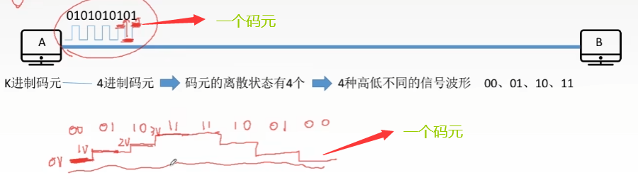

ComputerNetwork/

# 第一章 绪论

## 1.1 概念、组成、功能、分类

### 1.1.1 计算机网络的概念

**计算机网络**是一个将分散的、具有独立功能的==计算机系统==，通过==通信设备与线路==连接起来，由功能完善的软件实现==资源共享和信息传递==的系统。

⭐计算机网络是==互联的、自治的==计算机的集合

- 互联：互联互通
- 自治：无主从关系

### 1.1.2 组成

计算机网络由相关的==硬件、软件及协议==组成。

从==工作方式==上，可以将计算机网络分为两大部分：==核心部分==和==边缘部分==

- 核心部分由**路由器**和网络组成，主要向边缘部分提供连通性。
- 边缘部分由主机组成，工作方式有客户/服务器(C/S)方式、对等连接方式(P2P)。

从==功能组成==上，可以将计算机网络分为：通信子网(实现数据通信)、资源子网(实现资源共享)

### 1.1.3 功能

1. 数据通信 ⭐
2. 资源共享 ⭐
3. 分布式处理：多台计算机各自承担同一工作任务的不同部分
4. 提高可靠性
5. 负载均衡

### 1.1.4 分类

- 按分布范围分：广域网 WAN、城域网 MAN、局域网 LAN、个人区域网 PAN
- 按使用者分：公用网、专用网
- 按交换技术分：电路交换、报文交换、分组交换
- 按拓扑结构分：总线型、星型、环型、网状型
- 按传输技术分：广播式网络、点对点网络

## 1.2 性能指标

- 速率：即数据率或称数据传输率或比特率，指传送数据位数的速率。单位：$b/s, kb/s,Mb/s, Gb/s, Tb/s$
- 带宽：单位时间内，网络中一点到另一点所能通过的**最高数据率**(网络设备所支持的最高速度)。单位: $b/s, kb/s,Mb/s, Gb/s, Tb/s$
- 吞吐量：单位时间内通过某个网络的数据量。单位: $b/s, kb/s,Mb/s, Gb/s, Tb/s$
- 时延：指数据从网络一端到另一端所需要的时间。单位：$s$
    - 发送时延：$发送时延= \dfrac{数据长度}{发送速率}$
    - 传播时延：$传播时延=\dfrac{信道长度}{传播速率}$
    - 排队时延
    - 处理时延
- 时延带宽积：$时延带宽积=传播时延\times 带宽$
- 往返时延RRT：从发送方发送数据开始，到发送方收到应答为止，总共经历的时间。
- 利用率
    - 信道利用率：$\dfrac{有数据通过的时间}{有+无数据通过的时间}$
    - 网络利用率：信道利用率的加权平均值。

## 1.3 实体、协议、接口、服务

1. **实体:** 第n层中的活动元素称为n层实体，==同一层的实体叫对等实体==
2. **协议：** 为进行网络中==对等实体==间的数据交换而建立的规则、标准或约定，称为网络协议。协议是==水平==的。
    - 语法：规定传输数据的格式
    - 语义：规定所要完成的功能
    - 同步：规定各种操作的顺序
3. **接口：** 上层使用下层服务的入口
4. **服务：** 下层为相邻上层提供的功能调用。服务是==垂直==方向的，且所提供服务的具体细节对上一层完全屏蔽。第n层在向第n+1层提供服务时，此服务不仅包含第n层本身的功能，还包括由下层（1~n-1）服务提供的功能.

⭐**计算机网络体系结构**是从==功能==上描述计算机网络结构的，它是一种==分层结构==，每一层遵循其网络协议以完成本层功能。

⭐计算机网络体系结构是计算机网络的==各层及其协议==的集合。

## 1.4 OSI参考模型

### 1.4.1 传输层

1. 可靠传输（TCP）、不可靠传输（UDP）
2. 差错控制
3. 流量控制
4. 复用分用
    - 复用：多个应用层进程可同时使用下面运输层的服务。
    - 分用：运输层把收到的信息分别交付给应用层中的相应进程。

### 1.4.2 网络层

网络层的主要任务是把分组从源端传到目的端，网络层传输的单位是==数据报==

1. 路由选择
2. 差错控制
3. 流量控制
4. 拥塞控制

### 1.4.3 数据链路层

数据链路层的传输单位是==帧==

1. 封装成帧
2. 差错控制
3. 流量控制
4. 访问(接入)控制

### 1.4.4 物理层

物理层传输单位是==比特==

## 1.5 TCP/IP模型

  

## 1.6 5层参考模型

# 第二章 物理层

## 2.1 基本概念

物理层主要解决如何在传输媒体上==传输数据比特流==，而不是指具体的传输媒体

物理层的主要任务：确定与传输媒体==接口==有关的一些特性

- 机械特性：接口规格、接口形状、引线数目、引脚数目等
- 电气特性：线路上信号的电压范围、阻抗匹配、传输速率、距离限制(例如电线长度限于15m以内)等
- 功能特性：指明某一==电平表示何种意义==等
- 规程(过程)特性：定义物理线路的工作==规程和时序==关系

## 2.2 数据通信

🎈调制解调器的作用：实现（电脑网卡发出的）数字信号和（电话线上传输的）模拟信号之间的转换

🎈一个数据通信系统可以划分为==三大部分==：

1. 源系统
    - 源点(信源)
    - 发送器
2. 传输系统
3. 目的系统
    - 终点(信宿)
    - 接收器

🎈通信的目的是==传送消息==。

🎈==数据==是传送的信息的实体，通常是有意义的符号序列

🎈==信号==是数据的电气/电磁表现

- 数字信号(离散信号)
- 模拟信号(连续信号)

**🎈三种通信方式**

- 单工通信
- 半双工通信
- 全双工通信

**🎈两种数据传输方式**

- 串行传输：速度慢，费用低，适合远距离
- 并行传输：速度快，费用高，适合近距离

## 2.3 码元、波特率

**码元：** 是指用一个固定时长的信号波形，代表不同离散数值的基本波形，是数字通信中**数字信号**的计量单位。当码元的离散状态有M个时，此时码元为M进制码元。一个码元可以携带多个比特的信息量。

**速率：** 是指数据的传输速率，表示单位时间内传输的数据量。分为==码元传输速率==和==信息传输速率==

**码元传输速率：** 单位时间内传输的码元个数，单位是波特(Baud)。别名：码元速率，波形速率，调制速率，符号速率等。

**信息传输速率：** 单位时间内传输的比特数，单位是比特/秒(b/s)。别名：信息速率，比特率等。

若一个码元携带$n \ bit$的信息，则$M \ Baud$的码元速率对应的比特率为：$M * n \ bit/s$

## 2.4 奈氏准则、香农定理

**影响失真程度的因素：**

- 码元传输速率
- 信号传输距离
- 噪声干扰
- 传输媒体质量

**信道带宽：** 是信道能通过的最高频率和最低频率之差。

**码间串扰：** 接收端收到的信号波形失去了码元之间清晰界限的现象。

**奈氏准则：** 在理想低通(无噪声，带宽受限)条件下，为了避免码间串扰，极限码元传输速率为$2W \ Baud$，其中，W是信道带宽，单位为Hz。

理想低通信道下的极限数据传输率=$2Wlog_2^V \ (b/s)$，其中V表示码元的离散电平数目。

**香农定理：**在带宽受限且有噪声的信道中，为了不产生误差，信息的数据传输速率的上限为：$C = Wlog_2^{(1+\frac{S}{N})} \ (b/s)$。其中，$W$为带宽(单位是Hz)， $\dfrac{S}{N}$为信噪比，S表示信道所传信号的平均功率，N为高斯噪声功率。通常我们用分贝作为信噪比的度量单位：$信噪比(dB) = 10log_{10}^{\frac{S}{N}}$

 如果我们能够同时计算上面两种情况的极限数据传输率，那么最后我们需要选取最小的那个作为极限数据传输率

## 2.5 编码与调制

**基带信号：** 来自信源的信号称为基带信号。在计算机网络中，基带信号就是数字信号。

**带通信号：** 经过载波调制后的信号称为带通信号，在计算机网络中，带通信号就是模拟信号。

**基带调制：** 把数字信号转换成另一种数字信号，通常称为编码

**带通调制：** 使用载波的调制称为带通调制

**常见编码方式：**

1. 不归零制：正电平代表1，负电平代表0
2. 归零制：正脉冲代表1，负脉冲代表0
3. 曼彻斯特编码：位周期中心的向上跳变代表0，向下跳变代表1。也可以反过来定义
4. 差分曼彻斯特编码：在每一位的中心处都有跳变。位开始边界有跳变代表0，没有跳变代表1。

曼彻斯特编码产生的信号频率比不归零制高，曼彻斯特编码具有自同步能力。

**基本的带通调制方法：**

## 2.6 传输介质

**传输介质：** 是数据传输系统中在发送设备和接收设备之间的物理通路。

注意：传输介质不属于物理层，它位于物理层的下面，通常认为它是第0层。

**传输介质的分类：**

- 导引型传输媒体
    - 双绞线
        - 屏蔽双绞线STP
        - 非屏蔽双绞线UTP
    - 同轴电缆
    - 光纤
        - 单模光纤
        - 多模光纤
- 非导引型传输媒体
    - 无线电波
    - 微波
    - 红外线、激光

## 2.7 物理层设备

- **中继器：** 对信号进行==再生和还原==
- **集线器：** 集线器是一个多口中继器，实现信号的再生放大转发。

