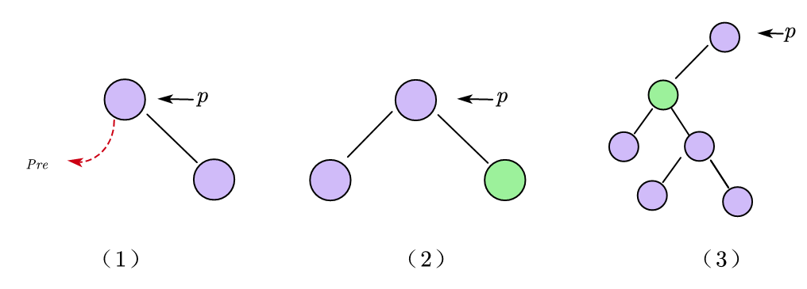

在本文中，我将介绍三种线索二叉树的构造方法，包括中序线索二叉树、先序线索二叉树以及后序线索二叉树。在介绍过程中，首先我会给出构造的基本思路，然后说明其中几点注意事项，最后我将给出代码示例。之后，我会针对每一种线索二叉树，给出其查找某节点p的前驱和后继结点的方法。最后我将做一个小小的对比总结，以便清楚地展现出不同线索二叉树在构造过程中以及查找前驱后继结点上的区别。

下面我们就开始吧！

## 1. 二叉树的线索化

### 1.1 中序线索二叉树

**中序线索二叉树的定义：** 一个二叉树通过如下的方法“穿起来”：所有原本为==空的右(孩子)指针==改为指向该节点在中序序列中的==后继==，所有原本为==空的左(孩子)指针==改为指向该节点的中序序列的==前驱==。

<center></center>

#### 1.1.1 朴素方法找中序前驱和后继

首先我们来思考如何用一种简单的方法来寻找中序遍历中某个结点的前驱和后继呢？

我们在遍历二叉树的时候，总是依次获取后继结点的，那么我们就不难想到，我们只要能够在遍历的过程中不断记录当前结点的前一个结点，那么就能够很方便的找到目标结点的前驱结点，为此只需额外设置一个pre指针来记录当前结点的前一个结点即可。下图给出了这个思想的示例：

<center></center>

当指针q和目标结点p重合时，pre指针指向的结点即为目标结点的前驱结点。当然，利用这种方法我们也可以找到目标结点的后继结点，只需要让pre指针与p指针重合，此时q指针指向的就是后继结点（但是需要对最后一个结点的后继结点进行特殊处理）。

**代码：**

```c++
void findPre(BiTree T) {
    if (T == NULL) {
        return;
    }
    findPre(T -> lchild);
    visit(T);
    findPre(T -> rchild);
}

void visit(BiTNode *q) {
    if (q == p) {
        final = pre;
    } else {
        pre = q;
    }
}

BiTNode *p; // p指向目标结点
BiTNode *pre = NULL; // 指向当前结点的前驱结点
BiTNode *final = NULL; // 记录最终结果
```


#### 1.1.2 中序线索化

**中序线索化的基本思想：** 本质上就是借助1.1.1的思想，借助pre指针来记录前一个结点，若当前结点p的左孩子为空，则让其左指针指向pre使其成为前驱线索(需要借助`ltag=1`进行标记)，若pre指向的结点的右孩子为空，则让其右指针指向当前结点p使其成为后继线索(需要借助`rtag=1`进行标记)。

<center></center>


**注意事项：**

- pre参数需要是**引用类型**，因为在程序运行中，pre的指向在不断进行更新。
- 处理中序遍历的最后一个结点时，可以不用判断rchild是否为NULL，因为中序遍历的最后一个结点的rchild必然为NULL否则就会继续遍历下去。但是，为了和其他线索二叉树统一起来，建议对最后一个结点进行一个非空判断。


**代码：**

```c++
typedef struct ThreadNode {
    ElemType data;
    struct ThreadNode *lchild, *rchild;
    int ltag, rtag;
} ThreadNode, *ThreadTree;

void InThread(ThreadTree p, ThreadTree &pre) {
    if (p == NULL) return;
    InThread(p->lchild, pre); // 递归线索化左子树
    if (p->lchild == NULL) { // 左子树为空，建立前驱线索
        p->lchild = pre;
        p->ltag = 1;
    }
    if (pre != NULL && pre->rchild == NULL) { // 建立前驱结点的后继线索
        pre->rchild = p;
        pre->rtag = 1;
    }
    pre = p;
    InThread(p->rchild, pre); // 递归线索化右子树
}

void CreatInThread(ThreadTree T) {
    ThreadNode *pre = NULL;
    if (T != NULL) {
        InThread(T, pre);
        if (pre->rchild == NULL) { // 处理最后一个结点
            pre->rtag = 1;
        }
    }
}
```


### 1.2 先序线索二叉树

**先序线索二叉树的定义：** 一个二叉树通过如下的方法“穿起来”：所有原本为==空的右(孩子)指针==改为指向该节点在先序序列中的==后继==，所有原本为==空的左(孩子)指针==改为指向该节点的先序序列的==前驱==。

<center></center>


#### 1.2.1 先序线索化

先序线索化的基本思想与中序线索化的思想相同，在这里不做过多赘述。

<center></center>

**注意事项：**

- 先序线索化过程中有一个需要格外注意的问题就是“转圈”问题，如下图所示的情况：当对d结点的左孩子线索化之后，由于先序遍历的规则，我们接下来应该遍历的是d的左子树也就是b，这样就导致了“转圈”问题。为了避免这个问题，我们就需要借助`ltag`判断左孩子是否为前驱线索。

- 处理先序遍历的最后一个结点时，其实也可以不用判断rchild是否为NULL，因为先序遍历的最后一个结点的rchild必然为NULL否则就会继续遍历下去。

    <center></center>


**代码：**

```c++
typedef struct ThreadNode {
    ElemType data;
    struct ThreadNode *lchild, *rchild;
    int ltag, rtag;
} ThreadNode, *ThreadTree;

void PreThread(ThreadTree p, ThreadTree &pre) {
    if (p == NULL) return;
    if (p->lchild == NULL) { // 左子树为空，建立前驱线索
        p->lchild = pre;
        p->ltag = 1;
    }
    if (pre != NULL && pre->rchild == NULL) { // 建立前驱结点的后继线索
        pre->rchild = p;
        pre->rtag = 1;
    }
    pre = p;
    if (p -> ltag == 0) { // 避免转圈问题
        PreThread(p->lchild, pre); // 递归线索化左子树
    }
    PreThread(p->rchild, pre); // 递归线索化右子树
}

void CreatPreThread(ThreadTree T) {
    ThreadNode *pre = NULL;
    if (T != NULL) {
        PreThread(T, pre);
        if (pre->rchild == NULL) { // 处理最后一个结点
            pre->rtag = 1;
        }
    }
}
```


### 1.3 后序线索二叉树

**后序线索二叉树的定义：** 一个二叉树通过如下的方法“穿起来”：所有原本为==空的右(孩子)指针==改为指向该节点在后序序列中的==后继==，所有原本为==空的左(孩子)指针==改为指向该节点的后序序列的==前驱==。

<center></center>


#### 1.3.1 后序线索化

后序线索化的基本思想与中序线索化的思想相同，在这里不做过多赘述。

<center></center>


**注意事项：**

- 后序线索化过程中不会出现“转圈”问题
- 但是，处理后序遍历的最后一个结点时，需要进行额外的判断，确定最后一个结点的右孩子是否为空。


**代码：**

```c++
typedef struct ThreadNode {
    ElemType data;
    struct ThreadNode *lchild, *rchild;
    int ltag, rtag;
} ThreadNode, *ThreadTree;

void PostThread(ThreadTree p, ThreadTree &pre) {
    if (p == NULL) return;
    PostThread(p->lchild, pre); // 递归线索化左子树
    PostThread(p->rchild, pre); // 递归线索化右子树
    if (p->lchild == NULL) { // 左子树为空，建立前驱线索
        p->lchild = pre;
        p->ltag = 1;
    }
    if (pre != NULL && pre->rchild == NULL) { // 建立前驱结点的后继线索
        pre->rchild = p;
        pre->rtag = 1;
    }
    pre = p;
}

void CreatPreThread(ThreadTree T) {
    ThreadNode *pre = NULL;
    if (T != NULL) {
        PostThread(T, pre);
        if (pre->rchild == NULL) { // 处理最后一个结点
            pre->rtag = 1;
        }
    }
}
```


## 2. 线索二叉树找前驱/后继

### 2.1 中序线索二叉树找后继

在中序线索二叉树中找到指定结点p的中序后继next

1. 若`p->rtag==1`，则`next=p->rchild`

2. 若`p->rtag==0`，则说明p一定有右孩子，此时`next=p的右子树中最左下结点`

    <center></center>

    

**代码：**

```c++
ThreadNode *Firstnode(ThreadNode *p) { // 找最左下结点
    while (p -> ltag == 0) {
        p = p -> lchild;
    }
    return p;
}

ThreadNode *Nextnode(ThreadNode *p) { // 判断p是否有右子树
    if (p -> rtag == 0) {
        return Firstnode(p -> rchild);
    } else {
        return p -> rchild;
    }
}

void InOrder(ThreadNode *T) { // 利用线索二叉树实现非递归的中序遍历
    for (ThreadNode *p = Firstnode(T); p != NULL; p = Nextnode(p)) {
        visit(p);
    }
}
```


### 2.2 中序线索二叉树找前驱

在中序线索二叉树中找到指定结点p的中序前驱pre

1. 若`p->ltag==1`，则`pre=p->lchild`

2. 若`p->ltag==0`，则说明p一定有左孩子，此时`pre=p的左子树中最右下结点`

    <center></center>


**代码：**

```c++
ThreadNode *Lastnode(ThreadNode *p) { // 找最左下结点
    while (p -> rtag == 0) {
        p = p -> rchild;
    }
    return p;
}

ThreadNode *Prenode(ThreadNode *p) { // 判断p是否有右子树
    if (p -> ltag == 0) {
        return Lastnode(p -> lchild);
    } else {
        return p -> lchild;
    }
}

void RevInOrder(ThreadNode *T) { // 利用线索二叉树实现非递归的逆向中序遍历
    for (ThreadNode *p = Lastnode(T); p != NULL; p = Prenode(p)) {
        visit(p);
    }
}
```


### 2.3 先序线索二叉树找后继

在先序线索二叉树中找到指定结点p的先序后继next

1. 若`p->rtag==1`，则`next=p->rchild`

2. 若`p->rtag==0`，则说明p一定有右孩子，此时又分为两种情况：

    1. 若p有左孩子，则`next=p->lchild`
    2. 若p没有左孩子，则`next=p->rchild`

    <center></center>

    

**代码：**

```c++
ThreadNode *Nextnode(ThreadNode *p) {
    if (p -> rtag == 1) {
        return p -> rchild;
    } else if (p -> rtag == 0 && p -> ltag == 0) {
        return p -> lchild;
    } else if (p -> rtag == 0 && p -> ltag == 1) {
        return p -> rchild;
    }
}
```


### 2.4 先序线索二叉树找前驱

在先序线索二叉树中找到指定结点p的先序前驱pre

1. 若`p->ltag==1`，则`pre=p->lchild`

2. 若`p->ltag==0`，由于先序遍历的特性，p的左右子树不可能为其先序前驱，且先序前驱只可能存在于上层结点中。因此普通的二叉链表除非从头遍历否则是无法找到其先序前驱的，我们需要借助三叉链表才能实现。

    <center>
        <br>
        <b>对情况3的额外说明</b>
        <br>
    
    </center>


### 2.5 后序线索二叉树找后继

在后序线索二叉树中找到指定结点p的后序后继next

1. 若`p->rtag==1`，则`next=p->rchild`

2. 若`p->rtag==0`，由于后序遍历的特性，p的左右子树不可能为其后序后继，且后序后后继只可能存在于上层结点中。因此普通的二叉链表除非从头遍历否则是无法找到其后序后继的，我们需要借助三叉链表才能实现。

    <center>
    <br>
        <b>对情况3的额外说明</b>
        <br></center>


​    

### 2.6 后序线索二叉树找前驱

在后序线索二叉树中找到指定结点p的后序前驱pre

1. 若`p->ltag==1`，则`pre=p->lchild`

2. 若`p->ltag==0`，则说明p一定有左孩子，此时又分为两种情况：

    1. 若p有右孩子，则`next=p->rchild`
    2. 若p没有右孩子，则`next=p->lchild`

    <center></center>


## 3. 小结

|                        |  中序线索化  |  先序线索化  | 后序线索化 |
| :--------------------: | :----------: | :----------: | :--------: |
|      **转圈问题**      |      无      |      有      |     无     |
| **最后一个结点的后继** | 直接赋值null | 直接赋值null |  需要判断  |


---


|            | 中序线索二叉树 | 先序线索二叉树 | 后序线索二叉树 |
| ---------- | :------------: | :------------: | :------------: |
| **找前驱** |       √        |       ×        |       √        |
| **找后继** |       √        |       √        |       ×        |

