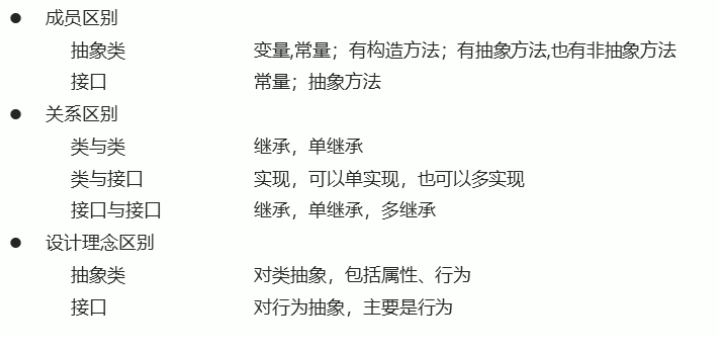

# Java学习笔记

## 1. Java语言介绍

### 1.1 Java语言跨平台原理

<center></center>


在需要运行Java应用程序的操作系统中，安装一个与操作系统对应的Java虚拟机即可。Java虚拟机(JVM)就像一个翻译一样，将java语言程序翻译成各种操作系统能够运行的程序。


### 1.2 JRE和JDK

#### 1.2.1 JRE(Java Runtime Environment)

java程序的运行时环境，包含JVM和java程序运行时所需要的核心类库。我们想要**运行**一个已有的java程序，那么只需要安装JRE即可。

#### 1.2.2 JDK(Java Development Kit)

Java程序开发工具包，包含JRE和开发人员使用的工具。其中，开发工具包括：编译工具(javac.exe)和运行工具(java.exe)。

我们如果想要开发java程序，就必须安装JDK

<center></center>


### 1.3 配置环境变量

#### 1.3.1 为什么要配置Path变量

为了在开发Java程序的时候，能够方便的使用javac和java命令，我们需要配置Path环境变量。否则，我们必须在JDK安装目录的bin目录下才可以使用。

#### 1.3.2 配置环境变量

参见：[Windows下配置Java环境变量 - Xiao·Tong - 博客园 (cnblogs.com)](https://www.cnblogs.com/xiaotong-sun/p/16139038.html)

提示：如果命令提示符窗口是在配置前打开的，需要关闭该窗口，重新打开一个新的窗口测试。


## 2. java入门

### 2.1 java程序开发运行流程

<center></center>

### 2.2 HelloWorld案例

```java
// HelloWorld.java
public class HelloWorld {
    public static void main(String[] args) {
        System.out.println("HelloWorld");
    }
}
```

在命令提示符窗口，编译并运行

- 编译：javac HelloWorld.java
- 运行:  java HelloWorld


## 3. java基础语法

### 3.1 关键字

- 关键字的字母全部小写
- 常用的代码编辑器，针对关健字有特殊颜色标记。
- 例如：`public`, `class`, `static`, `void`等。


### 3.2 常量

常量：在程序运行过程中，其值不可以发生改变的量。

| **常量类型** |                **说明**                | **举例**       |
| :----------: | :------------------------------------: | :------------- |
|  字符串常量  |          用双引号括起来的内容          | "HelloWorld"   |
|   整数常量   |             不带小数的数字             | 666， -8       |
|   小数常量   |              带小数的数字              | 1.1， 3.14     |
|   字符常量   |          用单引号括起来的内容          | 'A', '0', '我' |
|   布尔常量   |            布尔值，表示真假            | true，false    |
|    空常量    | 一个特殊的值：空值(空常量不能直接输出) | null           |


### 3.3 数据类型

#### 3.3.1 类型

java是强类型语言，对于每一种数据都给出明确的数据类型，不同的数据类型分配不同的内存空间，因此它们表示的数据大小也是不一样的。

<center></center>


#### 3.3.2 内存占用和取值范围

<center></center>


### 3.4 变量

变量：在程序运行过程中，其值可以发生改变的量

从本质上讲，变量是内存中的一小块区域。

#### 3.4.1 变量定义

- 格式：数据类型 变量名 = 变量值
- 范例：`int a = 10`

**注意事项：**

1. 整数变量默认类型为int， 浮点数变量默认为double
2. 变量名字不能重复
3. 变量未赋值不能使用
4. long类型的变量定义时，为了防止整数过大，后面要加L
5. float类型的变量定义时，为了防止类型不兼容，后面要加F

```java
public class VariableDemo {
    public static void main(String[] args) {
        long l = 10000000000L;	// 不能这样声明：long l = 10000000000
        System.out.println(l);
        float f = 3.14f;		// 不能这样声明：float f = 3.14
        System.out.println(f);
    }
}
```


### 3.5 标识符

#### 3.5.1 规则

1. 由数字、字母、下划线(`_`)和美元符(`$`)组成
2. 不能以数字开头
3. 不能是关键字
4. 区分大小写


#### 3.5.2 常见命名约定

<center></center>


### 3.6 类型转换

#### 3.6.1 自动类型转换

将一个表示**数据范围小**的数值或变量赋值给另一个表示**数据范围大**的变量。

<center></center>


#### 3.6.2 强制类型转换

将一个表示**数据范围大**的数值或变量赋值给另一个表示**数据范围小**的变量。

- 格式：目标数据类型 变量名 = (目标数据类型)值或者变量
- 范例：`int k = (int)88.88`


### 3.7 算术运算符

| 符号 | 作用 |
| :--: | :--: |
|  +   |  加  |
|  -   |  减  |
|  *   |  乘  |
|  /   |  除  |
|  %   | 取余 |

注意：整数相除只能得到整数，要想得到小数，必须有浮点数的参与


#### 3.7.1 字符串的“+”操作

```java
public class VariableDemo {
    public static void main(String[] args) {
        System.out.println("hello" + "world");
        // "helloworld"
        System.out.println("helloWorld" + 666);
        // "helloWorld666"
        System.out.println("helloWorld" + 6 + 66);
        // "helloWorld666"
        System.out.println(1 + 99 + "hello");
        // "100hello"   !!!!
    }
}
```


### 3.8 逻辑运算符

| 符号 |   作用   |                   说明                   |
| :--: | :------: | :--------------------------------------: |
|  &   |  逻辑与  |           结果均为true则为true           |
|  \|  |  逻辑或  |          结果均为false则为false          |
|  ^   | 逻辑异或 |     结果不同则为true，相同则为false      |
|  !   |  逻辑非  | 结果为true则为false，结果为false则为true |


### 3.9 短路逻辑运算符

| 符号 |  作用  |           说明           |
| :--: | :----: | :----------------------: |
|  &&  | 短路与 | 如果左边为假，右边不执行 |
| \|\| | 短路或 |   左边为真，右边不执行   |


### 3.10 三元运算符

- 格式：关系表达式?表达式1：表达式2
- 范例：a>b?a:b;

计算规则：

1. 首先计算关系表达式的值
2. 如果值为true，表达式1的值就是运算结果
3. 如果值为false，表达式2的值就是运算结果


### 3.11 数据输入

**Scanner使用的基本步骤**

:one: 导包

```java
import java.util.Scanner;
// 导包的动作必须出现在类定义的上边
```

:two: 创建对象

```java
Scanner sc = new Scanner(System.in);
```

:three: 接收数据

```java
int i = sc.nextInt();
```


### 3.12 Random

作用：用于产生一个随机数

使用步骤:

:one: 导包

```java
import java.util.Random;
```

:two: 创建对象

```java
Random r = new Random();
```

:three: 获取随机数

```java
int number = r.nextInt(10);
// 获取随机数的范围为：[0,10), 包括0，但不包括10
```


### 3.13 数组

数据是一种用来存储==多个相同类型数据==的存储类型

#### 3.13.1 数组的定义格式

- 格式一： 数据类型`[]`  变量名
- 范例：`int[] arr`


- 格式二： 数据类型  变量名`[]`
- 范例：`int arr[]`

**注意：**这两种格式在使用上是等价的，但推荐第一种格式。


#### 3.13.2 数组的初始化

**动态初始化：**初始化时仅指定数组长度，由系统为数组分配初始值。

- 格式：数据类型`[]`  变量名 = new 数据类型`[数组长度]`
- 范例：`int[] arr = new int[3];`

**静态初始化：**初始化时，指定每个数组元素的初始值，由系统决定数组长度。

- 格式：数据类型`[]` 变量名 = new 数据类型`[]` {数据1， 数据2， 数据3}；
- 范例：`int[] arr = new int[] {1, 2, 3};`
- 简化格式：`int[] arr = {1, 2, 3};`


#### 3.13.3 内存分配

<center></center>


## 4. java流程控制

### 4.1 流程控制语句分类

- 顺序结构
- 分支结构`if`, `switch`
- 循环结构`for`, `while`, `do...while`


### 4.2 switch语句格式

```
switch(表达式) {
	case 值1:
		语句体1;
		break;
	case 值2:
		语句体2;
		break;
	...
	default:
		语句体n+1;
		break;
}
```

**注意事项： case穿透**

如果在一个语句体结束之后，没有break，就会继续执行下面的case，直到遇到break为止。合理利用case穿透现象可以简化程序。

```java
// case穿透现象的应用示例
switch(month) {
    case 1:
    case 2:
    case 12:
        System.out.println("冬季");
        break;
    case 3:
    case 4:
    case 5:
        System.out.println("春季");
        break;
}
```


## 5. IDEA的安装与使用


### 5.1 IDEA概述

IDEA是用于Java语言开发的集成环境，它是业界公认的目前用于java程序开发的最好的工具。

**集成环境：**把代码==编写、编译、执行、调试==等多种功能综合到一起的开发工具


### 5.2 IDEA创建项目流程

:one: 创建空项目

<center></center>

:two: 创建新模块

<center></center>

:three: 在模块下的src下创建一个包

<center></center>

:four: 在包下创建一个类

<center></center>

:five: 在类中编写代码

:six: 在idea中执行程序(生成的class文件在out目录下)

<center></center>


### 5.3 IDEA项目结构

<center></center>


### 5.4 IDEA中内容辅助键和快捷键

#### 5.4.1 内容辅助键

- 快速生成语句
    - 快速生成main()方法：`psvm，回车` 或者 `main， 回车`
    - 快速生成输出语句：`sout, 回车`
- 内容辅助键
    - `Ctrl + Alt + space`: 内容提示， 代码补全等(新版本可能无法使用，直接tab即可)。

#### 5.4.2 注释键

- 单行注释：选中代码，`ctrl + /`
- 多行注释：选中代码，`ctrl + shift + /`


### 5.5 IDEA中模块操作

- 新建模块：操作见上面创建项目

- 删除模块

    <center></center>

- 导入模块

    <center></center>


## 6. java初级进阶

### 6.1 方法

#### 6.1.1 方法概述

- ==方法==是将具有独立功能的代码块组织成为一个整体，使其具有特殊的代码集。
- 方法必须先创建才能使用，该过程成为==方法定义==
- 方法创建后并不是直接运行的，需要手动使用后才可以执行，该过程称为==方法调用==。


#### 6.1.2 方法定义和调用

- 定义的格式：

    ```java
    public static void 方法名() {
        // 方法体
    }
    ```

- 调用的格式：

    ```java
    方法名();
    ```

- 带参数方法的定义：

    ```java
    public static void isEvenNumber(int a, int b) {
        // 方法体
    }
    ```


#### 6.1.3 方法的注意事项

- 方法==不能嵌套定义==
- void表示无返回值，可以省略return， 也可以单独的书写return，后面不加数据。
- 定义方法时，要做到==两个明确==
    - 明确返回值类型
    - 明确参数类型和数量


#### 6.1.4 方法重载

**方法重载**指同一个类中定义的多个方法之间的关系，这些方法只有满足下列条件才相会构成重载

- 多个方法在==同一个类中==
- 多个方法具有==相同的方法名==
- 多个方法的==参数不相同==或者==类型不同==或者==数量不同==

**特点：**

1. 重载仅对应方法的定义，与方法的调用无关
2. 重载仅针对同一个类中方法的==名称与参数进行识别==，与==返回值无关==，不能通过返回值来判断方法是否重载。
3. 在调用时，java虚拟机会通过==参数的不同==来区分同名的方法。


方法重载范例；

```java
/* 示例一 */
public class MethodDemo {
    public static void fn(int a) {
        // 方法体
    }
    public static void fn(double a) {
        // 方法体
    }
}

/* 示例二 */
public class MethodDemo {
    public static float fn(int a) {
        // 方法体
    }
    public static int fn(int a, int b) {
        // 方法体
    }
}
```


### 6.2 Debug

**Debug:**是供程序员使用的程序调试工具，它可以用于==查看程序的执行流程==，也可以用于追踪程序的执行过程来==调试程序==。

Debug调试又称为断点调试，断点其实是一个标记，告诉我们从哪里查看。


### 6.3 类和对象

#### 6.3.1 类

类的重要性：是java程序的基本组成单位

类的定义：是对现实生活中一类具有==共同属性==和==行为==的事物的抽象，确定对象将会拥有的属性和行为

类的组成：

- 属性：在类中通过==成员变量==来体现(类中方法外的变量)
- 行为：在类中通过==成员方法==来体现。


#### 6.3.2 类的定义

- 步骤：

    <center></center>
    
- 格式：

    ```java
    public class 类名 {
        // 成员变量
        数据类型 变量1;
        数据类型 变量2;
        ....
        // 成员方法
        方法1;
        方法2;
        ....
    }
    ```

- 范例：

    ```java
    public class Phone {
        String brand;
        int price;
        
        public void call() {
            System.out.println("call");
        }
        
        public void sendMessage() {
            System.out.println("message");
        }
    }
    ```


#### 6..3.3 对象

**创建对象：**

- 格式：类名 对象名 = new 类名();
- 范例：`Phone p = new Phone();`

**使用对象：**

1. 使用成员变量
    - 格式：对象名.变量名
    - 范例：`p.brand`
2. 使用成员方法
    - 格式：对象名.方法名
    - 范例：`p.call()`

```java
public class PhoneDemo {
    public static void main(String[] args) {
        Phone p = new Phone();
        p.brand = "小米";
        p.price = 2999;
        System.out.println(p.brand);
        System.out.println(p.price);
        p.call();
        p.sendMessage();
    }
}
```


#### 6.3.4 对象内存图及调用过程

<center>
<br>
<b>study方法调用完毕后，出栈，doHomework入栈 </b><br>
</center>


#### 6.3.5 成员变量和局部变量

<center></center>


### 6.4 ==封装==

#### 6.4.1 private关键字

- 是一个==权限修饰符==
- 可以修饰成员变量和成员方法
- 作用是：保护成员不被别的类使用，被private修饰的成员只在本类中才能访问

针对private关键字修饰的成员变量，如果需要被其他类使用，必须提供相应的操作

- 提供“get变量名()”方法，获取成员变量的值，方法用public修饰
- 提供“set变量名(参数)",用于设置成员变量的值，方法用public修饰

==通过以上方式可以处理输入数据的安全问题==


范例：

```java
package com.itheima02;

public class Student {
    String name;
    private int age;

    public void setAge(int a) {
        if (a >= 120 || a <= 0) {
            System.out.println("你输入的年龄有误");
        } else {
            age = a;
        }
    }

    public int getAge() {
        return age;
    }

    public void show() {
        System.out.println(name + "," + age);
    }
}


public class StudentDemo {
    public static void main(String[] args) {
        Student stu = new Student();
        stu.name = "小明";
        stu.setAge(-30);
        stu.show();
        stu.setAge(30);
        stu.show();
        System.out.println("getAge方法测试结果：" + stu.getAge());
    }
}

// OUT
你输入的年龄有误
小明,0
小明,30
getAge方法测试结果：30
```


#### 6.4.2 this关健字

1. this修饰的变量用于指代==成员变量==
    - 方法的形参如果与成员变量同名，不带this修饰的变量指的是形参，而不是成员变量
    - 方法的形参没有与成员变量同名，不带this修饰的变量指的是成员变量
2. this解决==局部变量隐藏成员变量的问题==
3. this：代表所在类的对象引用。==方法被哪个对象调用，this就代表哪个对象==。


#### 6.4.3 封装的概念

<center></center>


### 6.5 构造方法

构造方法是一种特殊方法，作用是在创建对象时完成对象数据的初始化。当一个类中没有构造方法，系统将默认给类一个无参的构造方法。·

构造函数基本上定义了两个规则。它们分别如下 :

1. **构造函数名称必须与其类名称相同**
2. **构造函数必须没有显式返回类型**


**基本格式:**

```java
public class 类名 {
    修饰符 类名(参数) {
        //内容
    }
}
// 范例
public class Student {
    public Student() {
        //内容
    }
}
```


**注意事项：**

<center></center>


**标准类的制作：**

<center></center>

**范例：**

```java
package com.itheima;

public class Student {
    // 成员变量
    private String name;
    private int age;

    // 构造方法
    public Student() {
    }

    public Student(String name, int age) {
        this.name = name;
        this.age = age;
    }

    // 成员方法
    public void setName(String name) {
        this.name = name;
    }

    public String getName() {
        return name;
    }

    public void setAge(int age) {
        this.age = age;
    }

    public int getAge() {
        return age;
    }

    public void show() {
        System.out.println(name + "," + age);
    }
}


public class StudentDemo {
    public static void main(String[] args) {
        // 无参构造
        Student s1 = new Student();
        s1.setName("小明");
        s1.setAge(30);
        s1.show();

        // 带参构造
        Student s2 = new Student("小刚", 20);
        s2.show();
    }
}
```


### 6.6 API

#### 6.6.1 API概述

API(Application Programming Interface):应用程序编程接口（本质上就是一些接口类，这些类中定义好了一些有用的方法）

Java API：指的就是JDK中提供的各种功能的java类。我们可以通过==帮助文档==来查看这些类。java.lang包下的类不需要导包。


#### 6.6.2 如何使用帮助文档

<center></center>


### 6.7 String

#### 6.7.1 概述

<center></center>


#### 6.7.2 构造方法：

<center></center>


#### 6.7.3 String对象特点

1. 通过new创建的字符串对象，每一次new都会申请一个内存空间，即使内容相同，它们的地址也是不同的。
2. 通过`“”`方式给出的字符串，只要字符序列相同（顺序和大小写），无论在代码中出现几次，都只是一个String对象。


#### 6.7.4 字符串的比较

- 使用`==`作比较
    - 基本类型：比较的是==数据值==是否相同
    - 引用类型：比较的是==地址值==是否相同
- 使用`equals()`
    - 比较的是引用的内容是否相同。


#### 6.7.5 案例

##### 统计字符串中大写字母，小写字母，及数字个数。

```java
import java.util.Scanner;

public class StringCount {
    public static void main(String[] args) {
        Scanner sc = new Scanner(System.in);
        System.out.println("Please input the String:");
        String str = sc.nextLine();
        int count1 = 0, count2 = 0, count3 = 0;
        for (int i = 0; i < str.length(); i ++) {
            char ch = str.charAt(i);
            if (ch >= 'A' && ch <= 'Z') {
                count1 ++;
            }else if (ch >= 'a' && ch <= 'z') {
                count2 ++;
            } else if(ch >= '0' && ch <= '9') {
                count3 ++;
            }
        }
        System.out.println("大写字母：" + count1);
        System.out.println("小写字母：" + count2);
        System.out.println("数字：" + count3);
    }
}
```


##### 字符串反转

```java
import java.util.Scanner;

public class StringReverse {
    public static void main(String[] args) {
        Scanner sc = new Scanner(System.in);
        String str = sc.nextLine();
        String ans = reverse(str);
        System.out.println(ans);
    }

    public static String reverse(String str) {
        String ans = "";
        for (int i = str.length() - 1; i >= 0; i --) {
            ans += str.charAt(i);
        }
        return ans;
    }
}
```


### 6.8 StringBulider

#### 6.8.1 概述

<center>
    <br><br>
    </center>


#### 6.8.2 范例

```java
// 范例1
public class StringBuilderDemo {
    public static void main(String[] args) {
        StringBuilder sb = new StringBuilder();
        // 链式编程
        sb.append("hello").append(" world").append(" 123");
        System.out.println(sb);
    }
}


// 范例2
public class StringBuilderDemo {
    public static void main(String[] args) {
        int[] arr = {1, 2, 3};
        System.out.println(arrayToString(arr));
        String str = "abcd";
        System.out.println(myRverse(str));
    }

    public static String arrayToString(int[] arr) {
        StringBuilder sb = new StringBuilder("[");
        for (int i = 0; i < arr.length; i ++) {
            sb.append(i);
            if (i < arr.length - 1) {
                sb.append(",");
            }
        }
        sb.append("]");
        return sb.toString();
    }

    public static String myRverse(String str) {
        StringBuilder sb = new StringBuilder(str);
        return sb.reverse().toString();
    }
}
```


<center></center>


### 6.9 集合

#### 6.9.1 集合概述

集合类的特点：提供一种==存储空间可变==的存储模型，存储的数据容量可以发生改变。

**案例：集合存储学生对象，并遍历**

```java
// 定义学生类
public class Student {
    // 成员变量
    private String name;
    private int age;

    // 构造方法
    public Student() {
    }

    public Student(String name, int age) {
        this.name = name;
        this.age = age;
    }

    // 成员方法
    public void setName(String name) {
        this.name = name;
    }

    public String getName() {
        return name;
    }

    public void setAge(int age) {
        this.age = age;
    }

    public int getAge() {
        return age;
    }
}

// 遍历
public class ArrayListTest {
    public static void main(String[] args) {
        // 创建集合对象
        ArrayList<Student> array = new ArrayList<>();

        // 创建学生对象
        Student stu1 = new Student("小明", 18);
        Student stu2 = new Student("小刚", 13);
        Student stu3 = new Student("小李", 19);

        // 添加学生对象到集合中
        array.add(stu1);
        array.add(stu2);
        array.add(stu3);

        // 遍历集合
        for (int i = 0; i < array.size(); i++) {
            Student s = array.get(i);
            System.out.println(s.getName() + "," + s.getAge());
        }
    }
}
```


### 6.10 ==继承==

- java中类只支持单继承，不支持多继承
- java中类支持多层继承

#### 6.10.1 继承概述

继承是面向对象三大特征之一。可以使得子类具有父类的属性和方法，还可以在子类中重新定义，最佳属性和方法。

#### 6.10.2 格式

- 格式：public class 子类名 extends 父类名{}
- 范例：`public calss Zi extends Fu {}`
- Fu: 是父类，也称为基类、超类。
- Zi：是子类，也被称为派生类。


继承中子类的特点：

- 子类可以有父类的内容
- 子类可以有自己特有的内容

```java
// 父类
public class Fu {
    public void show() {
        System.out.println("show方法被调用");
    }
}

//子类
public class Zi extends Fu{
    public void method() {
        System.out.println("method方法被调用");
    }
}

// 测试类
public class Demo {
    public static void main(String[] args) {
        Fu f = new Fu();
        f.show();

        Zi z = new Zi();
        z.method();
        z.show();
    }
}
```


#### 6.10.3 继承的好处和缺点

<center></center>


#### 6.10.4 继承中变量的访问特点

在子类方法中访问一个变量的查找顺序：

1. 子类方法内部局部范围查找
2. 子类成员范围查找
3. 父类成员方法查找
4. 如果都没有就报错（不考虑父类的父类，但是如果父类还有父类也需检查）


#### 6.10.5 super

```java
// 父类
public class Fu {
    public int age = 40;
}

// 子类
public class Zi extends Fu {
    public int age = 20;

    public void show() {
        int age = 30;
        System.out.println(age);
        System.out.println(this.age); // 访问子类成员变量
        System.out.println(super.age); // 访问父类成员变量
    }
}

// 测试类
public class Demo {
    public static void main(String[] args) {
        Zi z = new Zi();
        z.show();
    }
}
```

<center></center>


#### 6.10.6 继承中构造方法的访问特点

<center></center>


#### 6.10.7 继承中成员方法的访问特点

通过子类对象访问一个方法

- 子类成员范围查找
- 父类成员范围查找
- 都没有则报错（不考虑父类的父类）


#### 6.10.8 super内存图

<center></center>

<center></center>

<center></center>


#### 6.10.9 方法重写

方法重写：子类中出现了和父类中一模一样的方法声明

方法重写的应用：当子类需要父类的功能，而功能主体子类有自己特有的内容时，可以重写父类中的方法，这样，既沿袭了父类的功能，又定义了子类特有的内容。

==@Override==

- 是一个注解。
- 可以帮助我们检查重写方法的方法声明的正确性。


**注意事项：**

1. 私有方法不能被重写（父类私有成员子类是不能继承的）
2. 子类方法访问权限不能更低(public  > 默认 > 私有)


### 6.11 包

#### 6.11.1 概述

包其实就是文件夹

作用：对类进行分类管理

包的定义格式

- 格式：package 包名； （多级包用`.`分开
- 范例：`package com.itheima;`

<center></center>


#### 6.11.2 导包

```java
// 格式
import cn.itcast.Teacher
```


### 6.12 修饰符

- 权限修饰符

    <center></center>

- 状态修饰符

    - final：是最终的意思，可以修饰成员方法，成员变量，类

        - 修饰方法时：表示该方法是最终方法，==不能被重写==
        - 修饰变量时：表示该变量是常量，==不能再次被赋值==
            - 变量是基本类型时：final修饰指的是==基本类型的数据值==不能发生改变。
            - 变量是引用类型时：final修饰指的是==引用类型的地址值==不能发生改变，但地址里面的内容是可以改变的。
        - 修饰类：表明该类是最终类，==不能被继承==

    - static：是静态的意思，可以修饰成员方法，成员变量（有点像全局变量的意思）

        - 被类的所有对象共享

        - 可以通过类名调用（推荐），也可以通过对象名调用

            <center></center>


### 6.13 ==多态==

#### 6.13.1 多态概述

同一个对象，在不同时刻表现出来的不同状态

> 举例：学生
>
> 我们可以说学生是学生： `Student stu = new Student();`
>
> 我们也可以说学生是人：`Person stu = new Student();`
>
> 这里学生在不同时刻表现出来了不同的形态，这就是多态。


多态的前提和体现

- 有继承或实现的关系
- 有方法重写
- 有父(类/接口)引用指向(子/实现)类对象


#### 6.13.2 多态中成员访问特点

- 成员变量：编译看左边，执行也看左边
- 成员方法：编译看左边，执行看右边

为什么成员变量和成员方法的访问不一样呢？

- 因为成员方法有重写，而成员变量没有。


#### 6.13.3 多态的好处和弊端

- 好处：提高了程序的拓展性
    - 具体体现：定义方法时，使用父类型作为参数，将来在使用的时候，使用具体的子类型参与操作
- 弊端：不能使用子类的特有功能。


#### 6.13.4 多态中的转型

- 向上转型
    - 从子到父
    - 父类引用==指向==子类对象
- 向下转型
    - 从父到子
    - 父类引用==转为==子类对象


```java
public class Demo {
    public static void main(String[] args) {
        // 多态
    	Animal a = new Cat(); // 向上转型
        
        Cat c = (Cat)a; // 向下转型
        
    }
}
```


### 6.14 抽象类

#### 6.14.1 概念

在java中，一个没有方法体的方法定义为抽象方法， 而类中如果有抽象方法，该类必须定义为抽象类。==（抽象方法必须放在抽象类中，而抽象类中不一定要有抽象方法）==

```java
// 抽象类
public abstract class Animal {
    // 抽象方法
    public abstract void eat();
}
```

**特点:**

<center></center>


#### 6.14.2 抽象类的成员特点

<center></center>


### 6.15 接口

接口是一种==公共的规范标准==，java中的接口更多的体现在==对行为的抽象上==。

#### 6.15.1 接口的特点

- 接口用`interface`修饰
    - `public interface 接口名 {}`
- 类实现接口用`implements`表示
    - `public class 类名 implements 接口名 {}`
- 接口不能实例化
    - 可用参照多态的方式，通过实现类对象实例化，这叫接口多态。
- 接口的实现类
    - 要么重写接口中的所有抽象方法
    - 要么是抽象类


#### 6.15.2 接口的成员特点

<center></center>


#### 6.15.3 类和接口的关系

<center></center>


#### 6.15.4 抽象类和接口的区别

<center></center>


**以报警门案例展示抽象类和接口的用法**

```java
public interface Alarm {
    void alarm();
}

public abstract class Door {
    public abstract void open();
    public abstract void close();
}

public class AlarmDoor extends Door implements Alarm {
    public void open() {
        //
    }
    
    public void close() {
        //
    }
    
    public void alarm() {
        //
    }
}
```

**强调：抽象类是对事物的抽象，而接口是对行为的抽象**


## 7. java中级进阶

### 7.1 类名&抽象类名&接口名作为形参和返回值

#### 7.1.1 类名作为形参和返回值

- 方法的形参是类名，其实需要的是类的对象
- 方法的返回值是类名，其实返回的是类的对象


#### 7.1.2 抽象类名作为形参和返回值

**注意：抽象类是不能实例化的，因此我们需要采用多态的方法来创建抽象类对象。**

- 方法的形参是抽象类名，其实需要的是==该抽象类的子类的对象==
- 方法的返回值是抽象类名，其实返回的是==该抽象类的子类的对象==


#### 7.1.3 接口名作为形参和返回值

**注意：接口是不能实例化的，因此我们需要采用多态的方法来创建接口的实现类对象。**

- 方法的形参是接口名，其实需要的是==该接口的实现类对象==
- 方法的返回值是接口名，其实返回的是==该接口的实现类对象==


### 7.2 内部类

#### 7.2.1 概述

概述：内部类就是在一个类里面定义的类

格式：

```java
public class 类名 {
    // 外部类
    public class 类名 {
        // 内部类
    }
}
```


内部类访问特点：

- 内部类可以直接访问外部类的成员，包括私有。
- 外部类要访问内部类的成员，必须创建对象


#### 7.2.2 成员内部类

按照内部类在类中的定义位置不同，可以分为如下两种形式：

- 在类的成员位置：成员内部类
- 在类的局部位置：局部内部类


成员内部类，外界如何创建对象并使用？

- 格式：`外部类名.内部类名 对象名 = 外部类对象.内部类对象`;
- 范例：`Outer.Inner oi = new Outer().new Inner();`


**成员内部类常见修饰符：**private

如果我们的内部类不想轻易被任何人访问，可以选择使用private修饰内部类，这样我们就无法通过创建对象的方法来访问，想要访问只需要在外部类中定义一个public修饰的方法，间接调用。这样做的好处就是，我们可以在这个public方法中增加一些判断语句，起到数据安全的作用。

```java
  public class Outer {
      private class Inner {
          public void show() {
              System.out.println(“密码备份文件”);
          }
      }
      
      public void method() {
          if(你是管理员){
              Inner i = new Inner();
              i.show();
          }else {
              System.out.println(“你没有权限访问”);
          }
      }
  }
```

下面我们给出一个更加规范的写法

```java
  public class Outer {
      private class Inner {
          public void show() {
              System.out.println(“密码备份文件”);
          }
      }
      //使用getXxx()获取成员内部类，可以增加校验语句（文中省略）
      public Inner getInner() {
          return new Inner();
      }
      
      public static void main(String[] args) {
          Outer outer = new Outer();
          Outer.Inner inner = outer.getInner();
          inner.show();
      }
  }
```


#### 7.2.3 局部内部类

**特点**

- 局部内部类是在方法中定义的类，所以外界是无法直接使用的，需要在方法内部创建对象并使用。
- 局部内部类可以直接访问外部类的成员，也可以访问方法内的局部变量


**格式：**

```java
 public class Outer {
      public void method(){
          class Inner {
          }
      }
  }
```


**访问时：**

```java
  //在局部位置，可以创建内部类对象，通过对象调用和内部类方法
  public class Outer {
      private int age = 20;
      public void method() {
          final int age2 = 30;
          class Inner { // 注意：不能加public和private修饰
              public void show() {
                  System.out.println(age);
                  //从内部类中访问方法内变量age2，需要将变量声明为最终类型。
                  System.out.println(age2);
              }
          }
          
          Inner i = new Inner();
          i.show();
      }
  }
```


#### 7.2.4 匿名内部类

> 一个没有名字的类，是内部类的简化写法

**前提：**需要存在一个类（具体类或者抽象类均可）或者接口

**格式：**

```java
  new 类名或者接口名() {
      重写方法();
  }
```

**本质：其实是继承该类或者实现接口的子类匿名==对象==**

**范例：**

```java
// 接口
public interface Inter {
    void show();
}

// 外部类
public class Outer {
  	public void method() {
        // 匿名内部类
        new Inter() {
            @Override
            public void show() {
                System.out.println("单次匿名内部类")
            }
        }.show;
        
        Inter i = new Inter() {
            @Override
            public void show() {
                System.out.println("多次匿名内部类");
            }
        };
        i.show;
        i.show;
    }
}
```


**匿名内部类在开发中的使用**

我们在开发的时候，会看到抽象类，或者接口作为参数。

而这个时候，实际需要的是一个子类对象。

如果该方法仅仅调用一次，我们就可以使用匿名内部类的格式简化


### 7.3 Object类

**Object是类层次结构的根，每个类都可以将Object作为超类。所有的类都直接或间接地继承自该类**

<center></center>


通过快捷键`alt + insert`可以自动生成

方法重写的示例：

```java
package com.Demo;

import java.util.Objects;

public class Student {
    private String name;
    private String age;

    public Student() {}

    public Student(String name, String age) {
        this.name = name;
        this.age = age;
    }

    public String getAge() {
        return age;
    }

    public void setAge(String age) {
        this.age = age;
    }

    public String getName() {
        return name;
    }

    public void setName(String name) {
        this.name = name;
    }

    @Override
    public String toString() {
        return "Student{" +
                "name='" + name + '\'' +
                ", age='" + age + '\'' +
                '}';
    }

    @Override
    public boolean equals(Object o) {
        if (this == o) return true;
        if (o == null || getClass() != o.getClass()) return false;

        Student student = (Student) o;

        if (!Objects.equals(name, student.name)) return false;
        return Objects.equals(age, student.age);
    }
}
```


### 7.4 Arrays

<center></center>


### 7.5 基本类型包装类

#### 7.5.1 概述

将基本数据类型封装成对象的好处在于，可以在对象中定义更多的功能方法操作该数据

常用的操作之一：用于基本数据类型与字符串之间的转换

| 基本数据类型 |  包装类   |
| :----------: | :-------: |
|     byte     |   Byte    |
|    short     |   Short   |
|     int      |  Integer  |
|     long     |   Long    |
|    float     |   Float   |
|    double    |  Double   |
|     char     | Character |
|   boolean    |  Boolean  |


#### 7.5.2 以Integer为例介绍使用

<center></center>


#### 7.5.3 自动装箱与自动拆箱

- 装箱：把基本数据类型转换为对应的包装类类型
- 拆箱：把包装类类型转换为对应的基本类类型


```java
public class ArrayDemo {
    public static void main(String[] args) {
        Integer i = Integer.valueOf(100); //手动装箱
        Integer i2 = 100; //自动装箱，编译器底层自动实现Integer.valueOf()操作
        
        i2 = i2.intValue() + 200; //i2.intValue()为手动拆箱过程， 加完之后还有个自动装箱过程
        i2 = i2 + 200; // i2+200为自动拆箱； i2 = i2 + 200是自动装箱。
    }
}
```


### 7.6 日期类

#### 7.6.1 构造方法

- `public Date();` 无参构造，以当前时间初始化数据
- `public Date(long time);` 带参构造，以1970年1月1日，经过time毫秒后的日期初始化


#### 7.6.2 常用方法

- `public long getTime();` 获取的是日期对象从1970年1月1日00：00：00到现在的毫秒数
- `public void setTime(long time)` 设置时间，给的是毫秒数


#### 7.6.3 SimpleDateFormat类概述

<center></center>
<center></center>
<center></center>


范例

```java
import java.util.Date;

public class DateDemo {
    public static void main(String[] args) throws ParseException {
        Date d = new Date();

        SimpleDateFormat sdf = new SimpleDateFormat("yyyy/MM/dd hh:mm:ss");
        String s = sdf.format(d);
        System.out.println(s);

        String date = "2020/02/21 21:22:22";
        Date d2 = sdf.parse(date);
        System.out.println(d2);
    }
}
```


#### 7.6.4 Calendar类

Calendar类是一个抽象类，它为某一时刻和一组日历字段之间的转换提供了一些方法，并为操作日历字段提供了一些方法

**Calendar创建对象**

```java
Calendar c = Calendar.getInstance(); // Calendar类通常用此方法创建对象，其原理为多态（向上转型），其日历字段已使用当前的日期和时间初始化
```

**常用方法**

```java
/*  
	public abstract void add(int field,int amount)
    根据日历的规则，将指定的时间量添加或减去给定的日历字段。
    例如，要从当前日历的时间减去5天，您可以通过调用以下方法来实现：
    add(Calendar.DAY_OF_MONTH, -5);
*/

/*
	public int get(int field)
	返回给定日历字段的值。
*/

/*
	public final void set(int year,
                      	int month,
                      	int date,
                      	int hourOfDay,
                      	int minute,
                      	int second)
    设置字段中的值YEAR ， MONTH ， DAY_OF_MONTH ， HOUR_OF_DAY ， MINUTE和SECOND
*/
import java.util.Calendar;

public class CalendarDemo {
    public static void main(String[] args) {
        Calendar c = Calendar.getInstance();
        c.set(2022, 1, 1);
        c.add(Calendar.DATE, +5);
        int year = c.get(Calendar.YEAR);
        int month = c.get(Calendar.MONTH) + 1; // Calendar里面的月份默认从0开始，也就是说：0代表January， 11代表December
        int date = c.get(Calendar.DATE);
        System.out.println(year + "年" + month + "月" + date + "日");
    }
}

// OutPut：2022年2月6日
```


### 7.7 异常

#### 7.7.1 概述

<center></center>


#### 7.7.2 JVM对异常的默认处理方案

- 把异常的名称，异常原因以及异常出现的位置等信息输出在控制台上
- 把程序停止执行


#### 7.7.3 自定义异常处理

两种方案：

1. try .... catch....

    <center>
        
        <br>
    	<b>Throwable的成员方法</b>
    	<br>
        
    </center>
    
    
    
    
    
    
2. throws

    <center></center>


**自定义异常**

<center></center>


<center></center>

**范例**

```java
public class ScoreException extends Exception{ // 非运行时异常（受检异常）
    public ScoreException() {
    }

    public ScoreException(String message) {
        super(message);
    }
}


public class Teacher {
    public void checkScore(int score) throws ScoreException {
        if (score < 0 || score > 100) {
            throw new ScoreException("你输入的成绩不在0-100范围内");
        } else {
            System.out.println(1);
        }
    }
}


public class TeacherTest1 {
    public static void main(String[] args) throws ScoreException {
        int i = 120;

        Teacher t = new Teacher();
        t.checkScore(i);
        System.out.println("end"); // 使用throws ScoreException 时不会执行这一步
    }
}


public class TeacherTest2 {
    public static void main(String[] args) {
        int i = 120;

        Teacher t = new Teacher();
        try {
            t.checkScore(i);
        } catch(ScoreException e) {
            e.printStackTrace();
        }
        System.out.println("end"); // 使用try catch时，会执行这一步
    }
}
```


### 7.8 集合

#### 7.8.1 集合体系结构

 <center></center>

#### 7.8.2 Collection集合概述和使用

- Collecton是单列集合的顶层接口，他表示一组对象，这些对象也称为Collection的元素。
- JDK不提供此接口的任何直接实现，它提供更具体的子接口（如Set和List）实现。


创建Collection集合对象

```java
public class CollectonDemo01 {
    public static void main(String[] args) {
        Collection<String> c = new ArrayList<String>();
        c.add("hello");
        c.add("world");
        c.add("java");
        
        // 迭代器遍历集合元素
        Iterator<String> it = c.iterator(); //创建迭代器对象
        while (it.hasNext()) {
            System.out.println(it.next());
        }
    }
}
```


#### 7.8.3 List集合概述和使用

- List是有序集合，可以通过整数索引访问元素，并搜索列表中的元素
- 与Set集合不同，列表通常允许重复元素


创建List集合对象

```java
public class ListDemo01 {
    public static void main(String[] args) {
        List<String> c = new ArrayList<String>();
        c.add("hello");
        c.add("world");
        c.add("java");
        
        // 迭代器遍历集合元素
        Iterator<String> it = c.iterator(); //创建迭代器对象
        while (it.hasNext()) {
            System.out.println(it.next());
        }
        
        // 并发修改异常
        Iterator<String> it = c.iterator();
        while (it.hasNext()) {
            String s = it.next();
            if (s.equals("world")) {
                c.add("javaee");   // 这个操作导致：modCount和expectedModCount不相等
            }
            System.out.println(s);
        }
        
        // list迭代器，不会产生并发修改异常
        ListIterator<String> lit = list.listIterator();
        while (lit.hasNext()) {
            String s = lit.next();
            if (s.equals("world")) {
                lit.add("javaee");
            }
        }
    }
}
```


#### 7.8.4 增强for循环

- 内部原理是一个Iterator迭代器
- 实现iterator接口的类允许其对象成为增强型for语句的目标


范例

```java
import java.util.ArrayList;
import java.util.List;

public class CollectionDemo01 {
    public static void main(String[] args) {
        int[] arr = {1, 2, 3, 4, 5, 6};
        for (int i : arr) {
            System.out.println(i);
        }

        List<String> list = new ArrayList<>();
        list.add("hello");
        list.add("world");
        list.add("java");
        for (String s: list) {
            System.out.println(s);
        }
    }
}

// 注意增强for循环也会导致并发修改异常，因为其底层原理为iterator迭代器
```


#### 7.8.5 List集合子类特点

list集合常用子类：`ArrayList, LinkedList`

- ArrayList：底层数据结构是数组，查询快，增删慢
- LinkedList：底层数据结构是链表，查询慢，增删快


#### 7.8.6 Set集合概述和特点

- set集合不包含重复元素
- 没有带索引的方法，所以不能使用普通for循环遍历


范例

```java
import java.util.*;

public class CollectionDemo01 {
    public static void main(String[] args) {
        Set<String> set = new HashSet<>();

        set.add("hello");
        set.add("world");
        set.add("java");

        for(String s : set) {
            System.out.println(s);
        }
    }
}
```


**哈希值	**：是JDK根据对象的地址或者字符串或者数字算出来的int类型的数值。


**HashSet集合保证元素唯一性的方法分析：**

<center>
<br><br>
</center>


**案例**

 <center></center>

在这个案例中，简单的按照思路进行编程是不可行的，因为我们在创建学生对象时，即使学生成员变量的值相同，也是new出来的不同的对象，因此在加入Set时会加入。

为了解决这个问题，我们需要在Student类中==重写hashCode()和equals()方法==。在IDEA中，通过`alt + insert` 快捷键可以自动重写(一路next即可)。下面我们简单看一下重写后的代码：

```java
import java.util.Objects;

public class Student {
    private String name;
    private String age;

    public Student() {}

    public Student(String name, String age) {
        this.name = name;
        this.age = age;
    }

    public void setName(String name) {
        this.name = name;
    }

    public void setAge(String age) {
        this.age = age;
    }

    public String getName() {
        return name;
    }

    public String getAge() {
        return age;
    }
    
     @Override
    /*
    	重写hashCode()方法，使得具有相同成员变量值的Student对象的hashCode相等，但此时还不能满足要求。
    */
    public int hashCode() {
        int result = name != null ? name.hashCode() : 0;
        result = 31 * result + (age != null ? age.hashCode() : 0);
        return result;
    }

    @Override
    /*
    	重写equals()方法，常规的equals()方法只是比较两个对象的地址值是否相等，因此不满足我们的要求，需要重写使得能够比较两个Student对象的各个成员变量值是否相等，此时就可以满足要求了。
    */
    public boolean equals(Object o) {
        if (this == o) return true;
        if (o == null || getClass() != o.getClass()) return false;

        Student student = (Student) o;

        if (!Objects.equals(name, student.name)) return false;
        return Objects.equals(age, student.age);
    }
}

```


#### 7.8.7 LinkedHashSet集合特点

- 由哈希表和链表实现Set接口，具有可预测的迭代次序
- 由链表保证元素有序，保证元素的存储和取出顺序是一致的
- 由哈希表保证元素唯一，没有重复元素。


#### 7.8.8 TreeSet集合概述和特点

**TreeSet集合特点：**

- 集合元素有序，这里的顺序不是指存储和取出的顺序，而是按照一定的规则进行排序，具体的排序方式取决于构造方法
    - TreeSet(): 根据元素的自然顺序进行排序
    - TreeSet(Comparator comparator): 根据指定的比较器进行排序
- 没有带索引的方法，所以不能使用普通for循环遍历
- 由于是Set集合，所以不包含重复元素


 <center></center>

```java
public class Student implements Comparable<Student> {
    private String name;
    private int age;

    public  Student() {}

    public Student(String name, int age) {
        this.name = name;
        this.age = age;
    }

    public String getName() {
        return name;
    }

    public void setName(String name) {
        this.name = name;
    }

    public int getAge() {
        return age;
    }

    public void setAge(int age) {
        this.age = age;
    }


    @Override
    public int compareTo(Student o) {
        // this.age是这一个，o.age是上一个
        // 如果return 0， 说明元素是重复的，不会添加到集合
        // 如果return 正数， 这一个大于上一个，升序排序
        // 如果return 负数， 说明这一个小于上一个，需要把这个放在上面，倒序排序
        
        int num = this.age - o.age; // 按照年龄升序排序
        // int num = o.age - this.age; // 按照年龄降序排序，可以成将上面的数取相反数，则升序变降序
        return num == 0 ? this.name.compareTo(o.name) : num;
    }
}

import java.util.TreeSet;

public class TreeSetDemo {
    public static void main(String[] args) {
        TreeSet<Student> tr = new TreeSet<>();

        Student s1 = new Student("xishi", 20);
        Student s2 = new Student("diaochan", 19);
        Student s3 = new Student("wangzhaojun", 32);
        Student s4 = new Student("yangyuhuan", 16);

        tr.add(s1);
        tr.add(s2);
        tr.add(s3);
        tr.add(s4);

        for (Student s : tr) {
            System.out.println(s.getName() + ":" + s.getAge());
        }
    }
}
```


 <center></center>

```java
import java.util.Comparator;
import java.util.TreeSet;

public class TreeSetDemo {
    public static void main(String[] args) {
        TreeSet<Student> tr = new TreeSet<>(new Comparator<>() {
            @Override
            public int compare(Student o1, Student o2) {
                // o1->this  o2->o
                int num = o1.getAge() - o2.getAge();
                return num == 0 ? o1.getName().compareTo(o2.getName()) : num;
            }
        });  // 使用匿名内部类的方法生成比较器。
    }
}

```


### 7.9 泛型

 <center></center>


#### 7.9.1 泛型类

**格式**：修饰符 class 类名<类型> { }

**范例：** `public class Generic<T> { }`


```java
public class Generic<T> {
    private T t;

    public T getT() {
        return t;
    }

    public void setT(T t) {
        this.t = t;
    }
}
```


#### 7.9.2 泛型方法

 <center></center>


```java
public class GenericMethod {
    public <T> void show(T t) {
        System.out.println(t);
    }
}
```


#### 7.9.3 泛型接口

 <center></center>

```java
public interface Generic<T> {
    void show(T t);
}

public class GenericImpl<T> implements Generic<T> {
    @Override
    public void show(T t) {
        System.out.println(t);
    }
}
```


#### 7.9.4 类型通配符

 <center></center>


```java
public class GenericDeom {
    public static void main(String[] args) {
        List<? extends Number> list1 = new ArrayList<Number>();
        List<? extends Number> list2 = new ArrayList<Integer>();
        List<? super Number> list3 = new ArrayList<Object>();
        List<? super Number> list4 = new ArrayList<Number>();
    }
}
```


应用范例

```java
public class GenericDeom {
    public static void printAllObject(List<?> list) {
        for (Object i : list) {
            System.out.println(i);
        }
    }

    public static void main(String[] args) {
        List<String> list1 = new ArrayList<>();
        list1.add("你好");
        printAllObject(list1);

        List<Integer> list2 = new ArrayList<>();
        list2.add(200);
        printAllObject(list2);
    }
}
```


#### 7.9.5 可变参数

 <center></center>

```java
public class GenericDeom {
    public static void main(String[] args) {
        sum(10, 20, 30);
        sum(10, 20);
    }

    public static void sum(int ... a) { // 可变参数
        int sum = 0;
        for (int i : a) {
            sum += i;
        }
        System.out.println(sum);
    }
    
    public static void sum2(int a, int ... b) { // 当参数为多个参数并且包含可变参数时，可变参数要放在最后面。
        int sum = 0;
        for (int i : b) {
            sum += i;
        }
        System.out.println(sum);
    }
}
```


**可变参数的使用**
 <center></center>


### 7.10 Map


#### 7.10.1 Map集合概述和使用

- `Interface Map<K, V>`, k: 键的类型， V：值的类型
- 将键映射到值的对象，不能包含重复的键，每一个键可以映射最多一个值。

```java
import java.util.HashMap;
import java.util.Map;

public class MapDemo {
    public static void main(String[] args) {
        Map<String, String> map = new HashMap<>();

//        V put(K key, V value)将指定的值与该映射中的指定键相关联（可选操作）。 
//        如果映射先前包含了密钥的映射，则旧值将被指定的值替换。
        map.put("1", "张三");
        map.put("2", "李四");
        map.put("3", "王五");

        System.out.println(map);
    }
}
```


#### 7.10.2 Map集合的基本功能

 <center></center>


```java
import java.util.HashMap;
import java.util.Map;

public class MapDemo {
    public static void main(String[] args) {
        Map<String, String> map = new HashMap<>();

//        V put(K key, V value)将指定的值与该映射中的指定键相关联（可选操作）。
//        如果映射先前包含了密钥的映射，则旧值将被指定的值替换。
        map.put("1", "张三");
        map.put("2", "李四");
        map.put("3", "王五");

        System.out.println(map);

        System.out.println(map.remove("1"));

        System.out.println(map.containsKey("1"));
        System.out.println(map.containsValue("李四"));

        System.out.println(map.isEmpty());

        System.out.println(map.size());
    }
}


/* output
	{1=张三, 2=李四, 3=王五}
	张三
	false
	true
	false
	2
*/
```


#### 7.10.3 Map集合的获取功能

 <center></center>

```java
import java.util.Collection;
import java.util.HashMap;
import java.util.Map;
import java.util.Set;

public class MapDemo {
    public static void main(String[] args) {
        Map<String, String> map = new HashMap<>();

        map.put("1", "张三");
        map.put("2", "李四");
        map.put("3", "王五");

        System.out.println(map.get("2")); // 根据键获取值, 如果键或值不存在则返回null

        Set<String> ke = map.keySet(); // 获取所有键的集合
        for (String s : ke) {
            System.out.println(s);
        }

        Collection<String> values = map.values(); // 获取所有值的集合
        for (String s : values) {
            System.out.println(s);
        }
        
        Set<Map.Entry<String, String>> entries = map.entrySet();
        for (Map.Entry<String, String> s : entries) {
            System.out.println(s);
        }
    }
}

/*
output:
李四

1
2
3

张三
李四
王五

1=张三
2=李四
3=王五
*/
```


#### 7.10.4 Map集合的遍历

```java
import java.util.HashMap;
import java.util.Map;
import java.util.Set;

public class MapDemo {
    public static void main(String[] args) {
        Map<String, String> map = new HashMap<>();

        map.put("1", "张三");
        map.put("2", "李四");
        map.put("3", "王五");

        // 方式一
        Set<String> strings = map.keySet();
        for (String s : strings) {
            System.out.println(map.get(s));
        }

        // 方式二
        Set<Map.Entry<String, String>> entries = map.entrySet();
        for (Map.Entry<String, String> s : entries) {
            System.out.println(s.getKey() + "," + s.getValue());
        }
    }
}

/* output
张三
李四
王五

1,张三
2,李四
3,王五
*/
```


#### 7.10.5 案例

 <center></center>

```java
// 案例解析：这个案例的关键在于如何判断学生对象是否为同一个对象。
// 由于我们在7.8.6中介绍了HashSet的一个案例，而HashMap和HashSet类似，因此我们考虑重写hashcode()和equals()方法。

import java.util.Objects;

public class Student {
    private String name;
    private int age;

    public Student() {}

    public Student(String name, int age) {
        this.name = name;
        this.age = age;
    }

    public String getName() {
        return name;
    }

    public void setName(String name) {
        this.name = name;
    }

    public int getAge() {
        return age;
    }

    public void setAge(int age) {
        this.age = age;
    }

    @Override
    public boolean equals(Object o) {
        if (this == o) return true;
        if (o == null || getClass() != o.getClass()) return false;

        Student student = (Student) o;

        if (age != student.age) return false;
        return Objects.equals(name, student.name);
    }

    @Override
    public int hashCode() {
        int result = name != null ? name.hashCode() : 0;
        result = 31 * result + age;
        return result;
    }
}


import java.util.HashMap;
import java.util.Map;
import java.util.Set;

public class MapDemo {
    public static void main(String[] args) {
        Map<Student, String> map = new HashMap<>();
        Student s1 = new Student("张三", 20);
        Student s2 = new Student("李四", 21);
        Student s3 = new Student("王五", 22);
        Student s4 = new Student("王五", 23);
        Student s5 = new Student("王五", 23); // 在本案例中s4和s5为同一个对象

        map.put(s1, "上海");
        map.put(s2, "北京");
        map.put(s3, "天津");
        map.put(s4, "深圳");
        map.put(s5, "威海");

        Set<Map.Entry<Student, String>> entries = map.entrySet();
        for (Map.Entry<Student, String> s : entries) {
            Student stu = s.getKey();
            String add = s.getValue();
            System.out.println(stu.getName() + "," + stu.getAge() + "," + add);
        }
    }
}

/*ouput
张三,20,上海
王五,23,威海
李四,21,北京
王五,22,天津
*/
```


 <center></center>

```java
import java.util.ArrayList;
import java.util.HashMap;
import java.util.Set;

public class MapDemo {
    public static void main(String[] args) {
        ArrayList<HashMap<String, String>> list = new ArrayList<>();
        HashMap<String, String> hm1 = new HashMap<>();
        hm1.put("1", "zhang");
        hm1.put("2", "wang");

        HashMap<String, String> hm2 = new HashMap<>();
        hm2.put("3", "li");
        hm2.put("4", "sun");

        list.add(hm1);
        list.add(hm2);

        for (HashMap<String, String> hm : list) {
            Set<String> strings = hm.keySet();
            for (String s : strings) {
                System.out.println(s + "," + hm.get(s));
            }
        }
    }
}

/* output
1,zhang
2,wang
3,li
4,sun
*/
```


 <center></center>

```java
import java.util.ArrayList;
import java.util.HashMap;
import java.util.Set;

public class MapDemo {
    public static void main(String[] args) {
        HashMap<String, ArrayList<String>> map = new HashMap<>();
        ArrayList<String> list1 = new ArrayList<>();
        list1.add("yi");
        list1.add("er");
        list1.add("san");

        ArrayList<String> list2 = new ArrayList<>();
        list2.add("si");
        list2.add("wu");
        list2.add("liu");

        map.put("1", list1);
        map.put("2", list2);

        Set<String> strings = map.keySet();
        for (String s : strings) {
            ArrayList<String> list = map.get(s);
            for (String ss : list) {
                System.out.println(s + "," + ss);
            }
        }
    }
}

```


### 7.11 Collections

#### 7.11.1 概述和使用

 <center></center>

```java
import java.util.ArrayList;
import java.util.Collections;
import java.util.List;

public class CollectionsDemo {
    public static void main(String[] args) {
        List<Integer> list = new ArrayList<>();

        list.add(10);
        list.add(20);
        list.add(30);
        list.add(50);
        list.add(40);

        System.out.println(list);

        Collections.sort(list);    // 升序排序
        System.out.println(list);

        Collections.reverse(list); // 反转指定列表中的元素顺序
        System.out.println(list);

        Collections.shuffle(list); // 使用默认的随机源随机排列指定的列表
        System.out.println(list);
    }
}

```


#### 7.11.2 案例

 <center></center>

==对比7.8.7==

**方法一：** Student类实现Comparable接口并重写compareTo()方法

```java
import java.util.Comparator;

public class Student implements Comparable<Student> {
    private String name;
    private int age;

    public Student() {
    }

    public Student(String name, int age) {
        this.name = name;
        this.age = age;
    }

    public String getName() {
        return name;
    }

    public void setName(String name) {
        this.name = name;
    }

    public int getAge() {
        return age;
    }

    public void setAge(int age) {
        this.age = age;
    }


    @Override
    public int compareTo(Student o) {
        int num = age - o.age;
        return num == 0 ? name.compareTo(o.name) : num;
    }
}


import java.util.ArrayList;
import java.util.Collections;

public class CollectionsDemo {
    public static void main(String[] args) {
        ArrayList<Student> list = new ArrayList<>();

        Student s1 = new Student("Bob", 20);
        Student s2 = new Student("Jack", 21);
        Student s3 = new Student("Jim", 19);
        Student s4 = new Student("Rose", 20);

        list.add(s1);
        list.add(s2);
        list.add(s3);
        list.add(s4);

        Collections.sort(list);

        for (Student s : list) {
            System.out.println(s.getName() + "," + s.getAge());
        }
    }
}
```


**方法二：** 使用`public static <T> void sort(List<T> list, Comparator<? super T> c)`方法

```java
package com.Collections;

public class Student {
    private String name;
    private int age;

    public Student() {
    }

    public Student(String name, int age) {
        this.name = name;
        this.age = age;
    }

    public String getName() {
        return name;
    }

    public void setName(String name) {
        this.name = name;
    }

    public int getAge() {
        return age;
    }

    public void setAge(int age) {
        this.age = age;
    }
}


import java.util.ArrayList;
import java.util.Collections;
import java.util.Comparator;

public class CollectionsDemo {
    public static void main(String[] args) {
        ArrayList<Student> list = new ArrayList<>();

        Student s1 = new Student("Bob", 20);
        Student s2 = new Student("Jack", 21);
        Student s3 = new Student("Jim", 19);
        Student s4 = new Student("Rose", 20);

        list.add(s1);
        list.add(s2);
        list.add(s3);
        list.add(s4);

        Collections.sort(list, new Comparator<Student>() {
            @Override
            public int compare(Student o1, Student o2) {
                int num = o1.getAge() - o2.getAge();
                return num == 0 ? o1.getName().compareTo(o2.getName()) : num;
            }
        });

        for (Student s : list) {
            System.out.println(s.getName() + "," + s.getAge());
        }
    }
}
```


 <center></center>


```java
import java.util.ArrayList;
import java.util.Collections;
import java.util.HashMap;
import java.util.TreeSet;

public class CollectionsDemo {
    public static void main(String[] args) {
        HashMap<Integer, String> box = new HashMap<>();
        ArrayList<Integer> order = new ArrayList<>();
        String[] colors = {"♦", "♣", "♥", "♠"};
        String[] numbers = {"3", "4", "5", "6", "7", "8", "9", "10", "J", "Q", "K", "A", "2"};
        int index = 0;

        for (String number : numbers) {
             for (String color : colors) {
                box.put(index, color + number);
                order.add(index);
                index ++;
            }
        }
        box.put(index, "小王");
        order.add(index);
        index ++;
        box.put(index, "大王");
        order.add(index);

        Collections.shuffle(order);

        TreeSet<Integer> player1 = new TreeSet<>();
        TreeSet<Integer> player2 = new TreeSet<>();
        TreeSet<Integer> player3 = new TreeSet<>();
        TreeSet<Integer> dp = new TreeSet<>();


        for (int i = 0; i < order.size(); i ++) {
            if (i >= order.size() - 3) {
                dp.add(order.get(i));
            } else if (i % 3 == 0) {
                player1.add(order.get(i));
            } else if (i % 3 == 1) {
                player2.add(order.get(i));
            } else {
                player3.add(order.get(i));
            }
        }

        lookCard("player1", player1, box);
        lookCard("player2", player2, box);
        lookCard("player3", player3, box);
        lookCard("dp", dp, box);
    }

    public static void lookCard(String name, TreeSet<Integer> player, HashMap<Integer, String> box) {
        System.out.print(name + ":");
        for (Integer i : player) {
            System.out.print(box.get(i) + " ");
        }
        System.out.println();
    }
}
```


### 7.12 File

#### 7.12.1 File类概述和构造方法

 <center></center>

**这三个构造方法在实际应用中是等效的。**


#### 7.12.2 File类创建功能

- `public boolean creatNewFile()`: 当具有该名称的文件不存在时，创建一个由该抽象路径命名的新空文件
    - 如果文件不存在，就创建文件，并返回true
    - 如果文件存在，就不创建文件，并返回false
- `public boolean mkdir()`： 创建由此抽象路径命名的目录
    - 如果目录不存在，就创建目录，并返回true
    - 如果目录存在，就不创建目录，并返回false
- `public boolean mkdirs()`: 创建由此抽象路径命名的目录，包括任何必须但不存在的父目录


#### 7.12.3 File类判断和获取功能

<center></center>


#### 7.12.4 File类删除功能

 <center></center>


### 7.13 IO流

#### 7.13.1 IO流概述和分类

 <center></center>


#### 7.13.2 字节流写数据

 <center></center>

```java
import java.io.FileOutputStream;
import java.io.IOException;

public class FileDemo {
    public static void main(String[] args) throws IOException {
        FileOutputStream fos = new FileOutputStream("F:\\myFile\\fos.txt");
        /*
        * 做了3件事
        *   1.调用系统功能创建文件
        *   2.创建了字节流输出对象
        *   3.让字节流输出对象指向创建的文件
        */
        fos.write(97);
        fos.close();
    }
}

```


<center></center>

```java
import java.io.FileOutputStream;
import java.io.IOException;
import java.nio.charset.StandardCharsets;

public class FileDemo {
    public static void main(String[] args) throws IOException {
        FileOutputStream fos = new FileOutputStream("F:\\myFile\\fos.txt");
        /*
        * 做了3件事
        *   1.调用系统功能创建文件
        *   2.创建了字节流输出对象
        *   3.让字节流输出对象指向创建的文件
        */
        byte[] bytes = "hello world".getBytes(StandardCharsets.UTF_8);
        fos.write(bytes, 2, 3);
        fos.close();
    }
}

```


 <center></center>


**字节流写数据加异常处理**

```java
import java.io.FileOutputStream;
import java.io.IOException;
import java.nio.charset.StandardCharsets;

public class FileDemo {
    public static void main(String[] args) {
        FileOutputStream fos = null;
        try {
            fos = new FileOutputStream("H:\\myFile\\fos.txt", true);
            for (int i = 0; i < 10; i ++) {
                fos.write("hello\n".getBytes(StandardCharsets.UTF_8));
            }
        } catch (IOException e) {
            e.printStackTrace();
        } finally {
            if (fos != null) {
                try {
                    fos.close();
                } catch (IOException e) {
                    e.printStackTrace();
                }
            }
        }
    }
}
```


#### 7.13.3 字节流读数据

<center><b><font size = 6 color = "green">一次读入一个字节数据 （对中文数据不友好）</font></b>
<br>
    </center>

```java
import java.io.FileInputStream;
import java.io.IOException;

public class FileDemo {
    public static void main(String[] args) throws IOException {
        FileInputStream fis = new FileInputStream("F:\\myFile\\fos.txt");
        // 如果读取数据时到达文件末尾，则返回的是-1
        
//        int by = fis.read();
//        while (by != -1) {
//            System.out.println((char) by);
//            by = fis.read();
//        }
        // 这种读数据方法比较麻烦，我们通常采用下面的格式读取数据。
        
        int by;
        while ((by = fis.read()) != -1) {
            System.out.print((char) by);
        }
        fis.close();
    }
}

// 此方法缺点在于读取大文件时，速度太慢。
```


<center><b><font size = 6 color = "green">一次读入一个字节数组数据</font></b></center>


```java
import java.io.*;

public class FileDemo {
    public static void main(String[] args) throws IOException, FileNotFoundException {
        FileInputStream fis = new FileInputStream("F:\\myFile\\fos.txt");

        byte[] bytes = new byte[1024];
        int len; //len不表示字符数组的长度，而是表示实际读到的字符的长度
        while ((len = fis.read(bytes)) != -1) {
            System.out.print(new String(bytes, 0, len));
        }

        fis.close();
    }
}

// 读取是通过创建一个字节数组，读取一个字节数组的大小再写入程序中，此方法的优势在于速度快。
```


#### 7.13.4 字节流复制文本文件

```java
import java.io.*;

public class FileDemo {
    public static void main(String[] args) throws IOException, FileNotFoundException {
        FileInputStream fis = new FileInputStream("F:\\myFile\\fos.txt");
        FileOutputStream fos = new FileOutputStream("F:\\myFile\\fis.txt");
		
        // 一次读入一个字节
        int by;
        while ((by = fis.read()) != -1) {
            fos.write(by);
        }
		
        // 一次读入一个字节数组
        byte[] by = new byte[1024];
        int len;
        while ((len = fis.read(by)) != -1) {
            fos.write(by, 0, len);
        }
        
        fis.close();
        fos.close();
    }
}

/*
	字节流复制图片的操作跟这个是一样的
*/
```


#### 7.13.5 字节缓冲流

 <center></center>
==当读取数据量大的文件时，读取的速度会很慢，很影响我们程序的效率，Java中提高了一套缓冲流，它的存在，可提高IO流的读写速度。==

缓冲流，根据流的分类分成字节缓冲流与字符缓冲流。
字节缓冲流：

1. 字节缓冲输出流 BufferedOutputStream

2. 字节缓冲输入流 BufferedInputStream

它们的内部都包含了一个缓冲区，通过缓冲区读写，就可以提高了IO流的读写速度。

```java
import java.io.*;
import java.nio.charset.StandardCharsets;

public class FileDemo {
    public static void main(String[] args) throws IOException {
        // 字节缓冲输出流
        FileOutputStream fos = new FileOutputStream("F:\\myFile\\bos.txt");
        BufferedOutputStream bos = new BufferedOutputStream(fos);
        bos.write("hellodsaf\n".getBytes(StandardCharsets.UTF_8));
        bos.write("worldasdf\n".getBytes(StandardCharsets.UTF_8));

        bos.close();
        fos.close();
        
        // 字节缓冲输入流
        FileInputStream fis = new FileInputStream("F:\\myFile\\bos.txt");
        BufferedInputStream bis = new BufferedInputStream(fis);
        
        // 单字节读取
        int by;
        while ((by = bis.read()) != -1) {
            System.out.print((char) by);
        }
        
        // 字节数组读取
        byte[] bytes = new byte[1024];
        int len;
        while ((len = bis.read(bytes)) != -1) {
            System.out.println(new String(bytes, 0, len));
        }

        fis.close();
        bis.close();
    }
}
```


#### 7.13.6 字符流


