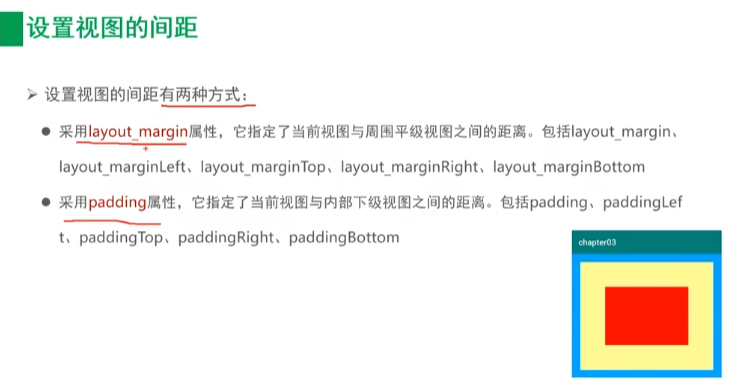

# 第一部分：Android开发入门

## 1.1  观察APP运行日志

<center></center>

## 1.2 APP工程目录结构

<center></center>

App项目下面有两个分类：app(代表app模块)， Gradle Scripts

### 1.2.1 app目录结构

app下面有3个子目录：manifests，java，res

- manifests子目录，下面只有一个XML文件(AndroidManifest.xml)，它是App的运行配置文件。
- java子目录，下面有3个com.example.myapp包，其中第一个包存放当前模块的java源代码，后面两个包存放测试用的Java代码。
- res子目录，存放当前模块的资源文件。
    - drawable目录存放图形描述文件与图片文件。
    - layout目录存放App页面的布局文件。
    - mipmap目录存放app的启动图标。
    - values目录存放一些常量定义文件，例如字符串常量strings.xml，像素常量dimens.xml，颜色常量colors.xml，样式风格定义styles.xml等。

### 1.2.2 Gradle Scripts

Gradle Script下面主要是工程的编译配置文件。

- build.gradle，该文件分为项目级与模块级两种，用于描述App工程的编译规则。
    - 项目级别的build.gradle指定了当前项目的总体编译规则。
    - 模块级别的build.gradle对应于具体模块，每个模块都有自己的build.gradle，指定了当前模块的详细编译规则。
- proguard-rules.pro，该文件用于描述Java代码的混淆规则。
- gradle.properities，该文件用于配置编译工程的命令行参数，一般无需改动。
- settings.gradle，该文件配置了需要编译哪些模块。初始内容为`include ':app'`，表示只编译app模块。
- local.properities，项目的本地配置文件，在编译时自动生成，用于描述开发者的电脑环境配置，包括SDK路径、NDK路径等。

**Gradle是一个项目的自动化构建工具，用来完成“依赖，打包、部署、发布、各种渠道的差异管理”等工作。**

### 1.2.3 模块级build.gradle

```java
plugins {
    id 'com.android.application'
}

android {
    compileSdk 32 // 指定编译用的版本号，比如30表示使用的是Android 11.0编译
	
    defaultConfig {
        // 指定该模块的应用编号，也就是App的包名。它要与AndroidManifest.xml中的package保持一致。
        applicationId "com.example.myapplication"
        // 指定app适合运行的最小sdk版本号
        minSdk 28
        // 指定目标设备的sdk版本号，表示app最希望在哪个版本上运行。
        targetSdk 32
        // 指定app的应用版本号
        versionCode 1
        // 指定app的应用版本名
        versionName "1.0"

        testInstrumentationRunner "androidx.test.runner.AndroidJUnitRunner"
    }

    buildTypes {
        release {
            minifyEnabled false
            proguardFiles getDefaultProguardFile('proguard-android-optimize.txt'), 'proguard-rules.pro'
        }
    }
    compileOptions {
        sourceCompatibility JavaVersion.VERSION_1_8
        targetCompatibility JavaVersion.VERSION_1_8
    }
}

// 指定app编译的依赖信息
dependencies {

    implementation 'androidx.appcompat:appcompat:1.3.0'
    implementation 'com.google.android.material:material:1.4.0'
    implementation 'androidx.constraintlayout:constraintlayout:2.0.4'
    testImplementation 'junit:junit:4.13.2'
    androidTestImplementation 'androidx.test.ext:junit:1.1.3'
    androidTestImplementation 'androidx.test.espresso:espresso-core:3.4.0'
}
```


### 1.2.4 AndroidManifest.xml

```java
<?xml version="1.0" encoding="utf-8"?>
<manifest xmlns:android="http://schemas.android.com/apk/res/android"
    xmlns:tools="http://schemas.android.com/tools"
    package="com.example.myapplication">

    <application
        android:allowBackup="true" //是否允许应用备份
        android:dataExtractionRules="@xml/data_extraction_rules"
        android:fullBackupContent="@xml/backup_rules"
        android:icon="@mipmap/ic_launcher" // 应用图标
        android:label="@string/app_name" // 应用名称
        android:roundIcon="@mipmap/ic_launcher_round" // 应用的圆角图标
        android:supportsRtl="true" // 是否支持阿拉伯语/波斯语这样从右往左的文字排列顺序
        android:theme="@style/Theme.MyApplication" // 指定app的显示风格
        tools:targetApi="31">
        <activity // activity是一个应用程序组件，它相当于一个页面，可以在上面提供各种控件来完成操作，例如按钮等
            android:name=".MainActivity"
            android:exported="true">
            <intent-filter>
                <action android:name="android.intent.action.MAIN" />

                <category android:name="android.intent.category.LAUNCHER" />
            </intent-filter>
        </activity>
    </application>

</manifest>
```


## 1.3 Activity的创建与跳转

步骤：

1. 在layout目录下创建xml文件
2. 创建与xml文件对应的Java代码
3. 在AndroidManifest.xml中注册页面配置

快捷方式：

<center></center>


# 第二部分：简单控件

## 2.1 文本显示

### 2.1.1 设置文本内容

**两种方式：**

1. 在XML文件中通过属性`android:text`设置文本
2. 在Java代码中调用文本视图对象的setText方法设置文本


**通过XML设置文本**

<center></center>

```xml
<!--activity_text_view.xml-->
<?xml version="1.0" encoding="utf-8"?>
<LinearLayout xmlns:android="http://schemas.android.com/apk/res/android"
    android:layout_width="match_parent"
    android:layout_height="match_parent">

    <TextView
        android:id="@+id/tv_hello"
        android:layout_width="wrap_content"
        android:layout_height="wrap_content"
        android:text="@string/hello"/> 
    <!--这里可以通过引用strings.xml文件中的字符串，也可以直接写字符串-->

</LinearLayout>
```

```java
// TextViewActivity.java
package com.example.chapter02;

import android.os.Bundle;
import android.widget.TextView;

import androidx.annotation.Nullable;
import androidx.appcompat.app.AppCompatActivity;

public class TextViewActivity extends AppCompatActivity {
    @Override
    protected void onCreate(@Nullable Bundle savedInstanceState) {
        super.onCreate(savedInstanceState);
        setContentView(R.layout.activity_text_view); // 显示内容
        TextView tv_hello = findViewById(R.id.tv_hello); // 根据id找到字符串，从而进行修改
        tv_hello.setText(R.string.hello_world); // 修改字符串
    }
}
```


### 2.1.2 设置文本大小

- 在java文件中设置字体大小

```java
TextView tv_hello = findViewById(R.id.tv_hello);
tv_hello.setTextSize(30); // 设置字体大小
```


- 在xml文件中设置字体大小

```xml
<TextView
        android:id="@+id/tv_hello"
        android:layout_width="wrap_content"
        android:layout_height="wrap_content"
        android:text="@string/hello"
        android:textSize="30sp"/>
		<!--设置大小时需要指定单位-->
```


### 2.1.3 设置文本颜色

- 在java文件中设置字体颜色

```java
TextView tv_hello = findViewById(R.id.tv_sp);
tv_hello.setTextColor(Color.RED); // 设置字体颜色
tv_hello.setBackgroundColor(Color.BLUE); // 设置背景颜色
```


- 在xml文件中设置字体颜色

```xml
<TextView
        android:layout_width="wrap_content"
        android:layout_height="wrap_content"
        android:text="@string/hello"
        android:textColor="#2DB168" 
        android:background="@color/teal_200"/>
```


## 2.2 视图基础

### 2.2.1 设置视图的宽高

视图的宽度通过属性`android:layout_width`表达，视图的高度通过属性`android:layout_height`表达，宽高的取值有以下三种：

- `match_parent`：与上级视图保持一致
- `wrap_content`：与内容自适应
- 以dp为单位的具体尺寸


- 通过java代码修改视图宽高

<center></center>

```java
public class TextViewActivity extends AppCompatActivity {
    @Override
    protected void onCreate(@Nullable Bundle savedInstanceState) {
        super.onCreate(savedInstanceState);
        setContentView(R.layout.activity_text_view);
        TextView tv_code = findViewById(R.id.tv_code);
        // 获取tv_code的布局参数，含高度和宽度
        ViewGroup.LayoutParams params = tv_code.getLayoutParams();
        // 修改布局参数中的宽度数值，注意默认为px单位，需要把dp数值转换成px数值
        params.width = Utils.dip2px(this, 300);
        /* params.width = 2; // 默认单位为px */
        // 设置tv_code的布局参数
        tv_code.setLayoutParams(params);
    }
}
/*
package com.example.chapter02.util; 

import android.content.Context;

public class Utils {

    public static int dip2px(Context context, float dpValue) {
        // 获取当前手机的像素密度(1个dp对应几个px)
        float scale = context.getResources().getDisplayMetrics().density;
        return (int) (dpValue * scale + 0.5f);
    }

}
*/
```


### 2.2.2 设置视图的间距

<center></center>

```xml
<?xml version="1.0" encoding="utf-8"?>
<LinearLayout xmlns:android="http://schemas.android.com/apk/res/android"
    android:layout_width="match_parent"
    android:layout_height="300dp"
    android:background="#00AAFF"
    android:orientation="vertical">

    <LinearLayout
        android:layout_width="match_parent"
        android:layout_height="match_parent"
        android:background="#FFFF99"
        android:layout_margin="40dp"
        android:padding="50dp">

        <View
            android:layout_width="match_parent"
            android:layout_height="match_parent"
            android:background="#FF0000"/>

    </LinearLayout>

</LinearLayout>
```


### 2.2.3 设置视图的对齐方式

<center></center>

```xml
<?xml version="1.0" encoding="utf-8"?>
<LinearLayout xmlns:android="http://schemas.android.com/apk/res/android"
    android:layout_width="match_parent"
    android:layout_height="300dp"
    android:background="#00AAFF"
    android:orientation="horizontal">

    <!--    第一个子布局为背景红色，它在上级视图中朝下对齐，它的下级视图靠左对齐-->
    <LinearLayout
        android:layout_width="0dp"
        android:layout_height="200dp"
        android:layout_weight="1"
        android:layout_margin="10dp"
        android:padding="10dp"
        android:background="#ff0000"
        android:layout_gravity="bottom"
        android:gravity="left">

        <!--  内部视图的高度和宽度都是100dp，且背景为青色-->
        <View
            android:layout_width="100dp"
            android:layout_height="100dp"
            android:background="#00ffff" />

    </LinearLayout>

    <!--    第二个子布局背景为红色，它在上级视图中朝上对齐，它的下级视图靠右对齐-->
    <LinearLayout
        android:layout_width="0dp"
        android:layout_height="200dp"
        android:layout_weight="1"
        android:layout_margin="10dp"
        android:padding="10dp"
        android:background="#ff0000"
        android:layout_gravity="top"
        android:gravity="right">

        <View
            android:layout_width="100dp"
            android:layout_height="100dp"
            android:background="#00ffff" />
    </LinearLayout>
</LinearLayout>
```


## 2.3 常用布局

### 2.3.1 线性布局LinearLayout


### 2.3.2 相对布局RelativeLayout


### 2.3.3 网格布局GridLayout


### 2.3.4 滚动视图ScrollView


## 2.4 按钮触控

### 2.4.1 按钮控件Button


### 2.4.2 点击事件和长按事件


### 2.4.3 禁用与恢复按钮


## 2.5 图像显示

### 2.5.1 图像视图ImageView


### 2.5.2 图像按钮ImageButton


### 2.5.3 同时展示文本与图像
