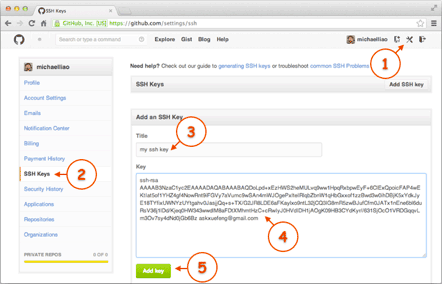

## 一：git简介

+ git是目前世界上最先进的**分布式版本控制系统**
+ 版本控制系统：可以储存一个文件在不同时间的版本，记录**每次文件的改动**，可以根据需要，随时**切换到之前的版本**。
+ 分布式VS集中式：

|        | 中央服务器 | 是否需要联网 | 安全性 |
| :----: | :--------: | :----------: | :----: |
| 集中式 |    需要    |     需要     |   低   |
| 分布式 |   不需要   |    不需要    |   高   |


## 二：安装git

1.  在Linux上安装
    终端输入：

```
$ sudo apt install git
```

2. 在Windows上安装git
    在Windows上使用Git，可以从Git官网直接下载安装程序，然后按默认选项安装即可。git会自动帮你配置好环境变量`E:\Git\cmd`
    安装完成后，在开始菜单里找到“Git”->“Git Bash”，蹦出一个类似命令行窗口的东西，就说明Git安装成功！


+ 安装完成后，需要在终端进行设置(必须)

```
$ git config --global user.name "Your name"
$ git config --global user.email "email@example.com"
```

` --global `是一个全局变量参数

### 关于Git配置的一些命令

> git的配置文件全部保存在本地文件中
>
> 系统配置文件路径："E:\Git\etc\gitconfig"
>
> 用户配置文件路径："C:\Users\86131\.gitconfig"

```git
git config -l	#查看git配置，包含系统配置和用户配置
git config --system --list	#查看git系统配置
git config --global --lsit	#查看git用户配置
```


## 三：创建版本库

1. 首先，选择一个合适的地方，创建一个空目录：

```
$ mkdir learngit 
$ cd learngit
$ pwd
 /Users/michael/learngit
```

   `pwd`命令用于显示当前目录。在我的电脑上，这个仓库位于`/Users/michael/learngit`

2. 通过`git init`命令把这个目录变成Git可以管理的仓库：

```
 $ git init
 Initialized empty Git repository in /Users/michael/learngit/.git/
```

 创建完成后会在当前目录下出现一个`.git`文件，若没有看见是因为这个目录默认为隐藏文件，用`ls -ah`命令就可以看见

3. 把文件添加到版本库:
    用命令 `vim a.txt` 在git仓库中编写一个文件
4. 把一个文件放到Git仓库只需要两步

 第一步，用命令`git add`告诉Git，把文件添加到仓库:

```  
  $ git add a.txt
```

 第二步，用命令git commit告诉Git，把文件提交到仓库：

```
$ git commit -m "wrote a readme file"
```

 简单解释一下`git commit命令`，`-m`后面输入的是本次提交的说明，可以输入任意内容，当然最好是有意义的，这样你就能从历史记录里方便地找到改动记录。


==我不小心将一个文件添加到了git中，如果我想取消对该文件的跟踪，我应该怎么办==

> 如果您想取消对已经被添加到 Git 仓库中的文件的跟踪，可以使用 `git rm --cached` 命令。这个命令会将文件从缓存区中删除，并且不再跟踪该文件。
>
> 具体步骤如下：
>
> 1. 在终端或命令行中进入 Git 仓库所在的目录。
> 2. 运行命令 `git rm --cached 文件名`，其中 `文件名` 指的是您想要取消跟踪的文件的名称。
>
> 例如，如果您想取消跟踪名为 `file.txt` 的文件，可以运行以下命令：
>
> ```
> git rm --cached file.txt
> ```
>
> 1. 运行完命令后，Git 会将文件从缓存区中删除。但是，该文件仍然存在于您的本地文件系统中，因此您需要将其从本地文件系统中删除。
> 2. 最后，提交更改并推送到远程仓库中：
>
> ```
> git commit -m "取消对文件的跟踪"
> git push origin master
> ```
>
> 这样就完成了对该文件的取消跟踪操作，该文件将不再被 Git 跟踪。


## 四：版本退回

1. 　`git status`-->让我们掌握仓库当前的状态
2. 　`git diff < file >`-->查看文件当前的改动
3. 　`git reset --hard HEAD^`-->返回上次提交的版本
4. 　`git reset --hard HEAD^^`-->返回上上次提交的版本
5. 　`git reset --hard HEAD~4`-->退回四个版本
6. 　`git reset --hard < commit id >`-->返回你想返回的文件版本
7. 　`git log --pretty=oneline`-->查看commit id
8. 　`git reflog `-->用来记录每一次的命令，当我们退回到之前的版本之后，就看不到之后的哪些版本了，此时我们想要再穿梭回之后的那个版本就需要知道那个版本的id，此时我们就可以通过`git reflog`来查看那个版本的id

> `git reset --hard HEAD^`是一个Git命令，可以让你将HEAD(当前分支的最后一次提交)指向前一个提交，并重置工作目录和暂存区以匹配该提交。这是撤销最新提交的一种方法。
>
> `--hard`选项告诉 Git 在重置HEAD后强制更新工作目录和暂存区，使它们完全匹配重置后的提交状态。因此，任何未提交的更改都将被丢失！在使用`--hard`操作时，请务必小心。
>
> 如果不使用`--hard`选项，Git将只重置HEAD，而不更新工作目录和暂存区。这意味着你的本地文件将保留最新更改，但Git的历史记录将回退到之前的提交。
>
> 总之，`--hard`选项非常有用，因为它可以让你快速撤销最新提交并将工作目录还原到之前的状态，但请注意，该操作也可能会导致数据丢失，请慎重使用。


 ## 五：管理修改

 每次修改如果不用`git add`到暂存区,就不会加入到commit中`git diff HEAD -- <file>`可以查看工作区和版本库里最新版本的区别。


## 六：撤销修改

`git checkout -- file` 可以把工作区的修改全部撤销掉:
**两种情况:**
一种是readme.txt自修改后还没有被放到暂存区,现在,撤销修改就回到和版本库一模一样的状态;
一种是readme.txt已经添加到暂存区后,又作了修改,现在,撤销修改就回到添加到暂存区后的状态。


如果我们不小心把一个文件做了错误的修改并且给`git add`到暂存区，那么此时我们就需要撤回该操作：

- `git reset HEAD file`可以把暂存区的修改撤销掉(unstage),重新放到工作区中。`HEAD`表示最新版本

    退回之后，暂存区是干净的，但是工作区是有修改的，如果要丢弃工作区的修改，就需要最上面提到的那个操作。


## 七：文件删除

`rm file`将工作区文件删掉。 #仅删除工作区
`git rm file `从版本库将文件删掉,并且需要`git commit` 　 #删除工作区,并删除版本库
若是误删,用`git checkout -- file`将文件恢复到最新版。仅对rm有效


## 八：添加远程库

第1步：创建SSH Key。在**用户主目录**下，看看有没有.ssh目录，如果有，再看看这个目录下有没有`id_rsa`和`id_rsa.pub`这两个文件，如果已经有了，可直接跳到下一步。如果没有，打开Shell（Windows下打开Git Bash），创建SSH Key：

```
$ ssh-keygen -t rsa -C "youremail@example.com"
```

你需要把邮件地址换成你自己的邮件地址，然后一路回车，使用默认值即可，由于这个Key也不是用于军事目的，所以也无需设置密码。
如果一切顺利的话，可以在用户主目录里找到`.ssh`目录，里面有`id_rsa`和`id_rsa.pub`两个文件，这两个就是SSH Key的秘钥对，`id_rsa`是私钥，不能泄露出去，`id_rsa.pub`是公钥，可以放心地告诉任何人。

第2步：登陆GitHub，打开“Account settings”，“SSH Keys”页面：
然后，点“Add SSH Key”，填上任意Title，在Key文本框里粘贴`id_rsa.pub`文件的内容：



点＂Add Key"，你就应该看到已经添加的key:


**使本地仓库和远程库关联起来:**
`git remote add origin git@github.com:xiaotong-sun/xxxx.git`
Origin 是远程库的名字,可以改成别的。 改名命令:`git remote rename origin xx`

**第一次**把本地库的所有内容推送到远程库上时的操作:
`git push -u origin master`
此后每次提交使用:`git push origin master`


## 九：从远程库克隆

已有远程库,使用命令克隆一个本地库:
`git clone git@github.com:xiaotong-sun/xxxxx.git`


## 十：分支管理

1. 创建分支:`git checkout -b dev` (dev为分支的名字,你可以随便起) 
    `git checkout` + `-b `  表示创建并切换--->相当于--->`git branch dev`&& `git checkout dev`两条命令
    `git switch -c dev`--->也可以用来创建并切换新的分支
    `git branch`--->可以用来查看当前分支

    `git branch -r`--->列出所有远程分支

2. 删除分支:
    `git branch -d dev`

3. 合并分支:合并某分支到当前分支:
    `git merge < file >`

4. 解决冲突:（详细见第11章）
    当主分支和次分支都修改了部分内容,此时将无法快速合并，这时可以直接查看并将冲突修改后方可合并

    `git log --graph`--->查看合并分支图

    `git log --graph --pretty=oneline --abbrev-commit`--->将提交版本整理成更简洁的图形

5. 分支管理策略:
    `git merge file `是一种==fast forward==合并,这种合并看不出来曾经做过合并,并且在分支中做过的提交会丢失

    如果我们想保留这部分信息，可以采用以下方式：

    `git merge --no-ff -m "提交信息"` ➕`dev` 是一种普通的合并,能看出合并历史。

    因为本次合并会自动创建一个新的commit，所以加上`-m`参数，把commit描述写进去。

6. bug分支:
    用`git stash `将手头进行的工作现场储存下来,之后就可以放心的去修bug了
    修bug时,要首先跳到bug所在分支,并在那个分支上创建一个分支用来修bug,修完之后将其合并。
    返回原来干活的分支,`git stash list`查看存放的工作现场。
    `git stash apply`恢复,但stash内容不删除。
    需要用`git stash drop`来删除
    而`git stash pop `在恢复的同时也将**stash内容删除了**
    若存放了多个现场,用`git stash apply stash@{0}`来指定恢复
    若主分支和次分支同时存在相同的bug,那么可用`git cherry-pick (主分支中修复bug那次提交的序列号)`来复制这个bug的修改

7. feature 分支
    开发一个新的feature,最好新建一个分支;如果要丢弃一个没有被合并过的分支可以通过`git branch -D branchName` 强行删除

8. 多人协作
    `git remote`查看远程库信息,`git remote -v`来显示更详细的信息;
    推送分支`git push origin master`推送主分支
    `git push origin dev`推其他分支
    `git clone` 只能克隆master分支,要想把其他分支也整到本地则需
    `git checkout -b dev origin/dev`
    git pull用来抓取,若git pull 失败请仔细看git给的提示
    用` git branch --set-upstream (branch-name) origin/(branch name)`建立关联

9. rebase
    `git rebase <branch-name>`操作可以把本地未push的分支提交历史整理成直线
    rebase的目的是是我们在 查看历史提交的变化时更容易


## 十一：解决冲突

当我们在不同分支对同一个文件进行不同的修改之后，如果要合并分支就会发生冲突，这种情况下，Git无法执行“快速合并”，只能试图把各自的修改合并起来，但这种合并就可能会有冲突，我们试试看：

```
$ git merge feature1
Auto-merging readme.txt
CONFLICT (content): Merge conflict in readme.txt
Automatic merge failed; fix conflicts and then commit the result.
```

果然冲突了！Git告诉我们，`readme.txt`文件存在冲突，必须手动解决冲突后再提交。`git status`也可以告诉我们冲突的文件：

```
$ git status
On branch master
Your branch is ahead of 'origin/master' by 2 commits.
  (use "git push" to publish your local commits)

You have unmerged paths.
  (fix conflicts and run "git commit")
  (use "git merge --abort" to abort the merge)

Unmerged paths:
  (use "git add <file>..." to mark resolution)

	both modified:   readme.txt

no changes added to commit (use "git add" and/or "git commit -a")
```

我们可以直接查看readme.txt的内容：

```
Git is a distributed version control system.
Git is free software distributed under the GPL.
Git has a mutable index called stage.
Git tracks changes of files.
<<<<<<< HEAD
Creating a new branch is quick & simple.
=======
Creating a new branch is quick AND simple.
>>>>>>> feature1
```

Git用`<<<<<<<`，`=======`，`>>>>>>>`标记出不同分支的内容，我们修改如下后保存：

```
Creating a new branch is quick and simple.
```

再提交：

```
$ git add readme.txt 
$ git commit -m "conflict fixed"
[master cf810e4] conflict fixed
```

## 十二：标签管理

1. 打标签
    `git tag <name>`就可以打一个标签
    `git tag name commit-id`-->对特定的提交打标
    `git tag `查看标签
    `git show name`查看标签信息
    `git tag -a name -m “” commit-id`创建带有说明的标签
2. 删除标签
    `git tag -d name` 这能删除本地标签
    `git push origin :refs/tags/tag-name`
3. 推送标签
    `git push origin <tag-name>`
    一次性推送所有标签:`git push origin --tags`


## 十三：忽略文件

有些时候我们不想把某些文件纳入版本控制中，比如数据库文件，临时文件，设计文件等，那么我们需要在项目目录下建立`.gitignore`文件，并进行相应配置，此文件有如下规则：

1. 忽略文件中的空行，以`#`号开头的行会被忽略(类似于注释)
2. 可以使用Linux通配符
    - `*` 代表任意多个字符
    - `?` 代表一个字符
    - `[abc]` 代表可选字符范围
    - `{string1, string2, ...}` 代表可选字符串范围
3. 如果名称最前面有`!`，表示例外规则，将不被忽略
4. 如果名称最前面有`/`，表示要忽略的文件在根目录下，而子目录中的文件不忽略
5. 如果名称最后面有`/`，表示要忽略的是此目录下该名称的子目录，而非文件

```
*.txt		# 忽略所有.txt结尾的文件
!lib.txt	# 但是lib.txt文件不忽略
/temp		# 忽略根目录下的temp
build/		# 忽略build/目录下的所有文件
doc/*.txt	# 忽略doc/目录下的所有.txt文件，但是不包括doc/file/xxx.txt
```

> 在.gitignore文件中，`/node_modules` 和 `node_modules/` 有着不同的含义。
>
> 1. `/node_modules`表示忽略项目根目录下的node_modules目录，但不会忽略子目录中的node_modules目录。
>
>     例如，如果你的项目有一个子目录为`src`，其下也有一个`node_modules`目录，那么`/node_modules`只会忽略根目录下的node_modules目录，而不会忽略`src/node_modules`目录。
>
> 2. `node_modules/`表示忽略所有名为 node_modules 的目录，包括根目录下和子目录中的所有node_modules目录。
>
>     这意味着如果你的项目有多个子目录中都包含了名为 `node_modules`的目录，`node_modules/`将会忽略它们全部。
>
> 所以，在.gitignore文件中使用 `/node_modules`或`node_modules/`，取决于你想要忽略哪些目录。如果你只想忽略根目录下的node_modules目录，可以使用`/node_modules`，否则使用`node_modules/`可以忽略所有名为node_modules的目录


## 十四：多人协作

> 此部分复制于：[多人协作 - 廖雪峰的官方网站 (liaoxuefeng.com)](https://www.liaoxuefeng.com/wiki/896043488029600/900375748016320)
>
> 
>
> 多人协作的工作模式通常是这样：
>
> 1. 首先，可以试图用`git push origin <branch-name>`推送自己的修改；
> 2. 如果推送失败，则因为远程分支比你的本地更新，需要先用`git pull`试图合并；
> 3. 如果合并有冲突，则解决冲突，==并在本地提交==；
> 4. 没有冲突或者解决掉冲突后，再用`git push origin <branch-name>`推送就能成功！
>
> 如果`git pull`提示`no tracking information`，则说明本地分支和远程分支的链接关系没有创建，用命令`git branch --set-upstream-to <branch-name> origin/<branch-name>`。
>
> 这就是多人协作的工作模式，一旦熟悉了，就非常简单。

### 多人协作


当你从远程仓库克隆时，实际上Git自动把本地的`master`分支和远程的`master`分支对应起来了，并且，远程仓库的默认名称是`origin`。

要查看远程库的信息，用`git remote`：

```
$ git remote
origin
```

或者，用`git remote -v`显示更详细的信息：

```
$ git remote -v
origin  git@github.com:michaelliao/learngit.git (fetch)
origin  git@github.com:michaelliao/learngit.git (push)
```

上面显示了可以抓取和推送的`origin`的地址。如果没有推送权限，就看不到push的地址。

### 推送分支

推送分支，就是把该分支上的所有本地提交推送到远程库。推送时，要指定本地分支，这样，Git就会把该分支推送到远程库对应的远程分支上：

```
$ git push origin master
```

如果要推送其他分支，比如`dev`，就改成：

```
$ git push origin dev
```

但是，并不是一定要把本地分支往远程推送，那么，哪些分支需要推送，哪些不需要呢？

- `master`分支是主分支，因此要时刻与远程同步；
- `dev`分支是开发分支，团队所有成员都需要在上面工作，所以也需要与远程同步；
- bug分支只用于在本地修复bug，就没必要推到远程了，除非老板要看看你每周到底修复了几个bug；
- feature分支是否推到远程，取决于你是否和你的小伙伴合作在上面开发。

总之，就是在Git中，分支完全可以在本地自己藏着玩，是否推送，视你的心情而定！

### 抓取分支

多人协作时，大家都会往`master`和`dev`分支上推送各自的修改。

现在，模拟一个你的小伙伴，可以在另一台电脑（注意要把SSH Key添加到GitHub）或者同一台电脑的另一个目录下克隆：

```
$ git clone git@github.com:michaelliao/learngit.git
Cloning into 'learngit'...
remote: Counting objects: 40, done.
remote: Compressing objects: 100% (21/21), done.
remote: Total 40 (delta 14), reused 40 (delta 14), pack-reused 0
Receiving objects: 100% (40/40), done.
Resolving deltas: 100% (14/14), done.
```

当你的小伙伴从远程库clone时，默认情况下，你的小伙伴只能看到本地的`master`分支。不信可以用`git branch`命令看看：

```
$ git branch
* master
```

现在，你的小伙伴要在`dev`分支上开发，就必须创建远程`origin`的`dev`分支到本地，于是他用这个命令创建本地`dev`分支：

```
$ git checkout -b dev origin/dev
```

现在，他就可以在`dev`上继续修改，然后，时不时地把`dev`分支`push`到远程：

```
$ git add env.txt

$ git commit -m "add env"
[dev 7a5e5dd] add env
 1 file changed, 1 insertion(+)
 create mode 100644 env.txt

$ git push origin dev
Counting objects: 3, done.
Delta compression using up to 4 threads.
Compressing objects: 100% (2/2), done.
Writing objects: 100% (3/3), 308 bytes | 308.00 KiB/s, done.
Total 3 (delta 0), reused 0 (delta 0)
To github.com:michaelliao/learngit.git
   f52c633..7a5e5dd  dev -> dev
```

你的小伙伴已经向`origin/dev`分支推送了他的提交，而碰巧你也对同样的文件作了修改，并试图推送：

```
$ cat env.txt
env

$ git add env.txt

$ git commit -m "add new env"
[dev 7bd91f1] add new env
 1 file changed, 1 insertion(+)
 create mode 100644 env.txt

$ git push origin dev
To github.com:michaelliao/learngit.git
 ! [rejected]        dev -> dev (non-fast-forward)
error: failed to push some refs to 'git@github.com:michaelliao/learngit.git'
hint: Updates were rejected because the tip of your current branch is behind
hint: its remote counterpart. Integrate the remote changes (e.g.
hint: 'git pull ...') before pushing again.
hint: See the 'Note about fast-forwards' in 'git push --help' for details.
```

推送失败，因为你的小伙伴的最新提交和你试图推送的提交有冲突，解决办法也很简单，Git已经提示我们，先用`git pull`把最新的提交从`origin/dev`抓下来，然后，在本地合并，解决冲突，再推送：

```
$ git pull
There is no tracking information for the current branch.
Please specify which branch you want to merge with.
See git-pull(1) for details.

    git pull <remote> <branch>

If you wish to set tracking information for this branch you can do so with:

    git branch --set-upstream-to=origin/<branch> dev
```

`git pull`也失败了，原因是没有指定本地`dev`分支与远程`origin/dev`分支的链接，根据提示，设置`dev`和`origin/dev`的链接：

```
$ git branch --set-upstream-to=origin/dev dev
Branch 'dev' set up to track remote branch 'dev' from 'origin'.
```

再pull：

```
$ git pull
Auto-merging env.txt
CONFLICT (add/add): Merge conflict in env.txt
Automatic merge failed; fix conflicts and then commit the result.
```

这回`git pull`成功，但是合并有冲突，需要手动解决，解决的方法和分支管理中的[解决冲突](http://www.liaoxuefeng.com/wiki/896043488029600/900004111093344)完全一样。解决后，提交，再push：

```
$ git commit -m "fix env conflict"
[dev 57c53ab] fix env conflict

$ git push origin dev
Counting objects: 6, done.
Delta compression using up to 4 threads.
Compressing objects: 100% (4/4), done.
Writing objects: 100% (6/6), 621 bytes | 621.00 KiB/s, done.
Total 6 (delta 0), reused 0 (delta 0)
To github.com:michaelliao/learngit.git
   7a5e5dd..57c53ab  dev -> dev
```

### 小结

- 查看远程库信息，使用`git remote -v`；
- 本地新建的分支如果不推送到远程，对其他人就是不可见的；
- 从本地推送分支，使用`git push origin branch-name`，如果推送失败，先用`git pull`抓取远程的新提交；
- 在本地创建和远程分支对应的分支，使用`git checkout -b branch-name origin/branch-name`，本地和远程分支的名称最好一致；
- 建立本地分支和远程分支的关联，使用`git branch --set-upstream branch-name origin/branch-name`；
- 从远程抓取分支，使用`git pull`，如果有冲突，要先处理冲突。


> git fetch和git pull的区别主要有以下几点：
>
> - git fetch是从远程仓库获取最新版本到本地，但不会自动合并到当前分支。
> - git pull是从远程仓库获取最新版本并合并到当前分支。
> - git fetch可以保持本地分支和远程分支的独立性，方便查看和比较差异。
> - git pull可能会导致本地分支的冲突和覆盖，需要注意备份和解决。
>
> 是的，git pull相当于git fetch和git merge两个步骤的结合。git pull会直接将远程仓库的最新内容拉取并合并到当前分支，可能会产生冲突或覆盖。git fetch则会先将远程仓库的最新内容拉取到本地，然后让用户检查后再决定是否合并。
>

