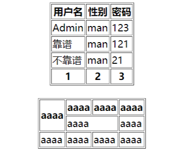
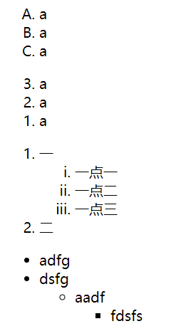
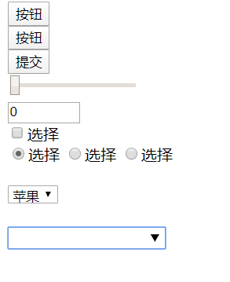
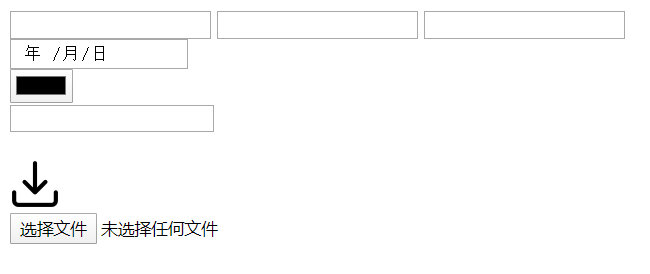

## HTML5学习笔记

#### HTML5背景知识

- 超文本[^1]标记语言

- HTML5是一系列用来制作现代富web内容的相关技术的总称。

- 最重要的三项技术：

  - HTML5核心规范
  - css（层叠样式表）
  - JavaScript（给html网页添加动态功能）

- HTML5新特性

  - 引入原生多媒体支持 （可以不使用flash）
  - 引入可编程内容
  - 引入语义web

  [^1]: 超文本指页面可以包含图片、链接，甚至音乐、程序等非文字元素


#### 创建HTML文档

```html
<!DOCTYPE html><!--浏览器得知自己要处理的内容是html，可以不写-->
<html lang="zh">
<head>
    <meta charset="UTF-8"><!--以UTF-8的格式编码，如果不统一编码格式，在不同的浏览器上会出现乱码-->
    <title>Title</title>
</head>
<body>
    aaa
</body>
</html>
```

- 常用的字符编码包括：
  - 中文简体：gb2312
  - 中文繁体：big5
  - 通用字符编码：UTF-8

##### 语法

```html
<meta http-equiv="content-type|default-style|refresh">
```

##### 属性值

| 值            | 描述                                                         |
| :------------ | ------------------------------------------------------------ |
| content-type  | 规定文档的字符编码。<br>实例：<br>`<meta http-equiv="content-type" content="text/html; charset=UTF-8">` <br>HTML5中： `<meta charset="UTF-8">` |
| default-style | 规定要使用的预定义的样式表。                                 |
| refresh       | 定义文档自动刷新的时间间隔。<br>`<meta http-equiv="refresh" content="300">` |


#### HTML基础元素

```html
<!DOCTYPE html>
<html lang="en">
<head>
    <meta charset="UTF-8">
    <title>Title</title>
</head>
<body>
    <h# align = left | center | right >标题</h#>
    <a href="url" target="_blank">链接</a>
    <p>
        paragraph
    </p>
    <b>粗体</b>
    <em>斜体</em>
    <i>斜体</i>
    <u>下划线</u>
</body>
</html>
```


#### HTML表格元素

- 表格的三大元素：`<table>,<tr>,<td>`

```html
<!DOCTYPE html>
<html lang="en">
<head>
    <meta charset="UTF-8">
    <title>Title</title>
</head>
<body>
<table border="1px" align="center"> <!--border和align都是HTML5弃用的标签-->
    <thead><!--表头-->
    <tr>
        <th>用户名</th><!--th标签为表头，默认黑体居中-->
        <th>性别</th>
        <th>密码</th>
    </tr>
    </thead>
    <tbody><!--表体-->
    <tr>
        <td>Admin</td>
        <td>man</td>
        <td>123</td>
    </tr>
    <tr>
        <td>靠谱</td>
        <td>man</td>
        <td>121</td>
    </tr>
    <tr>
        <td>不靠谱</td>
        <td>man</td>
        <td>21</td>
    </tr>
    </tbody>
    <tfoot><!--表脚-->
    <tr>
        <th>1</th>
        <th>2</th>
        <th>3</th>
    </tr>
    </tfoot>
</table>
<br>
<table border="1px" align="center"><!--不规则表格-->
    <tr>
        <th rowspan="2">aaaa</th><!--合并列单元格-->
        <th>aaaa</th>
        <th>aaaa</th>
        <th>aaaa</th>
    </tr>
    <tr>
        <td colspan="2">aaaa</td><!--合并行单元格-->
        <td>aaaa</td>
    </tr>
    <tr>
        <td>aaaa</td>
        <td>aaaa</td>
        <td>aaaa</td>
        <td>aaaa</td>
    </tr>
</table>
</body>
</html>
```

效果如下：




#### HTML列表元素

- `<ol>` 有序列表
  - 属性：type（设置样式，1（默认）、A、a、I、i），reversed（降序），start（从某个数字开始）
- `<ul>` 无序列表
  - 属性：type（设置样式， disc（实心圆点）、circle（空心圆点）、square（方块））
- `<li>` 表示列表中的项

```html
<!DOCTYPE html>
<html lang="en">
<head>
    <meta charset="UTF-8">
    <title>Title</title>
</head>
<body>
<ol type="A"><!--默认type = "1"-->
    <li>a</li>
    <li>a</li>
    <li>a</li>
</ol>

<ol reversed><!--降序-->
    <li>a</li>
    <li>a</li>
    <li>a</li>
</ol>

<ol><!--列表的嵌套-->
    <li>一</li>
    <ol type="i">
        <li>一点一</li>
        <li>一点二</li>
        <li>一点三</li>
    </ol>
    <li>二</li>
</ol>

<ul type="disc"><!--实心点（默认）-->
    <li>adfg</li>
    <li>dsfg</li>
    <ul type = "circle"><!--空心点-->
        <li>aadf</li>
        <ul type = "square"><!--方块-->
            <li>fdsfs</li>
        </ul>
    </ul>
</ul>
</body>
</html>
```

效果如下：




#### HTML表单元素(上)

- 表单是HTML中获取用户输入的手段，对于web应用系统极其重要

- 关健表单元素：

  - `<form>` (input应包含在form元素中)

    属性：

    - method：用于发送form-data的http方法
    - action：当提交表单时向何处发送表单数据

  - `<input>`

    属性：

    - Type：input元素的类型，默认type = "text"
    - Name
    - value：input元素的值
    - readonly：只读
    - ......

```html
<!DOCTYPE html>
<html lang="zh">
<head>
    <meta charset="UTF-8">
    <title>创建表单</title>
</head>
<body>
    <form>
        <input type="text"><!--单行文本框-->
        <input type="text" value="靠谱学院"><!--value占位符-->
        <br>
        <input type="text" placeholder="靠谱学院"><!--不占文本框的位-->
        <input type="text" placeholder="靠谱学院" maxlength="8"><!--最大能输入的字符数-->
        <br>
        <input type="text" placeholder="靠谱学院" size="50"><!--拓宽单行文本框-->
        <br>
        <input type="text" value="靠谱学院" readonly><!--只读-->
        <br>
        <input type="password" placeholder="密码"><!--输入的文本以····的形式呈现-->
        <br>
        <textarea rows="20">dsfafdgasg</textarea><!--多行文本框 rows：增加文本框的 cols：增加文本框的长度-->
    </form>
</body>
</html>
```


#### HTML表单元素（中）

- 按钮属性
  - type = "button"
  - `<button></button>`
- range型input元素
- checkbox型input元素
- radio型input元素
- 用input生成一组固定选项
- 生成选项列表（select）和数据列表（datalist）


```html
<!DOCTYPE html>
<html lang="zh">
<head>
    <meta charset="UTF-8">
    <title>创建表单2</title>
</head>
<body>
    <form>
        <input type="button" value="按钮">
        <br>
        <button>按钮</button><!--js合作并作为绑定事件的-->
        <br>
        <input type="submit" value="提交"><!--提交表单-->
        <br>
        <input type="range" min="-100" max="500" step="100" value="-100"><!--数字滑动-->
        <br>
        <input type="number" min="-100" max="100" value="0"><!--手动输入数字-->
        <br>
        <input type="checkbox">选择<!--复选框-->
        <br>
        <!--添加name = "a"用于单选，但不一定非得是a，也可以是其他的，但必须所有选择的name相同-->
        <input type="radio" name="a" checked>选择
        <input type="radio" name="a">选择
        <input type="radio" name="a">选择
        <br>
        <br>
        <select>
            <option>苹果</option>
            <option>香蕉</option>
            <option>西瓜</option>
        </select>
        <br>
        <br>
        <input type="text" list="datalist1">
        <datalist id="datalist1">  <!--这种方式不仅可以选择，也可以添加没有的选项-->
            <option>苹果</option>
            <option>香蕉</option>
            <option>西瓜</option>
        </datalist>
    </form>
</body>
</html>
```

具体效果：




1. 原理来讲: button元素和type=" button" 实际应用还是有区别的, button要比input按钮的功能多, button元素可以当任何按钮来使
   用,适用范围更广泛一些。
2. Input button和input submit的区别: submit用于提交表单,适用范围比input button要小一点。
3. Input button通常用于和javascript一起使用并作为绑定事件处理(js课程详解)
4. input submit用于提交表单时,必须声明form里面的method属性,最好也添加action属性。(涉及php内容只做参考)

得出**结论**：

​			适用范围和功能：button>input button>input submit


#### HTML表单元素（下）

```html
<!DOCTYPE html>
<html lang="zh">
<head>
    <meta charset="UTF-8">
    <title>创建表单3</title>
</head>
<body>
<form>
    <input type="email"><!--电子邮件文本框-->
    <input type="tel"><!--电话文本框-->
    <input type="url"><!--链接地址文本框-->
    <br>
    <input type="date"><!--获取时间-->
    <br>
    <input type="color"><!--获取颜色-->
    <br>
    <input type="search"><!--搜索框-->
    <br>
    <input type="hidden" value="1323"><!--隐藏文本框-->
    <br>
    <input type="image" src="download1.png" width="40px"><!--图片按钮-->
    <br>
    <input type="file"><!--上传文件，multiple上传多个文件，required必须上传一个文件-->
</form>
</body>
</html>
```

效果如下：




#### HTML嵌入图片与创建分区响应图

##### 创建图片

- ``元素

  属性：

  - src：设置图片的位置
  - width：设置图片的宽度
  - height：设置图片的高度
  - alt：设置图片的备用内容

```html
<!DOCTYPE html>
<html lang="zh">
<head>
    <meta charset="UTF-8">
    <title>创建表单3</title>
</head>
<body>
<!--点击图片后跳转到百度，如果图片无法显示则显示文字“下载”-->
<a href="http://www.baidu.com" target="_blank">
    
</a>
</body>
</html>
```

##### 创建客户端分区响应图

原理：通过点击某张图片的不同区域让浏览器到不同的url上

| 元素     | 作用介绍                                         |
| -------- | ------------------------------------------------ |
| `<map>`  | 客户端分区响应的关键元素                         |
| `<area>` | 可以有多个，每个各自代表图像上可被点击的一块区域 |

使用方法：

```html

<map name="">
	<area href="" shape="" coords="" target="_blank">
    <area>
</map>
```

- area元素属性
  1. href：加载相应的url
  2. alt：图片的备用内容
  3. shape：coords属性的值解析
     - rect：矩形区域，用**四个逗号**分割的**整数**组成，分别代表：左，上，右，下边缘
     - circle：圆形区域，用**三个逗号**分割的**整数**组成，分别代表：左边缘到圆心的距离，右边缘到圆心的距离，半径。
     - poly：多边形，至少包含**六个逗号**分割的**整数**组成，每一对数字各代表多边形的一个顶点
     - default：默认覆盖整张图片，不需要coords值