
<b>Java Web 开发（tomcat)</b>

### IDEA创建Web项目

#### 新建module

2020新版IDEA右键新建module无法配置Web Application，此时我们先右键新建一个module，正常的Java选项即可，点击【Next】，如下图。

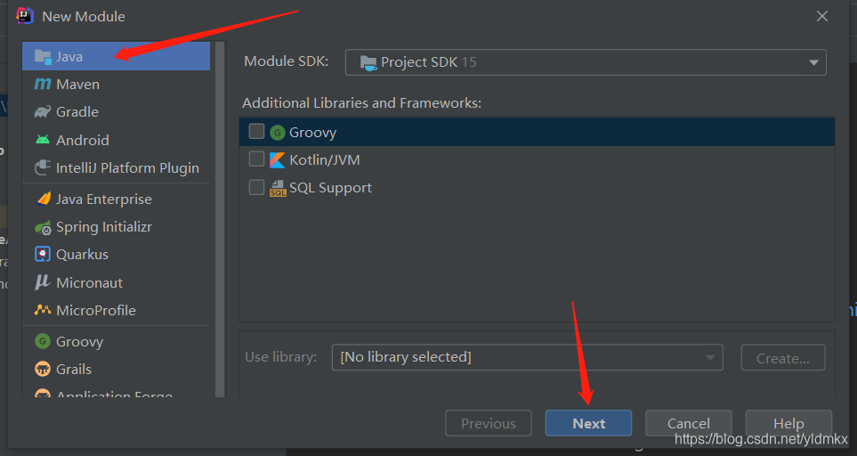

然后命名为JavaWeb，并单击Finish完成module的创建，如下图。

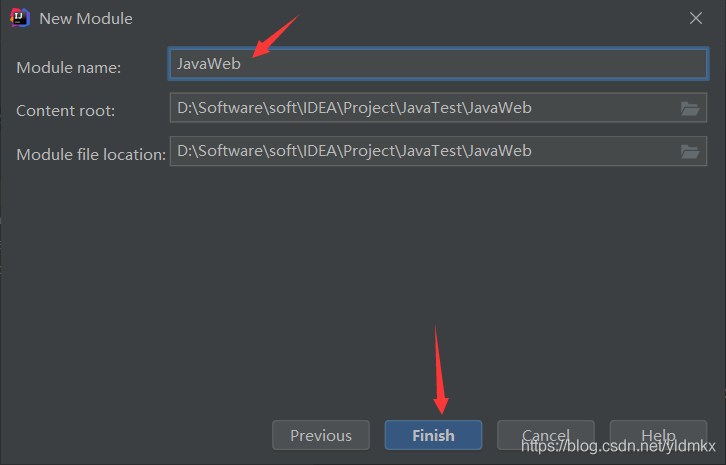

#### 添加框架支持

右键JavaWeb模块，选择【Add Framework Support】,然后勾选【Web Application】(Create web.xml是自动帮我们勾选的)，此时JavaWeb目录下即有web项目，如下图。

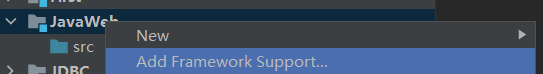

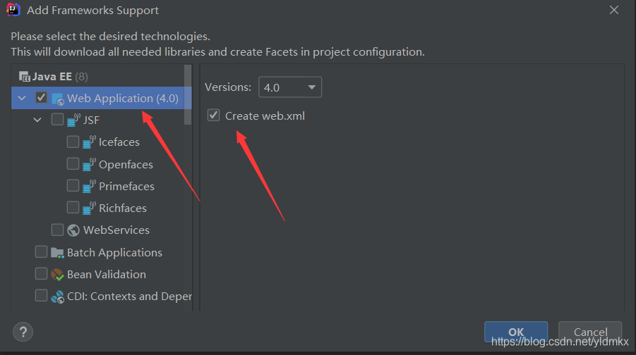

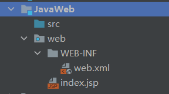

#### IDEA部署Web工程

【Run】-->【Edit Configurations】，打开面板后，选择坐上叫的【+】符号选择Tomcat Server，并且点击【Local】，如下图。

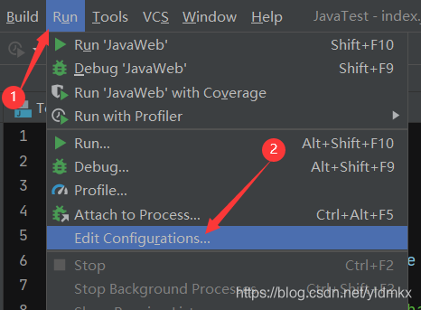

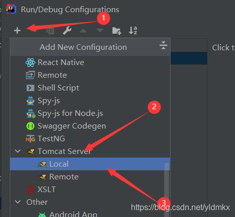

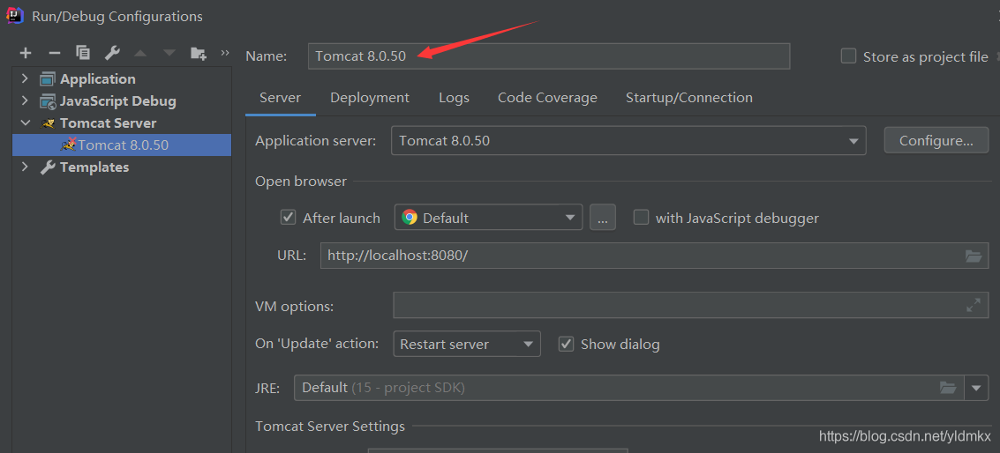

我们先将Tomcat服务名字改一下，这里我改成JavaWeb，并且选择【Deployment】，然后选择【+】符号添加Artifact。

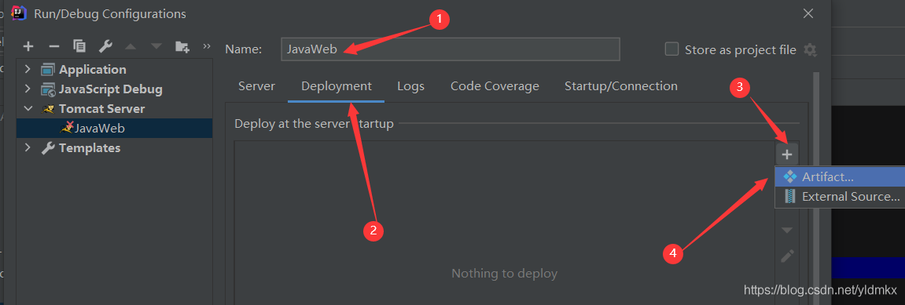

为我们的JavaWeb部署，如下图。

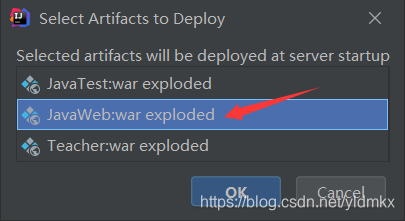

此时我们打开JavaWeb下的index.jsp文件，里面改成我们自己想显示的内容，如下图。

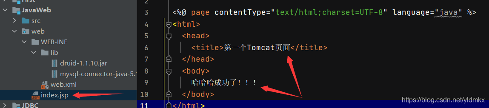

运行，等个两三秒，弹出了我们设置的内容，如下图，部署成功。

### JDBC

#### JDBC基本概念

- 概念：Java DataBase connectivity,  Java数据库连接， java语言操作数据库

- 本质：JDBC是官方定义的一套操作关系型数据库的规则，即**接口**。各个数据厂商去实现这套接口，提供**数据库驱动jar包**，我们可以使用这套接口编程，但是真正执行的代码是驱动jar包里的 实现类。

  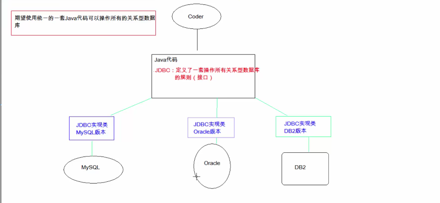

