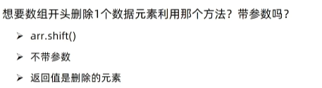

# Javascript学习笔记

## 1. JS基础入门

> Javascript是一种运行在客户端(浏览器)的编程语言，用来实现人机交互的效果。
>
> 主要能够完成以下任务：
>
> - 网页特效
> - 表单验证
> - 数据交互
> - 服务端编程(node.js)
>
> Javascript的组成部分主要有两个：`ECMAScript`和`Web APIs`
>
> - ECMAScript 规定了js基础语法核心知识
> - Web APIs 又分为两个组成部分
>     - DOM 操作文档，实现对页面元素的移动、大小、添加删除等操作。
>     - BOM 操作浏览器，实现页面弹窗、检测窗口宽度、存储数据到浏览器等操作。

### 1.1 书写位置

#### 1.1.1 内部Javascript

直接写在html文件里，用script标签包住

**规范：** script标签写在`</body>`上面

```html
<body>
    <script>
    	alert('hello world')
    </script>
</body>
```

#### 1.1.2 外部Javascript

代码写在以`.js`结尾的文件里，通过script标签引入到html页面中。

```html
<body>
	<!-- 通过src引入外部js文件 -->
	<script src="my.js">
    	// 中间不要写内容
    </script>
</body>
```

### 1.2 基本语法

#### 1.2.1 注释

- 单行注释：`//`
- 块注释：`/* */`

#### 1.2.2 结束符

每一个语句的最后可以使用`;`来结束，但通常我们将其省略，浏览器可以自动判断每一个语句的起始。

#### 1.2.3 输入输出

- 输入
    - `document.write('输出内容')`：向body内输出内容，如果输出的内容写的是标签，也会被解析成网页元素。
    - `alert('输出内容')`：页面弹出警告对话框
    - `console.log('控制台打印')`：控制台输出语法，程序员调试使用。
- 输出
    - `prompt('请输入内容')`：显示一个对话框，对话框中包含一条文字信息，提示用户输入文字。输入进的数据默认视为==字符串==数据类型

#### 1.2.4 变量

- 变量声明：`let 变量名`或`var 变量名`(基本已经舍弃)

    ```javascript
    let age = 18;
    let name = '小明';
    let array = [1, 2, 3];
    ```

- 变量命名规则

    - 不能使用关键字
    - 只能使用下划线、字母、数字、$，且数字不能开头
    - 严格区分大小写

#### 1.2.5 常量

- 常量声明：`const 变量名` 常量不允许重新复制，声明时必须赋值。
- 建议数组和对象使用`const`来声明

<center></center>

#### 1.2.6 数据类型

- 基本数据类型：`number, string, boolean, undefined, null`
    - 当声明一个变量，但未赋值时，默认为`undefined`
- 引用数据类型：`object, function, array`

使用`typeof(x)`来检测数据类型。

#### 1.2.7 数据类型转换

- 隐式转换

    <center><br><br></center>

- 显式转换

    <center></center>

#### 1.2.8 模板字符串

模板字符串使用==反引号==来包含数据，使用`${name}`使用变量

```javascript
let name = '小明';
let age = 20;
document.write(`我叫${name}, 今年${age}岁了`);
```

#### 1.2.9 比较运算符

在JavaScript中，要多用`===`和`!==`运算符，尽量少用`==`

<center></center>

### 1.3 断点调试

浏览器调试页面

1. F12打开开发者工具
2. 点到sources一栏
3. 选择代码文件进行调试

### 1.4 数组增删

#### 1.4.1 增

<center><br><br></center>

#### 1.4.2 删

<center><br><br><br><br></center>

### 1.5 函数

#### 1.5.1 具名函数

```javascript
// 函数声明
function getSum(num1, num2) {
    // 方法体
    return 数据 
    // 跟java一样，只能return一个数据，如果要返回多个，可以通过数组实现
}

// 为了使函数有更好的容错性，通常给一个默认参数，否则默认undefined
function getSum(num1 = 0, num2 = 0) {
    // 方法体
}
```

#### 1.5.2 匿名函数

匿名函数是没有名字的函数，例如`function() {}`，它无法被直接使用。它的使用方法有以下两种：

- 函数表达式

    <center></center>

    ```javascript
    let fn = function(num1, num2) {
        console.log('函数表达式')
    }
    fn(num1, num2)
    // 函数表达式和具名函数的主要区别在于，使用具名方式声明的函数
    // 可以在任意地方调用，而函数表达式声明的函数只能在其下方使用。
    ```

    

- 立即执行函数

    ```javascript
    // 立即执行函数的写法类似于以下这种，主要在web API中使用。
    let btn = document.querySelector('button')
    btn.addEventListener(function() {
        alert('弹出')
    })
    
    // 另一种立即执行函数写法
    (function() {
        console.log('立即执行函数')
    })(); // 立即执行函数后面一定要用;隔开
    (function(x, y) {
        console.log('立即执行函数2')
    })(1, 2);
    ```

### 1.6 逻辑中断

```javascript
// 采用逻辑中断的方式可以不用给形参赋予默认参数
function fu1(x, y) {
    x = x || 0; // 如果x有值则返回该值，否则返回0
    y = y || 0;
    console.log(x + y);
}
```

> 要注意：
>
> false && 20  ---> false
>
> 5 < 3 && 20 ---> false
>
> undefined && 20 ---> undefined
>
> null && 20 ---> null
>
> 0 && 20 ---> 0
>
> 其中``'', 0, undefined, null, false, NaN`` 转化成Boolean型后都为false

### 1.7 对象

#### 1.7.1 概念及对象声明

<center></center>

#### 1.7.2 对象的操作

<center></center>

```javascript
let obj = {
    'goods-name':'玩具',
    num: 20,
    weight: '0.5kg',
    address: '中国大陆'
}
obj.num = 30; // 改
obj.color = '粉色'; // 增
delete obj.color; // 删
obj['goods-name'] // 另一种查询方式，使用这种查询方式中括号里面的变量名一定要有引号引起来,如下：
obj['num']
```

#### 1.7.3 对象方法

```java
let obj = {
 uname: '小明',
 // 方法声明
 say: function() {
     console.log('你好')；
 }
}
obj.say(); // 方法调用
```

#### 1.7.4 遍历对象内容

```javascript
let obj = {
    uname: '小铭',
    age: 20,
    gender: 'man'
}
// 遍历对象
for (let key in obj) {
    // 获取到的key是'uname', 'age', 'gender',他们都是字符串类型的
    console.log(obj.key); // 注意！！！这种查询方式会报错
    console.log(obj[key]); // 这才是正确的查询方式
}
/*
不推荐使用以下方式遍历数组
for (let i in array) {
	console.log(i); // i 获取到的是数组元素的下标
	console.log(array[i]); // 这样才能获取到数组元素
}
*/
```

#### 1.7.5 内置对象

内置对象是js内部提供的对象，包含了一些已经定义好的属性和方法，可以直接调用。

<center></center>


## 2. Web APIs

### 2.1 作用和分类

<center></center>

### 2.2 DOM

> DOM(Document Object Model----文档对象模型)是用来呈现以及与任意HTML或XML文档交互的API，换句话来说就是用来==操作网页内容==。

#### 2.2.1 DOM对象介绍

<center></center>

#### 2.2.2 获取DOM对象

最常使用的获取对象方法是根据CSS选择器来获取DOM元素。

<center><br><br><br><br></center>

还有一些其他获取DOM元素方法，但是现在基本不用了，作为了解即可：

<center></center>

#### 2.2.3 DOM修改元素

##### 修改元素内容

`对象.innerHTML = ''` 和 `对象.innerText = ''`

```html
<html lang="en">
<head>
    <meta charset="UTF-8">
    <title>Title</title>
</head>
<body>
    <div class="box">content</div>
<script>
    const box = document.querySelector('.box')
    // 使用.innerHTML属性修改元素内容，它可以识别内容里的标签
    box.innerHTML = '<strong>hello world</strong>'
    // 使用.innerText属性修改元素内容，它不能识别内容里的标签，在内容里写标签是没用的
    box.innerText = 'world'
    console.dir(box)
</script>
</body>
</html>
```

##### 修改元素属性

`对象.属性 = value`

```html
<body>
    
<script>
	const img = document.querySelector('img')
    img.src = './2.png'
    img.title = 'picture2'
</script>
</body>
```

##### 操作元素样式属性

- 通过style属性操作css

    <center></center>

- 通过操作类名操作css

    <center></center>

    ```html
    <html lang="en">
    <head>
        <meta charset="UTF-8">
        <title>Title</title>
    </head>
    <style>
        div {
            width: 200px;
            height: 200px;
            background-color: pink;
        }
        .nav {
            color: red;
        }
        .box {
            width: 300px;
            height: 300px;
            background-color: skyblue;
            margin: 100px auto;
            padding: 10px;
            border: 1px solid #000;
        }
    </style>
    <body>
        <div class="box"></div>
    <script>
        const box = document.querySelector('div')
        box.className = 'nav' // 将css中nav类赋值给div标签
        box.className = 'box nav' // 将css中的多个样式类赋值给div标签
    </script>
    </body>
    </html>
    ```

    

- 通过classList操作类控制css（常用）

    <center></center>

```html
<html lang="en">
<head>
    <meta charset="UTF-8">
    <title>Title</title>
</head>
<style>
    div {
        width: 200px;
        height: 200px;
        background-color: pink;
    }
    .nav {
        color: red;
    }
    .box {
        width: 300px;
        height: 300px;
        background-color: skyblue;
        margin: 100px auto;
        padding: 10px;
        border: 1px solid #000;
    }
</style>
<body>
    <div class="box"></div>
<script>
    const box = document.querySelector('div')
	box.classList.add('nav') // 追加一个类
    box.classList.toggle('nav') // 首先检测有没有这个类，有就删掉，没有就加上
</script>
</body>
</html>
```


 


