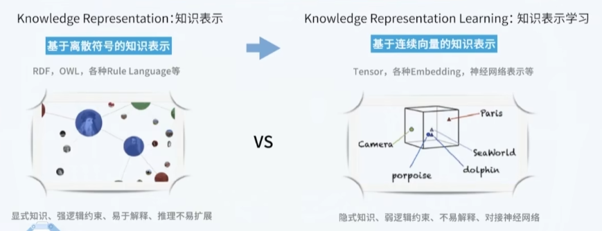
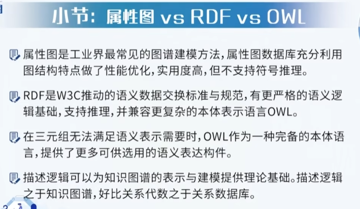
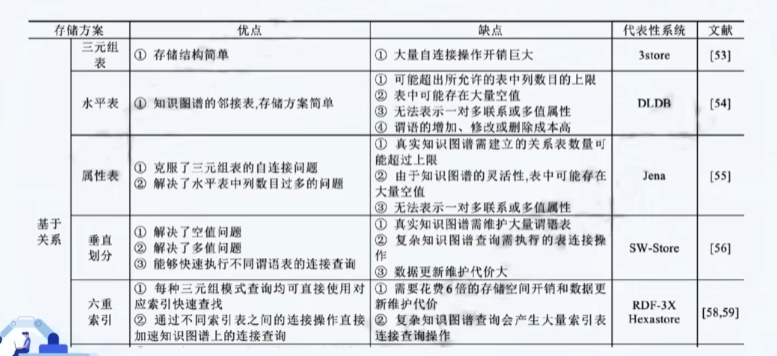
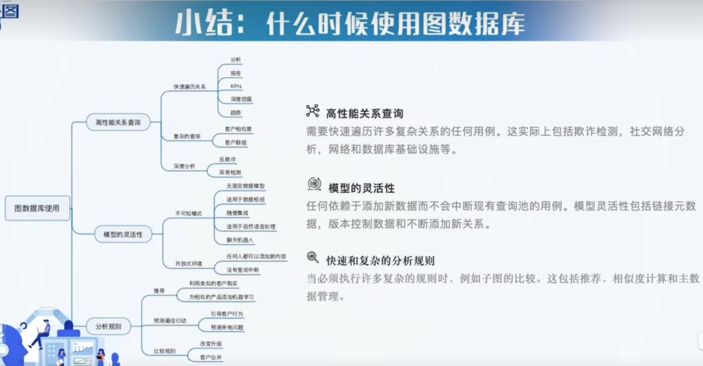

# 知识图谱

## 1.知识图谱的技术内涵

1. 知识图谱不是单一的技术，它需要建立系统工程思维，它是数据、算法、工具、系统的多方面的结合。

2. **知识图谱推理**包括两种方法：

    - 基于符号逻辑的推理方法

        > 优点是具备可解释性
        >
        > 缺点是不利于处理隐含和不确定的知识

    - 基于图结构或表示学习的推理方法

        > 优点是推理效率高，而且能表征隐含的知识
        >
        > 缺点是丢失了可解释性

## 2.知识图谱的表示

什么是知识表示？

知识表示(KR)是用计算机易于处理的形式来描述人脑中的知识，它不同于数据结构、编程语言等，它与数据的最本质的区别在于KR支持推理.
$$
KR=Computational\ Model \  of \ Reality
$$

 

传统的知识表示主要以==符号表示==为主，与知识图谱有关的典型方法包括：

- 描述逻辑
- Horn Logic
- 产生式规则
- 框架系统
- 语义网络

基于==关系数据库==的几种知识图谱存储方案：

关系型数据库的局限性：

1. 不能显式地表达语义关联关系，需要借助外键来描述，这也会导致关联查询与计算的复杂性
2. 大量的离群点导致数据库结构复杂和空间浪费
3. 不能适合于高动态和去中心化的需求

> 关系模型背离了用接近自然语言的方式来描述客观世界的原则，这使得概念化、高度关联的世界模型与数据的物理存储之间出现了失配。

图数据建模的好处：

1. 自然表达：更接近人对事物之间关系的描述
2. 易于扩展
3. 复杂关联表达：图模型易于表达复杂关联逻辑的查询。

