# 知识图谱

## 1.知识图谱的技术内涵

1. 知识图谱不是单一的技术，它需要建立系统工程思维，它是数据、算法、工具、系统的多方面的结合。

2. **知识图谱推理**包括两种方法：

    - 基于符号逻辑的推理方法

        > 优点是具备可解释性
        >
        > 缺点是不利于处理隐含和不确定的知识

    - 基于图结构或表示学习的推理方法

        > 优点是推理效率高，而且能表征隐含的知识
        >
        > 缺点是丢失了可解释性

## 2.知识图谱的表示

什么是知识表示？

知识表示(KR)是用计算机易于处理的形式来描述人脑中的知识，它不同于数据结构、编程语言等，它与数据的最本质的区别在于KR支持推理.
$$
KR=Computational\ Model \  of \ Reality
$$

 

传统的知识表示主要以==符号表示==为主，与知识图谱有关的典型方法包括：

- 描述逻辑
- Horn Logic
- 产生式规则
- 框架系统
- 语义网络

基于==关系数据库==的几种知识图谱存储方案：

关系型数据库的局限性：

1. 不能显式地表达语义关联关系，需要借助外键来描述，这也会导致关联查询与计算的复杂性
2. 大量的离群点导致数据库结构复杂和空间浪费
3. 不能适合于高动态和去中心化的需求

> 关系模型背离了用接近自然语言的方式来描述客观世界的原则，这使得概念化、高度关联的世界模型与数据的物理存储之间出现了失配。

图数据建模的好处：

1. 自然表达：更接近人对事物之间关系的描述
2. 易于扩展
3. 复杂关联表达：图模型易于表达复杂关联逻辑的查询。

原生图数据库的实现原理：==免索引邻接==

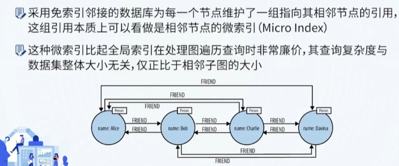

一般而言，如果应用场景重图结构和查询分析，属性图会更合适一些；

如果应用场景重知识的建模或要求和表示复杂的关联关系且有知识推理的要求，采用RDF图会更合适一些。

## 3.知识抽取

### 3.1 实体识别与分类

实体识别与分类任务的定义为：从文本中识别实体边界及类型。

实体识别的常用方法之一是定义模板和规则

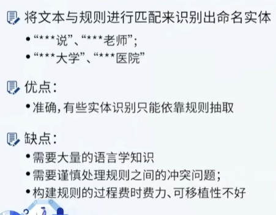

另一个常用且重要的方法是采用机器学习，基于序列标注的方法进行。概括来说，是通过机器学习来构建一个文本分类器，实现对文本中实体的自动分类。

常见的序列预测模型有：HMM（隐马尔可夫模型），CRF条件随机场

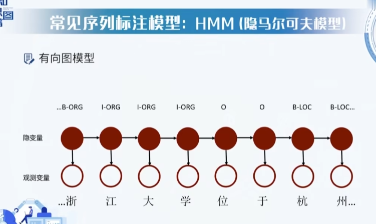 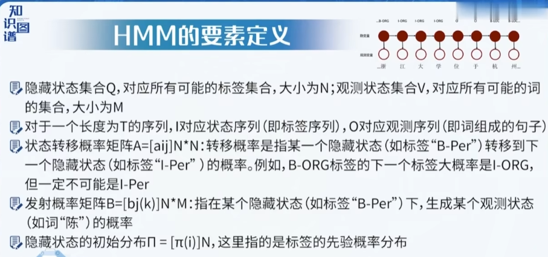 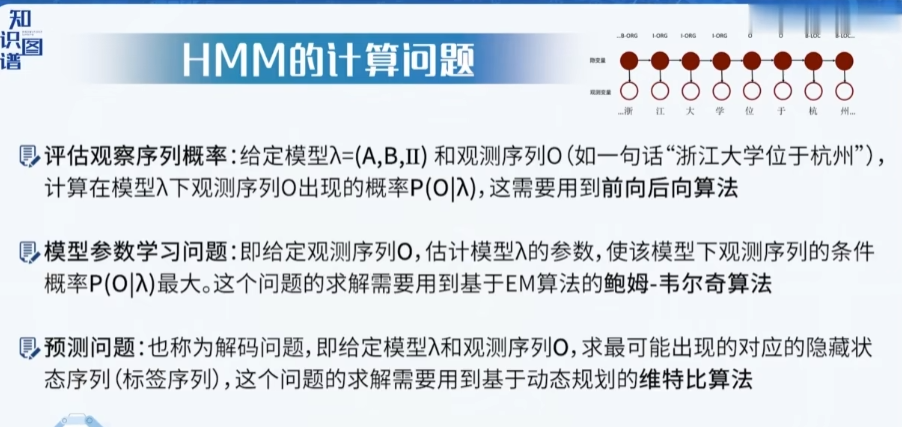

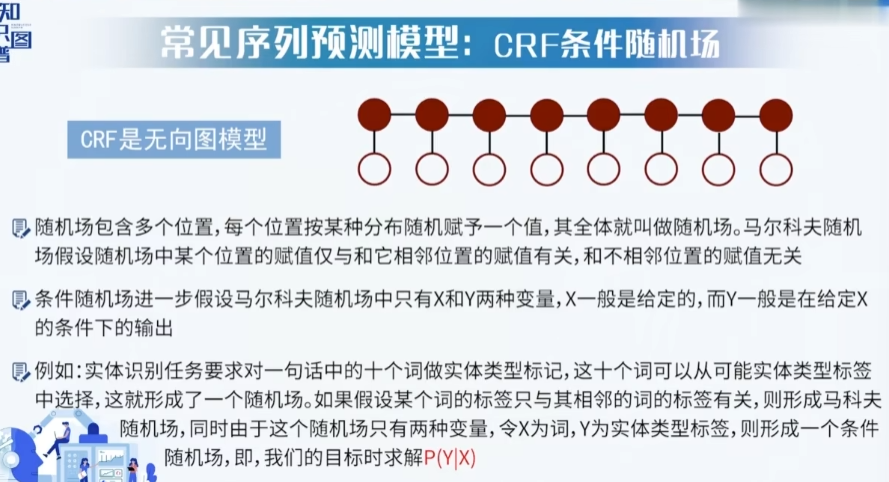

  

### 3.2 关系抽取与属性补全

关系抽取是从文本中抽取出两个或多个实体之间的语义关系。它是从文本获取知识图谱三元组的主要技术手段，通常被用于知识图谱的补全。

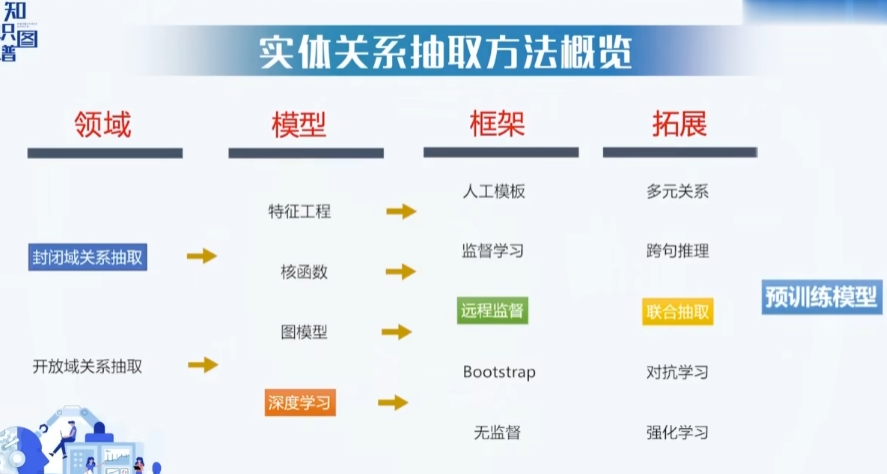

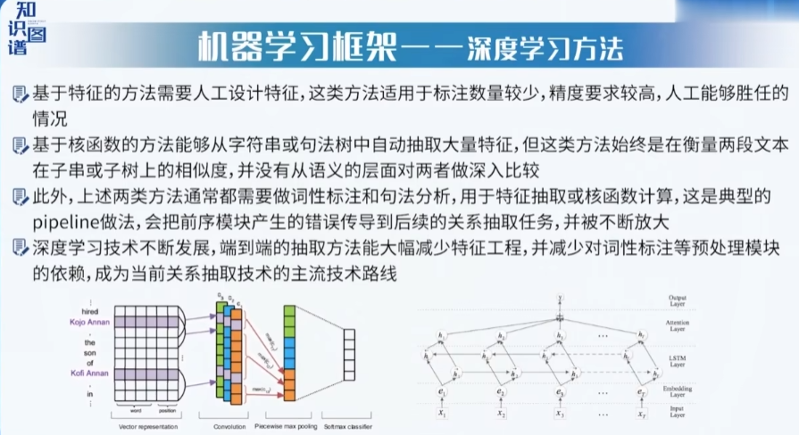

### 3.3 概念抽取

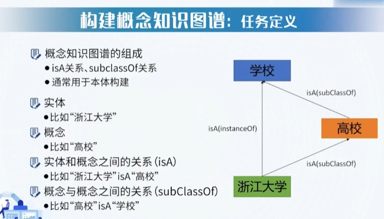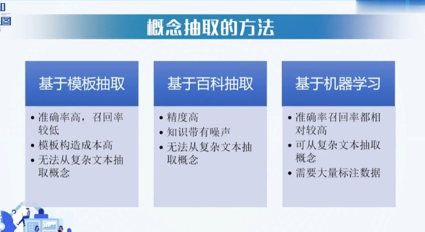

### 3.4 事件识别与抽取

事件抽取方法包括：模式匹配、机器学习

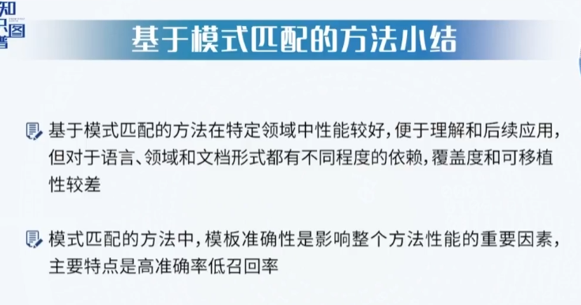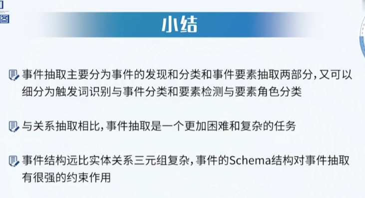

## 4.知识图谱推理

在知识图谱之上可以进行演绎、归纳、溯因、类比等各种形式的推理。

### 4.1 推理方法分类

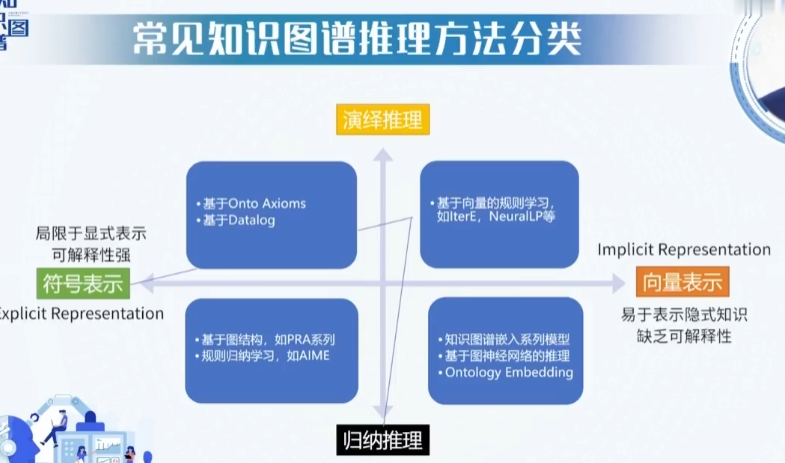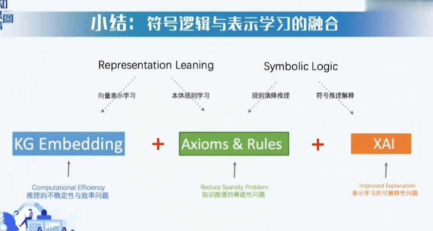

### 4.2 基于ontology(本体)的推理

在知识图谱中，基于本体（ontology）的推理是一种通过使用已定义的本体结构和属性关系来推断实体之间关系的技术。本体是一个形式化的概念模型，描述了实体之间的分类、属性和关系等信息。

基于本体的推理通常基于逻辑规则，例如基于RDF Schema或OWL本体语言中定义的子类和子属性关系进行推理。这些推理可以自动发现实体之间的隐藏关系并填充缺失的数据，从而为用户提供更完整和准确的信息。

例如，在一个医疗知识图谱中，本体可以定义不同疾病之间的层次结构和症状之间的关系。基于本体的推理可以根据已知的症状和疾病之间的关系，推断出一个患者可能患有哪种疾病，帮助医生进行诊断和治疗决策。
