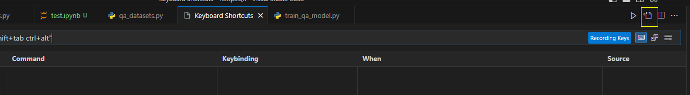
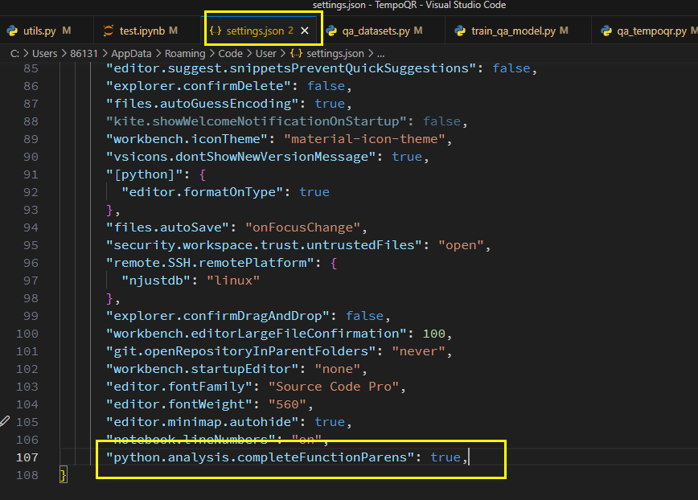
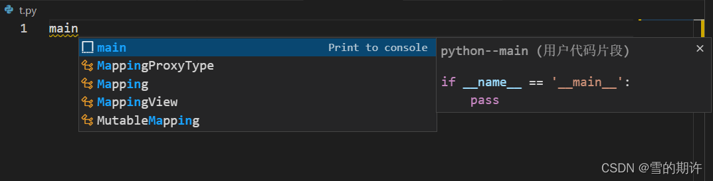
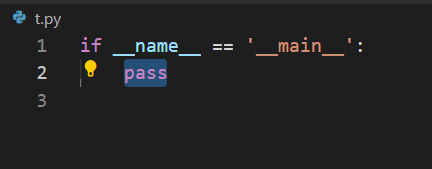
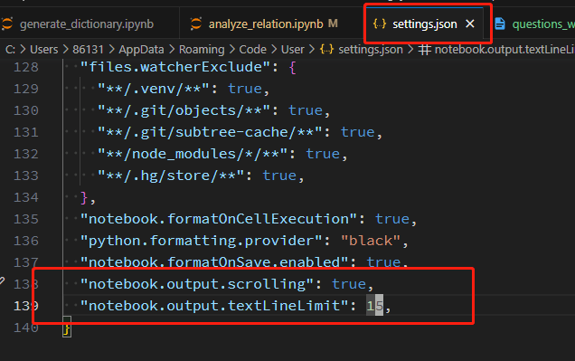
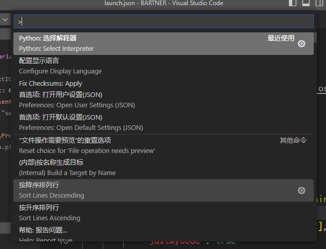
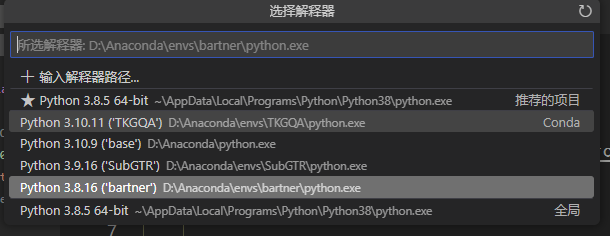

# Vscode配置

## 基础配置

### 1. vscode设置tab为补全切换而不是确认

<center></center>

```json
{
   "key": "tab",
   "command": "selectNextSuggestion",
   "when": "editorTextFocus && suggestWidgetMultipleSuggestions && suggestWidgetVisible"
},
{
   "key": "shift+tab",
   "command": "selectPrevSuggestion",
   "when": "editorTextFocus && suggestWidgetMultipleSuggestions && suggestWidgetVisible"
},
```


### 2. vscode设置python代码补全时函数自动加上小括号

<center></center>


### 3. VSCode写python快捷输入if __name__ == ‘__main__‘:

1. 点击VS Code左下角小齿轮，点击“用户代码片段”(user snippets)
2. 在弹出下拉框中选择python，会打开一个配置文件python.json
3. 给python.json添加"Print to console"项，修改后如下：

```json
{
	"Print to console": {
		"prefix": "main",
		"body": [
			"if __name__ == '__main__':",
			"    ${1:pass}",
			"",
		],
		"description": "python--main"
	}
}
```


效果

<center></center>


回车后：

<center></center>

### 4. 控制notebook输出栏的显示行数

<center></center>

## Python

### 1. 调试配置

在运行和调试部分(`Ctrl+Shift+D`)，创建一个launch.json文件,并进行如下配置：

```json
{
    "version": "0.2.0",
    "configurations": [
        {
            "name": "train.py",   // 根据需要，自己起一个名字
            "type": "python",
            "request": "launch",
            "program": "${workspaceFolder}/train.py",  // 要执行的python文件路径
            "console": "integratedTerminal",
            "args": ["--dataset_name", "genia"],  // 额外的参数设置
            "justMyCode": true
        }
    ]
}
```


### 2. 使用Conda虚拟环境

使用快捷键：`Ctrl+Shift+P`调出控制栏，并选择python解释器，然后选择需要的环境即可

<center></center>

<center></center>

