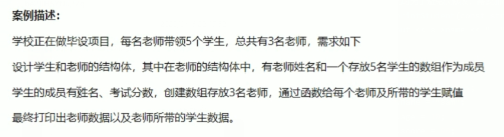
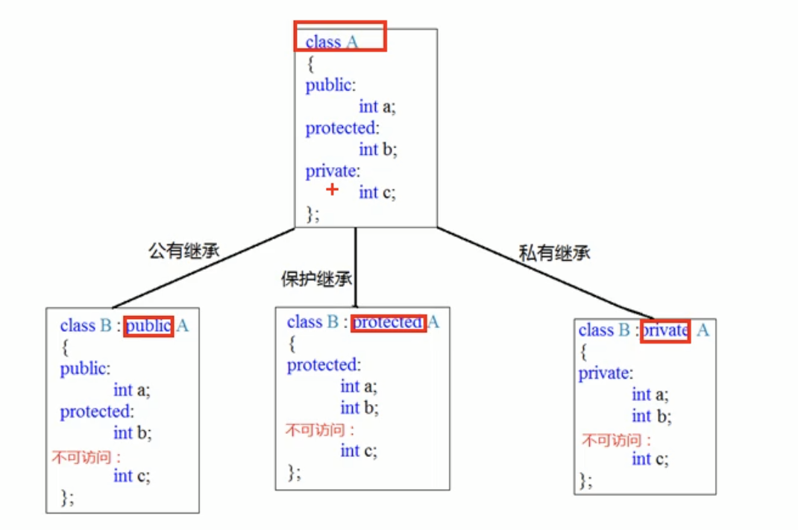

# C++基础入门

## 1.基本语法

### 1.1 基本结构

```c++
#include <iostream>
using namespace std;

int main() {
    cout << "hello world" << endl;
    return 0;
}
```


### 1.2 注释

```c++
// 1. 单行注释

/*
   2. 多行注释
   2. 多行注释
*/
```


### 1.3 变量

**作用：** 给一段指定的内存空间起名，从而方便操作这段内存空间

**语法：** `数据类型 变量名 = 变量初始值;`

**示例：** `int a = 10;`


**变量命名规则：**

- 标识符不能是关键字
- 标识符只能由数字、字母、下划线组成
- 标识符只能由字母、下划线开头
- 标识符区分大小写


### 1.4 常量

**作用：** 用于记录程序中不可更改的数据

**语法：** `#define 常量名 常量值` 或 `const 数据类型 常量名 = 常量值`

**示例：** `#defint day 7` 或 `const int day = 7`


### 1.5 数据类型

#### 整型

| 数据类型  |                     占用空间                     |              取值范围              |
| :-------: | :----------------------------------------------: | :--------------------------------: |
|   short   |                      2Byte                       | -2<sup>15</sup> ~ 2<sup>15</sup>-1 |
|    int    |                      4Byte                       | -2<sup>31</sup> ~ 2<sup>31</sup>-1 |
|   long    | Windows为4Byte， Linux为4Byte(32位)，8Byte(64位) | -2<sup>31</sup> ~ 2<sup>31</sup>-1 |
| long long |                      8Byte                       | -2<sup>63</sup> ~ 2<sup>63</sup>-1 |


#### 实型（浮点型）

| 数据类型 | 占用空间 | 取值范围        |
| -------- | -------- | --------------- |
| float    | 4Byte    | 7位有效数字     |
| double   | 8Byte    | 15~16位有效数字 |

浮点数可以使用科学计数法表示，例如:`3.2e-3`


#### 字符型

**语法：** `char ch = 'a';`

- C和C++中字符类型的变量只占用==一个字节==
- 字符型变量存储的并非是该字符，而是该字符的ASCII编码


#### 字符串类型

**语法：** `string 变量名 = "字符串值"` 或 `char str[] = "字符串值"`

【注意】：C++风格字符串(前一种)，需要加入头文件`#include<string>`， string类型占用32个字节，字符数组的形式由字符串长度决定内存大小


#### 布尔类型

- true，本质为1
- false，本质为0
- 占用1个字节

`bool flag = true`, `bool flag = false`


#### sizeof关键字

**作用：** 统计数据类型所占用的内存空间大小，单位为==字节==

**语法：** `sizeof(数据类型\变量)`

**示例：** `sizeof(int)`, `sizeof(name)`


### 1.6 输入和输出

**数据输入：** `cin >> 变量;`

**数据输出：** `cout << 数据 << endl;`


### 1.7 数组

#### 一维数组

- `数据类型 数组名[数组长度];`
- `数据类型 数组名[数组长度] = {1,2,3,4,....};`
- `数据类型 数组名[] = {1,2,3,4};`


#### 二位数组

- `数据类型 数组名[行数][列数];`
- `数据类型 数组名[2][3] = {{1,2,3}, {4,5,6}};`
- `数据类型 数组名[2][3] = {1,2,3,4,5,6};`
- `数据类型 数组名[][3] = {1,2,3,4,5,6};`


## 2.程序流程结构

### 2.1 goto语句

**作用：** 无条件跳转语句

**语法：** `goto 标记；`

**解释：** 如果标记名称存在，则跳转到该标记位置继续执行

**示例:**

```C++
int main() {
    cout << "1" << endl;
    
    goto FLAG;
    
    cout << "2" << endl;
    cout << "3" << endl;
    
    FLAG:
    
    cout << "4" << endl;
    cout << "5" << endl;
    
    return 0;
}
```


### 2.2 switch语句

**作用：** 基于条件选择执行的操作

**语法：** `switch (条件){case 条件1：break;default: break;}`

**示例：**

```c++
int flag;
switch (flag) {
    case 1:
        pass;
        break;
    case 2:
        pass;
        break;
    case 3:
        pass;
        break;
    default:
        pass;
        break;
}
```


==注意：==如果在case语句里面，需要声明变量，或者要执行的操作比较多，需要将这些部分用`{}`括起来,例如：

```c++
case 1:
{
    int a = 0;
    pass;
}
	break;
```


## 3.函数

### 3.1 函数的定义

函数的定义一般分为五个步骤：

1. 返回值类型
2. 函数名
3. 参数列表
4. 函数体
5. return表达式

**语法：**

```c++
返回值类型 函数名(参数列表) {
    
    函数体;
    
    return 表达式；
}
```


### 3.2 函数的声明

**语法：** `返回值类型 函数名(参数列表);`

函数的声明可以有多次，但函数的定义只能有一次。

如果函数在main()函数后面被定义，那么必须在main()函数前面进行函数的声明。


### 3.3 函数的分文件编写

**作用：** 让代码结构更加清晰

**步骤：**

1. 创建后缀名为`.h`的头文件
2. 创建后缀名为`.cpp`的源文件
3. 在`.h`文件中写函数的声明
4. 在`.cpp`文件中写函数的定义

```c++
// swap.h文件
#include <iostream>
using namespace std;

void swap(int a, int b); // 放置函数声明

---------------------------------------
// swap.cpp文件
#include "swap.h"

void swap(int a, int b) { // 放置函数定义
    int temp = a;
    a = b;
    b = temp;
    cout << "a = " << a << endl;
    cout << "b = " << b << endl;
}
```


## 4.指针

### 4.1 指针的概念

**指针的作用：** 可以通过指针间接的访问内存


### 4.2 指针的定义及使用

**语法：** `数据类型* 指针变量名;`

**例子：** `int* p;`

可以通过取地址符来对指针进行赋值，例如：`int* p = &a;`

为了避免出现==野指针==的情况，通常在声明指针的时候赋值为NULL,从而将指针指向内存空间编号为0的空间:`int* p = NULL;`。注意，内存空间编号为0~255为系统占用内存，不允许用户访问。


> 野指针：指针变量指向非法的内存空间
>
> 示例：
>
> ```c++
> int mai() {
>     // 指针变量p指向内存地址编号为0x1100的空间
>     int *p = (int *) 0x1100;
>     
>     // 访问野指针报错
>     cout << *p << endl;
>     return 0;
> }
> ```
>
> 总结：空指针和野指针都不是我们申请的内存空间，因此不要访问。


### 4.3 指针所占的内存空间大小

指针存放的是16进制的地址，在32位系统中，指针所占用的内存大小为4Byte，不管是什么数据类型；在64位系统中为8Byte。


### 4.4 const修饰指针⭐

**const修饰指针的三种情况**

- const修饰指针 --> 常量指针（指向常量的指针）
    - `const int* p = &a;`
    - 指针的指向可以修改，但是指针指向的值不可以修改
- const修饰常量 --> 指针常量（指针类型的常量）
    - `int* const p = &a;`
    - 指针的指向不可以修改，但是指针指向的值可以修改
- const既修饰指针又修饰常量
    - `const int* const p = &a;`
    - 指针的指向和指向的值均不可以修改

```c++
#include <iostream>

using namespace std;

int main() {
    int a = 10;
    int b = 20;

    // 常量指针
    const int* p1 = &a;
    p1 = &b; // 正确
    *p1 = 30; // 错误

    // 指针常量
    int* const p2 = &a;
    *p2 = 30; // 正确
    p2 = &b; // 错误
	
    // const既修饰常量又修饰指针
    const int* const p3 = &a;
    p3 = &b; // 错误
    *p3 = 40; // 错误
}
```


### 4.5 指针和数组

**作用：** 利用指针访问数组元素

```c++
#include <iostream>

using namespace std;

int main() {
    int arr[10] = {1,2,3,4,5,6,7,8,9,10};

    int* p = arr;

    // 利用指针遍历数组
    for (int i = 0; i < 10; ++i) {
        cout << *(p ++) << endl;
    }

    return 0;
}
```


### 4.6 指针和函数

**作用：** 利用指针作为函数参数，可以修改实参的值。

```c++
#include <iostream>

using namespace std;

void swap(int* a, int* b) {
    int temp = *a;
    *a = *b;
    *b = temp;
}

int main() {
    int a = 10;
    int b = 20;

    swap(&a, &b);

    cout << "a:" <<  a << "\nb:" << b << endl;

    return 0;
}
```


### 4.7 指针、数组、函数

**案例描述：** 封装一个函数，利用==冒泡排序==，实现对整数数组的升序排序。

```c++
#include <iostream>

using namespace std;

void swap(int* a, int* b) {
    int temp = *a;
    *a = *b;
    *b = temp;
}

void bubbleSort(int* arr, int len) {
    for (int i = 0; i < len - 1; i ++) {
        for (int j = 0; j < len - i - 1; j ++) {
            if (arr[j] > arr[j + 1]) {
                swap(&arr[j], &arr[j + 1]);
            }
        }
    }
}

int main() {
    int arr[10] = {4,3,6,9,1,2,10,8,7,5};
    int len = sizeof(arr) / sizeof(int);

    bubbleSort(arr, len);

    for (int i = 0; i < len; ++i) {
        cout << arr[i] << endl;
    }
}
```


## 5.结构体

### 5.1 结构体基本概念

结构体属于用户自定义的数据结构，允许用户存储不同的数据类型。


### 5.2 结构体的定义和使用

**语法：** `struct 结构体名 {结构体成员列表};` (struct不可省略)

通过结构体创建变量的方式有三种：

- `struct 结构体名 变量名;` （struct可以省略）
- `struct 结构体名 变量名 = {值1，值2...};` （struct可以省略）
- 定义结构体时顺便创建变量。


```c++
struct Student {
    string name;
    int age;
    int score;
};

int main() {
    // 第一种方式
    struct Student s1; 
    /* 或者 Student s1; */
    s1.name = "Amy";
    s1.age = 20;
    s1.score = 100;
    
    // 第二种方式
    struct Student s2 = {"Jam", 19, 99};
    
    // 第三种方式
    /*
    	struct Student {
    		string name;
    		int age;
    		int score;
    	} s3;
    */
}
```


### 5.3 结构体数组

**作用：** 将自定义结构体放到数组中方便维护

**定义：** `struct 结构体名 数组名[元素个数] = {{},{},{},...};`

```c++
#include <iostream>

using namespace std;

struct Student {
    string name;
    int age = 0;
    int score = 0;
};

int main() {
    Student stu[3] = {
            {"amy", 20, 100},
            {"jam", 20, 99},
            {"jack", 19, 89}
    };
    stu[1].name = "tom";

    for(Student s : stu) {
        cout << s.name << "--" << s.age << "--" << s.score << endl;
    }
}
```


### 5.4 结构体指针

**作用：** 通过指针访问结构体中的成员

- 利用操作符`->`可以通过结构体指针访问结构体属性

```c++
#include <iostream>

using namespace std;

struct Student {
    string name;
    int age = 0;
    int score = 0;
};

int main() {
    Student s1 = {"tom", 20, 200};
    Student *p = &s1;
    cout << p->name << "--" << p->age << "--" << p->score << endl;
}
```


### 5.5 结构体嵌套结构体

**作用:** 结构体中的成员可以是另一个结构体

**示例：**

```c++
struct Student {
    string name;
    int age = 0;
    int score = 0;
};

struct Teacher {
    int id = 0;
    string name;
    int age = 0;
    struct Student stu[20]; 
};
```


### 5.6 结构体作函数参数

**作用：** 将结构体作为参数向函数中传递

传递方式有两种：

- 值传递
- 地址传递

**示例：**

```c++
#include <iostream>

using namespace std;

struct Student {
    string name;
    int age = 0;
    int score = 0;
};

// 值传递
void printStudent(struct Student s) {
    s.age = 100;
    cout << s.name << "--" << s.age << "--" << s.score << endl;
}

// 地址传递
void printStudent2(struct Student *s) {
    s->age = 100;
    cout << s->name << "--" << s->age << "--" << s->score << endl;
}

int main() {
    struct Student s;
    s.name = "sam";
    s.age = 10;
    s.score = 90;

    printStudent(s);
    cout << s.name << "--" << s.age << "--" << s.score << endl;
    printStudent2(&s);
    cout << s.name << "--" << s.age << "--" << s.score << endl;
}
```

> 如果不想修改主函数中的数据，用值传递，反之用地址传递。


### 5.7 结构体中const使用场景

**作用：** 用const防止误操作

**示例：**

```c++
#include <iostream>

using namespace std;

struct Student {
    string name;
    int age = 0;
    int score = 0;
};

// 将函数中的形参改为指针，可以减少内存空间，而且不会复制新的副本出来
// 但此时为了避免误修改，需要加const修饰；
void printStudent(const struct Student *s) {
    cout << s->name << "--" << s->age << "--" << s->score << endl;
}

int main() {
    struct Student s;
    s.name = "sam";
    s.age = 10;
    s.score = 90;

    printStudent(&s);
    cout << s.name << "--" << s.age << "--" << s.score << endl;
}
```


### 5.8【案例1】

<center></center>

```c++
#include <iostream>
#include <string>
#include <ctime>

using namespace std;

struct Student {
    string sName;
    int score = 0;
};

struct Teacher {
    string tName;
    Student sArray[5];
};

void allocateSpace(struct Teacher tArray[], int len) {
    string nameSeed = "ABCDE";
    for (int i = 0; i < len; ++i) {
        tArray[i].tName = "Teacher_";
        tArray[i].tName += nameSeed[i];

        for (int j = 0; j < 5; ++j) {
            tArray[i].sArray[j].sName = "Student_";
            tArray[i].sArray[j].sName += nameSeed[j];

            int random = rand() % 61 + 40; // 生成[40,100]之间的随机数
            tArray[i].sArray[j].score = random;
        }
    }
}

void printInfo(Teacher tArray[], int len) {
    for (int i = 0; i < len; ++i) {
        cout << "老师的姓名：" << tArray[i].tName << endl;

        for (int j = 0; j < 5; ++j) {
            cout << "\t" << "学生的姓名：" << tArray[i].sArray[j].sName << "\t" << tArray[i].sArray[j].score << endl;
        }
        cout << "\n" << endl;
    }
}

int main() {
    // 设置随机数种子
    srand((unsigned int)time(NULL));
    
    struct Teacher tArray[3];
    int len = sizeof(tArray) / sizeof(tArray[0]);
    allocateSpace(tArray, len);
    printInfo(tArray, len);
}
```


# C++核心编程

## 1. 内存分区模型

C++程序在执行时，将内存大方向划分为==四个区域==

- 代码区：存放函数体的二进制代码，由操作系统进行管理
- 全局区：存放全局变量，静态变量，常量等
- 栈区：由编译器自动分配，存放函数的参数值和局部变量等。
- 堆区：由程序员分配释放，若程序员未释放，则由操作系统在程序结束时收回

**内存四区的意义：**

不同区域存放不同的数据，有不同的生命周期，给我们更大的灵活编程。


### 1.1 程序运行前

在程序编译后，生成了exe可执行文件，未执行该程序前，分为两个区域

**代码区：**

- 存放cpu执行的机器指令
- 代码区是==共享==的，一个程序的多次运行共享一个代码区
- 代码区是只读的，不可以被修改


**全局区：**

- 存放全局变量和静态变量、
- 全局区还包含了常量区、字符串常量和其他常量
- 该区域的数据在程序结束后由操作系统释放


**注意：** 

- 局部变量、==局部常量==不在全局区中
- 静态变量，全局变量，全局常量在全局区中


### 1.2 程序运行后

**栈区：**

- 由编译器自动分配释放，存放函数的参数值、局部变量等。
- 注意，不要返回局部变量的地址值，栈区开辟的数据由操作系统自动释放。


**堆区：**

- 由程序员分配释放，若程序员未释放，则由操作系统在程序结束时收回。
- C++主要利用`new`在堆区中开辟内存。

```c++
int* func() {
    int* p = new int(10);
    return p;
}

int main() {
    int* p = func();
    cout << *p << endl;
}
```


### 1.3 new操作符

C++中利用new操作符在堆区开辟数据

堆区开辟的数据，由程序员手动开辟，手动释放，释放利用操作符`delete`

**语法**：`new 数据类型`

利用new创建的数据，会返回该值数据类型对应的指针。

```c++
// 在堆区创建数组
void test02() {
    int* p = new int[10];

    for (int i = 0; i < 10; i++)
    {
        p[i] = i + 100;
    }

    for (int i = 0; i < 10; i++)
    {
        cout << p[i] << endl;
    }

    delete[] p; // 释放数组时，需要使用delete[]
}
```


## 2. 引用

### 2.1 引用的基本使用

**作用：**给变量起别名

**语法：**`数据类型 &别名 = 原名；`

```c++
#include <iostream>
using namespace std;

int main() {
    int a = 10;
    int& b = a;
    cout << a << endl;
    cout << b << endl;
    b = 100;
    cout << a << endl;
    cout << b << endl;
}
```


### 2.2 引用的注意事项

1. 引用必须要初始化
2. 引用一旦初始化后，就不可以更改


### 2.3 引用做函数参数

**作用：**函数传参时，可以利用引用的技术让形参修饰实参

**优点：**可以简化指针修改实参

```c++
void swap(int& a, int& b) {
    int temp = a;
    a = b;
    b = temp;
}

int main() {
    int a = 10;
    int b = 20;
    swap(a, b);
    cout << a << endl;
    cout << b << endl;
}
```

总结：通过引用参数产生的效果同地址传递是一样的，引用语法更为清楚。


### 2.4 引用做函数返回值

**作用：**引用是可以作为函数的返回值存在的


**注意：**不要返回局部变量的引用。

**用法：**函数的调用可以作为左值。

```c++
int& test() {
    static int a = 10;
    return a;
}

int main() {
    int& ref = test();
    cout << ref << endl;

    ref = 100;
    cout << ref << endl;

    test() = 1000;
    cout << ref << endl;
}
```


### 2.5 引用的本质

**本质：**指针常量

```c++
int main() {
    int a = 10;
    
    // 自动转化为 int* const ref = &a;指针常量的指向不可更改，这也说明为什么引用不可更改
    int& ref = a;
    ref = 20； // 内部发现ref是引用，自动帮我们转化成*ref = 20；
}
```

C++推荐使用引用技术，引用的本质是指针常量，但是所有的指针操作编译器都帮我们做了。


### 2.6 常量引用

**作用：**用于修饰形参，防止误操作

在函数形参列表中，可以加`const`修饰形参，防止形参改变实参

常量引用`const int& reg = a;`相当于`const int* const reg = &a;`

```c++
void showValue(const int& v) {
    cout << v << endl;
}

int main() {
    // int& ref = 10; 引用本身需要一个合法的内存空间，因此这一行是错误的
    // 加入const就可以了，编译器会自动优化成：int temp=10; const int& reg = temp;
    const int& ref = 10; // 所以说这里的ref并非指向常量区的10，而是指向一个我们看不见的temp=10
    cout << ref << endl;
    
    int a = 10;
    showValue(a); // 函数中利用常量引用防止误操作，修改实参。
}
```


## 3. 函数提高

### 3.1 函数默认参数

在c++中，函数的形参列表中的形参是可以有默认值的。

**注意事项:**

- 如果某个位置已经有了默认参数，那么从这个位置往后，从左到右都必须有默认参数
- 如果函数声明有默认参数，函数实现就不能有默认参数,反之亦然。（声明和实现只能有一个默认参数）


**语法：** `返回值类型 函数名 (参数=默认值) {}`

```c++
int func(int a = 10, int b = 10, int c = 10) {
    int temp = a + b + c;
    return temp;
}

// 如果某个位置已经有了默认参数，那么从这个位置往后，从左到右都必须有默认参数
int func2(int a, int b, int c = 1, int d = 2) {
    pass;
}

// 如果函数声明有默认参数，函数实现就不能有默认参数
int func3(int a = 10, int b = 10);

int func3(int a, int b) {
    return a + b;
}

int main() {
    int a = 1;
    int b = 2;
    int ans = func(a, b);
    cout << ans << endl;
}
```


### 3.2 函数占位参数

C++中函数的形参列表里可以有占位参数，用来占位，调用函数是必须填补该位置

**语法：** `返回值类型 函数名(数据类型) {}`

```c++
// 后面那个int就是占位参数
// 占位参数还可以有默认参数
void func(int a, int = 10) {
    cout << "func" << endl;
}

int main() {
    // 在使用时，占位参数必须被填补，如果有默认就可以不传
    func(10, 10);
}
```


### 3.3 函数重载

#### 3.3.1 函数重载概述

**作用：**函数名可以相同，提高复用性

**需要满足的条件：**

- 同一个作用域下
- 函数名相同
- 函数参数的类型不同、数量不同、顺序不同

**注意:** 函数的==返回值不可以作为函数重载==的条件。

```c++
int func(int a, int b) {
    cout << "func_ab" << endl;
    return a + b;
}

int func(int a, int b, int c) {
    cout << "func_abc" << endl;
    return a + b + c;
}

int main() {
    int a = 1;
    int b = 2;
    int c = 2;
    cout << func(a, b) << endl;
    cout << func(a, b, c) << endl;
}
```


#### 3.3.2 函数重载注意事项

- 引用作为重载条件
- 函数重载碰到函数默认参数

```c++
// 1.引用作为函数重载
void fun(int& a) {
    cout << "fun(int& a)的调用" << endl;
}

void fun(const int& a) {
    cout << "fun(const int& a)的调用" << endl;
}

// 2.函数重载碰到默认参数
void fun2(int a) {
    cout << "fun2(int a)的调用" << endl;
}

void fun2(int a, int b = 10) {
    cout << "fun2(int a, int b = 10)的调用" << endl;
}

int main() {
    // 使用fun(int& a)来运行
    int a = 10;
    int& ref = a;
    fun(ref);

    // 使用fun(const int& a)来运行
    fun(10);

    // 当函数重载碰到默认参数，会出现二义性，报错，因此在函数重载时尽可能不使用默认参数
    fun2(a); // ！！！报错
}
```


## 4 类和对象

c++面向对象的三大特性为：==封装、继承、多态==

c++认为万事万物皆为对象，对象上有其属性和行为


### 4.1 封装

#### 4.1.1 封装的意义

封装是c++面向对象的三大特征之一

封装的意义：

- 将属性和行为作为一个整体，表现生活中的事物
- 将属性和行为加以权限控制


**封装的意义一：**

在设计类的时候，属性和行为写在一起，表现事物。

**语法:** `class 类名{访问权限：属性 / 行为}；`

**示例1:**设计一个圆类，求圆的周长

```c++
// 设计一个圆类，求圆的周长
#define PI 3.14

class Circle {
    // 访问权限
public:
    // 属性
    int m_r;

    // 行为
    double calculateZC() {
        return 2 * PI * m_r;
    }
};

int main() {
    // 通过圆类，创建具体的圆
    Circle c1;
    c1.m_r = 10;

    cout << c1.calculateZC() << endl;
}
```


**封装的意义二：**

类在设计时，可以把属性和行为放在不同的权限下，加以控制

访问权限有三种:

1. `public` 公共权限：类内可以访问，类外可以访问，子类可以继承
2. `protected` 保护权限：类内可以访问，类外不可以访问 子类可以访问父类中的保护内容，子类可以继承
3. `private` 私有权限：类内可以访问，类外不可以访问 子类不可以访问父类中的私有内容，子类不可以继承


#### 4.1.2 struct和class的区别

在C++中struct和class唯一的区别在于==默认的访问权限不同==

区别：

- struct默认权限为**公共**
- class默认权限为**私有**


#### 4.1.3 将成员属性设置为私有

**优点1：** 将所有成员属性设置为私有，可以自己控制读写权限

**优点2：** 对于写权限，我们可以检测数据的有效性

```c++
class Person {
private:
    string m_Name; // 可读可写
    int m_age = 0; // 只读
    string m_Lover; // 只写

public:
    void setName(string name) {
        m_Name = name;
    }

    string getName() {
        return m_Name;
    }

    int getAge() {
        return m_age;
    }

    // 如果只读，不要set，这里演示的是检测数据有效性。
    void setAge(int age) {
        if (age < 0 || age > 150) {
            cout << "Wrong!" << endl;
            return;
        }
        m_age = age;
    }

    void setLover(string lover) {
        m_Lover = lover;
    }
};

int main() {
    Person p1;
    p1.setName("Amy");
    p1.setLover("Tom");
    cout << p1.getName() << endl;
    cout << p1.getAge() << endl;
}
```


#### 4.1.4 将不同的类写在多文件中

```c++
// point.h 文件

#pragma once // 保证同一个文件不会被包含多次
#include <iostream>
using namespace std;

class Point {
private:
    int m_X;
    int m_Y;

public:
    void setX(int x); // 只写函数声明

    int getX();

    void setY(int y);

    int getY();
};
```


```c++
// point.cpp 文件

#include "point.h"

void Point::setX(int x) { // 在写函数定义时，要明确函数的作用域，使用：“类名”+::
    m_X = x;
}

int Point::getX() {
    return m_X;
}

void Point::setY(int y) {
    m_Y = y;
}

int Point::getY() {
    return m_Y;
}
```


### 4.2 对象的初始化和清理

#### 4.2.1 构造函数和析构函数

对象的初始化和清理是两个非常重要的安全问题

- 一个对象或变量没有初始状态，对其使用后果是未知的。
- 同样的，使用完一个对象或变量，没有及时清理，也会造成一定的安全问题。

c++利用构造函数和析构函数，完成对象的初始化和清理工作。

对象的初始化和清理工作是编译器强制要我们做的事情，因此如果我们不提供构造和析构，编译器会提供，编译器提供的构造函数和析构函数是**空实现**

- 构造函数：主要作用在于创建对象时为对象的成员属性赋值，构造函数由编译器自动调用，无需手动调用。
- 析构函数：只要作用在于对象销毁前系统自动调用，执行一些清理操作。


**构造函数语法：** `类名() {}`

1. 构造函数，没有返回值，也不写void
2. 函数名称与类名相同
3. 构造函数可以有参数，因此可以发生重载
4. 程序会自动调用构造，无需手动调用，而且只会调用一次。


**析构函数语法：** `~类名() {}`

1. 析构函数，没有返回值，也不写void
2. 函数名称与类名相同，在名称前面加上符号~
3. 析构函数不可以有参数，因此不可以发生重载
4. 程序在对象销毁前会自动调用析构，无需手动调用，而且只会调用一次。

```c++
class Person {
public:
    // 构造函数
    Person() {
        cout << "person" << endl;
    }

    // 析构函数
    ~Person() {
        cout << "~person" << endl;
    }
};

```


#### 4.2.2 构造函数的分类及调用

两种分类方式：

- 按参数分为：有参构造和无参构造
- 按类型分为：普通构造和拷贝构造

三种调用方式：

- 括号法
- 显示法
- 隐式转换法


```c++
#include <iostream>

using namespace std;

class Person {
public:
    // 构造函数，无参构造为默认构造
    Person() {
        cout << "无参构造" << endl;
    }

    Person(int a) {
        age = a;
        cout << "有参构造" << endl;
    }

    Person(int a, string n) {
        age = a;
        name = n;
    }

    // 拷贝构造
    Person(const Person& p) {
        age = p.age;
        name = p.name;
        cout << "拷贝构造" << endl;
    }

    ~Person() {
        cout << "析构函数" << endl;
    }

public:
    int age;
    string name;
};

// 调用
void test01() {
    // 1. 括号法
    Person p1;
    Person p2(10);
    Person p3(p2);

    /*
       注意：调用默认构造函数时，不要加()
       Person p1();
       因为这会视为一个函数声明
    */

    // 2. 显示法
    Person p4;
    Person p5 = Person(10);
    Person p6 = Person(p5);

    /*
        其中Person(10)是一个匿名对象，特点：当前行执行结束后，系统会立即回收掉匿名对象。
        不要利用拷贝构造函数初始化匿名对象，编译器会认为 Person (p3) === Person p3;
    */

    // 3. 隐式转换法
    Person p7 = 10; // 相当于 Person p7 = person(10);
    Person p8 = { 10, "张三" };
    Person p9 = p8;

}

int main() {
    test01();
}
```


#### 4.2.3 拷贝构造函数的调用时机

C++中拷贝构造函数调用的时机通常有三种情况

- 使用一个已经创建完毕的对象来初始化一个新对象。
- 值传递的方式给函数参数传值。
- 以值方式返回一个对象。


```c++
#include <iostream>

using namespace std;

class Person {
public:
    // 构造函数，无参构造为默认构造
    Person() {
        cout << "无参构造" << endl;
    }

    Person(int a) {
        age = a;
        cout << "有参构造" << endl;
    }

    Person(int a, string n) {
        age = a;
        name = n;
        cout << "有参构造" << endl;
    }

    // 拷贝构造
    Person(const Person& p) {
        age = p.age;
        name = p.name;
        cout << "拷贝构造" << endl;
    }

    ~Person() {
        cout << "析构函数" << endl;
    }

public:
    int age;
    string name;
};

// 1. 使用一个已经创建完毕的对象来初始化一个新的对象
void test01() {
    Person p1(10, "Amy");
    Person p2(p1);
}

// 2. 值传递的方式给函数参数传值
void example(Person p) {
    return;
}

void test02() {
    Person p1(10, "Amy");
    example(p1);
}

// 3. 以值传递的方式返回一个对象
Person example2() {
    Person p1(10, "Amy");
    cout << (int*)&p1 << endl;
    // return Person(p1); 这个会调用拷贝构造, 变量地址不同
    return p1; // 这个不会调用拷贝构造，而且变量地址相同
}

void test03() {
    Person p = example2();
    cout << (int*)&p << endl;
}

int main() {
    test01();
    test02();
    test03();
}
```

> 注意：对于Line59~60的疑问，请参考[这篇文章](..\03.问题总结\014.C++中当函数返回类对象时发生了什么？.md)


#### 4.2.4 构造函数调用规则

默认情况下，c++编译器至少会给一个类添加3个函数

1. 默认构造函数(无参，函数体为空)
2. 默认析构函数(无参，函数体为空)
3. 默认拷贝构造函数，对属性值进行拷贝


构造函数调用规则如下：

- 如果用户定义了有参构造函数，则c++不会提供默认无参构造函数，但会提供默认拷贝构造函数。
- 如果用户定义了拷贝构造函数，则c++不会提供默认无参构造函数，也不会提供默认拷贝构造函数。


#### 4.2.5 深拷贝和浅拷贝

**浅拷贝：**简单的赋值拷贝操作，如果是一个指针，那么就会把指针的指向复制过去，这有时会产生负面影响

**深拷贝：**在堆区重新申请空间，进行拷贝操作，如果是指针，那么就会重新开辟一个空间，将指针指向的值赋值到新的空间中。


**注意:**深浅拷贝问题只是针对指针的，如果一个类或结构体里面有指针变量，就需要考虑深浅拷贝的问题。


**示例：**

```c++
#include <iostream>
using namespace std;

class Person {
public:
    Person() {
        cout << "默认构造函数" << endl;
    }

    Person(int age, int height) {
        m_Age = age;
        m_Height = new int(10);
        cout << "有参构造函数" << endl;
    }

    Person(const Person& p) {
        cout << "拷贝构造" << endl;
        m_Age = p.m_Age;
        // m_Height = p.m_Height // 编译器默认实现的就是这行代码
        m_Height = new int(*p.m_Height); // 实现深拷贝
    }

    ~Person() {
        // 析构代码，可以用来将堆区开辟的数据做释放操作
        if (m_Height != NULL) {
            delete m_Height;
            m_Height = NULL;
        }
        cout << "析构函数" << endl;
    }

public:
    int m_Age;
    int* m_Height = NULL;
};

void test01() {
    Person p1(18, 170);
    cout << "p1's age: " << p1.m_Age << " height: " << *p1.m_Height << endl;

    // 编译器默认的拷贝构造使用的是浅拷贝操作,这里会导致的问题是：堆区的内存重复释放。
    Person p2(p1);
    cout << "p2's age: " << p2.m_Age << " height: " << *p2.m_Height << endl;
}

int main() {
    test01();
}
```

==注意：如果有在堆区开辟的属性，一定要自己提供拷贝构造函数，防止浅拷贝带来的问题==


#### 4.2.6 初始化列表

**作用：**

C++提供了初始化列表语法，用来初始化属性

**语法：** `构造函数():属性1(值1),属性2(值2),...{}`

**示例：**

```c++
class Person {
public:
    // 初始化列表
    Person(int a, int b, int c) :m_A(a), m_B(b), m_C(c) {}

public:
    int m_A;
    int m_B;
    int m_C;
};

void test01() {
    Person p(10, 20, 30);
    cout << "m_A = " << p.m_A << endl;
    cout << "m_B = " << p.m_B << endl;
    cout << "m_C = " << p.m_C << endl;
}
```


**补充：**

在C++中，初始化列表是一种常用的初始化成员变量的方式，特别是对于引用类型的成员变量和常量成员变量。它在构造函数中使用冒号（`:`）后跟随成员初始化的列表。

==初始化列表在以下情况下是必需的：==

1. 对于引用类型的成员变量：引用必须在创建时与某个对象绑定，并且不能在后续的赋值操作中重新绑定到其他对象。因此，引用类型的成员变量必须在构造函数的初始化列表中进行初始化。
2. 对于常量成员变量：常量成员变量具有常量性质，一旦初始化后就不能再修改。因此，它们必须在构造函数的初始化列表中进行初始化。

示例代码：

```cpp
class MyClass {
public:
    // 引用类型的成员变量
    int& refVar;

    // 常量成员变量
    const int constantVar;

    // 构造函数
    MyClass(int& ref, int constant) : refVar(ref), constantVar(constant) {
        // 其他构造逻辑
    }
};
```

然而，对于非引用类型的成员变量和非常量成员变量，您也可以在构造函数的函数体内进行初始化。在构造函数的函数体中，使用成员初始化语法（`=`）来对非引用类型的成员变量进行初始化。

示例代码：

```cpp
class MyClass {
public:
    // 非引用类型的成员变量
    int nonRefVar;

    // 构造函数
    MyClass(int value) {
        nonRefVar = value; // 在构造函数的函数体内进行初始化
    }
};
```


#### 4.2.7 类对象作为类成员

C++类中的成员可以是另一个类的对象，我们称该成员为**对象成员**

例如：

```c++
class A {};
class B {
    A a;
};
```

B类中有对象A作为成员，A为对象成员

那么当创建B对象时，A与B的构造和析构顺序是谁先谁后？

答：A的构造函数 -> B的构造函数 -> B的析构函数 -> A的析构函数

**结论：**

- 先调用对象成员的构造，再调用本类的构造
- 析构与之相反。


#### 4.2.8 静态成员

静态成员就是在成员变量和成员函数前加上关键字static，称为静态成员

静态成员分为：

- 静态成员变量

    - 所有对象共享同一份数据
    - 在编译阶段分配内存
    - 类内声明，类外初始化

    ```c++
    class Person {
    public:
        static int m_A;
    
    private:
        static int m_B;
    };
    
    // 类外初始化
    int Person::m_A = 100;
    int Person::m_B = 300;
    
    void test01() {
        Person p;
        cout << p.m_A << endl;
    
        // 所有对象都共享同一份数据
        Person p2;
        p2.m_A = 200;
        cout << p.m_A << endl;
    }
    
    void test02() {
        // 可以通过对象访问，也可以通过类名访问
        cout << Person::m_A << endl;
        // 私有成员无法访问
        // cout << Person::m_B << endl;
    }
    ```

- 静态成员函数

    - 所有对象共享同一个函数
    - 静态成员函数只能访问静态成员变量

    ```c++
    class Person {
    public:
        // 静态成员函数
        static void func() {
            m_A = 100;
            // m_B = 200; // 静态成员函数不可以访问非静态成员变量，因为无法区分到底是哪个对象的。
            cout << "static void func()" << endl;
        }
    public:
        static int m_A;
        int m_B;
    
    private:
        // 静态成员函数也是有访问权限的
        static void func2() {
            cout << "static void func2()" << endl;
        }
    };
    
    // 类外初始化
    int Person::m_A = 100;
    
    void test01() {
        // 1.通过对象访问
        Person p;
        p.func();
        // 2. 通过类名访问
        Person::func();
        // Person::func2(); // 无法访问
    }
    ```


### 4.3 C++对象模型和this指针

#### 4.3.1 成员变量和成员函数分开存储

在c++中，类内的成员变量和成员函数分开存储

只有非静态成员变量才属于类的对象

```c++
class Person {
public:
    int m_A; // 非静态成员变量，属于类的对象上，占用类内空间
    int m_B;
    static int m_C; // 静态成员变量，不属于类的对象上，不占用类内空间

public:
    void func() {} // 非静态成员函数，不属于类的对象上
    static void func2() {} // 静态成员函数，不属于类的对象上
};

int Person::m_C = 10;

void test01() {
    Person p;
    // 空对象占用的内存空间为1
    // C++编译器也会给每个空对象分配一个字节的内存空间，为了区分空对象占用内存的位置
    // 每个空对象也应该有一个独一无二的内存空间
    cout << "size of p = " << sizeof(p) << endl; // size of p = 8
}
```


#### 4.3.2 this指针概念

在c++中每一个非静态成员函数只会诞生一份函数实例，也就是说多个同类型的对象会公用一块代码。那么，这块代码是如何区分哪个对象调用自己呢？

c++通过this指针解决上面的问题。**this指向被调用的成员函数所属的对象**


this指针的用途：

- 当形参和成员变量同名时，可用this指针来区分
- 在类的非静态成员函数中，返回对象本身，可使用`return *this`

```c++
class Person {
public:
    Person(int age) {
        // age = age; // 名称会冲突
        this->age = age; // this指向被调用的成员函数所属的对象。
    }

    // 注意需要用引用的方式返回
    Person& PersonAddAge(Person& p) {
        this->age += p.age;
        return *this;
    }

    int age;
};

void test01() {
    Person p(10);
    Person p2(10);
    cout << p.age << endl;
    p2.PersonAddAge(p).PersonAddAge(p).PersonAddAge(p);
    cout << p2.age << endl;
}
```


#### 4.3.3 空指针访问成员函数

c++中空指针也是可以调用成员函数的，但是也要注意有没有用到this指针。

如果用到this指针，需要加以判断确保代码的健壮性

**示例：**

```c++
class Person {
public:
    void showClassName() {
        cout << "this is Person Class" << endl;
    }

    void showPersonAge() {
        // 提高代码的健壮性
        if (this == NULL) {
            return;
        }
        cout << "Age = " << m_Age << endl;
    }

    int m_Age;
};

void test01() {
    Person* p = NULL;
    p->showClassName(); // 空指针是可以正常访问成员函数的。
    // p->showPersonAge(); // 报错原因是因为传入的指针为NULL
}
```


#### 4.3.4 const修饰成员函数

常函数：

- 成员函数后加const后，我们称这个函数为**常函数**。
- 常函数不可以修改成员属性
- 如果依然想通过常函数修改一些成员属性，那么可以在成员属性声明时加`mutable`

常对象：

- 声明对象前加const，称该对象为常对象。
- 常对象只能调用常函数。

**示例：**

```c++
class Person {
public:
    // this指针的本质是：指针常量
    // 在函数后面加const相当于，const Person* const this
    void showPerson() const {
        //this->m_A = 100; // 不可修改
        this->m_B = 100;
    }

    void func() {
        cout << "func()" << endl;
    }

    int m_A = 100;
    mutable int m_B = 0;
};

void test01() {
    Person p;
    p.showPerson();
}

void test02() {
    const Person p;
    // p.m_A = 10;
    p.showPerson();
    // p.func(); // 常对象不能调用普通成员函数，因为普通成员函数有可能修改成员变量
    cout << p.m_A << endl;
    cout << p.m_B << endl;
}
```


#### 4.3.5 对象作为函数参数

在c++中，对象作为函数参数进行传递时，默认进行的是值传递，也就是说将该对象复制一份给到另一个对象(即拷贝构造)，这一点与java是不同的。如果这个对象里面没有指针类型的变量，调用拷贝构造时就不涉及深浅拷贝的问题，都是深拷贝；只有当里面有指针类型的变量时，才涉及深浅拷贝的问题。

因此如果要按引用的方式传递对象，需要加上`&`符号

```c++
#include <iostream>
#include <vector>

using namespace std;

class Test {
public:
    int a = 1;
    int b = 2;
    vector<int> c;
};

void test01(Test t) {
    t.a = 100;
    t.b = 200;
    t.c.push_back(1);

    cout << "a=" << t.a << " b=" << t.b << " c.size=" << t.c.size() << " :::test01" << endl;
}

void test02(Test& t) {
    t.a = 100;
    t.b = 200;
    t.c.push_back(1);

    cout << "a=" << t.a << " b=" << t.b << " c.size=" << t.c.size() << " :::test02" << endl;
}

int main() {
    Test t1;
    cout << "a=" << t1.a << " b=" << t1.b << " c.size=" << t1.c.size() << " :::main" << endl;

    test01(t1);
    cout << "a=" << t1.a << " b=" << t1.b << " c.size=" << t1.c.size() << " :::main" << endl;

    test02(t1);
    cout << "a=" << t1.a << " b=" << t1.b << " c.size=" << t1.c.size() << " :::main" << endl;
}
```


==输出结果为==

```txt
a=1 b=2 c.size=0 -->main
a=100 b=200 c.size=1 -->test01
a=1 b=2 c.size=0 -->main
a=100 b=200 c.size=1 -->test02
a=100 b=200 c.size=1 -->main
```


### 4.4 友元

在程序中，一些类中存在私有属性，如果想让类外的一些特殊函数或其他类进行访问，那么就需要用到友元的技术。

友元的目的就是让一个函数或类访问另一个类中的私有成员。

友元的关键字为：`friend`


友元的三种实现：

- 全局函数做友元：
    - 语法：`friend 全局函数的声明`
    - 示例：`friend void goodGay(Building& building);`
- 类做友元
    - 语法：`friend 类的声明`
    - 示例：`friend class GoodGay;`
- 成员函数做友元
    - 语法：`friend 函数作用域::成员函数；`
    - 示例：`friend void GoodGay::visit();`

```c++
// ------全局函数作友元-----------
class Building {
    // goodGay全局函数是Building好朋友，可以访问私有成员
    friend void goodGay(Building& building);

public:
    Building() {
        m_SettingRoom = "客厅";
        m_BedRoom = "卧室";
    }

public:
    string m_SettingRoom; // 客厅

private:
    string m_BedRoom; // 卧室
};

// 全局函数作友元
void goodGay(Building& building) {
    cout << "好基友全局函数 正在访问:" << building.m_SettingRoom << endl;
    cout << "好基友全局函数 正在访问:" << building.m_BedRoom << endl;
}

void test01() {
    Building building;
    goodGay(building);
}

// --------类作友元----------------
class Building {
    // GoodGay类是本类的好朋友，可以访问私有成员
    friend class GoodGay;
    
public:
    Building();
    string m_settingroom; // 客厅

private:
    string m_bedroom; // 卧室
};

class GoodGay {
public:
    GoodGay();
    void visit();
    Building* building;
};

// 类外写成员函数/构造函数 （需要在类内写函数声明）
Building::Building() {
    m_settingroom = "客厅";
    m_bedroom = "卧室";
}

GoodGay::GoodGay() {
    building = new Building;
}

void GoodGay::visit() {
    cout << "好基友类正在访问:" << building->m_settingroom << endl;
    cout << "好基友类正在访问:" << building->m_bedroom << endl;
}

void test01() {
    GoodGay gg;
    gg.visit();
}

// ************成员函数作友元****************
// **********这个类的声明顺序，和函数构造顺序值得好好看看********

class Building; // 这个声明必须有

class GoodGay {
public:
    GoodGay();
    void visit();
    Building* building;
};

class Building {
    friend void GoodGay::visit();

public:
    Building();

public:
    string m_SettingRoom;

private:
    string m_BedRoom;
};

Building::Building() {
    m_SettingRoom = "客厅";
    m_BedRoom = "卧室";
}

GoodGay::GoodGay() {
    building = new Building;
}

void GoodGay::visit() {
    cout << "正在访问：" << building->m_SettingRoom << endl;
    cout << "正在访问：" << building->m_BedRoom << endl;
}

void test01() {
    GoodGay goodgay;
    goodgay.visit();
}
```


==成员函数作友元的易错点：==

- 因为GoodGay类需要声明Building类变量，所以Building类必须在GoodGay类之前声明(前向声明)
- 因为Building的定义中需要将GoodGay类的成员函数声明友元成员函数，所以Building类必须在GoodGay类之后定义
- 因为GoodGay中的**构造函数**需要调用Building的构造函数，所以GoodGay类中的**构造函数**的实现必须在Building类之后定义


### 4.5 运算符重载

运算符重载的概念：对已有的运算符重载进行重定义，赋予其另一种功能，以适应不同的数据类型。

#### 4.5.1 加号运算符重载(+)

作用：实现两个自定义数据类型相加的运算

```c++
// 加号运算符重载
class Person {
public:
    // 1. 成员函数重载 + 号
        Person operator+(Person & p) {
        Person temp;
        temp.m_A = this->m_A + p.m_A;
        temp.m_B = this->m_B + p.m_B;
        return temp;
    }

    int m_A;
    int m_B;
};

// 2. 全局函数重载+号
Person operator+(Person& p1, Person& p2) {
    Person temp;
    temp.m_A = p1.m_A + p2.m_A;
    temp.m_B = p1.m_B + p2.m_B;
    return temp;
}

void test01() {
    Person p1;
    p1.m_A = 10;
    p1.m_B = 10;

    Person p2;
    p2.m_A = 10;
    p2.m_B = 10;

    Person p3 = p1 + p2;
    cout << p3.m_A << ":::" << p3.m_B;
}
```

此外：运算符重载，也可以发生函数重载。


#### 4.5.2 左移运算符重载(<<)

**作用：** 可以输出自定义数据类型

左移运算符重载不能用成员函数来写，因为这样不能实现cout在左侧，必须要利用==全局函数==来重写。

```c++
class Person {
    friend ostream& operator<<(ostream& cout, Person p); // 通过友元实现私有属性的访问

public:
    int m_A;
    int m_B;

private:
    int m_C = 20;
    int m_D = 20;
};

// cout的类型为输出流类型，需要采用引用的方式保证它只有一个。
ostream& operator<<(ostream& cout, Person p) {
    cout << "m_A = " << p.m_A << endl;
    cout << "m_B = " << p.m_B << endl;
    cout << "m_C = " << p.m_C << endl;
    cout << "m_D = " << p.m_D << endl;

    return cout; // 通过返回一个ostream引用，可以实现链式编程
}

void test01() {
    Person p;
    p.m_A = 10;
    p.m_B = 10;

    cout << p << endl;
}
```

==左移运算符配合友元可以实现自定义数据类型的输出。==


#### 4.5.3 递增运算符重载(++)

**作用：**通过重载递增运算符，实现自己的整型数据

```c++
class MyInteger {
    friend ostream& operator<<(ostream& cout, MyInteger myint);
private:
    int m_A;
public:
    MyInteger(int a) {
        m_A = a;
    }

    // 重载前置++运算符, 注意需要返回引用类型
    MyInteger& operator++() {
        m_A++;
        return *this;
    }

    // 重载后置++运算符，注意必须采用值传递的方式进行  int代表占位参数，可以用于区分前置和后置递增
    MyInteger operator++(int) {
        MyInteger temp = *this;
        m_A++;
        return temp;
    }
};

// 重载<<运算符
ostream& operator<<(ostream& cout, MyInteger myint) {
    cout << myint.m_A;
    return cout;
}

void test01() {
    MyInteger myint(10);
    cout << ++(++myint) << endl;
    cout << myint++ << endl;
    cout << myint << endl;
}
```


#### 4.5.4 赋值运算符重载(=)

c++编译器至少给一个类添加4个函数

1. 默认构造函数（无参，函数体为空）
2. 默认析构函数（无参，函数体为空）
3. 默认拷贝构造函数，对属性进行值拷贝
4. 赋值运算符`operator=`，对属性进行值拷贝

**注意：**如果类中有属性指向堆区，做赋值操作也会产生深浅拷贝问题

```c++
class Person {
public:
    Person(int a) {
        nums = new int(a);
    }

    ~Person() {
        if (nums != NULL) {
            delete nums;
            nums = NULL;
        }
    }

    Person& operator=(Person& p) {
        // 首先如果原来的nums不为空，需要先将堆区的内容释放掉
        if (nums != NULL) {
            delete nums;
            nums = NULL;
        }

        nums = new int(*p.nums);
        return *this;
    }

    int* nums;
};

void test01() {
    Person p1(10);
    Person p2(20);
    Person p3(30);
    p1 = p2 = p3;
    cout << *p1.nums << endl;
    cout << *p2.nums << endl;
    cout << *p3.nums << endl;
}
```


#### 4.5.5 关系运算符重载(>,<,==,!=)

**作用：**重载关系运算符，使自定义类对象可以进行比较。

```c++
class Person {
public:
    Person(string name, int age) {
        this->name = name;
        this->age = age;
    }

    bool operator==(Person& p) {
        if (name == p.name && age == p.age) {
            return true;
        }
        else {
            return false;
        }
    }

    bool operator!=(Person& p) {
        if (name == p.name && age == p.age) {
            return false;
        }
        else {
            return true;
        }
    }

    string name;
    int age;
};

void test01() {
    Person p1 = { "Amy", 12 };
    Person p2 = Person("Amy", 12);

    if (p1 == p2) {
        cout << "p1 == p2" << endl;
    }
    else {
        cout << "p1 != p2" << endl;
    }

    if (p1 != p2) {
        cout << "p1 != p2" << endl;
    }
    else {
        cout << "p1 == p2" << endl;
    }
}
```


#### 4.5.6 函数调用运算符重载

- 函数调用运算符`()`也可以发生重载
- 由于重载后的使用方式很像函数的调用，因此也称为仿函数
- 仿函数没有固定的写法，非常灵活

```c++
class Myprint {
public:
    // 函数调用运算符重载
    void operator()(string text) {
        cout << text << endl;
    }

    int operator()(int a, int b) {
        return a + b;
    }
};

void test01() {
    Myprint mp;
    mp("hello world");
    cout << mp(10, 20) << endl;

    // 使用匿名对象调用重载后的函数调用运算符
    cout << Myprint()(10, 20) << endl;
}
```


### 4.6 继承

**继承是面向对象的三大特征之一**

继承的好处在于能够减少重复代码

子类 也称为 派生类

父类 也称为 基类

#### 4.6.1 基本语法

**语法：** `class 子类 : 继承方式 父类 {}；`

继承方式不加也可以，class的继承默认是`private`，struct的继承是`public`（和默认属性一样）

```c++
class BasePage {
public:
    void test1() {}
    void test2() {}
    void test3() {}
}

class Java : public BasePage {
public:
    void test4() {}
}
```


#### 4.6.2 继承方式

继承方式一共有三种：

- 公共继承
- 保护继承
- 私有继承




#### 4.6.3 继承中的对象模型

父类中所有非静态成员属性都会被子类继承下去。虽然确实被继承下去了，但是父类中的私有属性会被编译器给隐藏掉，因此是访问不到的。


#### 4.6.4 继承中构造和析构顺序

子类继承父类之后，当创建子类对象时，也会调用父类的构造函数

**问题：**父类和子类的构造和析构函数是谁先谁后？

**答：**父构-->子构-->子析-->父析


#### 4.6.5 继承同名成员的处理方式

**问题：**当子类与父类出现同名的成员，如何通过子类对象，访问到子类或父类中的同名数据呢？

- 访问子类同名成员，直接访问即可
- 访问父类同名成员，需要加作用域
- 如果子类中出现和父类同名的成员函数，子类的同名成员会隐藏掉父类中的所有同名成员函数，如果想访问，需要加作用域

```c++
class Base {
public:
    int m_A = 100;

    void func() {
        cout << "Base-func()" << endl;
    }

    void func(int a) {
        cout << "Base-func(int a)" << endl;
    }
};

class Son : public Base {
public:
    int m_A = 200;

    void func() {
        cout << "Son-func()" << endl;
    }
};

void test01() {
    Son s;
    cout << "Son类中的m_A = " << s.m_A << endl;
    cout << "Base类中的m_A = " << s.Base::m_A << endl;
    s.func();
    s.Base::func();
    s.Base::func(100);
    // s.func(100); 会报错
    // 如果子类中出现和父类同名的成员函数，子类的同名成员会隐藏掉父类中的所有同名成员函数
    // 如果想访问，需要加作用域
}
```


#### 4.6.6 继承同名静态成员的处理方式

静态成员和非静态成员出现同名的处理方式一致

- 访问子类同名成员，直接访问即可
- 访问父类同名成员，需要加作用域
- 如果子类中出现和父类同名的静态成员函数，子类的同名成员会隐藏掉父类中的所有同名静态成员函数，如果想访问，需要加作用域

```c++
class Base {
public:
    static int m_A;

    static void func() {
        cout << "Base-func()" << endl;
    }
};

int Base::m_A = 10;

class Son : public Base {
public:
    static int m_A;

    static void func() {
        cout << "Son-func()" << endl;
    }
};

int Son::m_A = 20;

void test01() {
    // 通过类名访问静态变量
    cout << Son::m_A << endl;
    cout << Son::Base::m_A << endl;
    // 我为甚么不直接Base::m_A呢？
    cout << Base::m_A << endl;
    Son::func();
    Son::Base::func();
}
```


#### 4.6.7 多继承语法

C++允许一个类继承多个类

**语法：**`class Son : public Base1, public Base2, public Base3 {};`

多继承可能会引发父类中有同名成员出现，因此需要加作用域进行区分。

**C++实际开发中，不建议用多继承**


# C++常用函数记录

| 函数                                 | 作用                                                         |
| ------------------------------------ | ------------------------------------------------------------ |
| `system("pause");`                   | 请按任意键继续                                               |
| `system("cls");`                     | 清屏操作                                                     |
| `Sleep(1000);`  #include <windows.h> | 使程序暂停1000毫秒                                           |
| `endl与ends、flush的区别`            | endl表示输出并换行，ends表示输出加一个空格，flush表示什么都不加，直接输出 |
|                                      |                                                              |
