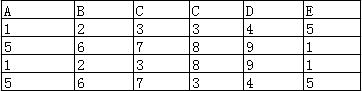

# 1.数据库基本操作

数据中的连接join分为自然连接、内连接、外连接，其中外连接又分为左外连接、右外连接、全外连接。

- 自然连接 Natural Join
- 内连接 Inner Join
- 外连接 Outer Join
    - 左外连接(也称左连接) Left-Outer-Join or Left-Join
    - 右外连接(也称右连接) Right-Outer-Join or Right-Join
    - 全外连接(也称全连接) Full-Outer-Join or Full-Join

<center></center>

## 1.1 笛卡尔积

笛卡尔积简单的说就是一个表里的记录要分别和另外一个表的所有记录匹配为一条记录。

<center><br>笛卡尔积的结果</center>

如果，表A有3条记录，表B有3条记录，经过笛卡尔运算之后就应该由3*3即9条记录。


## 1.2 等值连接

等值连接不要求相等属性值的属性名相同，只需要指定两个数据列即可。它不会消除重复属性的列。

```sql
select * from Table1 t1, Table2 t2
where t1.C = t2.D
```

<center><br>此表采用的是另一个例子，用来展示重复属性列是如何处理的</center>


## 1.3 自然连接

自然连接是一种特殊的等值连接，他要求两个关系表中进行比较的必须是相同的属性列(即属性名相同)，无需添加连接条件，并且在结果中需要==消除重复的属性列==。

```sql
select * from 表1 natural join 表2

or

select * from 表1 join 表2
```


## 1.4 内连接

内连接与等值连接比较类似，但确切来说，**等值连接是内连接的一种特殊情况**。内连接可以使用using或on来指定某两列字段的连接条件，与等值连接不同的是内连接允许使用其他连接条件(如==不等值连接==)进行连接操作，并返回满足所选条件的行。

```sql
select * from 表1 inner join 表2 on 表1.A = 表2.E
```


## 1.5 左外连接(左连接)

==注意：外连接必须用using或on指定连接条件==

左外连接是在两表进行自然连接，但是把左表要舍弃的保留在结果集中，右表对应的列填上null。

```sql
select * from 表1 left outer join 表2 on 表1.C = 表2.C
```


## 1.6 右外连接(右连接)

右外连接是在两表进行自然连接，但是把右表要舍弃的保留在结果集中，左表对应的列填上null。

```sql
select * from  表1 right outer join 表2 on 表1.C = 表2.C
```


## 1.7 全外连接(全连接)

全外连接是在两表进行自然连接的基础上，同时保留左表和右表中需要删除的结果，相对应的列上填null。

```sql
select * from 表1 full join 表2 on 表1.C = 表2.C
```


