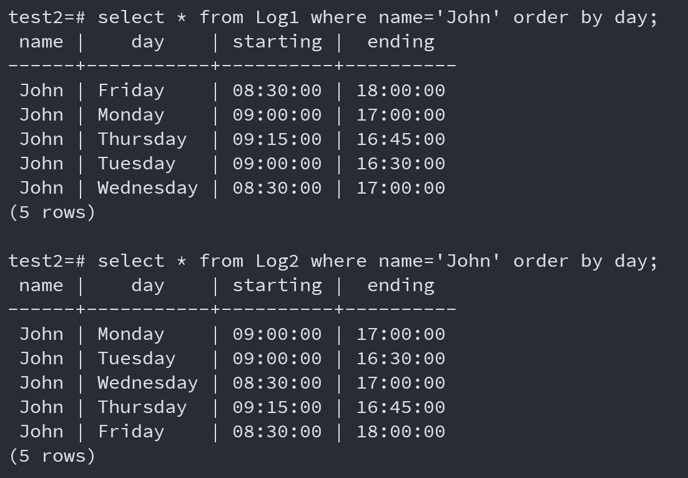

# PostgreSQL添加新的数据类型

PostgreSQL比许多其他DBMS做得更好的一件事是提供定义良好且相对易于使用的机制来添加新数据类型。 PostgreSQL的数据类型视图是标准的抽象数据类型视图。

**类型**是==值的域==以及这些值上的==运算符==的集合。 （类型=域+运算符）

此外，数据类型的值存在排序以及使用该排序的操作允许在该类型的属性上构建索引。

>   这句话的意思是，如果一个数据类型的值可以进行排序，并且这个排序逻辑能够被相关操作所利用，那么就可以在这个数据类型的属性上构建索引。
>
>   具体而言，当某个数据类型的值可以按照一定的顺序进行排列，比如从小到大或从大到小，而且这种排序可以用在操作中，比如搜索、过滤或者合并等操作，那么就可以利用这种排序属性来创建索引。通过索引，可以加速对这些属性的值进行查找、筛选或者操作，提高数据处理的效率。


## 1.数据类型介绍

#### PostgreSQL有几种不同的类型

| 数据类型                     | 介绍                                                         |
| ---------------------------- | ------------------------------------------------------------ |
| 基类型（base type）          | 通过C语言函数定义，并提供真正的新数据类型；内置类型（例如整数、日期和 varchar(n)）是基本类型；用户还可以定义新的基本类型； |
| 域（domains）                | 基于现有数据类型的受限版本的数据类型                         |
| 枚举类型（enumerated type）  | 通过枚举类型的值来定义；值被指定为字符串列表，并且根据值在列表中出现的顺序定义排序； |
| 复合类型（composite type）   | 这些本质上是元组类型；复合类型由命名字段的集合组成，其中字段可以具有不同的类型； 每当定义表时都会隐式创建复合类型，但也可以在不需要表的情况下定义复合类型 |
| 多态类型（polymorphic type） | 定义类型的类（例如anyarray），主要用于多态函数的定义；       |
| 伪类型（pseudo type）        | 系统内部使用的特殊类型（例如触发器）；多态类型也被认为是伪类型。 |


#### 多态类型的补充介绍

在PostgreSQL中，polymorphic type（多态类型）是一种特殊的数据类型，它允许在表定义或函数参数中使用一个通用的数据类型，以便接受多个不同类型的值。这样可以提高代码的灵活性和可重用性。

在定义表时，使用多态类型可以将列的数据类型设置为"polymorphic"，例如：

```sql
CREATE TABLE my_table (
  id serial,
  data "polymorphic"
);
```

上述示例中，"data" 列的数据类型被设置为 "polymorphic"，这意味着该列可以接受任何数据类型。

在定义函数时，也可以使用多态类型作为参数类型，例如：

```sql
CREATE FUNCTION my_function(value "polymorphic") RETURNS void AS $$
BEGIN
  -- 函数体
END;
$$ LANGUAGE plpgsql;
```

上述示例中，"value" 参数的数据类型被设置为 "polymorphic"，这意味着该函数可以接受任何数据类型的参数。

多态类型的主要优点是可以减少重复定义类似的表和函数，并且可以处理不同类型的数据。但需要注意的是，在使用多态类型时，需要在实际使用时进行类型检查和转换，以确保操作的正确性和安全性。


## 2.添加数据类型(以域和枚举类型为例)

> 该例子来源于[Prac Exercise 04](D:\Document\PostgreSQL\Prac Exercises\p04)

当考虑为一周中的几天定义数据类型的问题时，我们通常希望用名称来表示日期，例如：

| Monday | Tuesday | Wednesday | Thursday | Friday | Saturday | Sunday |
| ------ | ------- | --------- | -------- | ------ | -------- | ------ |

我们通常还需要某种排序来指示日期发生的顺序，也就是选择哪一天作为一周的开始。如上所述，我们假设我们从星期一开始，并且我们将使用上面的日期名称顺序。

日期名称最好在SQL中表示为字符串，因此我们需要一种可以由一组字符串表示的新类型。在PostgreSQL中有两种方法可以生成这样的类型，我们可以直接通过sql语句来实现该数据类型，如下所示：

```sql
-- domain类型
create domain Days1 as varchar(9)
	check (value in ('Monday', 'Tuesday', 'Wednesday', 
                     'Thursday', 'Friday', 'Saturday', 'Sunday'));

-- 枚举类型
create type Days2 as enum
	('Monday', 'Tuesday', 'Wednesday', 'Thursday', 'Friday', 'Saturday', 'Sunday');
```

现在定义一对相同的表，但是一个使用域，而另一个使用枚举类型

```sql
create table Log1 (name text, day Days1, starting time, ending time);
create table Log2 (name text, day Days1, starting time, ending time);
```

通过一下两个命令对上述两个表进行填充

```sql
copy Log1 (name, day, starting, ending) from '/web/cs9315/19T2/pracs/p04/LogData';
copy Log2 (name, day, starting, ending) from '/web/cs9315/19T2/pracs/p04/LogData';
```

通过select语句检查表的内容，然后运行以下两个命令：

```sql
select * from Log1 where name='John' order by day;
select * from Log2 where name='John' order by day;
```

结果如下图所示：



从上面的图中可以看到，Domain类型的数据是按照字典进行排序的，而在枚举类型中，数据是按照指定的顺序进行排列的。


## 3.添加基类型(base type)

为了添加一个新的基类型数据，用户需要提供以下内容：

- 该类型数据所需要的**输入输出函数**，通常以C语言实现
- 用于在内部表示类型值的C语言数据结构定义
- 该类型的SQL定义，给出其长度、对齐方式和 I/O 函数
- 该类型中操作符的SQL定义
- 该类型中操作符的C语言函数实现


## src/turotial/makefile解析

```makefile
%.sql: %.source
	rm -f $@; \
	C=`pwd`; \
	sed -e "s:_OBJWD_:$$C:g" < $< > $@
```

这段代码是一个makefile规则，它描述了如何根据每个`.source`文件生成对应的`.sql`文件。 

1. `%.sql: %.source ` 这一行是规则的头部，它指定了生成的目标文件以及所依赖的源文件格式。这里的`%`是一个通配符，表示任意的文件名（不包括目录部分），因此`%.sql`匹配所有的`.sql`文件，而`%.source`匹配相同文件名的`.source`文件。 
2. `rm -f $@; \ `这行使用`rm -f`命令来删除当前目标文件（`$@`表示目标文件名），`; \`是换行符的转义，表示命令在多行中。 
3. ```C=`pwd`; \ ``` 这行用于获取当前工作目录，并将其赋值给变量 `C`。这个命令使用反引号`` `来执行一个shell命令，并将其结果赋值给变量 `C`。
4. ```sed -e "s:_OBJWD_:$$C:g" < $< > $@ ``` 最后这行则使用了`sed` 命令，它从源文件(`< $<`)中读取内容，并将替换后的内容写入目标文件(`> $@`)。具体来说，它是在读取源文件中的内容时，将`_OBJWD_`替换为当前工作目录的绝对路径。

因此，整个规则的功能是：根据每个`.source`文件生成对应的`.sql`文件，其中将源文件中的`_OBJWD_`替换为当前工作目录的绝对路径。这样的操作可能是为了在生成SQL文件时，插入当前的工作目录信息。


## C-Language Functions(38.10)

用户定义的函数可以用C（或与C兼容的语言，例如C++）编写。这些函数被编译成动态可加载对象（也称为共享库）并由服务器按需加载。

动态加载功能是“C语言”函数与“内部”函数的区别——两者的实际编码约定本质上是相同的。（因此，标准内部函数库是用户定义的C函数编码示例的丰富来源。）

目前，C函数仅使用一种调用约定（版本1）。通过为函数编写PG_FUNCTION_INFO_V1() 宏调用来指示对该调用约定的支持。


### Base Types in C-Language Functions(38.10.2)

基础类型有三种传递方式，如下所示

- **值传递**，仅用于固定长度，并且长度只能为1、2、4或者8字节。
- **引用传递**，可用于固定长度，当长度大于8字节时，只能通过引用传递来进行。
- **引用传递**，对于所有的可变长度的数据类型，只能通过引用传递来进行。


### Version 1 Calling Conventions(38.10.3)

这部分给出了一个实例，并且解释了V1调用规范的必要性。


### Writing Code(38.10.4)

这部分介绍了在写C-language functions时的一些规范和注意事项。

大体包括以下几点：

- 要定义一个“magic block”，使其能够在动态加载的时候检测明显的不兼容问题。
- 使用`palloc`和==pfree？==来代替C语言中的`malloc`和`free`，使用`palloc`分配的空间会自动地释放。
- 要使用`memset`或者`palloc0`将一个数据结构的每一个字节都初始化为0
- 编写function时，通常需要包含`postgres.h`和`fmgr.h`这两个头文件。其中`postgres.h`包含了internal PostgreSQL types，`fmgr.h`包含了一些函数管理接口（例如：`PG_FUNCTION_ARGS`）.
- 注意变量名不要与内置的一些关键字或函数名冲突。


