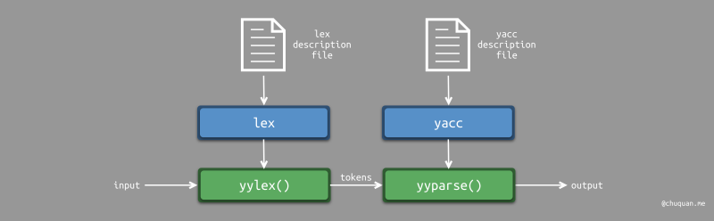

# Lex&Yacc

## 1.Lex&Yacc介绍

### 1.1 Lex&Yacc

Lex和Yacc是两个在编程语言编译器开发中常用的工具。

1. **Lex**：
    - Lex通常用于生成词法分析器（lexer）。词法分析器负责将源代码中的字符流转换为标记流（tokens），这些标记通常被用来构建语法树。Lex提供一种方式来指定==基于正则表达式的模式匹配规则==，以便识别源代码中的词法结构，如关键字、标识符、常量等。生成的词法分析器可将输入的字符流分解成标记并传递给后续的语法分析器。
2. **Yacc**（Yet Another Compiler Compiler）：
    - Yacc通常用于生成语法分析器（parser）。语法分析器负责将词法分析器生成的标记流转换为语法树，以便进行语法分析和后续的语义分析与代码生成。使用Yacc，程序员可以指定源代码的文法规则和语法结构，并定义语法分析器的行为。

通常，Lex和Yacc配合使用，将词法分析和语法分析等步骤模块化，并且提供了一种灵活且可扩展的方式来开发编程语言解析器，将源代码转换为抽象语法树和执行需要的代码分析。它们在编译器、解释器和类似工具开发中有着广泛的应用，使得开发者能够更好地处理和理解程序源代码。


### 1.2 词法分析&语法分析

词法分析（lexical analysis）和语法分析（syntax analysis）是编译过程中两个重要的阶段，它们分别负责对源代码进行词法结构和语法结构的分析，具体作用如下：

1. **词法分析**：
    - 词法分析阶段负责将源代码的字符序列解析成为有意义的词法单元（tokens），比如关键字、标识符、运算符、常量等。在这个阶段，词法分析器会根据事先定义的规则（通常使用正则表达式）对输入的字符流进行识别和转换，生成一系列词法单元。词法分析的作用是为语法分析提供符号流，并同时排除源代码中的注释、空白符等对语义没有影响的部分。
2. **语法分析**：
    - 语法分析阶段负责将词法分析生成的词法单元序列转换成为语法树（syntax tree）或者抽象语法树（abstract syntax tree，AST）。语法分析器根据语言的文法规则分析词法单元之间的关系，并根据这些关系构建分层结构，以表示源代码中语法上的结构和关联。语法分析的作用是检查语法正确性，确认代码是否符合语言的语法规则，并且为后续的语义分析和代码生成提供基础。


### 1.3 Lex和Yacc协同工作

下图为lex和yacc协同工作的示意图。



lex和yacc分别使用各自的描述文件生成词法分析器`yylex()`和语法分析器`yyparse()`。

`yyparse()`自身并不进行词法分析，而是调用`yylex()`进行词法分析。`yylex()`返回一个token号，表示token的类型。token值则存储在`yylval`变量中。

比如：token的类型为**算术运算符**，token的值为**+**。`yyparse()`则通过读取`yylex()`的返回值以及 `yylval`变量分别获取token类型和token值。

`yyparse()`函数的返回值有两种：

- 当返回值为 0 时，表示解析正确
- 当返回值为 1 时，表示解析错误


### 1.3 Lex中的语法规则

#### 1.3.1 lex源程序的一般格式

Lex文件通常由三个主要部分组成：定义部分、词法规则部分、用户代码部分。

- 定义部分：以 "%" 开头，用于定义标记、宏、正则表达式等。例如 "%{ ... %}" 用于插入C代码段。
- 词法规则部分：位于 "%%" 和 "%%" 之间的部分。其中包含了一系列正则表达式规则和对应的动作代码。这些规则描述了如何匹配输入流，并在匹配成功时执行相应的操作。
- 用户代码部分：位于 "%%" 之后的部分，可以包含用户自定义的C代码，用于实现与词法分析相关的逻辑。
- 除此以外还有一些`%top{}`可以用来把一部分代码挪到最开始的（跟 %{ %} 的作用类似？）

下面是一个简单的示例：

```c
%{
// C代码段
#include <stdio.h>
%}

%{

// 在这里可以编写一些辅助函数或全局变量的定义

int line_count = 1;

%}

%%
// 正则表达式规则和对应的动作

\n        { line_count++; }   // 匹配换行符并增加行数计数器
[a-zA-Z]+ { printf("单词: %s\n", yytext); }
.         { /* 默认动作 */ }
%%

int main() {
  // 调用词法分析器的入口函数
  yylex();
  return 0;
}
```


#### 1.3.2 定义段中的Option

**定义段包含了简单名称的声明（这些声明可以简化扫描器的说明）和开始条件。**除此之外，定义段中还包含了一些选项(options)。下面介绍一些比较常用的options：

| Option                                     | Description                                                  |
| ------------------------------------------ | ------------------------------------------------------------ |
| %option 7bit，%option 8bit                 | 指示flex生成一个7bit或8bit的扫描器与-7，-8 选项等价          |
| %option backup                             | 生成一个备份信息到lex.backup，与-b选项等价                   |
| %option caseful，%option case-sensitive    | 区分大小写，与-i相反                                         |
| %option case-insensitive，%option caseless | 忽略大小写，与-i选项等价                                     |
| %option debug                              | 让生成的扫描器运行在debug模式，与-d选项等价                  |
| %option default，%option nodefault         | %default与-s选项相反，后者与其等价。-s选项作用：使不匹配的输入回显到输出设备的rule失去作用。在此种情况下，如果扫描器不能匹配到任何规则rule的输入，它会终止并返回错误。**在查找扫描器的规则漏洞时，-s和%option nodefault都非常有用。** |
| %option interactive                        | 指示flex生成一个交互式的扫描器。交互式扫描器就是向前查看下一个匹配的token是什么。结果就是总向前多看了一个字符，即使是在扫描器已经看够了文本已经排除了token 的歧义。但向前查看给了扫描器强大的交互能力。与-I等价。 |
| %option warn                               | 用于启用词法分析器产生警告信息，与-w选项相反。%option nowarn与-w选项等价 |
| %option array                              | 与%array等价，用于启用词法分析器生成一个名为 "yytext[]" 的全局字符数组，以存储当前匹配的文本。 |
| %option pointer                            | 与%point等价,用于启用词法分析器生成一个名为 "yytext" 的字符指针，以指向当前匹配的文本。 |
| %option always-interactive                 | 指示flex生成的扫描器总是把它的输入认为是"interactive"        |
| %option main                               | 指示flex为扫描器提供一个缺省的main()函数，它只是简单的调用了yylex()。这个选项暗示noyywrap。 |
| %option never-interactive                  | flex生成的扫描器从不认为输入是交互的（不会调用isatty()）。这和always-interactive正好相反 |
| %option yylineno                           | flex生成的扫描器用全局变量yylineno 维护着输入文件的当前行编号 |
| %option yywrap                             | 用于告诉词法分析器在遇到输入流的末尾时如何处理。具体而言，当设置 "%option yywrap" 后，词法分析器会自动插入一个名为 "yywrap()" 的函数作为词法分析器的一部分。这个函数负责决定是否继续扫描输入流或者终止词法分析过程。 |


#### 1.3.3 `%x`指令

在Lex中，`%x` 指令用于声明新的词法分析状态（lexical state）。词法分析状态是用来控制词法分析器在不同上下文中的行为。通过使用 `%x` 指令，可以定义一个新的词法分析状态，并在需要时切换到该状态，以适应特定的词法分析需求。

具体而言，`%x` 的作用有以下几个方面：

1. 声明新的词法分析状态：通过 `%x` 可以声明一个新的词法分析状态，将其命名为标识符，并将其添加到词法分析器中。例如，`%x STRING` 声明了一个名为 "STRING" 的新的词法分析状态。
2. 切换词法分析状态：在词法分析过程中，可以通过调用 `BEGIN(state)` 函数切换当前的词法分析状态到指定的状态。例如，`BEGIN(STRING)` 将当前状态切换为 "STRING" 状态。
3. 定义处理特定状态的规则：在 `%x` 声明的状态下，可以使用对应的规则来处理符合该状态语义的输入。在 Lex 代码中，可以使用 `<state>` 来指定特定状态下的规则。例如，`<STRING>. { /* 在 STRING 状态下的动作 */ }` 使用了与 "STRING" 状态相关的规则。

通过这些功能，可以在处理复杂的词法分析任务时，根据不同的上下文需要定义和切换词法分析状态，并执行相应的规则。


### 1.4 Yacc语法规则

#### 1.4.1 yacc源程序的一般格式

yacc源程序一般包括三个部分：定义部分、语法规则部分、程序段部分。大体上和lex类似。定义部分可以定义基于C语言的变量与函数，后续的操作均可以引用。yacc约定使用`%{`和`%}`进行定义

下面是一个简单的示例：

```yacc
％{
定义部分 （可选）
例如：
	头文件表
	宏定义
	数据类型定义
	全局变量定义
％}

语法开始符定义
语义值类型定义
终结符定义
运算符优先级及结合性定义

%%
语法规则部分 （必选）
%%

程序段部分 (可选)
```


#### 1.4.2 语法开始符定义

上下文无关文法的开始符号是一个特殊的非终结符，所有的推导都从这个非终结符开始，

在yacc中，语法开始符定义语句是：

```
%start 非终结符
```

如果没有上面的说明，yacc自动将语法规则部分中第一条语法规则左部的非终结符作为语法开始符。

#### 1.4.3 语义值类型定义

如果没有对语义值的类型做定义，那么yacc认为它是整型（int）的。因为不同的语法符号的语义值类型可能不同，所以语义值类型说明就是将语义值的类型定义为一个联合（union），这个联合包括所有可能用到的类型。同时，在语义值类型定义部分还要求用户说明每一个语法符号（终结符和非终结符）的语义值是哪一个联合成员类型。

例：

```
％union｛
	int ival
	double dval
	INTERVAL vval;
｝

％token ＜ival＞DREG VREG
％token ＜dval＞CONST
％type  ＜dval＞dexp
％type  ＜vval＞vexp
```

在上述定义中，以％union开始的行定义了语义值的联合类型，共有三个成员类型分别取名为ival,dval, vval。

**以％token开始的行定义的是终结符**，所以DREG,VREG和CONST都是终结符，尖括号中的名字就是这些终结符的语义值的具体类型。如DREG和VREG这两个终结符的语义值将是整型（int）的，成员名是ival。

**以％type开始的行是说明非终结符语义值的类型**，如非终结符dexp的语义值将是双精度浮点类型。

请注意，在yacc中非终结符不必特别声明，但是当说明部分有对语义值类型的定义，而且某非终结符的语义值将被存取，就必须用上面的方法定义它的类型。

#### 1.4.4 终结符定义

在yacc源程序语法规则部分出现的所有终结符（文字字符literal 除外）必须在这部分定义，定义方法如下例：

```
％token DIGIT LETTER
```

每个终结符定义行以％token开头，注意％与token之间没有空格，一行中可以定义多个终结符，它们之间用空格分开，终结符名可以由字母，数字，下划线组成，但必须用字母开头。非终结符名的组成规则与此相同。终结符定义行可多于一个。

在1.4.3中说过如果用户定义了语义值的类型，那么那些具有有意义的语义值的终结符，其义值的类型要用union中的成员名来说明，除了在1.4.3中介绍的定义方法外，还可以把对终结符的定义和其语义值的类型说明分开，例如：

```
%token DREG VREG CONST
％type ＜ival＞ DREG VREG
％type ＜dval> CONST
```


#### 1.4.5 算符优先级及结合性定义

yacc允许用户规定运算符的优先级和结合性，这样就可以消除上述文法的二义性。

在说明部分中以％left开头的行就是定义算符结合性的行。％left表示其后的算符是遵循左结合的；％right表示右结合性，而％nonassoc则表示其后的算符没有结合性。优先级是隐含的，==在说明部分中，排在前面行的算符较后面行的算符的优先级低==；排在同一行的算符优先级相同。

左结合就是优先对左边的表达式加括号，例如：`a / b / c => (a / b) / c`。右结合就是优先对右边的表达式加括号，例如：`a / b / c => a / (b / c)`。

当一元运算符和二元运算符发生冲突时（如负号和减号），使用%prec子句说明它所在的语法规则中最右边的运算符或终结符的优先级与％prec后面的符号的优先级相同，注意％prec子句必须出现在某语法规则结尾处分号之前。

例：

```
expr：expr'+' expr
	|expr'-’expr
	|expr'*'expr
	|expr'／’ expr
	|'-'expr％prec'*'
	|NAME
	;
```

