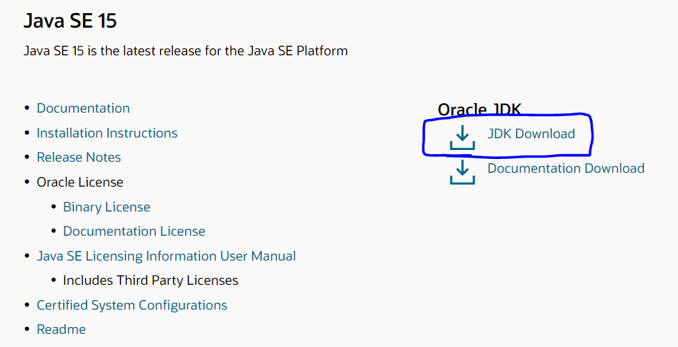
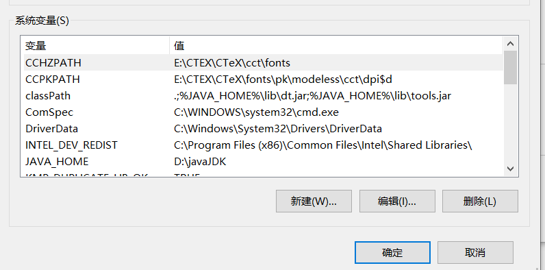
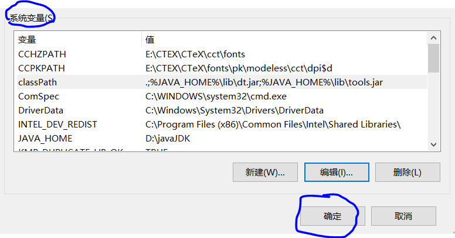
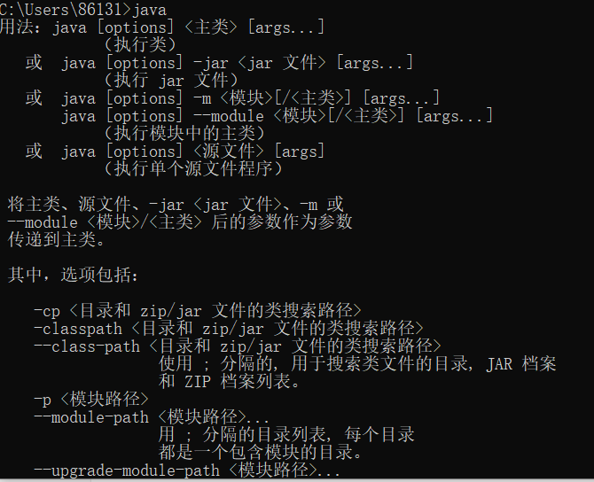

# Java环境变量配置

对于很多人来说，下载java JDK以及IDE是非常容易的，但是为系统配置Java环境变量就显得相对困难了。下面将具体介绍下载并安装JDK和配置环境变量的方法。

## 1. JDK下载

建议从Oracle（甲骨文）官网下载java JDK，因为它可以为你提供各种的Java JDK版本，可以按需下载。

下面给出相关链接：

官网链接：https://www.oracle.com/cn/index.html

下载页面链接：https://www.oracle.com/cn/java/technologies/javase-downloads.html

进入下载页面链接后

1. 选择JDK Download

    

2. 选择需要的下载文件，以windows系统为例

    

3. 下载完成后，打开，进行安装，**注意将安装位置记录一下**

    

## 2. 配置环境变量

1. JDK安装完成之后，就可以开始配置java环境了。打开文件资源管理器，鼠标右击“此电脑”，打开属性。

    

2. 选择高级系统设置

    

3. 选择“环境变量”

    

4. 在“系统变量“下，新建

    

5. 变量名填入：JAVA_HOME

    变量值填入：**你自己的JDK安装路径**

    然后点击确定。

    

6. 让后在”系统变量“中找到变量名为 `Path` 的变量，双击它。选择新建，将`%JAVA_HOME%\bin` 填入其中。确定即可。

7. 在“系统变量”中新建一个变量

    变量名：`classPath`

    变量值：`.;%JAVA_HOME%\lib\dt.jar;%JAVA_HOME%\lib\tools.jar` **（注意不要漏了前面的.）**

    点击确定。

    再点击确定。java环境就配置好了。

    

8. 我们调出cmd，输入java，如果出现以下内容则配置成功。

    

9. 如果未出现上面的结果，返回第9步，将 `%JAVA_HOME%\bin` 改为 `%JAVA_HOME%\bin;%JAVA_HOME%\jre\bin;`，再次执行第11步。