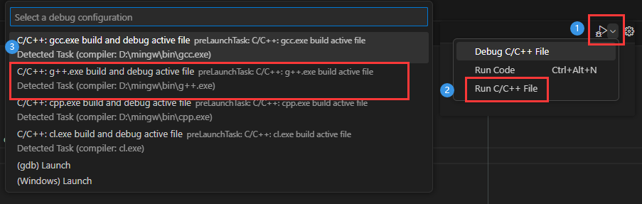
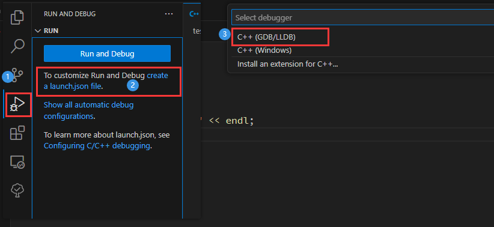
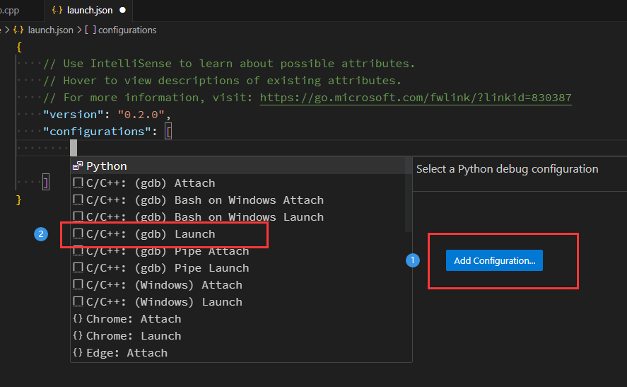
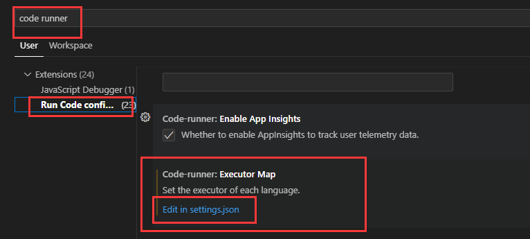
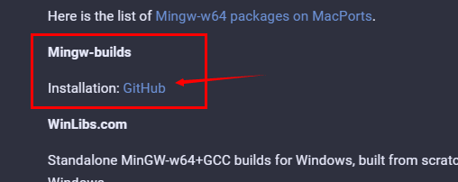
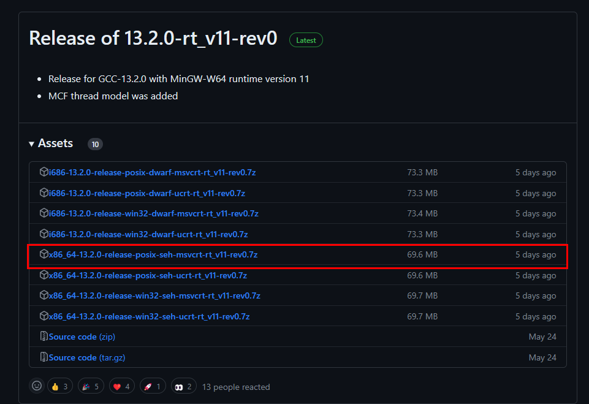

# Vscode创建c++项目

## 1.初始化并配置C++项目

**目标：**创建C++文件，并自动生成tasks.json和launch.json，能够支持单文件和多文件的编译和调试

**步骤：**

1. 创建一个空文件夹，然后选择用vscode打开

2. 在文件夹里编写一个c++文件 （也可以在里面再次创建一个存放c++源码的文件夹）

3. 然后选择g++编译运行该文件，此时会自动生成tasks.json文件

    

4. tasks.json文件在.vscode文件夹下，按需求可以自行修改

    ```json
    {
        "tasks": [
            {
                "type": "cppbuild",
                "label": "C/C++: g++.exe build active file",
                "command": "D:\\mingw\\bin\\g++.exe", // 编译器的路径
                "args": [    // 编译参数
                    "-fdiagnostics-color=always",
                    "-g",
                    // "${file}",  //需要编译的当前文件名，只能编译单文件
    ---->           "${fileDirname}\\*.c*", //将文件夹下的所有.c*文件都编译，用于多文件编译
                    "-o",  //对象名，不进行编译优化
                    "${fileDirname}\\${fileBasenameNoExtension}.exe", //生成的可执行文件存放路径及名字
                    // "-std=c++17",  //使用c++17标准编译
                    // "-std=c++2a",  //使用c++20标准编译
                    // "-fexec-charset=GBK" //如果出现乱码的情况，可以加上这一句
                ],
                "options": {
                    "cwd": "${fileDirname}" //当前工作目录
                },
                "problemMatcher": [
                    "$gcc"
                ],
                "group": {
                    "kind": "build",
                    "isDefault": true
                },
                "detail": "Task generated by Debugger."
            }
        ],
        "version": "2.0.0"
    }
    ```

5. 创建launch.json文件用于调试

    

    

6. launch.json文件在.vscode文件夹下，==有几处需要自行修改==

    ```json
    {
        // Use IntelliSense to learn about possible attributes.
        // Hover to view descriptions of existing attributes.
        // For more information, visit: https://go.microsoft.com/fwlink/?linkid=830387
        "version": "0.2.0",
        "configurations": [
            {
                "name": "(gdb) Launch",
                "type": "cppdbg",
                "request": "launch",
                "program": "${fileDirname}\\${fileBasenameNoExtension}.exe", //这一处需要修改，修改成需要调试的文件的路径
                "args": [],
                "stopAtEntry": false,
                "cwd": "${fileDirname}",
                "environment": [],
                "externalConsole": false,
                "MIMode": "gdb",
                "miDebuggerPath": "D:\\mingw\\bin\\gdb.exe", //这一处需要修改，就修改成这个路径
                "setupCommands": [
                    {
                        "description": "Enable pretty-printing for gdb",
                        "text": "-enable-pretty-printing",
                        "ignoreFailures": true
                    },
                    {
                        "description": "Set Disassembly Flavor to Intel",
                        "text": "-gdb-set disassembly-flavor intel",
                        "ignoreFailures": true
                    }
                ]
            }
        ]
    }
    ```

7. 根据以上配置，基本就可以实现一个c++项目的创建了。


**补充：** 如果我们使用Code Runner来运行多文件，需要对它的编译命令进行修改



```json
// "c": "cd $dir && gcc $fileName -o $fileNameWithoutExt && $dir$fileNameWithoutExt", //单文件
"c": "cd $dir && gcc *.c* -o $fileNameWithoutExt && $dir$fileNameWithoutExt", //多文件
// "cpp": "cd $dir && g++ $fileName -o $fileNameWithoutExt && $dir$fileNameWithoutExt",
"cpp": "cd $dir && g++ *.c* -o $fileNameWithoutExt && $dir$fileNameWithoutExt",
// "cpp": "cd $dir && g++ -std=c++2a *.c* -o $fileNameWithoutExt && $dir$fileNameWithoutExt",
// 使用c++20标准编译，暂不支持23

// 如果出现乱码情况，可以添加如下配置
"c": "cd $dir && gcc *.c* -o $fileNameWithoutExt -fexec-charset=GBK && $dir$fileNameWithoutExt",
"cpp": "cd $dir && g++ *.c* -o $fileNameWithoutExt -fexec-charset=GBK && $dir$fileNameWithoutExt",
```


## 2.进阶：配置C++项目

### 2.1 根据项目结构配置tasks.json

```txt
|---include
|	   |---*.h
|---src
|    |---baseline
|          |---*.c
|    |---bean
|          |---*.c
|	 |---util
|          |---*.c
|---main.cpp
```

#### 2.1.1 修改tasks.json

tasks.json文件的配置，主要体现在对`args`部分的修改：

```json
{
    "tasks": [
        {
            "type": "cppbuild",
            "label": "C/C++: g++.exe build active file",
            "command": "D:\\Software\\mingw64\\bin\\g++.exe",
            // "command": "D:\\MinGW\\bin\\g++.exe",
            "args": [
                "-fdiagnostics-color=always",
                "-g",
                "${workspaceFolder}\\*.c*",
                "${workspaceFolder}\\src\\util\\*.c*",
                "${workspaceFolder}\\src\\bean\\*.c*",
                "${workspaceFolder}\\src\\baseline\\*.c*",
                "-I",
                "${workspaceFolder}\\include",
                "-o",
                "${workspaceFolder}\\main.exe",
                "-std=c++2a",
            ],
            "options": {
                "cwd": "${workspaceFolder}"
            },
            "problemMatcher": [
                "$gcc"
            ],
            "group": {
                "kind": "build",
                "isDefault": true
            },
            "detail": "Task generated by Debugger."
        }
}
```

#### 2.1.2 修改c_cpp_properties.json

c_cpp_properties.json主要用来设置包含**头文件的路径**，设置C/C++支持的**版本号**等等。

如果我们将头文件统一放在了include文件夹下，为了避免在写代码时报一些找不到头文件的错误(这可能并不会影响编译运行，只是在代码提示上有些问题)，我们需要修改该文件。如果没有该文件，可以`ctrl+shift+p`输入`C/C++:Edit Configurations(JSON)`，让其自动生成。

```c++
{
    "configurations": [
        {
            "name": "Win32",
            "includePath": [
                "${workspaceFolder}/**",
                "${workspaceFolder}/include" // 加上该文件夹
            ],
            "defines": [
                "_DEBUG",
                "UNICODE",
                "_UNICODE"
            ],
            "intelliSenseMode": "windows-gcc-x64"
        }
    ],
    "version": 4
}
```


### 2.2 编译运行带参数的项目

#### 2.2.1 方法介绍

在 `tasks.json` 中定义编译和运行任务。以下是一个例子：

```json
{
    "version": "2.0.0",
    "tasks": [
        {
            "label": "build",
            "type": "shell",
            "command": "g++",
            "args": [
                "-g",
                "${file}",
                "-o",
                "${fileDirname}/${fileBasenameNoExtension}"
            ],
            "group": {
                "kind": "build",
                "isDefault": true
            }
        },
        {
            "label": "run_with_args",
            "type": "shell",
            "command": "./${fileBasenameNoExtension}",
            "options": {
                "cwd": "${fileDirname}"
            },
            "args": ["arg1", "arg2"],
            "group": "test",
            "dependsOn": "build" // 这里说明该任务依赖于"label"="build"的任务，
            					 // 因此会先执行build，再执行该任务。
        }
    ]
}
```

在这样的配置中，我们定义了两个任务：
- `build` 用于编译C++程序。
- `run_with_args` 用于运行已编译的程序，并传递参数 "arg1" 和 "arg2"。

3. 保存 `tasks.json` 文件。

4. 打开你的C++源代码文件，并按下 `Ctrl+Shift+B`（或者选择 "Terminal" -> "Run Build Task"），选择 "build" 任务来编译你的程序。

5. 编译完成后，可以按下 `Ctrl+Shift+B` 再次，并选择 "run_with_args" 任务来运行你的程序，并且传递参数。

希望这个步骤可以帮助你成功在VSCode中编译并运行带参数的C++程序！如果有其他问题，欢迎随时向我提问！

#### 2.2.2 案例

```c++
{
    "tasks": [
        {
            "type": "cppbuild",
            "label": "C/C++: g++.exe build active file",
            "command": "D:\\Software\\mingw64\\bin\\g++.exe",
            // "command": "D:\\MinGW\\bin\\g++.exe",
            "args": [
                "-fdiagnostics-color=always",
                "-g",
                "${workspaceFolder}\\*.c*",
                "${workspaceFolder}\\src\\util\\*.c*",
                "${workspaceFolder}\\src\\bean\\*.c*",
                "${workspaceFolder}\\src\\baseline\\*.c*",
                "-I",
                "${workspaceFolder}\\include",
                "-o",
                "${workspaceFolder}\\main.exe",
                "-std=c++2a",
            ],
            "options": {
                "cwd": "${workspaceFolder}"
            },
            "problemMatcher": [
                "$gcc"
            ],
            "group": {
                "kind": "build",
                "isDefault": true
            },
            "detail": "Task generated by Debugger."
        },
        // 主要是下面这一部分代码
        {
            "label": "run_with_args",
            "type": "process",
            "command": "${workspaceFolder}\\main.exe",
            "options": {
                "cwd": "${workspaceFolder}"
            },
            "args": [
                "./data/Case_Product/",
                "0.75",
                "3",
                "1",
                "0 0 1 2 2 3 1 1 0",
                "homoGraph.txt",
                "2"
            ],
            "group": "test",
            "dependsOn": "C/C++: g++.exe build active file",
        }
    ],
    "version": "2.0.0"
}
```


## 补充1：MinGW下载

如何下载最新版本的MinGW

**网址：**[Downloads - MinGW-w64](https://www.mingw-w64.org/downloads/)






## 补充2：launch.json tasks.json c_cpp_properties.json 解析

### **1. tasks.json**

```json
{
    "version": "2.0.0",
    "tasks": [
        {
            "type": "cppbuild",        //任务类型（如果是shell，下面的command就相当于执行shell命令）
            "label": "环境配置测试",     //任务的名称，可以修改，但一定要和launch中的"preLaunchTask"项保持一致
            "command": "/usr/bin/gcc", //编译器（可执行文件）的路径
            "args": [                  //（常用）编译时使用的参数，和命令行下相同
                "-g",
                "${fileDirname}/hello.c",
                "-o",
                "${fileDirname}/hello"
            ],
            //上述内容相当于在命令行下输入了: gcc hello.c -o hello
            "options": {
                "cwd": "/usr/bin"     //编译器的当前工作目录
            },
            "problemMatcher": [
                "$gcc"                //使用gcc捕捉错误
            ],
            "group": "build",         //定义任务属于哪个组。在示例中，它属于测试组。属于测试组的任务可以通
            						  //过从命令面板运行运行测试任务来执行。
            "detail": "compiler: /usr/bin/gcc"      //一些描述性信息
        }
    ]
}
```

 也可以参考 **[Integrate with External Tools via Tasks 官方文档](https://code.visualstudio.com/docs/editor/tasks)** 文档进一步了解


### 2. launch.json

```json
{
    "version": "0.2.0",
    "configurations": [
        {
            "name": "运行和调试",         //运行和调试任务的名称，可自定义
            "type": "cppdbg",            //配置类型，默认即可
            "request": "launch",         //launch模式允许我们打断点进行调试，默认即可
            "program": "${fileDirname}/hello", //（常用）程序目录，这里相当于在命令行执行"hello"
            "args": [],                  //（常用）程序(main函数)的入口参数
            "stopAtEntry": false,       //在入口处暂停，选true相当于在入口处增加断点
            "cwd": "${workspaceFolder}",//当前的文件目录
            "environment": [],          //添加到程序的环境变量
            "externalConsole": false,   //外部控制台，true在调试时会开启系统控制台窗口，false会使用vscode自带的调试控制台
            "MIMode": "gdb",            //使用gdb进行调试
            "setupCommands": [           //用来设置gdb的参数，默认即可
                {
                    "description": "为 gdb 启用整齐打印",
                    "text": "-enable-pretty-printing",
                    "ignoreFailures": true
                }
            ],
            "preLaunchTask": "环境配置测试",    //（常用）运行和调试前要执行的task(编译)任务，任务名要和task.json里的"label"对应
            "miDebuggerPath": "/usr/bin/gdb"  //debug调试工具的路径，这里使用gdb所在的路径
        }
    ]
}
```

也可以参考 **[Configuring C/C++ debugging官方文档](https://code.visualstudio.com/docs/cpp/launch-json-reference)** 和 **[Debugging in VS Code官方文档](https://code.visualstudio.com/docs/editor/debugging#_global-launch-configuration)** 进行设置


### 3. c_cpp_properties.json

```json
{
    "configurations": [
        {
            "name": "Linux",    　　　　//配置名称，默认为系统名，可以自行更改
            "includePath": [    　　　　//（常用）运行项目包含.h头文件的目录，
                "${workspaceFolder}/**"//此处会匹配工作文件下的所有文件
            ],                  　　　　//添加"compilerPath"后,系统include路径可不写明
            "defines": [],　　　　　　　 //（常用）定义一些需要的变量，等价于在编译时写"-D变量" 
            "compilerPath": "/usr/bin/gcc",     //编译器的路径
            "cStandard": "gnu17",               //C标准的版本
            "cppStandard": "gnu++14",           //C++标准的版本
            "intelliSenseMode": "gcc-x64"       //IntelliSense的一些配置，默认即可
        }
    ],
    "version": 4
}
```

也可参考 **[c_cpp_properties.json 官方文档](https://code.visualstudio.com/docs/cpp/c-cpp-properties-schema-reference)** 设置更多内容。

如果我们在使用vscode引入头文件时，如果没有提示，可以在settings.json中配置以下选项：

```json
  "C_Cpp.default.includePath": [
    "${workspaceFolder}/**",
    "D:\\MinGW\\lib\\gcc\\x86_64-w64-mingw32\\13.2.0\\include\\c++",
  ],
```

