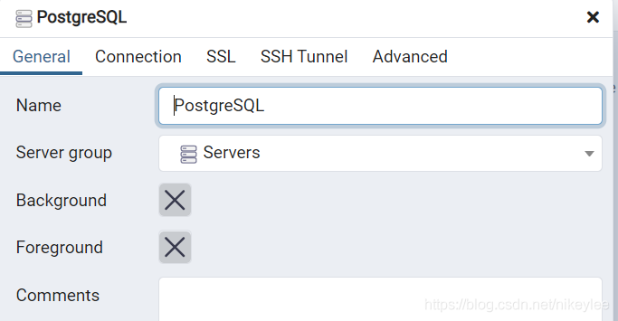

# PostgreSQL的安装与启用

## 1. 安装

**网址：** [Community DL Page (enterprisedb.com)](https://www.enterprisedb.com/downloads/postgres-postgresql-downloads)

选择15.4版本(截至2023.9.6)，有一个16.RC1版本，我尝试安装过，但是缺少一些组件（可能有一些问题，所以不选择安装）。

下载完成后，双击下载安装包，开始安装


你可以修改安装路径


选择安装组件，不懂的选就是全部勾上：


设置数据库路径


设置超级用户的密码，随便设置，我选择root


设置端口号，可以直接用默认就行


直接点 Next


点 Next


去掉勾选，直接点 Finish


至此，安装过程完成。


## 2. 启用

### 2.1 存在的问题


打开SQL Shell(psql)，一路回车


可能会出现以下问题，这是因为我们虽然安装完软件，但是并没有注册服务器，因此就无法连接。

```txt
psql: 无法联接到服务器: Connection refused (0x0000274D/10061)
        服务器是否在主机 "localhost"(::1) 上运行并且准备接受在端口
5432 上的 TCP/IP 联接?
无法联接到服务器: Connection refused (0x0000274D/10061)
        服务器是否在主机 "localhost"(127.0.0.1) 上运行并且准备接受在端口
5432 上的 TCP/IP 联接?
```


### 2.2 问题解决

1. 以==管理员身份==在`PostgreSQL\bin\`目录下打开Terminal(或CMD)

2. 运行以下命令

    `pg_ctl.exe register -N "postgresql-x64-15" -D "D:/PostgreSQL/data"`

    其中`postgresql-x64-15`是新注册的服务名称，也可以自己起

    `D:/PostgreSQL/data`表示服务器数据的保存位置，一定要在PostgreSQL的data目录下

3. `win + R`输入`services.msc`打开服务，找到服务器`postgresql-x64-15`，右键，启动

4. 完成

5. 再次打开SQL Shell(psql)一路回车，输入密码就可以连接了。


## 3. 使用可视化工具pgAdmin操作PostgreSQL数据库

#### 3.0 存在的问题

如果按照以上方式进行安装，会自动安装pgAdmin，但是在使用时我会报一个错误：`pgadmin4 : postgresql application server could not be contacted`，尝试了一些方式，无法解决。

我选择的解决方式是从pgadmin4官网重新下载该软件：[Download (pgadmin.org)](https://www.pgadmin.org/download/pgadmin-4-windows/)

然后将`PostgreSQL\pgAdmin4`文件夹删除

重新安装之后应该就可以运行了。（如果不行，请尝试将`PostgreSQL\bin`添加到环境变量）

#### 3.1 在PostgreSQL 13开始菜单，点击pgAdimin


#### 3.2 输入配置的密码root


#### 3.3 第一次登录，使用超级用户postgres进行登录




登录成功截图：


#### 3.4 创建新的登录和连接的用户


输入用户名和密码


设置为可以登录


创建成功后截图：sonar用户创建成功


4）创建一个新的数据库


输入数据库名称sonarqube，选择可登录的用户为sonar


sonarqube数据库创建成功，表存放在默认的public的Schemas下面

