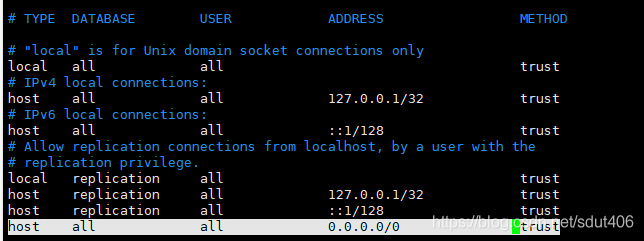
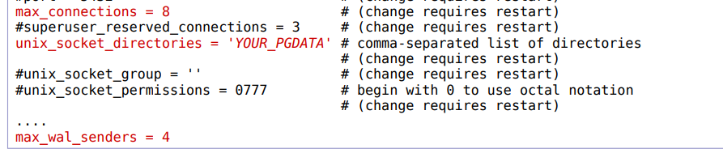

[TOC]


## 1. 下载源文件

地址：[PostgreSQL: File Browser](https://www.postgresql.org/ftp/source/)

选择一个你喜欢的版本进行（我用的是v15.4）.


## 2. 安装MSYS2

官网：[MSYS2](https://www.msys2.org/)

选择.exe可执行文件下载，并安装即可


下面两篇教程可作了解，不必需。

[从MSYS2访问Windows目录_msys2 目录_bcbobo21cn的博客-CSDN博客](https://blog.csdn.net/bcbobo21cn/article/details/129339185)

[把MSYS2终端放在Windows Terminal中_msys2 terminal_chenxizhan1995的博客-CSDN博客](https://blog.csdn.net/chenxizhan1995/article/details/109609823)


## 3. MSYS2镜像配置

国内如果直接通过msys2默认的源更新会相当慢，因此有必要配置一下国内镜像以加速下载.

进入 `C:\msys64\etc\pacman.d` ， 下面有3个文件：

```ini
mirrorlist.mingw32
mirrorlist.mingw64
mirrorlist.msys
```

分别编辑其内容，在原文件的第一个Server=前一行插入中国镜像配置，结果如下：

mirrorlist.mingw32 内容如下：

```ini
##
## 32-bit Mingw-w64 repository mirrorlist
##

## Primary
## 清华大学软件镜像
Server = https://mirrors.tuna.tsinghua.edu.cn/msys2/mingw/i686/
## 中科大镜像
Server = http://mirrors.ustc.edu.cn/msys2/mingw/i686/
## msys2.org
Server = http://repo.msys2.org/mingw/i686/
Server = https://sourceforge.net/projects/msys2/files/REPOS/MINGW/i686/
Server = https://www2.futureware.at/~nickoe/msys2-mirror/mingw/i686/
Server = https://mirror.yandex.ru/mirrors/msys2/mingw/i686/
Server = https://mirrors.tuna.tsinghua.edu.cn/msys2/mingw/i686
Server = http://mirrors.ustc.edu.cn/msys2/mingw/i686
Server = http://mirror.bit.edu.cn/msys2/REPOS/MINGW/i686
```

mirrorlist.mingw64 内容如下：

```ini
##
## 64-bit Mingw-w64 repository mirrorlist
##

## Primary
## 清华大学软件镜像
Server = https://mirrors.tuna.tsinghua.edu.cn/msys2/mingw/x86_64/
## 中科大镜像
Server = http://mirrors.ustc.edu.cn/msys2/mingw/x86_64/
## msys2.org
Server = http://repo.msys2.org/mingw/x86_64/
Server = https://sourceforge.net/projects/msys2/files/REPOS/MINGW/x86_64/
Server = https://www2.futureware.at/~nickoe/msys2-mirror/mingw/x86_64/
Server = https://mirror.yandex.ru/mirrors/msys2/mingw/x86_64/
Server = https://mirrors.tuna.tsinghua.edu.cn/msys2/mingw/x86_64
Server = http://mirrors.ustc.edu.cn/msys2/mingw/x86_64
Server = http://mirror.bit.edu.cn/msys2/REPOS/MINGW/x86_64
```

mirrorlist.msys 内容如下：

```ini
##
## MSYS2 repository mirrorlist
##

## Primary
## 清华大学软件镜像
Server = https://mirrors.tuna.tsinghua.edu.cn/msys2/msys/$arch
## 中科大镜像
Server = http://mirrors.ustc.edu.cn/msys2/msys/$arch
## msys2.org
Server = http://repo.msys2.org/msys/$arch/
Server = https://sourceforge.net/projects/msys2/files/REPOS/MSYS2/$arch/
Server = https://www2.futureware.at/~nickoe/msys2-mirror/msys/$arch/
Server = https://mirror.yandex.ru/mirrors/msys2/msys/$arch/
Server = https://mirrors.tuna.tsinghua.edu.cn/msys2/mingw/$arch/
Server = http://mirrors.ustc.edu.cn/msys2/msys/$arch
Server = http://mirror.bit.edu.cn/msys2/REPOS/MSYS2/$arch
```

安装完, 修改好镜像之后，更新一下软件：

```shell
pacman -Syu
```


## 4. 安装MinGW toolchain

若您在MSYS2环境中想要安装MinGW，请按照以下步骤进行：

1. 打开MSYS2终端：在开始菜单或MSYS2安装目录中找到"Mingw-w64 Win64 Shell"（如果您的操作系统是64位）或"Mingw-w64 Win32 Shell"（如果您的操作系统是32位），然后双击打开终端。

2. 在终端中运行更新命令：运行以下命令来确保系统包管理器pacman的软件包数据库和依赖项是最新的：

    ```bash
    pacman -Syu
    ```

    这个命令将更新MSYS2的软件包管理器和现有的软件包。

3. 安装MinGW工具链：运行以下命令来安装MinGW的64位或32位版本，具体取决于您的操作系统和需求：

    对于64位系统：

    ```bash
    pacman -S mingw-w64-x86_64-toolchain
    ```

    对于32位系统：

    ```bash
    pacman -S mingw-w64-i686-toolchain
    ```

    上述命令将自动安装MinGW工具链及其相关组件，包括GCC编译器等。

4. 安装其他MinGW软件包（可选）：如果您需要其他MinGW软件包，可以使用类似以下命令进行安装：

    对于64位系统：

    ```bash
    pacman -S mingw-w64-x86_64-<package_name>
    ```

    对于32位系统：

    ```bash
    pacman -S mingw-w64-i686-<package_name>
    ```

    将`<package_name>`替换为您想要安装的特定软件包的名称。例如，如果要安装SDL库，可以使用`mingw-w64-x86_64-SDL`（64位系统）或`mingw-w64-i686-SDL`（32位系统）。

5. 完成安装后，您可以使用MinGW工具链编译和运行C/C++代码了。在MSYS2终端中，可以通过运行`gcc`或`g++`命令来调用GCC编译器。


## 5. 开始编译

1. 打开MSYS2下的mingw64.exe程序，一定要用该程序进行编译，不要用msys2.exe进行，否则完成不了。

2. 进入到存放压缩包的那个文件夹下，通过以下命令进行解压

    ```bash
    tar xfj /web/cs9315/19T2/postgresql/postgresql-11.3.tar.bz2
    # 解释
    # tar xfj 命令用于解压缩 .tar.bz2 或 .tbz2 格式的文件。具体用途如下：
    # tar: 它是一个用于归档和解归档文件的命令行工具。
    # x: 表示解压缩，将文件从归档中提取出来。
    # f: 表示指定要解压缩的归档文件。
    # j: 表示使用 bzip2 压缩算法解压缩。.tar.bz2 或 .tbz2 文件是使用 bzip2 算法压缩的文件格式。
    # 后面剩下的就是要解压的压缩包
    ```

3. 进入到解压完的文件夹下，配置软件的安装选项

    ```bash
    cd postgresql-15.4
    ./configure --prefix=/srvr/YOU/pgsql
    # 命令用于配置软件的安装选项，其中 --prefix 参数指定了软件安装的目标路径，可以自行更改。
    
    # 命令执行完毕之后，进行如下配置
    edit src/backend/storage/ipc/latch.c
    # edit表示编辑后面的文件，注意edit并不是一个命令，需要替换成vim等编辑命令才可以，如果没有vim，也可以找到该文件用记事本打开修改。
    #... and fix an annoying Grieg glitch ...
    #... search for "epoll_create1" ...
    #... on the line above "#if defined(WAIT_USE_EPOLL)" ...
    #... add "#undef EPOLL_CLOEXEC" ...
    ```

4. 编译，安装

    ```bash
    make
    make install
    ```

    补充：如果显示找不到make命令，请在mingw64/bin目录下找到mingw32-make.exe文件，将其复制一份，并重命名为make.exe即可。

5. 配置环境变量

    将`/pgsql/bin`目录的绝对路径添加到系统环境变量Path中。


## 6. 安装完成之后

1. 生成数据库文件
    `mkdir /home/pgsql/data`

2. 数据库初始化
    `/home/pgsql/bin/initdb -D /home/pgsql/data`

    如果配置好环境变量可以直接使用`initdb`命令，不必写完整路径

    这种初始化默认是trust模式，超级账户的密码为空，当然你也可以等初始化完数据库，后面在修改密码，但是如果想在初始化的时候就设置好密码，并修改pg_hba的校验方式，可以使用
    `initdb -A scram-sha-256 --pwfile /opt/pwd.txt`
    -A设置校验方式，–pwfile 指定密码文件，注意密码文件第一行写密码

    执行成功会出现

    ```txt
    Success. You can now start the database server using:
    /home/pgsql/bin/pg_ctl -D /home/pgsql/data -l logfile start
    ```

3. 配置数据库允许访问的IP，设置监听地址和端口
    `vim /home/pgsql/data/pg_hba.conf`
    追加一条记录：
    `host all all 0.0.0.0/0 trust`
    这表示所有数据库的所有用户都可以无密码登录，至于怎么设置这个权限问题，自己设计即可。
    
    在配置一下监听地址和端口，执行`vim /usr/local/postgresql/data/postgresql.conf`
    `listen_addresses = '*'`
    `port = 5432`
    表示端口5432，监听所有地址

4. 然后将下图标红的地方按要求进行修改，YOUR_PGDATA是你的data文件夹的绝对路径，然后就可以启动数据库了，`unix_socket_directories`是否要修改有待考证。

    

5. 启动数据库服务
    `/home/pgsql/bin/pg_ctl -D /home/pgsql/data -l logfile start` 就可以了

    补充，关闭数据库：`pg_ctl -D /home/pgsql/data stop`

6. 进入数据库

    ```bash
    psql <数据库名>
    ```

    

## 7. 一些报错的处理

### 7.1 连接服务器失败

出现 "psql: error: connection to server at "localhost" (::1), port 5432 failed: FATAL: database "84097" does not exist" 的错误消息表示连接到 PostgreSQL 服务器失败，因为指定的数据库 "84097" 不存在。以下是解决此问题的几个步骤：

1. 检查数据库名称：确保您输入的数据库名称是正确的。验证数据库的存在，可以使用以下命令连接到 PostgreSQL 服务器：

    ```bash
    psql -h localhost -p 5432 -U <username> -l
    ```

    将 `<username>` 替换为您的 PostgreSQL 用户名。此命令将列出服务器上所有可访问的数据库。确认您要连接的数据库在列表中。

2. 检查 PostgreSQL 服务是否运行：确保 PostgreSQL 服务器正在运行。您可以在终端或命令提示符中运行以下命令检查服务状态(==这个在windows下，需要一些东西，不太好用==)：

    ```bash
    systemctl status postgresql
    ```

    或者

    ```bash
    service postgresql status
    ```

    如果 PostgreSQL 服务未运行，您可以尝试启动它：

    ```bash
    systemctl start postgresql
    ```

    或者

    ```bash
    service postgresql start
    ```

3. 创建数据库（如果需要）：如果上述步骤确认不存在指定的数据库，您可以使用以下命令在 PostgreSQL 服务器上创建该数据库：

    ```bash
    createdb -h localhost -p 5432 -U <username> <database>
    ```

    将 `<username>` 替换为您的 PostgreSQL 用户名，将 `<database>` 替换为要创建的数据库名称。确保使用具有适当权限的用户执行此命令。

4. 检查连接参数：确保您在连接时使用正确的主机、端口、用户名和密码。如果 PostgreSQL 服务器在非默认主机和端口上运行，或者需要进行身份验证，请相应地调整连接参数。


### 7.2 缺少zlib1.dll

如果我们下载的是最新版的MinGW，在bin目录下面可能会缺少一个zlib1.dll文件，导致pg_ctl命令无法启动服务。(但是如果用的是MSYS2下的mingw64.exe执行命令就没有这个问题，因为这里用的是另一个mingw64目录，它下面有zlib1.dll，我们可以将这个dll复制到最新版的MinGW的bin目录下面。)

==可能的原因：==

zlib1.dll<u>可能</u>是在编译时自动生成的，由于我当时编译的时候是在MSYS2的mingw64.exe中执行命令的，所以它会把自动生成的zlib1.dll文件放在`MSYS2/mingw64/bin`目录下，因此就导致我们自己的MinGW中没有这个文件。


## 8. 命令总结

| 命令                                                     | 说明                                                         |
| -------------------------------------------------------- | ------------------------------------------------------------ |
| `pg_ctl start -D .\data\ -l .\logfile`                   | 启动服务                                                     |
| `pg_ctl stop -D .\data\`                                 | 关闭服务                                                     |
| `createdb -h localhost -p 5432 -U <username> <database>` | 创建数据库，也可以简写为`createdb <database>`，创建的数据库存放在`data/base`下 |
| `psql -d beer -f beer.dump`                              | 从beer.dump备份文件中加载数据到beer数据库                    |
| `psql <database>`                                        | 进入数据库                                                   |
| `dropdb beer`                                            | 删除数据库                                                   |
| `\i /pathA/xxx.sql`                                      | 执行sql文件                                                  |
| `psql -l`                                                | 列出所有的数据库                                             |


### psql基本命令

| 命令                 | 说明                     |
| -------------------- | ------------------------ |
| `\q`or`\quit`        | 退出                     |
| `\l`                 | 显示所有的数据库         |
| `\dt`                | 显示当前数据库中的所有表 |
| `\d table_name`      | 显示table_name表的表结构 |
| `\c database_name`   | 切换到指定数据库         |
| `\du`                | 显示所有的用户           |
| `drop User username` | 删除用户                 |

