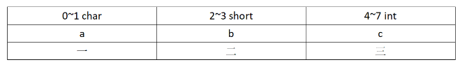

# 什么是字节对齐，为什么要进行字节对齐

## 1. 什么是字节对齐？

计算机的内存空间是按照字节进行划分的，理论上任何类型的变量可以存放在任意一个位置上，但是实际上计算机对变量的存储地址是有限制的，因为计算机读取数据时并不是逐字节读取的，而是按照2、4、8等字节成块读取的。这就要求变量的首地址是某个数k(通常是4或8)的倍数，这就是所谓的==字节对齐==。

也就是说，每个类型的变量必须按照规则排放(首地址有限制)，而不能一个接一个排放，这就是字节对齐。


## 2. 为什么要进行字节对齐？

各个硬件平台对存储空间的处理上有很大的不同。一些平台对某些特定类型的数据只能==从某些特定地址开始存取==。比如有些架构的CPU在访问一个没有进行对齐的变量的时候会发生错误,那么在这种架构下编程必须保证字节对齐.其他平台可能没有这种情况，但是最常见的是如果不按照适合其平台要求对数据存放进行对齐，会在==存取效率上带来损失==。比如有些平台每次读都是从偶地址开始，如果一个int型（假设为32位系统）如果存放在偶地址开始的地方，那么一个读周期就可以读出这32bit，而如果存放在奇地址开始的地方，就需要2个读周期，并对两次读出的结果的高低字节进行拼凑才能得到该32bit数据。显然在读取效率上下降很多。

**补充：**对于一个数据总线宽度为32位的cpu，它一次拥有取出4字节数据的能力。64位cpu，一次可以读取8字节数据的能力。

----

**例如：**在结构体中进行字节对齐，读取数据时按照其中的最大基本类型的字节数进行读取，就可以保证每一次都能读取到完整的数据。如果在结构体中不进行字节对齐的话，访问一个较长类型的数据就可能需要多次读取，然后组装，这样就会很慢。因此，字节对齐的出发点是充分考虑计算机处理数据时的特性，提高数据访问效率。

> The CPU accesses memory by a single [memory word](https://en.wikipedia.org/wiki/Memory_word) at a time. As long as the memory word size is at least as large as the largest primitive data typesupported by the computer, aligned accesses will always access a single memory word. This may not be true for misaligned data accesses.-----Wikipedia


## 3. 字节对齐有什么作用？

字节对齐的作用不仅是便于cpu快速访问，同时合理的利用字节对齐可以有效地节省存储空间


## 4. 如何进行字节对齐？

**字节对齐的规则**

- 规则一：结构体变量的首地址能够被字节对齐的大小整除(gcc 缺省字节对齐大小是4)。
- 规则二：结构体的每个成员相对首地址的偏移是成员类型大小的整数倍。（成员自身对齐）
- 规则三：结构体变量的总大小是结构体里最大的成员的整数倍。(结构体本身对齐)


**示例：**



计算字节大小可以==不关心规则一==，可以被忽略。看规则二，第二个成员b的偏移是2是short大小(2)的整数倍,第三个成员c的偏移量是4是int的大小的整数倍。看规则三，总的大小是8字节，是int大小的整数倍，c成员后面不需要填内容。


看规则二，第二个成员b的偏移是2不是int大小(4)的整数倍,成员a后面补2个字节才能被4整除，第三个成员c的偏移量是8是char的大小的整数倍。看规则三，总的大小是10字节，不是是int大小(4)的整数倍，成员c补上内容(2)，直到能被4整除，所以总大小是12个字节。


## 5. 人工干预字节对齐

### 1. 使用`#prama park(n)`伪指令

该指令会同时对规则二和规则三进行干预，使得==成员自身对齐和结构体本身对齐大小不能大于n，只能小于n==

```c
作者：小昭debug
链接：https://www.zhihu.com/question/23791224/answer/2422363788
来源：知乎
著作权归作者所有。商业转载请联系作者获得授权，非商业转载请注明出处。

#include <stdio.h>
#include <stdlib.h>
#include <stdint.h>

#define debug_printf(value) printf(#value " ---==> %d\n", value)
#define struct_member_offset(struct, member) (((char *)(&(((struct *)0)->member))) - ((char *)0))

#pragma pack(4)  //4字节对齐开始 对齐大小只能比4小，不能大
typedef struct
{
  uint32_t b;    // 32位无符号整数
  /* double 8字节对齐，这里正常是要补4字节内容，
     但是编译器这里规定最多只能4个字节对齐，
     如果是short就按2个字节对齐，只能小不能大 */
  double   f;
} test_t;
#pragma pack()//字节对齐结束
int main()
{
  int b = struct_member_offset(test_t, b);
  int f = struct_member_offset(test_t, f);

  debug_printf(sizeof(test_t));
  debug_printf(b);
  debug_printf(f);
  return 0;
}
```

运行结果：


注释#pragma pack(4)  占用空间是16.


### 2、使用`__**attribute**((aligned(n)))`

操作结构体时，这里可以看成是对规则三进行干预，对结构体本身对齐。

```c
typedef struct
{
  uint8_t  a;    // 偏移地址
  uint16_t b;    // 偏移地址
}__attribute((packed)) test_t1; //按实际空间 
typedef struct
{
  uint8_t  a;    // 偏移地址
  uint16_t b;    // 前补1 偏移地址
}__attribute((aligned(4))) test_t2;
typedef struct
{
  uint8_t  a;    // 偏移地址
  uint16_t b;    //前补1 偏移地址
}__attribute((aligned(8))) test_t3;
typedef struct
{
  uint8_t  a;    // 偏移地址
  uint16_t b;    //前补1 偏移地址
}__attribute((aligned(16))) test_t4;
//#pragma pack()
int main()
{
  debug_printf(sizeof(test_t1));
  debug_printf(sizeof(test_t2));
  debug_printf(sizeof(test_t3));
  debug_printf(sizeof(test_t4));
  return 0;
}
```

运行结果

