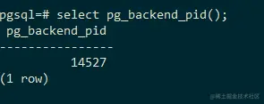
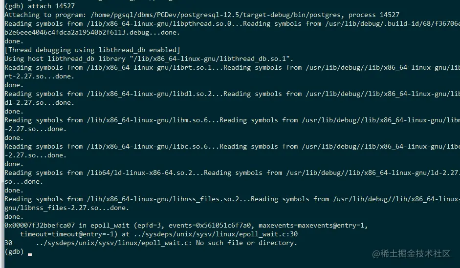
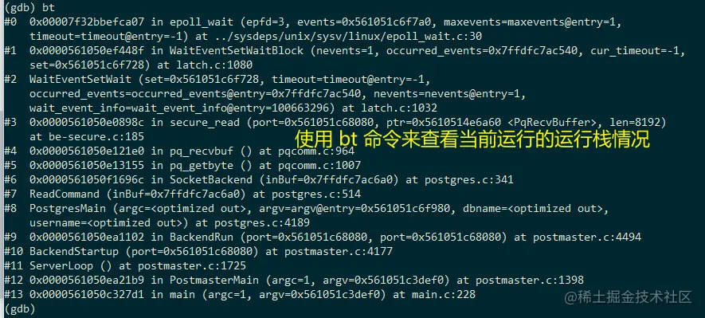
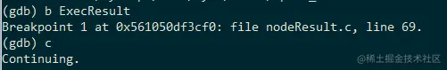
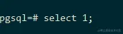
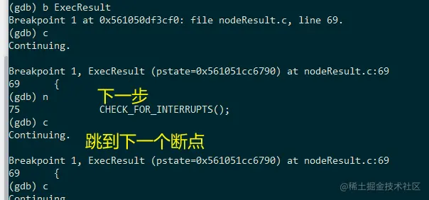
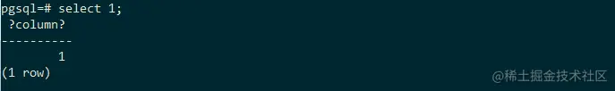

# 使用GDB调试postgreSQL

## 1.编译源代码

### 1.1 编写环境文件

这一步假设你已经在服务器中已经存在gcc，make等编译程序了，如果没有请自行安装。 创建一个文件名为`env-debug`的文件在根目录中， 写入以下信息，其中的PGHOME的目录须根据你自己的代码目录进行调整，实际上，PGHOME指定的就是postgreSQL的安装目录，可以自己指定。

```bash
PGHOME=源码安装路径/target-debug # 后面的target-debug只是为了更好的标记这个源码可以用于debug
export PGDATA=127.0.0.1 # 这个实际上就是PGDATA的文件夹名字，我觉得也可以自己指定
export PGHOST=$PGDATA # 如果PGDATA是127.0.0.1就可以直接使用，否则，需要设置PGHOST=127.0.0.1
export PGPORT=5432
export LD_LIBRARY_PATH=$PGHOME/lib
export PATH=$PGHOME/bin:$PATH
```

env-debug文件其实记录的就是一些环境变量，我们在使用的时候，需要手动导入一下这些环境变量，写成一个文件的好处就是直接执行这个文件就可以了，不需要每次都写这些东西。

```bash
source env-debug
```

> **补充：**
>
> source命令也称为“点命令”，也就是一个点符号（.）。source命令通常用于重新执行刚修改的初始化文件，使之立即生效，而不必注销并重新登录。该命令通常用命令“.”来替代。
>
> 使用范例：
>
> ```bash
> source filename
> 
> or
> 
> . filename（中间有空格）
> ```


### 1.2 编写并运行编译脚本

之后我们编写一个编译脚本命名为`compile.sh`也放在根目录中，来进行自动化编译并调整编译优化为O0，这是为了后面更好的看到完整的调试信息

```bash
#!/bin/bash

source env-debug

make distclean

#  --enable-profiling      build with profiling enabled
# need to install profiling tools.
#  --enable-coverage       build with coverage testing instrumentation
#  Needs to install lcov
#  --enable-tap-tests      enable TAP tests (requires Perl and IPC::Run)
#  Needs to install perl tools. IPC::Run and Test::More
#

# 调整预配置，并设置编译选项O0，不开启任何的编译优化，这是为了后面更好的看到完整的调试信息
./configure --prefix=$PGHOME \
    --enable-debug \
    CCFLAG="-g -O0" CC='gcc'

# 使用4个进程来进行编译任务
make -j 4 world

make install-world

cd ..

echo 'Run Sucessful.'
```

之后在根目录中使用 `source ./compile.sh` 就会自动开启编译的啦。


## 2.运行postgreSQL

1. 使用`initdb`命令来初始化数据库系统
2. 开启运行数据库系统`pg_ctl start -l $PGDATA/log`
3. 使用`createdb`创建数据库（默认会创建和当前用户名一致的数据库）如想创建 test名的数据库, 请这样子做 `createdb test`
4. 使用`psql`进行到和用户名一致的数据库， 如果想进去到test名的数据库，那么请使用`psql test`这一个命令

之后就可以开始自由的玩耍啦


## 3.调试PostgreSQL

### 3.1 加载符号文件

这里我们使用 `gdb` 进行代码的调试 首先我们先进入到我们的`代码的根目录`中。 然后使用 输入 `gdb` 开启调试模式， 进入之后我们需要将编译生成的符号文件载入gdb中（为了在后续调试中可以直接看到对应代码），这里我们就需要 使用 file 命令载入符号文件， `file target-debug/bin/postgres` 像这样子我们就算加载成功了。


之后我们需要调试的是postgres这一个应用程序，不能像直接调试 .out 文件一样，我们需要让gdb调试这一个进程，所以我们需要让gdb attach到这一个运行中进程中去。

我们需要在另外一个窗口中，使用`psql`进入到一个数据库中，然后我们使用

```csharp
select pg_backend_pid();
```

来获得连接的这一个进程号



### 3.2 连接数据库进程

接着我们在gdb中 attach 到这一个进程中 `attach 进程号`



之后我们就可以快乐地进行调试postgres sql啦。gdb的相关语法可以看这里：[打印内存的值 | 100个gdb小技巧 (gitbooks.io)](https://link.juejin.cn/?target=https%3A%2F%2Fwizardforcel.gitbooks.io%2F100-gdb-tips%2Fcontent%2Fexamine-memory.html)


## 4.简单尝试GDB

### 4.1 查看运行栈情况



### 4.2 给程序打断点

我们在这里给 `ExecResult` 函数（每一次查询都会调用这一个函数）打一个断点`b ExecResult`，再按 `c` ，这样子我们就打上了一个断点啦。



接着到我们的数据库端上。输入 `select 1;` 就可以发现程序会被卡在这里，因为它被gdb给捕获了。



接着我们在gdb中使用 `n` 是下一步的意思， `c`是运行到下一个断点位置的意思。



接着我们看到数据库端层就正常返回了数据了，通过一个简单的调试程序来让我们体验一下如何调试postgres程序。



