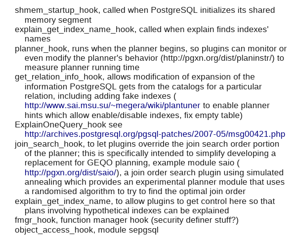

# postgreSQL中的hook机制

## 1.问题的产生

在看AGE代码的时候，我一直有个疑问，就是postgreSQL的插件（拓展）是通过什么方式与postgre源码建立连接的？

目前，了解到的方式主要有两种，其一是利用hook，其二是建立c函数，然后在数据库中进行关联。在实践过程中，通常会将两种方式结合使用，从而构建一个比较完善的拓展程序。Apache AGE就是这样。

按照一定的编码规范建立c函数来进行拓展的方式，在之前做过的Assignment中已经有所接触。但是对于hook机制，却并没有太多接触，因此本文主要对postgre中的hook机制进行一个解释说明。主要包括以下几点：

1. Hook机制的概念、作用
2. PostgreSQL中有哪些Hook
3. 如何在拓展中使用Hook
4. AGE中使用到的Hook


## 2.Hook机制的概念、作用

在PostgreSQL中，Hook（或称钩子）是一种机制，允许用户在PostgreSQL内核功能的执行过程中插入自定义的代码，以实现功能的定制化和扩展。从本质上来说，hook是一系列的回调函数，在插件中可以通过注册这些回调函数，来为系统的各个处理环节插入逻辑代码，这样就可以在不修改内核代码的情况下，通过插件为内核增加功能。

hook函数在实现上比较简单，它们是一系列的==全局函数指针==，数据库在适当环节会判断对应的hook是否被设置了，如果已经设置，则会调用这个函数。

在初始时，hook函数指针被设置为NULL，表示hook未被使用。当程序运行到hook处时，如果函数指针依然为NULL，则什么额外的事情也不做，但如果函数指针被设置为某个函数的地址(通常是我们自定义的函数)时，程序则跳转到这个新增的函数中，执行我们想要的功能。


### 举例说明:

下面我们以ClientAuthentication_hook为例，大致看一下在postgreSQL中hook长什么样。

这个hook的作用是帮助我们在client得到验证之后并且服务端还未给client反馈的时候运行我们的代码(contrib目录下的auth_delay和sepgsql使用了这个hook)。

首先，这个hook指针声明在
`src/include/libpq/auth.h, line 27`

```cpp
/* Hook for plugins to get control in ClientAuthentication() */
typedef void (*ClientAuthentication_hook_type) (Port *, int);
extern PGDLLIMPORT ClientAuthentication_hook_type ClientAuthentication_hook;
```

它的调用点，也就是hook所在的位置是：

`src/backend/libpq/auth.c, line 215`

```sql
/*
* This hook allows plugins to get control following client authentication,
* but before the user has been informed about the results. It could be used
* to record login events, insert a delay after failed authentication, etc.
*/
ClientAuthentication_hook_type ClientAuthentication_hook = NULL;
```

我们可以看到该hook初始化为NULL。具体到函数里，它出现在：

`src/backend/libpq/auth.c, line 580`

```scss
if (ClientAuthentication_hook)
 (*ClientAuthentication_hook) (port, status);
```

这很明显，就是如果我们写好了一个ClientAuthentication_hook并且通过我们上面提到的方法把它挂到了ClientAuthentication_hook上，那么我们的hook就会在这里被调用。


## 3.PostgreSQL中有哪些Hook


所有Executor_hook都有助于那些需要使用执行器信息的函数。主要用于了解执行了哪些查询，以便可以计算统计数据或记录它们。

check_password_hook是一种根据企业规则检查密码的方法。

ClientAuthentication_hook可以添加其他检查以允许或拒绝连接。





## 4.如何在拓展中使用Hook

至少要实现以下三个函数：

```c++
_PG_init(); // 在加载拓展时调用，将hook挂载到PostgreSQL的hook函数指针上
your_hook_function(); // 自己的hook函数实现
_PG_fini(); // 在卸载拓展时调用，移除自己的hook并将其重置为之前的指针
```


首先，当PostgreSQL在加载拓展时，它需要将拓展加载到内存中。这时需要我们实现一个`_PG_init()`函数，这类函数在PostgreSQL源码的contrib目录下很容易找到，类似下面这样：

```c++
_PG_init() {
    prev_ExecutorRun_hook = ExecutorRun_hook;
    ExecutorRun_hook = your_function_hook;
}
```

这段代码首先将之前的hook保存下来，以便后面进行恢复，然后将我们自己写的hook挂载到PostgreSQL的hook函数指针上。

相应的，我们还需要实现一个`_PG_fini()`函数，在卸载拓展时，将hook指针复原，如下所示：

```c++
_PG_fini() {
    ExecutorRun_hook = prev_ExecutorRun_hook;
}
```

这两个函数再加上我们的hook函数，就构成了最基本的PostgreSQL的hook。


### 举例说明：

以post_parse_analyze_hook为例，这个hook会在系统构造好查询树后调用，插件可以在系统对查询树做任何处理之前对查询树进行二次加工。

```c++
/** src/backend/parser/analyze.c */

/* 函数指针类型定义 */
typedef 
void (*post_parse_analyze_hook_type) (ParseState *pstate,
                                        Query *query);

/* 全局函数指针的定义，在插件中可以对它直接赋值 */
post_parse_analyze_hook_type post_parse_analyze_hook = NULL;

Query *parse_analyze(...)
{
    Query      *query;

    /* ... */

    /* 构造查询树 */
    query = transformTopLevelStmt(...);

    /* 调用hook */
    if (post_parse_analyze_hook)
        (*post_parse_analyze_hook) (...);

    /* ... */

    return query;
}
```

在系统加载插件后，会先调用`_PG_init()`函数对插件进行初始化，在插件被卸载前会调用`_PG_fini()`函数进行反初始化，所以注册hook回调的方法是在插件中实现这个函数，在函数内部注册hook回调。

```c
void _PG_init(void) 
{
    /* 注册hook(直接覆写全局函数指针) */
    post_parse_analyze_hook = analyze_hook_impl;
}

/* hook实现函数 */
static void analyze_hook_impl(...) 
{
    /* hook逻辑 */
}
```

从上面看到postgreSQL的hook设计非常简单粗暴。但是这个在多插件的情况下是有问题的，系统的hook函数指针只有一个，但是插件是有多个的，假如多个插件都需要注册这个hook怎么办?

```c
/* 插件A(先初始化) */
post_parse_analyze_hook = analyze_hook_impl_a;

/* 插件B(后初始化) */
post_parse_analyze_hook = analyze_hook_impl_b;

/* 插件A的hook被覆盖了！！！！！ */
```

postgreSQL把解决这个问题的责任留给了每一位的插件开发者，也就是说每个插件都要处理这个事情。方法是把初始化前的hook指针保存起来，在hook调用后，hook内部也调用以下保存好的原始hook函数

```c
/* 声明一个指针，用来保存别人的hook函数 */
static 
post_parse_analyze_hook_type prev_post_parse_analyze_hook = NULL;

void _PG_init(void) 
{
    /* 把原先的hook函数保存起来 */
    prev_post_parse_analyze_hook = post_parse_analyze_hook;

    /* 注册自己的hook函数 */
    post_parse_analyze_hook = analyze_hook_impl;
}

/* hook实现函数 */
static void analyze_hook_impl(...) 
{
    /* 调用一下别人的hook函数 */
    if (prev_post_parse_analyze_hook)
        (*prev_post_parse_analyze_hook) (...);

    /* 自己的hook逻辑 */
}

void _PG_fini(void)
{
    /* 自己的模块被卸载后，要恢复下现场 */
    post_parse_analyze_hook = prev_post_parse_analyze_hook;
}
```

还有一种和前面略有不同的hook函数，例如计划器中的planner_hook，在内核中是这么使用的:

```c
/* src/backend/optimizer/plan/planner.c */
PlannedStmt *planner(Query *query,...)
{
    PlannedStmt *result;
    if (planner_hook)
        result = (*planner_hook) (query, ...);
    else
        result = standard_planner(query, ...);
    return result;
}   
```

这里要注意的是，内核计划器的入口函数是planner，而实现代码却在standard_planner函数中，但问题在于，只要注册了planner_hook函数，就不会再调用standard_planner函数了。

那standard_planner还要不要调用呢？

当然要调的，除非在插件中实现了一个完整的计划器。postgreSQL把这个调用的责任也留给了插件开发者，在hook函数内部不能忘记调用standard_planner。

```c
PlannedStmt *planner_hook_impl(Query *query, ...)
{
    PlannedStmt *result;

    /* 自己的hook逻辑 */

    /* 调用一下内核的计划器 */
    result = standard_planner(query,...);

    /* 自己的hook逻辑 */

    return result;
}
```

这种hook设计有个好处，就是在一个hook函数中可以同时对计划器执行前，和执行后两个时间点进行处理。

换句话说，也就是插件的开发者可以自己决定是要在计划器调用前增加逻辑，还是计划器调用后增加逻辑，或者前后都加。

最后，结合前面处理多插件兼容的解决方法，这类hook完整的实现是这样的：

```c
/* 声明一个指针，用来保存别人的hook函数 */
static
planner_hook_type prev_planner_hook = NULL;

void _PG_init(void)
{
    /* 把原先的hook函数保存起来 */
    prev_planner_hook = planner_hook;

    /* 注册自己的hook函数 */
    planner_hook = planner_hook_impl;
}

/* hook实现函数 */
static PlannedStmt * planner_hook_impl(...)
{
    PlannedStmt *result;

    /* 自己的hook逻辑 */

    if (prev_planner_hook)
        /* 调用一下别人的hook函数
        * 这个时候调用standard_planner的重任就落在别的插件上了
        */
        result = (*prev_planner_hook) (...);
    else 
        /* 没有别的插件了，我们自己调用standard_planner */
        result = standard_planner(...);


    /* 自己的hook逻辑 */
}

void _PG_fini(void)
{
    /* 自己的模块被卸载后，要恢复下现场 */
    planner_hook = prev_planner_hook;
}
```

从上面分析可以看到，postgreSQL提供hook功能机制比较简单，把许多责任留给了hook使用者，这会给postgreSQL的插件带来的兼容风险，系统加载多个插件后，只要有一个插件没按这个规矩来，就可能会相互影响。


## 5.AGE中使用到的Hook

```c++
void _PG_init(void)
{
    register_ag_nodes();
    set_rel_pathlist_init();       // ----> set_rel_pathlist_hook
    object_access_hook_init();     // ----> object_access_hook
    process_utility_hook_init();   // ----> ProcessUtility_hook
    post_parse_analyze_init();     // ----> post_parse_analyze_hook
    define_config_params();
}

void _PG_fini(void)
{
    post_parse_analyze_fini();
    process_utility_hook_fini();
    object_access_hook_fini();
    set_rel_pathlist_fini();
}
```


**参考文献**：

[1]: http://wiki.postgresql.org/images/e/e3/Hooks_in_postgresql.pdf
[2]: https://www.cnblogs.com/flying-tiger/p/7801258.html
[3]: https://blog.csdn.net/zhouhuajun/article/details/124278677


