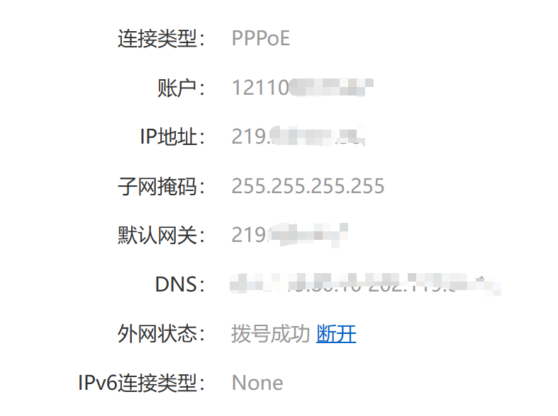

1. 配置好后如果两台电脑（连接方和被连接方）在同一个局域网下，那么是可以通过username@servername（如84097@Labs）的方式进行连接的。但如果两个电脑不在同一个局域网下，那么是不可以通过上面那种方式连接的，只能通过username@hostname（如84097@公网ip）来连接。

2. 密码是微软账户的密码，而不是电脑的锁屏密码

3. windows服务器默认使用cmd.exe来作为远程连接的shell，我们可以通过以下方式将powershell设置为默认shell

    ```shell
    # 注意，powershell的路径可以根据自己的实际情况进行更改，这里默认使用的是系统自带的powershell，版本较低，比较low
    New-ItemProperty -Path "HKLM:\SOFTWARE\OpenSSH" -Name DefaultShell -Value "C:\Windows\System32\WindowsPowerShell\v1.0\powershell.exe" -PropertyType String -Force
    ```

4. 把公钥添加到服务器user\\.ssh\\authorized_keys之后，如果依然无法免密登录，需要进行以下操作：服务端切换到C:\ProgramData\ssh\下（首次启动sshd后会生成该文件夹），打开sshd_config文件，修改文件（以下是重点）：

    ```config
    确保以下3条没有被注释
    PubkeyAuthentication yes
    AuthorizedKeysFile	.ssh/authorized_keys
    PasswordAuthentication no #这个感觉无所谓，可以先不注释，试试再改
    
    确保以下2条有注释掉 重点，这两行要注释
    #Match Group administrators
    #       AuthorizedKeysFile __PROGRAMDATA__/ssh/administrators_authorized_keys
    ```

5. 相关命令

    ```
    查看状态：Get-Service sshd
    关闭服务：Stop-Service sshd
    重启服务：Restart-Service sshd
    ```

6. 如果我们作为服务器的windows是通过wifi连接网络的（通过宽带连接的电脑不太清除会遇到什么情况），我们不能简单地使用ipconfig来查看电脑的ip地址，因为这个地址本质上是一个局域网ip。而实际上，我们应该使用路由器所在的公网ip，可以通过路由器管理端查看，也可用通过[链接](https://www.whatismyip.com)查看。此外，虽然sshd默认端口是22，但是我们仍需要在路由器上配置转发端口，否则外部的网络无法到达我们的服务器。

    

    
