本文引用自：https://mathpretty.com/13287.html

## 简介

之前介绍了文献管理工具，Mendeley（[论文管理工具–Mendeley](https://mathpretty.com/11413.html)），但是实际使用下来总是有些不便。特别是文件同步的时候。所以尝试使用以下 Zotero 来进行文献管理。这一篇文章会介绍关于 Zotero 的一些使用。包括文件的导入，一些插件的使用。

Zotero 的一些优点如下所示：

- 软件本身完全免费并且开源，不存在盗版问题
- 注册后本身只包括 300M 空间同步，但支持 WebDAV 同步，例如 Dropbox 和坚果云等
- 官方的反馈论坛比较活跃，有问题可以快速得到反馈
- 从网站和期刊文章等提取保存出版物数据检索
- 拖入 PDF 的出版物数据准确率高
- 可以和 Word，LibreOffice 集成，方便文献进一步的使用管理
- 强大的第三方插件系统

### Zotero 学习路径

下面是 Zotero 的学习路径（来自[文献管理神器 Zotero 学习路径指南](https://sspai.com/post/56724)），这篇文章尽量都对其有所涉及。

<center>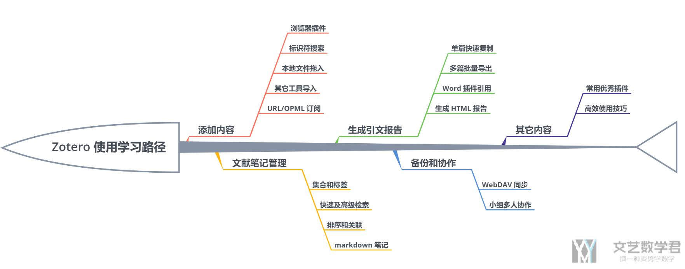</center>

### 参考资料

- [Zotero Download](https://www.zotero.org/download/)，下载 Zotero 软件
- [论文管理工具–Mendeley](https://mathpretty.com/11413.html)，之前记录 Mendeley 的使用
- [文献管理神器 Zotero 学习路径指南](https://sspai.com/post/56724)，一份非常详细的说明

 

## Zotero 内容的添加

### 使用浏览器插件进行内容的添加

我们可以在[Zotero Download](https://www.zotero.org/download/)下载 Chrome 的插件，这样可以方便我们进行内容的插入。当我们浏览网页的时候，插件会根据内容不同有不同的显示，我们直接进行保存即可。

<center>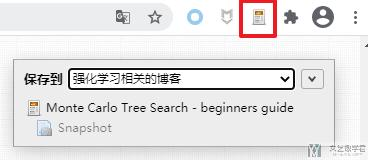</center>

之后再进入 Zotero 就可以看到自己保存的网页的内容了。

<center>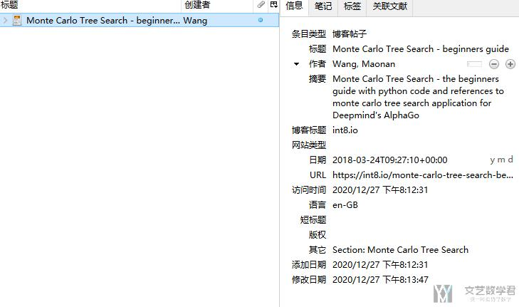</center>

 

### 使用本地文件进行拖入

如果我们已经下载好了 PDF 版本文献，只要直接拖入到应用中即可，Zotero 会自动识别 PDF 文档中的元数据。

和大多数文献管理软件相比，`Zotero` 有一个非常大的优势就是支持将任意格式的附件添加到某个条目中，例如这里的附件可以是 Excel 格式的电子表格，可以是文献中提到的某一个网页地址，也可以是你自己和文献主题相关的电子实验记录，甚至你还可以将文章中提到的相关代码打包为压缩文件后进行添加。

**结合ZotFile 的文件管理 和 WebDAV 的同步功能，我们还可以将这些相关资料在多个设备间进行同步，这样就极大的方便了我们对文献相关的各种资料进行整理。**

直接放入的本地文件，会放在 `storage` 目录下。我们可以配合 `ZotFile` 使用，将文件转移到指定的目录下。选择我们需要转移的文件，「右键->Manage Attachments->Rename Attachments」，这样文件就会转移到指定的目录下。

<center>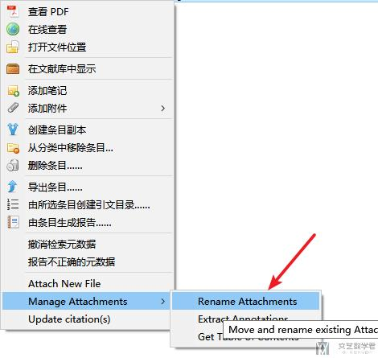</center>

这个时候在 `Zotero` 看指定文献的时候，文件上面会有一个链接的标志。

<center>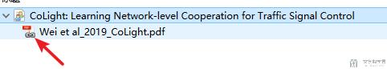</center>

## Zotero 的文献和笔记管理

### 分类与标签

在使用 Zotero 的时候，我们可以**新建不同的分类**（这个类似于文件夹）来放置不同的类型的文件。直接使用右键就可以**新建分类**，和**新建子分类**。如下所示为「新建分类」

<center>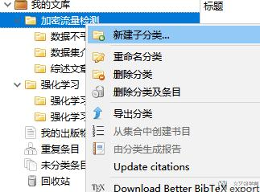</center>

除了设置分类之后，可以为每个文献**添加若干个标签**。这里建议标签的使用维度不和集合重合。例如，我有个一个叫做「lncRNA」的目录集合，就不应该再建立一个「lncRNA」的标签，这时的标签可以考虑应用维度或者重要性维度。如使用 P1、P2 和 P3 标注文献的重要性，使用「中期」「答辩」等标注一个文献的用途。

每个标签可以设置对应颜色，这个色块也会自动显示在每一个条目的开头，方便查看，一目了然。下面简单看一下如何设置标签，和标签的颜色。首先选中一篇文章，进行标签的添加；接着可以修改标签的颜色；最后就可以在文章标题前面看到标签的颜色了。

<center>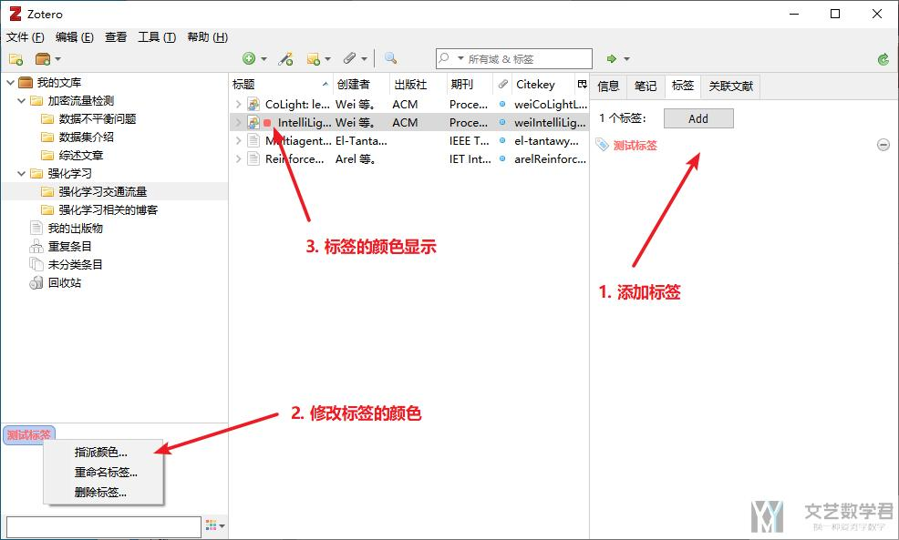</center>

 

## Zotero 的简单使用

### Zotero 文件夹设置

我们需要在 「首选项->高级->文件和文件夹」中进行目录的设置。

- 首先设置「**链接附件的根目录**」，这个目录下可以放置我们的 pdf，设置了这个目录之后，Zotero 会使用相对路径来进行保存，这样我们在更换电脑之后，也可以进行访问。
- 接着设置「**数据存储位置**」，这个包含 Zotero 的数据库文件。

下面是我的这两个部分的配置的详情。

<center>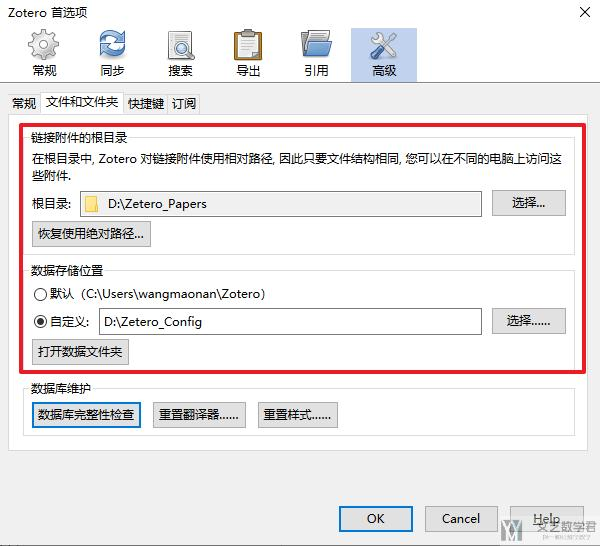</center>

 

### Zotero 文献同步

在「编辑->首选项->同步」中，我们注册 Zotero 账号（如果想要修改账号信息，可以登录 [Zotero Account](https://www.zotero.org/settings/account) 进行修改），并可以设置 WebDAV 来进行同步。这里我们将 Zotero 于 Onedrive 进行同步。下面我们详细介绍。

首先我们在「首选项->同步」中登录 **Zotero 账号**。如果使用 Onedrive 同步，那就不需要勾选「文件同步」，如下图所示。数据同步可以理解为我们在 Zotero 中存储的文章，目录结构等，但是不会存储文章的源文件。文章的源文件是存储在 onedrive 里面的。

<center>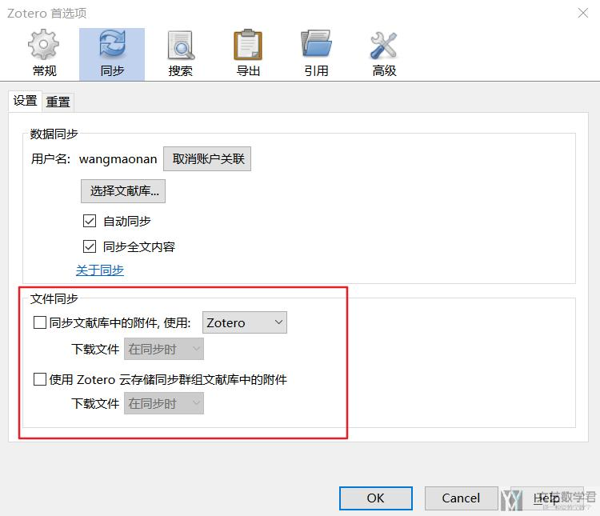</center>

接着我们要将 Zetero 的「根目录」设置在 onedirve 中，这样所有的附件都可以使用 onedrive 自动进行同步。我们需要注意，**下面的数据存储位置不需要放在 onedrive 进行同步（也就是数据存储位置，这个随意选一个路径即可）**。

<center>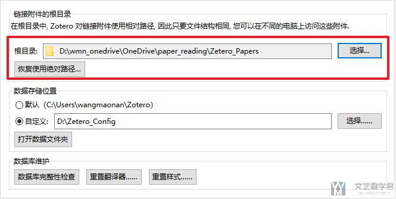</center>

关于数据同步，我们可以使用 Zotero 自带的同步即可。这样更换电脑，也可以很快进行同步。之后只需要登录 Zotero 账号，设置链接附件的更目录即可。

 

### Quick Copy（快速粘贴文献）

有的时候我们需要将 Zotero 中的文献按照某种格式粘贴出来，这个时候可以使用「Quick Copy」的功能。在「**编辑->首选项->导出**」中可以选择项目格式。如下所示，我们选择「BibTex」格式：

<center>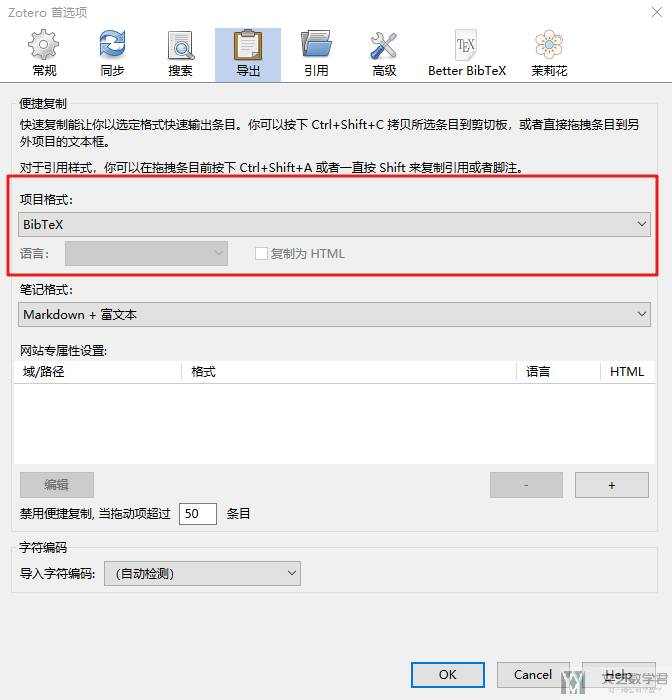</center>

接着在 Zotero 中直接将文章拖动到要复制的地方即可。例如我们可以直接拖动到 Word 中去，效果如下所示：

<center>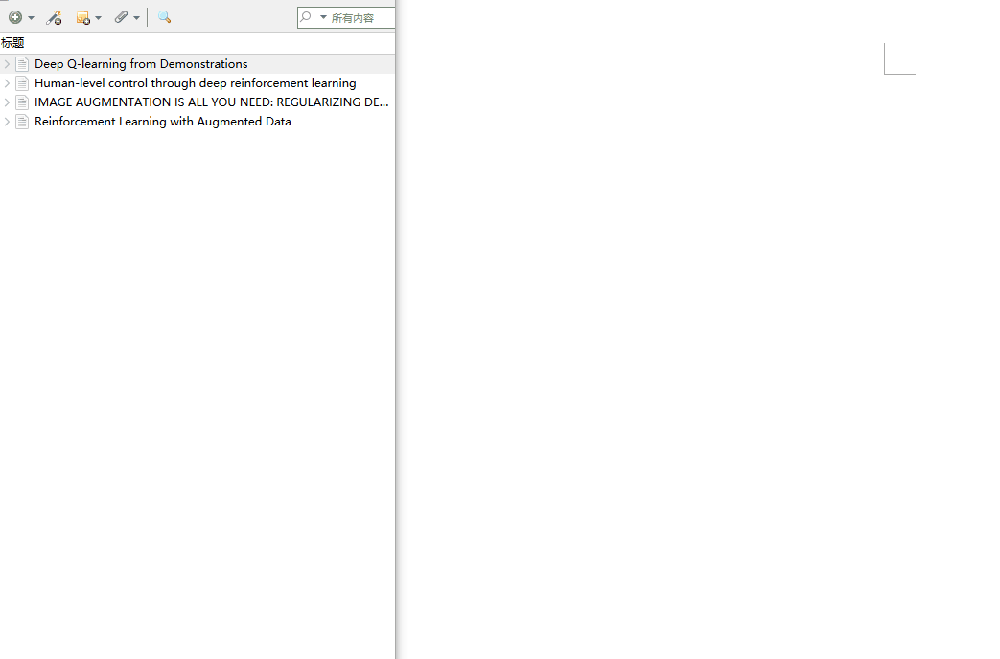</center>

**详细的操作说明，可以参考这个链接**，[Creating Bibliographies - Quick Copy](https://libguides.massgeneral.org/zotero/create-bibliography)

 

## Zotero 相关插件使用

插件系统是 Zotero 作为开源软件的独特优势，你可以通过 [官方插件网站](https://www.zotero.org/support/plugins) 进行查看。下面介绍几款比较常用的 Zotero 的插件。我们可以在「工具->插件」中进行插件的安装。

### Zotero Connector - Chrome 浏览器插件

这一款插件安装之后，就可以在浏览网页的时候，将需要的内容保存到 Zotero 中。如下图所示，浏览不同网页的时候，插件显示会有区别，如果是 html 会直接将 html 保存下来。（**十分推荐使用**）

<center></center>

 

### ZotFile-自动 pdf 重命名

在官网，[Zotfile-Download](http://zotfile.com/)，进行软件的下载（**十分推荐使用**）。在网上下载的 pdf 名称都会比较随机，我们可以在 ZotFile 设置好名称的规则，就可以自动进行修改。首先在「工具-->ZotFile Preferences」中进行设置：

<center>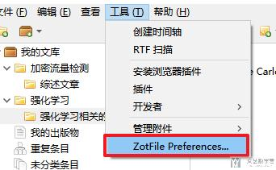</center>

接着我们进行如下的配置：

- `Source Folder for Attaching new Files`可设置为 Zetero 的存储文件的目录，也就是 **storage** 文件夹。这个时候如果有新的文件加入，会自动进行转换；
- `Location of Files`设置为链接附件的根目录，会存储文件的目录，我们可以修改成上面 Zetero 中的数据存储的位置；
- `Renaming Rules`中附件重命名可设置为`{%y-}{%j-}{%t}`；

下面是文件夹的基础设置，包括 `Source Folder` 和 `Location of Files` 的设置（简单一点的话，**只需要对 `Location of Files` 中的 `Custom Location` 设置成 `onedrive` 的地址即可**）：

<center>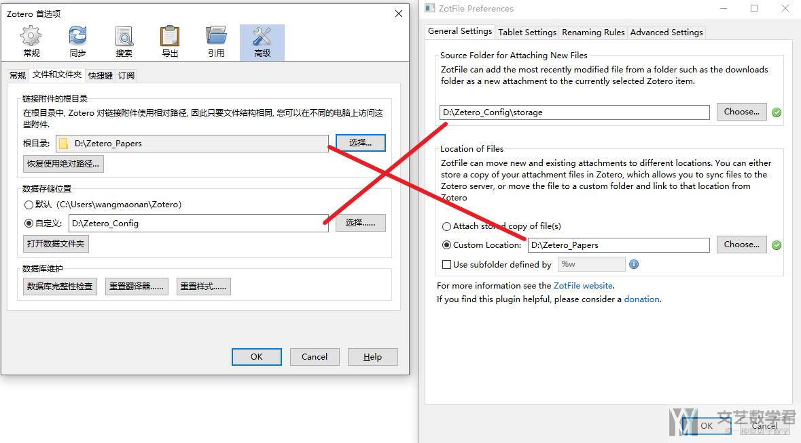</center>

同样，重命名的方式也是可以自定义的，可以在 `Renaming Rules` 来进行设置。

<center>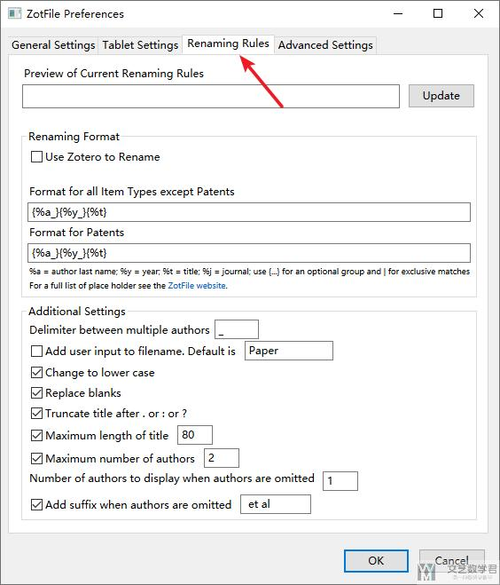</center>

之后还是在浏览器插件的位置，可以对 pdf 进行保存。

<center>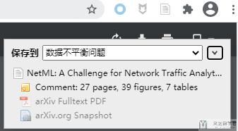</center>

之后，ZotFile 会直接对文件进行名称的修改。

<center>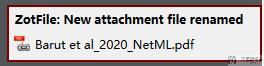</center>

如果是**直接拖动放入的文件**，我们需要「右键->Rename Attachments」即可将文件进行修改名称，同时转移到目标文件夹内。

<center></center>

 

### Zotero better bibtex

Zotero better bibtex 可以帮助我在使用 latex 写作的时候快速的导入文献。该插件的官网为，[BETTER BIBTEX FOR ZOTERO](https://retorque.re/zotero-better-bibtex/)

 

### **中文文献抓取-Jasminum**

在我们使用 Zotero 进行文献管理的时候，默认的情况下中文文献是不会抓取信息的。这个时候我们可以下载 Zotero 插件 Jasminum 来进行更新，插件的链接为，[Jasminum Download](https://github.com/l0o0/jasminum)。安装完毕之后，我们只需要「右键」中文文献，点击「抓取知网元数据」即可。

<center>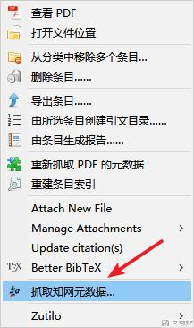</center>

 

## Zotero 一些其他的

### 清除 Zotero 中 storage 中空文件夹

在 Zotero 中使用 Zotfile 时，常会生成一些空文件夹留在`<数据存储位置>/storage`中，虽然不占空间，但依然有用户想要删除它们。这些“空”文件夹通常并不是真的没有文件。附件进入 storage 后，Zotero 缓存全文生成 `.zotero-ft-cache`，而后附件被 Zotfile 移动至其他位置，留下只包含`.zotero-ft-cache`。

我们可以通过 Python 脚本自动删除这些空的文件夹。**下面的脚本可以在任意位置运行。**

```python
#!/usr/bin/env python
# coding: utf-8
from __future__ import print_function
import configparser
import re
import shutil
import sys
try:
    from pathlib import Path
except ImportError:
    from pathlib2 import Path
def get_zotero_storage_dir():
    '''
    Get the Zotero storage dir and in PosixPath type
    '''
    profile_dirs = {
        'darwin': Path.home() / 'Library/Application Support/Zotero',
        'linux': Path.home() / '.zotero/zotero',
        'linux2': Path.home() / '.zotero/zotero',
        'win32': Path.home() / 'AppData/Roaming/Zotero/Zotero'
    }
    profile_dir = profile_dirs[sys.platform]
    config = configparser.ConfigParser()
    config.read('{}'.format(profile_dir / 'profiles.ini'))
    configs_loc = profile_dir / config['Profile0']['Path'] / 'prefs.js'
    configs = configs_loc.read_text()
    zotero_data_pat = re.compile(
        r'user_pref\("extensions.zotero.dataDir",\ "(?P<zotero_data>.+)"\);')
    zotero_data_dir = Path(zotero_data_pat.search(configs).group('zotero_data'))
    storage_dir = zotero_data_dir / 'storage'
    return storage_dir
def get_empty_folders(zotero_storage_dir):
    '''
    Get a list of empty dir in string type.
    '''
    return [
        p.as_posix() for p in zotero_storage_dir.iterdir()
        if (not p.is_file()) and (
            not len([f for f in list(p.iterdir()) if f.name[0] != '.']))
    ]
if __name__ == '__main__':
    zotero_storage_dir = get_zotero_storage_dir() # 可以找到 storage 的位置
    dirs_to_remove = get_empty_folders(zotero_storage_dir) # 找到其中空的文件夹
    try:
        import click
        print('The following folders contain no attachments:')
        print('\n  '.join([''] + dirs_to_remove))
        if click.confirm('Do you want remove them?', default=True):
            [shutil.rmtree(p, ignore_errors=True) for p in dirs_to_remove]
    except ImportError:
        print(
            'The following folders containing no attachments will be removed:')
        print('\n  '.join([''] + dirs_to_remove))
        [shutil.rmtree(p, ignore_errors=True) for p in dirs_to_remove]
```

**这部分内容参考自链接**，[为 Zotero 删除 storage 中的“空”文件夹](https://zhuanlan.zhihu.com/p/41168160)。