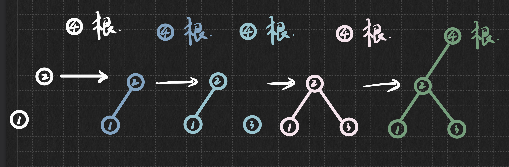

# LeetCode刷题笔记

## 树、二叉树

### [95. Unique Binary Search Trees II](https://leetcode-cn.com/problems/unique-binary-search-trees-ii/) [medium]

`二叉搜索树、后续遍历` 

#### 1. 问题描述

> Given an integer n, return all the structurally unique BST's (binary search trees), which has exactly n nodes of unique values from 1 to n. Return the answer in any order.

**Example：**


```
Input: n = 3
Output: [[1,null,2,null,3],[1,null,3,2],[2,1,3],[3,1,null,null,2],[3,2,null,1]]
```

#### 2. 问题分析

​	拿到这道题，首先有一个朴素的但是不太好操作的想法：自上而下生成二叉搜素树，也就是前序遍历生成。在生成过程中，先确定根节点(循环遍历根结点的每一种可能性)，然后确定左右子树。但是，这样做会产生两个问题：1. 如何判断以i为根结点的所有二叉搜索树均已生成 2. 如何返回(或者说保存)已经生成的二叉搜索树。也就是说，当我们自上而下生成一棵树之后，我们不仅需要将这棵树加到List列表中，同时还要返回前一个节点去探索其他可能性，如何处理这两个问题在前序遍历的方法下会比较麻烦。我对照下面的图来做具体的解释。



​	当我们用递归的方式前序遍历生成树时，会先确定根结点，再确定左子树的根结点，再确定左子树的左子树的根结点，依次类推。但是在这个过程中，根结点虽然被确定了，但是左子树与根结点的连接并没有建立，只有当递归函数返回时才会建立二者之间的连接。所以说，对于这道题，如果采用前序遍历的方法，只有当递归完全返回之后，一棵树才得以建立起来。但是，如果完全返回，我们生成这棵树的中间结果就会被抛弃，在接下来生成具有相同根的另一棵树时就不知道这棵树是否被生成，这样就会产生问题。也许如果采用前序遍历的。(迭代也是如此)

​	而如果考虑自底向上生成所有二叉搜索树，即后序遍历的方法，情况就会有所不同。我们可以先求出以i为根结点的左子树的所有情况，以及右子树的所有情况，然后将左子树的可能情况添加到根结点的左孩子上，右子树的可能情况添加到根结点的右孩子上。这样自底向上地生成，就会比较方便的解决上面提到的两个问题。

#### 3. 代码

```java
/**
 * Definition for a binary tree node.
 * public class TreeNode {
 *     int val;
 *     TreeNode left;
 *     TreeNode right;
 *     TreeNode() {}
 *     TreeNode(int val) { this.val = val; }
 *     TreeNode(int val, TreeNode left, TreeNode right) {
 *         this.val = val;
 *         this.left = left;
 *         this.right = right;
 *     }
 * }
 */
class Solution {
    public List<TreeNode> generateTrees(int n) {
        if(n == 0) {
            return null;
        }
        return generateTrees(1, n);
    }
    
    public List<TreeNode> generateTrees(int low, int high) {
        List<TreeNode> allTrees = new LinkedList<TreeNode>();
        if(low > high) {
            allTrees.add(null);
            return allTrees;
        }
        for(int i = low; i <= high; i ++) {
            // 后序遍历，对左右子树的操作
            List<TreeNode> leftchild = generateTrees(low, i - 1); // 生成某一节点左子树的所有情况，存储在List内
            List<TreeNode> rightchild = generateTrees(i + 1, high); // 生成某一节点右子树的所有情况，存储在List内
            
            // 对根结点的操作：根据leftchild和rightchild，双重循环，生成所有以i为根结点的可能的子树。
            for(TreeNode left: leftchild) {
                for(TreeNode right: rightchild) {
                    TreeNode root = new TreeNode(i);
                    root.left = leftchild;
                    root.right = rightchild;
                    allTrees.add(root);
                }
            }
        }
        return allTrees;
    }
}
```


## 字符串

### [1576. Replace All ?'s to Avoid Consecutive Repeating Characters](https://leetcode-cn.com/problems/replace-all-s-to-avoid-consecutive-repeating-characters/) [easy]

`字符串`

1. #### 问题描述

> Given a string s containing only lowercase English letters and the '?' character, convert all the '?' characters into lowercase letters such that the final string does not contain any consecutive repeating characters. You cannot modify the non '?' characters.
>
> It is guaranteed that there are no consecutive repeating characters in the given string except for '?'.
>
> Return the final string after all the conversions (possibly zero) have been made. If there is more than one solution, return any of them. It can be shown that an answer is always possible with the given constraints.

**Example：**

```txt
Input: s = "?zs"
Output: "azs"
Explanation: There are 25 solutions for this problem. From "azs" to "yzs", all are valid. Only "z" is an invalid modification as the string will consist of consecutive repeating characters in "zzs".
```

#### 2. 问题分析

​	这个题并不难，但是关键点在于如何对字符串进行处理。在java中，无法直接对字符串进行修改操作，在此我介绍两种解决方法，第一种比较常见，第二种可以作为拓展。

1. 将字符串通过`.toCharArray()`转换成字符数组，对字符数组进行修改，然后将字符数组通过`new String(arr)`或者`String.valueOf(arr)`转换为字符串。
2. java无法对字符串进行修改，但是可以通过StringBuilder`StringBuilder builder = new StringBuilder(str)`并使用`builder.setCharAt(1, 'a')`函数来修改1处的值为'a'，最后再通过`builder.toString()`转换为字符串。

#### 3. 代码

方法1: `.toCharArray()`

```java
class Solution {
    public String modifyString(String s) {
        char[] arr = s.toCharArray();
        int n = s.length();
        for(int i = 0; i < n; i ++) {
            if(arr[i] == '?') {
                for(char ch = 'a'; ch <= 'c'; ch ++) {
                    if(i > 0 && arr[i - 1] == ch || i < n - 1 && arr[i + 1] == ch) {
                        continue;
                    }
                    arr[i] = ch;
                    break;
                }
            }
        }
        return new String(arr);
    }
}
```


方法2: `SrtingBuilder`

```java
class Solution {
    public String modifyString(String s) {
        StringBuilder builder = new StringBuilder(s);
        int n = s.length();
        for(int i = 0; i < n; i ++) {
            if(builder.charAt(i) == '?') {
                for(char ch = 'a'; ch <= 'c'; ch ++) {
                    if(i > 0 && builder.charAt(i - 1) == ch || i < n - 1 && builder.charAt(i + 1) == ch) {
                        continue;
                    }
                    builder.setCharAt(i, ch);
                    break;
                }
            }
        }
        return builder.toString();
    }
}
```

## 栈

#### [71. Simplify Path](https://leetcode-cn.com/problems/simplify-path/)[medium]

`栈、 字符串`

1. #### 问题描述

> Given a string path, which is an absolute path (starting with a slash '/') to a file or directory in a Unix-style file system, convert it to the simplified canonical path.
>
> In a Unix-style file system, a period '.' refers to the current directory, a double period '..' refers to the directory up a level, and any multiple consecutive slashes (i.e. '//') are treated as a single slash '/'. For this problem, any other format of periods such as '...' are treated as file/directory names.
>
> The canonical path should have the following format:
>
> The path starts with a single slash '/'.
> Any two directories are separated by a single slash '/'.
> The path does not end with a trailing '/'.
> The path only contains the directories on the path from the root directory to the target file or directory (i.e., no period '.' or double period '..')
> Return the simplified canonical path.

**Example：**

```txt
Input: path = "/home//foo/"
Output: "/home/foo"
Explanation: In the canonical path, multiple consecutive slashes are replaced by a single one.
```

#### 2. 问题分析

​	对于这道题，我们可以对输入的字符串以`/`为分隔符进行预处理，得到一个字符串数组。在字符串数组中，**元素的内容**可能存在如下几种情况：

1. `""` ，(空串)
2. `"abc"` , (文件名)
3. `"."`
4. `".."`

- 对于空串和`"."`, 它们不会影响文件路径结构，可以直接忽略
- 对于文件名来说，它们需要进行入栈操作
- 对于`".."`来说，需要执行出栈操作

按照以上原则，最终栈里面剩下的元素即为路径所包含的文件/文件夹名。

#### 3. 代码

```java
class Solution {
    public String simplifyPath(String path) {
		String[] names = path.split("/");
        Deque<String> stack = new ArrayDeque<String>();
        
        // 利用栈，简化路径
        for(String name: names) {
            if("".equals(name) || ".".equals(name)) {
                continue;
            } else if("..".equals(name)) {
                // 注意判断栈是否为空需要在这里面进行
                if(stack.isEmpty()) {
                    continue;
                }
                stack.pop();
            } else {
                stack.push(name);
            }
        }
        
        // 生成简化后的路径
        StringBuilder ans = new StringBuilder("");
        if(stack.isEmpty()) {
            ans.append("/");
        } else {
            while(!stack.isEmpty()) {
                ans.append("/");
                ans.append(stack.pollLast());
            }
        }
        
        return ans.toString();
    }
}
```

**注意：equals() 方法和`==`运算符执行的是两个不同的操作。equals() 方法比较字符串对象中的字符。而`==`运算符比较两个对象引用看它们是否引用相同的实例。**
