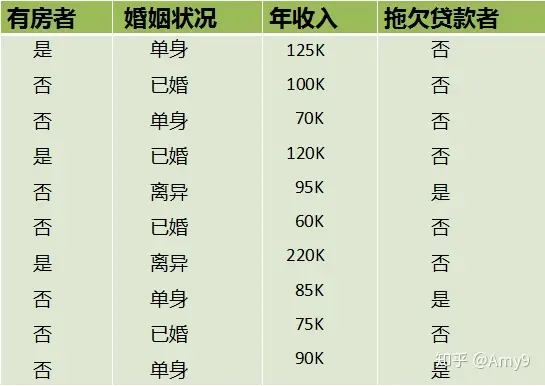
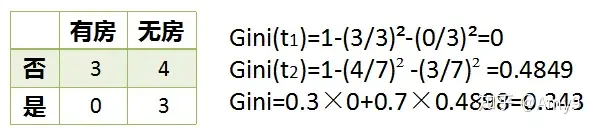
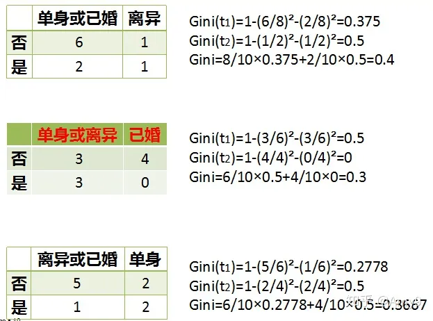
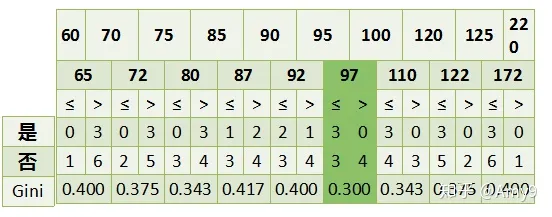
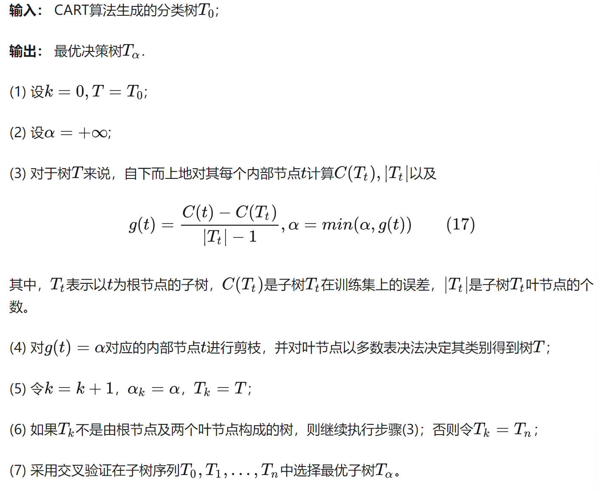
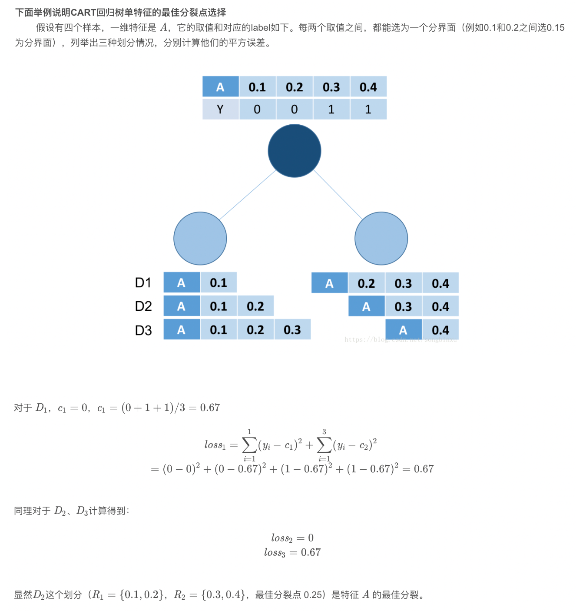

# 决策树CART算法

介绍算法的细节，包括其假设、学习准则、优化算法、模型预测。

## 1.概述

决策树是一种常见的机器学习算法，用于从输入数据中推断出关于数据特征的结论。通过类似树状结构的决策图，它能够帮助我们做出决策或预测结果。在每个内部节点，决策树根据输入数据的特征进行划分；在叶子节点，它给出了数据的预测结果。决策树非常直观易懂，同时也可以处理分类和回归任务。在训练过程中，决策树算法会根据数据特征不断进行分裂，直到达到预先设定的停止条件。它也可以处理缺失数据，并且对异常值具有一定的鲁棒性。决策树在实际应用中具有很好的可解释性，能够帮助分析人员理解模型的决策过程，因此被广泛应用于各行各业的数据分析和决策支持中。 

决策树的生成算法有ID3，C4.5和CART等。ID3和C4.5算法生成的决策树是多叉树，只能处理分类而不能处理回归。而CART算法（即分类回归树算法）生成的算法是一棵二叉树，既可以用于分类也可以用于回归，分类树的输出是样本的类别，回归树的输出是一个实数。三种算法的区别如下表所示：

| 算法 | 树结构 |  支持模型  |       特征选择       | 连续值处理 | 缺失值处理 |  剪枝  |
| :--: | :----: | :--------: | :------------------: | :--------: | :--------: | :----: |
| ID3  | 多叉树 |    分类    |       信息增益       |   不支持   |   不支持   | 不支持 |
| C4.5 | 多叉树 |    分类    |      信息增益率      |    支持    |    支持    |  支持  |
| CART | 二叉树 | 分类、回归 | 基尼系数、平方误差和 |    支持    |    支持    |  支持  |

本文重点介绍CART算法。

在CART算法中，对于回归树，采用的是**平方误差最小化准则**；对于分类树，采用**基尼系数最小化准则**。

CART算法的步骤包括以下几点：

1. 特征选择；
2. 递归建立决策树；
3. 决策树剪枝；

## 2.CART分类树算法

ID3中使用了**信息增益**选择特征，增益大的优先选择。在C4.5算法中，采用**信息增益率**来选择特征，减少因特征值多导致信息增益大的问题。CART分类树算法使用**基尼系数**选择特征，基尼系数代表了模型的不纯度，**基尼系数越小，不纯度越低，特征越好**。这和信息增益(率)相反。

### 2.1 基尼系数

在分类问题中，假设数据集$D$有$K$个类别，第$k$个类别的概率为$p_k$, 则基尼系数的表达式为：
$$
Gini(D)=\sum_{k=1}^{K}p_k(1-p_k)=1-\sum_{k=1}^{K}p_k^2
$$
如果是二类分类问题，计算就更加简单了，如果属于第一个样本输出的概率是$p$，则基尼系数的表达式为：
$$
Gini(D)=2p(1-p)
$$
从直观上来说，数据集的基尼系数反映了从数据集$D$中随机抽取两个样本，其类别不一样的概率。因此，基尼系数越小，数据集的纯度就越高。

对于个给定的样本$D$,假设有$K$个类别, 第$k$个类别的数量为$C_k$,则样本$D$的基尼系数表达式为：
$$
Gini(D)=1-\sum_{k=1}^{K}(\frac{|C_k|}{|D|})^2
$$
> 注：这个基尼系数的定义本质上跟上面那个是一样的，只不过，这里的概率$p_k$表示成了$\frac{|C_k|}{|D|}$。

特别的，对于样本$D$,如果根据特征$A$的某个值$a$,把$D$分成$D1$和$D2$两部分，则在特征$A$的条件下，$D$的基尼系数表达式为：
$$
Gini(D|A=a)=\frac{|D_1|}{|D|}Gini(D_1)+\frac{|D_2|}{|D|}Gini(D_2)
$$
为了简化基尼系数的计算，CART分类树算法每次仅对某个特征值进行二分，而不是多分，这样CART分类树算法建立起来的就是一棵二叉树，而不是多叉树。

**CART选择划分属性的标准是**：选择那个使得划分后的基尼指数最小的属性作为最优划分属性，用数学语言表达如下：
$$
a^* = argmin_{a\in A}Gini(D|A=a)
$$

### 2.2 连续特征处理

CART处理连续特征的思想是将连续的特征离散化，这一点与C4.5是相同的，区别在于选择划分点的时候，CART是以基尼系数作为判断指标，而C4.5是以信息增益率作为判断指标的。

CART连续特征处理的过程：

1. 假设$m$个样本的连续特征A有$m$个值，将他们从小到大排列$a_1, a_2, ...,a_m$，则CART取相邻两样本值的平均数作为划分点，一共有$m-1$个，其中第$i$个划分点$T_i$表示为：$T_i=\frac{(a_i + a_{i+1})}{2}$。
2. 分别计算以这$m-1$个点作为二元分类点时的基尼系数。选择基尼系数最小的点为该连续特征的二元离散分类点。比如取到的基尼系数最小的点为$a_t$ ，则小于$a_t$的值为类别1，大于$a_t$​的值为类别2，这样就做到了连续特征的离散化。

> 注：与处理离散属性不同的是，如果当前节点为连续属性，则该属性在后面还可以参与子节点的产生选择过程。（什么意思？？）

### 2.3 离散特征处理

**思路：**不断地二分离散特征。

在ID3、C4.5中，特征$A$被选取建立决策树节点，如果它有3个类别$A_1,A_2,A_3$，我们会在决策树上建立一个三叉点，这样决策树是多叉树，而且离散特征只会参与一次节点的建立。

CART采用的是不停的二分，且一个特征可能会参与多次节点的建立。CART会考虑把特征$A$分成$(A_1和A_2,A_3)$、$(A_2和A_1, A_3)$、$(A_3和A_1,A_2)$三种情况，找到基尼系数最小的组合，比如$(A_2和A_1, A_3)$，然后建立二叉树节点，一个节点是$A_2$对应的样本，另一个节点是$A_1,A_3$对应的样本。由于这次没有把特征$A$的取值完全分开，后面还有机会对子节点继续选择特征$A$划分$A_1$和$A_3$​​​。

#### 案例

数据集的属性有3个，分别是有房情况，婚姻状况和年收入，其中有房情况和婚姻状况是离散的取值，而年收入是连续的取值。拖欠贷款者属于分类的结果。

对于有房情况这个属性，它是离散型数据，那么按照它划分后的Gini系数计算如下

对于婚姻状况属性，它也是离散型数据，它的取值有3种，按照每种属性值分裂后Gini系数计算如下

年收入属性，它的取值是连续的，那么连续的取值采用分裂点进行分裂。如下

根据这样的分裂规则CART算法就能完成建树过程 。

### 2.4 缺失值处理

模型对于缺失值的处理会分为两个子问题：

1. 如何在特征值缺失的情况下进行划分特征的选择？
2. 选定该划分特征，模型对于缺失该特征值的样本该进行怎样处理？

对于第一个子问题，CART一开始严格要求分裂特征评估时**只能使用在该特征上没有缺失值的那部分数据**，在后续版本中，CART算法使用了**一种惩罚机制来抑制提升值**，从而反映出缺失值的影响（例如，如果一个特征在节点的20%的记录是缺失的，那么这个特征就会减少20%或者其他数值）。

对于第二个子问题，CART算法的机制是为**树的每个节点都找到代理分裂器**，无论在训练数据上得到的树是否有缺失值都会这样做。在代理分裂器中，特征的分值必须超过默认规则的性能才有资格作为代理（即代理就是代替缺失值特征作为划分特征的特征），当CART树中遇到缺失值时，这个实例划分到左边还是右边是决定于其排名最高的代理，如果这个代理的值也缺失了，那么就使用排名第二的代理，以此类推，如果所有代理值都缺失，那么默认规则就是把样本划分到较大的那个子节点。代理分裂器可以确保无缺失训练数据上得到的树可以用来处理包含缺失值的新数据。

### 2.5 建树

输入：训练集D，基尼系数的阈值，切分时最少样本个数阈值

输出：分类树T

算法从根节点开始，用训练集递归建立CART分类树。

1. 对于当前节点的数据集为$D$，如果样本个数小于阈值或没有特征，则返回决策子树，当前节点停止递归；
2. 计算样本集$D$的基尼系数，如果基尼系数小于阈值，则返回决策树子树，当前节点停止递归 ；
3. 计算当前节点现有各个特征的各个值的基尼指数，
4. 在计算出来的各个特征的各个值的基尼系数中，选择基尼系数最小的特征$A$及其对应的取值$a$作为最优特征和最优切分点。然后根据最优特征和最优切分点，将本节点的数据集划分成两部分$D_1$和$D_2$，同时生成当前节点的两个子节点，左节点的数据集为$D_1$，右节点的数据集为$D_2$。
5. 对左右的子节点递归调用1-4步，生成CART分类树；

对生成的CART分类树做预测时，假如测试集里的样本落到了某个叶子节点，而该节点里有多个训练样本。则该测试样本的类别为这个叶子节点里概率最大的类别。

### 2.6 剪枝

剪枝的思路主要有两种，一种是**预剪枝**，即在生成决策树的时候就决定是否剪枝。另一种是**后剪枝**，即先生成决策树，然后产生所有可能的剪枝后的树，再通过交叉验证来检验各种剪枝的效果。

CART采用的是后剪枝策略，可以概括为两步，第一步是从原始决策树生成各种剪枝效果的决策树，第二部是用交叉验证来检验剪枝后的预测能力，选择泛化预测能力最好的剪枝后的树作为最终的CART树。

CART的后剪枝策略是一种**基于代价复杂度的剪枝**。这种方法会生成一系列树，每个树都是通过将前面的树的某个或某些子树替换成一个叶节点而得到的，这一系列树中的最后一棵树仅含一个用来预测类别的叶节点。然后用一种成本复杂度的度量准则来判断哪棵子树应该被一个预测类别值的叶节点所代替。这种方法需要使用一个单独的测试数据集来评估所有的树，根据它们在测试数据集熵的分类性能选出最佳的树。

我们来看具体看一下代价复杂度剪枝算法：

首先我们将最大树称为$T_0$，我们希望减少树的大小来防止过拟合，但又担心去掉节点后预测误差会增大，所以我们定义了一个损失函数来达到这两个变量之间的平衡。损失函数定义如下：
$$
C_{\alpha}(T)=C(T)+\alpha|T|
$$
$T$为任意子树，$C(T)$为预测误差，$|T|$为子树$T$的叶子节点个数，$\alpha$是参数，$C(T)$衡量训练数据的拟合程度， $|T|$衡量树的复杂度，$\alpha$权衡拟合程度与树的复杂度。

那么如何找到合适的$\alpha$来使得复杂度和拟合度达到最好的平衡点呢，最好的办法就是另$\alpha$从$0$取到正无穷，对于每一个固定的$\alpha$，我们都可以找到使得$C_{\alpha}(T)$最小的最优子树$T(\alpha)$。当$\alpha$很小的时候，$T_0$是最优子树；当$\alpha$最大时，单独的根节点是这样的最优子树。随着$\alpha$增大，我们可以得到一个这样的子树序列：$T_0,T_1,T_2,...,T_n$，这里的子树$T_{i+1}$生成是根据前一个子树$T_i$剪掉某一个内部节点生成的。

Breiman证明：将$\alpha$从小增大，$0=\alpha_0 \lt \alpha_1 \lt ...\lt \alpha_n<\infin$，在每个区间$[\alpha_i,\alpha_{i+1})$中，子树$T_i$是这个区间里最优的。

这是代价复杂度剪枝的核心思想。

我们每次剪枝都是针对某个非叶节点，其他节点不变，所以我们只需要计算该节点剪枝前和剪枝后的损失函数即可。

对于任意内部节点$t$，剪枝前的状态，有$|T_t|$个叶子节点，预测误差是$C(T_t)$；剪枝后的状态：只有本身一个叶子节点，预测误差是$C(t)$。

因此剪枝前以$t$节点为根节点的子树的损失函数是：
$$
C_{\alpha}(T)=C(T_t)+\alpha|T|
$$
剪枝后的损失函数是
$$
C_{\alpha}(t)=C(t)+\alpha
$$
通过Breiman证明我们知道一定存在一个$\alpha$使得$C_{\alpha}(T)=C_{\alpha}(t)$，使得这个值为：
$$
\alpha=\frac{C(t)-C(T_t)}{|T_t| - 1}
$$
$\alpha$的意义在于，$[\alpha_i,\alpha_{i+1}$中，子树$T_i$是这个区间里最优的。当$\alpha$大于这个值是，一定有$C_{\alpha}(T)\gt C_{\alpha}(t)$，也就是剪掉这个节点后都比不剪掉要更优。所以每个最优子树对应的是一个区间，在这个区间内都是最优的。

然后我们对$T_i$中的每个内部节点$t$都计算：
$$
g(t)=\frac{C(t)-C(T_t)}{|T| - 1}
$$
$g(t)$表示阈值，故我们每次都会减去最小的$T_t$。

## 3.CART回归树算法

回归树的建立算法与分类树部分相似，这里简单介绍下不同之处。

### 3.1 连续值处理

对于连续值的处理，CART分类树采用基尼系数的大小来度量特征的各个划分点。在回归模型中，我们使用常见的和方差度量方式，对于任意划分特征$A$，对应的任意划分点$s$两边划分成的数据集$D_1$和$D_2$，求出使$D_1$和$D_2$各自集合的均方差最小，同时$D_1$和$D_2$的均方差之和最小所对应的特征和特征值划分点。表达式为：
$$
\mathop{min}_{a,s}[\mathop{min}_{c_1}\sum_{x_i\in D_1}(y_i-c_1)^2 + \mathop{min}_{c_2}\sum_{x_i\in D_2}(y_i-c_2)^2]
$$
其中，$c_1$为$D_1$数据集的样本输出均值，$c_2$为$D_2$​数据集的样本输出均值。

### 3.2 预测方式

对于决策树建立后做预测的方式，上面讲到了CART分类树采用叶子节点里概率最大的类别作为当前节点的预测类别。而回归树输出不是类别，它采用的是用最终叶子的均值或者中位数来预测输出结果。

