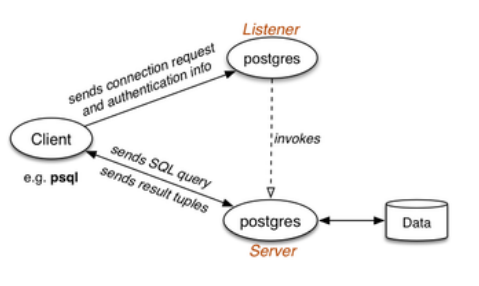
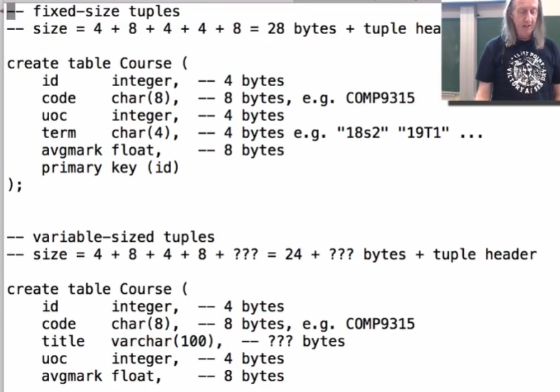

# COMP9315 DBMS Implementation

## Week 01

**课程的主要研究对象**：关系型数据库管理系统中的数据结构和算法


### 课程目标

为我们介绍：

- 关系型数据库管理系统的组织架构。(以PostgreSQL为例)
- 用于数据密集型计算的算法和数据结构。
- 关系型数据库中对象的表示。
- 关系运算符的表示。(sel:筛选, proj：投影, join：连接)
    - sel: 从数据库表中选择满足特定条件的行，类似于SQL中的`where`
    - proj: 从数据库表中选择满足特定条件的列，类似于SQL中的`select`
    - join: 将多个表基于共同的列值关联起来形成新的表，类似于SQL中的`join`
- SQL查询处理技术。
    - 当我们输入一个SQL查询时，在得到查询结果之前，是如何处理的。
- 并发事务管理技术
- 非关系型数据库中的一些概念


建立以下技能：

- 分析数据密集型算法算法的性能。
- 使用C语言来实现数据密集型算法。


### 练习1 SQL (复习)


```sql
select s.sid, s.name, e.mark
from Students s join Enrolments e join Courses c
where c.code = 'COMP9315' and c.term = '18s2' and e.mark >= 50
```


### 练习2 Unix File I/O (复习)


```c++
#include <stdlib.h>
#include <stdio.h>
#include <io.h>
#include <fcntl.h>

void giveUp(char*);

// argc记录参数的个数，至少为1（即文件本身）
// argv可以理解成一个二维的字符数组，记录每一个参数
int main(int argc, char** argv) {
    char* buf; // 指向缓冲区的指针
    int inf; // file descriptor 文件指示器
    int bufsize; // 缓冲区的大小
    ssize_t nread; // 记录读入多少个字节
    int nblocks = 0, nbytes = 0; // 记录总块数，总字节数

    if (argc < 3) giveUp("Insufficient args");
    bufsize = atoi(argv[1]); // atoi(Ascii to integer) 将字符串转换成整型数
    if (bufsize < 100) giveUp("Invalid buffer size");
    buf = malloc(bufsize * sizeof(char));
    if (buf == NULL) giveUp("Can't create buffer");

    // open file
    if ((inf = open(argv[2], O_RDONLY)) < 0) {
        giveUp("Can't read file");
    }

    // read file and count blocks/bytes

    while ((nread = read(inf, buf, bufsize)) != 0) {
        // printf("%ld", tell(inf)); // 读写指针在不断后移
        nblocks++;
        nbytes += nread;
        printf("%ld bytes read in current block\n", nread);
    }

    // display results
    printf("Read %d blocks and %d bytes\n", nblocks, nbytes);

    exit(EXIT_SUCCESS);
}

void giveUp(char* msg) {
    fprintf(stderr, "Error: %s\n", msg);
    fprintf(stderr, "Usage: ./blocks BlockSize InputFile\n");
    exit(EXIT_FAILURE);
}
```

==output==

```txt
PS D:\XiaoTong\COMP9315-master\Lecture Exercises\week01\Ex2> .\blocks.exe 4096 .\big.txt
4096 bytes read in current block
4096 bytes read in current block
4096 bytes read in current block
4096 bytes read in current block
4096 bytes read in current block
1959 bytes read in current block
Read 6 blocks and 22439 bytes
```


### 实践工作

在本课程中，我们使用PostgreSQL v11.3

实践工作要求，从源码编译PostgreSQL

- ==PostgreSQL docs== 介绍了如何在windows上进行编译。

PostgreSQL是一个大型的软件系统：

- 在内部核心引擎/客户端中，包含＞1700个源码文件。
- 在内核中，包含＞1,000,000行C代码。

我们不需要完全弄清楚这些，我们需要学习的是如何高效地浏览这些代码。在课程中将会探讨相关parts来帮助我们实现这个目标。


### RDBMS的功能

关系型数据库管理系统提供了丰富的功能：

- 存储/修改 数据和元数据(数据的定义)
- 对定义/存储/维护/检查等操作进行了约束，确保数据的一致性。
- 数据的声明操作(via SQL)
- 通过视图、触发器和存储程序的可扩展性
- 查询重写（规则）、优化（索引）
    - 对查询进行分析和解释，并尝试对其进行优化，以提高查询性能和效率
- 事务处理、并发/恢复

所有RDBMS常见特点是：**关系模型**，**SQL**(Structured query language)


### 数据定义

关系数据：关系/表、元组、值、类型等

```sql
create domain WAMvalue float check (value between 0.0 and 100.0);
create table Students (
	id integer, -- e.g. 3123456
	familyName text, -- e.g. 'Smith'
	givenName text, -- e.g. 'John'
	birthDate date, -- e.g. '1-Mar-1984'
	wam WAMvalue, -- e.g. 85.4
	primary key (id)
);
```

上面的语句向数据库中添加了元数据，DBMSs通常以一种特殊的table(catalog)来存储元数据。

> catalog记录了数据库中的各种对象，例如表、视图、索引、触发器和存储过程等。
>
> 它提供了有关这些对象的详细信息，包括它们的名称、所属模式、列定义、数据类型、约束条件等。

#### DDL：Data Definition Languages


其中，status为返回的状态信息，告诉我们数据表是否成功创建。

#### 数据约束

Constraints是数据定义的一个重要方面，包括：

- <font color=blue>属性约束</font>
- <font color=orange>元组约束</font>
- <font color=red>关系约束</font>
- <font color=green>引用完整性约束</font>


### 数据修改

DBMS的一个关键作用是：修改数据

- `insert` 向数据表中插入新的元组。
- `delete` 从表中删除存在的元组。
- `update` 更新存在的元组中的值。

例子：

```sql
# 插入
insert into Enrolments(student,course,mark) values (3312345, 5542, 75);
# 更新
update Enrolments set mark = 77 where student = 3354321 and course = 5542;
# 删除
delete Enrolments where student = 3112233;
```

#### DML：Data Manipulation Language


其中，status为返回的状态信息，告诉我们数据表的插入、修改、删除操作是否完成。


### 查询处理

查询处理是RDBMS最常用的功能

- 读取一个SQL查询。
- 返回一个查询结果的表。

例子：

```sql
select s.id, c.code, e.mark
from Students s
join Enrolments e on s.id = e.student
join Courses c on e.course = c.id;
```


### DBMS框架

这部分的目的在于：

- 了解DBMS框架内部结构
- 发现它使用的各种机制
- 理解并分析其性能


为什么要关注这些内容：

- 如果我们了解查询处理器的工作原理，可以帮助我们更好地编写高效的查询
- DBMS 包含有趣的数据结构和算法，这在RDBMS之外也可能有用


下图所示的是DBMS的一个框架概况：


- 首先，SQL查询语句被输入到解析器(Parser)中，并被转换成一个树结构的关系代数表示。
- 然后通过一个优化器(Optimizer)，将关系代数树进行一定的转换处理，从而使查询处理更加高效。
- RA Ops是一系列关系代数操作的整合，它们一起输入到数据库引擎中进行处理，从而获得查询结果元组，并进行展示。


- 数据以特定格式存储在硬盘之中，通过Storage Management来进行管理(存储格式，存储位置等)。
- 我们从磁盘中捕获到这些数据之后，会将其放入Buffer Pool(缓存池)中进行管理，从而提高数据读写速度。
- 通过Files and Access Methhods来实现对数据的读写操作。
- Relational Operators中包含了各种关系运算的实现方法。
- 通过Query Evaluation来评估代数运算符应该在何时进行操作，从而优化查询效率。
- 自顶向下依次经过各个结构之后，就完成了SQL的查询过程。


与DBMS架构相关的重要因素：

- 数据永久存储在大型慢速设备上
- 数据在小型快速存储器中处理

影响：

- 数据结构应尽量减少存储利用率
- 算法应尽量减少内存/磁盘数据传输

现代DBMS通过O/S文件系统与存储交互。


### 数据引擎操作

==数据引擎 = 关系代数虚拟机==

数据操作包括：


对于每一种数据操作：

- 存在多种数据结构和算法可供选择。
- 但是DBMS可能只提供一种，或者提供一个选择。


### 关系代数

关系代数（RA）可以被视为：

- 用于操纵关系的数学语言
- 或者是用于关系模型的数据操作语言 (DML)


核心RA操作包括：

- selection: 选择行
- projection: 选择列
- product,join: 组合表
- union,intersection,difference: 组合表
- rename: 修改表/属性的名称


常见的拓展包括：

- sorting (order by)
- partition (group by)

[其他关于RA的信息参考 week01.pdf-35~43](Lectures/week01.pdf)


### 练习3 关系代数


```txt
Tmp1 = join[sid](Students,Enrolments)
Tmp2 = join[cid](Tmp1,Courses)
Tmp3 = sel[code=9315 and term=18s2 and mark >=50]Tmp2
Res  = proj[sid,name,mark]Tmp3
```


### 关系代数引擎


### Catalogs

考虑RDBMS需要哪些有关关系的信息：

- 每个关系的名称、所有者、主键
- 每个属性的名称、数据类型、约束
- 对每个关系的操作授权

以上这些信心被存储在系统catalog表中

`create`,`drop`,`alter`,`grant`等操作均会对catalog表产生影响


### PostgreSQL简介

PostgreSQL是一个功能齐全的开源(R)DBMS，提供了一个关系引擎，具备以下特点：

- 关系操作的高效实现
- 事务处理（并发访问）
- 备份/恢复（应用程序/系统故障情况下）
- 新颖的查询优化（基于遗传算法）
- 复制、JSON、可扩展索引等等
- 已经支持多种非标准数据类型
- 允许用户定义自己的数据类型
- 支持大部分SQL3标准


### PostgreSQL功能

PostgreSQL处理各种各样的实体：

| 实体           | 说明                       |
| -------------- | -------------------------- |
| users          | 谁可以访问该系统           |
| groups         | 用户组，用于基于角色的权限 |
| databases      | schemas/tables/views的集合 |
| tables         | 元组的集合                 |
| views          | 虚拟table，可以被更新      |
| functions      | 对table中数据的操作        |
| triggers       | 响应事件而调用的操作       |
| operators      | 具有中缀语法的函数         |
| aggregates     | 对整个表列的操作           |
| types          | 用户定义的数据类型         |
| rules          | 用于query的重写            |
| access methods | 高效访问表中的元组         |


PostgreSQL的SQL大部分是标准的（但有扩展）

- 包含原子值数组的属性

    ```sql
    create table R (id integer, values integer[]);
    insert into R values (123, '{5,4,3,2,1}');
    ```

- 表类型继承

    ```sql
    create table S (x float, y float);
    create table T inherits (R, S);
    ```

- 表值函数(能返回一个表的函数)

    ```sql
    create function f(integer) returns setof TupleType;
    ```

    

PostgreSQL存储过程与SQL标准不同：

- 仅提供函数功能，而不是过程（但函数可以返回void，实际上相当于过程）
- 允许函数重载（相同的函数名称，不同的参数类型）
- 在不同的"词法级别"上定义，与SQL不同
- 提供了自己类似于PL/SQL语言的函数语言


PostgreSQL拥有一个清晰明确且开放的可扩展性模型：

- 存储过程以字符串形式保存在数据库中
    - 允许使用多种编程语言
    - 语言解释器可以集成到引擎中
- 可以添加新的数据类型、操作符、聚合函数和索引
    - 通常需要使用C语言编写代码，遵循定义好的API
    - 对于新的数据类型，需要编写输入/输出函数等...
    - 对于新的索引，需要实现文件结构等...


### PostgreSQL的架构

#### 客户服务器框架


用户通过客户端与后台程序进行身份验证，并建立连接关系，后台程序监听到客户端的请求时，会在服务端派生一个服务进程，服务端会处理来自客户端的查询请求，并返回结果元组给客户端


#### 内存/存储结构


Postgres大量使用唯一的共享内存，并在共享内存中设置大量缓冲区空间。共享内存中会设置一些表，所有这些进程可以访问共享内存中的数据。客户端不能直接访问数据库数据，必须通过建立后端服务才能读写数据。buffers的作用是提高数据的访问效率，但是数据必须存储在Disk中以避免丢失，然后在使用时需要将数据从disk中读取到buffers中。


#### 文件系统结构


- base： 存储database数据
- global： 存放的文件用于存储全局的系统表信息和全局控制信息
- pg_xlog: 用于存放事务日志信息文件。
- pg_hba.conf：指定了哪些IP地址和哪些用户可以连接到Postgresql数据库，同时规定了用户必须用什么身份验证方式登陆

**注意：**PostgreSQL从版本10开始引入了一个重要的更改，即将事务日志 (transaction logs) 存储在"pg_wal"目录中，而不是以前的"pg_xlog"目录。所以，如果你的PostgreSQL版本是10或更高，那么在"PGDATA"目录下将没有"pg_xlog"文件夹，而是使用"pg_wal"目录来保存事务日志。


### PostgreSQL源码结构

PostgreSQL发行版的顶层包含：

- README,INSTALL：概述和安装说明
- config*：构建本地化Makefile的脚本
- Makefile：控制系统构建的顶层脚本
- src：包含系统源代码的子目录
- doc：常见问题解答和文档（可以删除以节省空间）
- contrib：贡献扩展的源代码


源代码目录（src）包含：

- include：具有全局定义的*.h文件（常量、类型……）
- backend：PostgreSQL数据库引擎的代码
- bin：客户端代码（例如 psql、pg_ctl、pg_dump，...）
- pl：存储过程语言解释器（例如 plpgsql）
- interfaces：底层C接口的代码（例如 libpq）

src目录下的内容将和Makefiles结合，来构建整个系统以及其他一些目录。


如何开始了解PostgreSQL的工作原理：

- 熟悉用户级界面
    - psql、pg_dump、pg_ctl
- 从 *.h 文件开始，然后移至 *.c 文件
    - \*.c 文件位于 src/backend/* 下
    - *.h 文件位于 src/include 下）
- 从全局开始，然后一次只工作一个子系统


### PostgreSQL查询的生命周期

PostgreSQL 查询是如何执行的：

- SQL查询字符串在客户端生成
- 客户端建立与PostgreSQL的连接
- 附加到客户端的专用服务器进程
- SQL查询字符串发送到服务器进程
- 服务器解析/计划/优化查询
- 服务器执行查询以生成结果元组
- 元组被传输回客户端
- 客户端与服务器断开连接




## week 02

需要补充....


## week 03

### 元组在table中的存储

从抽象观点来看，一个table包含了一系列的tuple。

但是具体来看，一个table包含了一系列的page，在一个page中包含了多个rec，而一个rec对应于一个tuple


### Page的格式

Page在本质上就是一个字节数组(byte[])，将它视为record的集合来进行解释和操作。

对于pages和records的典型操作包括：

- request_page(rel,pid) // 通过PageId获取page
- get_record(buf,tid) // 从buffer中获得record
- insert_record(rel,pid,rec) // 添加新的rec
- update_record(rel,rid,rec) //更新record的值
- delete_record(rel,rid) // 删除record

其中：`rid=(PageId, TupIndex )`,`rel=open relation`


```c
Record get_record(Relation rel, RecordId rid) {
    (pid, tid) = rid;
    Page* buf = get_page(rel, pid);
    Record rec = get_record(buf, tid);
    return rec;
}
```

 

### record在Page中的管理方式

这取决于records是否是固定长度，或者是可变长度。



#### 固定长度

对于长度固定的records，使用record slots

- insert：place new record in first available slot
- delete: mark slot as free, or set xmax

==withDict.c==

```c
// insert into a page with fixed-size records
// and distributed free space and slot bitmap

// Assume the following definitions

typedef ... Byte;    // one-byte value
typedef ... Count;   // two-byte value

#define PAGESIZE ...
#define DICTSIZE ...

#define MAXRECS (PAGESIZE-DICTSIZE)/rel.recSize

typedef struct {
	Bit     present[MAXRECS];  // bitmap
	Record  data[1];   // start of tuples
} Page;

// Initialise Page data

void initPage(Relation rel, PageId pid, Page *p)
{
	// p is a pointer to a PAGESIZE buffer
	for (int i = 0; i < MAXRECS; i++)
		p->present[i] = 0;
	put_page(p, rel, pid);
}

// Add record into Page; return record ID

RecordId insert_record(Relation rel, PageId pid, Record rec)
{
	// get Page
	Page *p = get_page(rel, pid);
	// find a free slot
	int slot = -1;
	for (int i = 0; i < MAXRECS; i++)
		if (p->present[i] == 0) {
			slot = i;
			break;
		}
	}
	if (slot < 0) FAIL no room;
	Byte *location = &(p->data) + slot*rel.recSize;
	memcpy(location, r, rel.recSize); // 将r指向内容，复制recSize个字节给location指向的空间
	put_page(p, rel, pid);
	return (pid,slot);
}

// Delete record from Page;

void delete_record(Relation rel, TupleId rid)
{
	(pid,tid) = rid;
	Page *p = get_page(rel, pid);
	p->present[i] = 0;
	put_page(p, rel, pid);
}
```

==withXmax.c==

```c
// insert into a page with fixed-size records
// and distributed free space and MVCC

// Assume the following definitions

typedef ... Byte;    // one-byte value
typedef ... Count;   // two-byte value

#define PAGESIZE ...

#define MAXRECS  (PAGSIZE/rel.recSize)

typedef struct {
	Record  data[1];   // start of tuples
} Page;

// Initialise Page data

void initPage(Relation rel, PageId pid, Page *p)
{
	Record *r;
	for (int i = 0; i < MAXRECS; i++) {
		r = &(p->data) + i*rel.recSize;
		r->xmax = 0;
	}
	put_page(p, rel, pid);
}

// Add record into Page; return record ID

RecordId insert_record(Relation rel, PageId pid, Record rec)
{
	// get Page
	Page *p = get_page(rel, pid);
	// find a free slot
	int slot = -1;
	for (int i = 0; i < MAXRECS; i++)
		Record *r = &(p->data) + i*rel.recSize;
		if (r->xmax == 0) {
			slot = i;
			break;
		}
	}
	if (slot < 0) FAIL no room;
	Byte *location = &(p->data) + slot*rel.recSize;
	memcpy(location, r, rel.recSize);
	put_page(p, rel, pid);
	return (pid,slot);
}

// Delete record from Page;

void delete_record(Relation rel, TupleId rid)
{
	(pid,tid) = rid;
	Page *p = get_page(rel, pid);
	Record *r = &(p->data) + tid*rel.recSize;
	r->xmax = currentTxId;
	put_page(p, rel, pid);
}

```


#### 可变长度

对于可变长度的records，必须使用record directory。

- directory[i]记录了页面中第i个记录的存储位置
- 在page中，元组的存储位置可以改变，但是tuple index(tid)不改变


