# CUDA、CUDNN以及Pytorch的安装记录

以下记录均在**Windows11**系统

## 1. 显卡、驱动、CUDA、CUDNN、Pytorch简介

- **显卡**：即GPU，大致分为两类：Nvidia GPU以及AMD GPU，目前市场上主流是Nvidia的GPU。深度学习本身需要大量计算，而GPU的并行计算能力，在过去几年里恰当地满足了深度学习的需求。但是AMD的GPU基本没有什么支持。
- **驱动**：没有显卡驱动，就不能识别GPU硬件，不能调用其计算资源。
- **CUDA**：是Nvidia推出的只能用于自家GPU的并行计算框架。只有安装这个框架才能够进行复杂的并行计算。主流的深度学习框架也都是基于CUDA进行GPU并行加速的，几乎无一例外。
- **CUDNN**：是针对深度卷积神经网络的加速库。
- **Pytorch**：是一个基于Python的科学计算软件包，针对两组受众：
  - 替代NumPy以使用GPU的功能
  - 提供最大灵活性和速度的深度学习研究平台

我们在借助pytorch框架进行机器学习相关内容时，一般都会在GPU上进行模型的训练。然而，在能够使用GPU运算之前，我们需要安装CUDA以及CUDNN。在安装时，需要保证**三个相匹配**：

1. CUDA版本与显卡驱动版本相匹配
2. CUDNN版本与CUDA版本相匹配
3. pytorch版本与CUDA版本相匹配

（详细内容会在各自的安装过程中加以展示）

## 2. CUDA的安装

**第一步：检查自己的GPU驱动版本号**

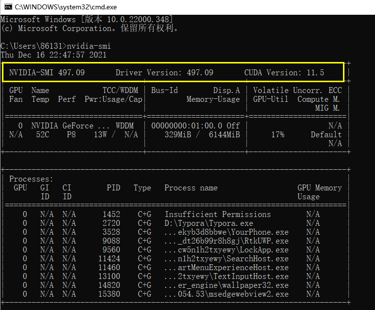

如图所示，NVIDIA-SMI以及Driver Version后面的数字即为驱动的版本号，我们需要根据这个版本号安装合适的CUDA。驱动版本和CUDA的对应关系在如下网站查询：https://docs.nvidia.com/cuda/cuda-toolkit-release-notes/index.html

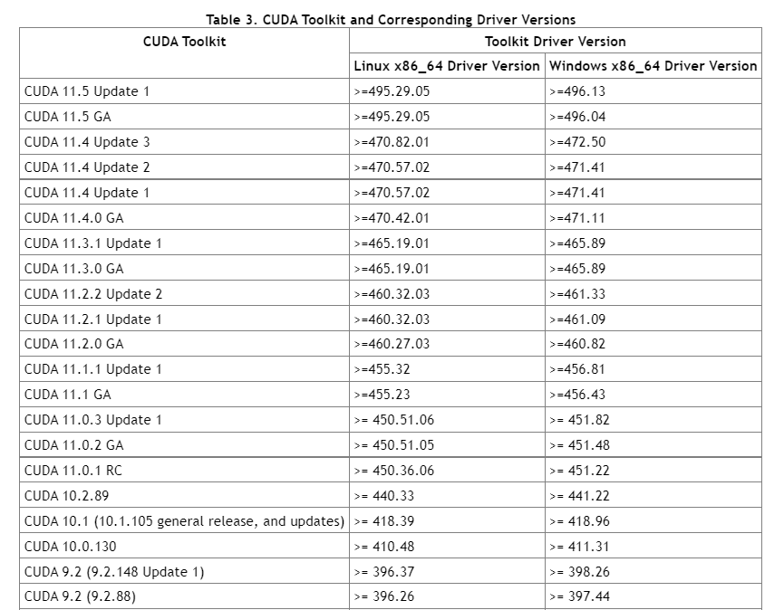

**第二步：安装**

找到合适的CUDA版本之后，我们就可以在CUDA官网下载对应的安装包，下面以CUDA11.5为例：

https://developer.nvidia.cn/cuda-downloads?target_os=Windows&target_arch=x86_64&target_version=11&target_type=exe_local

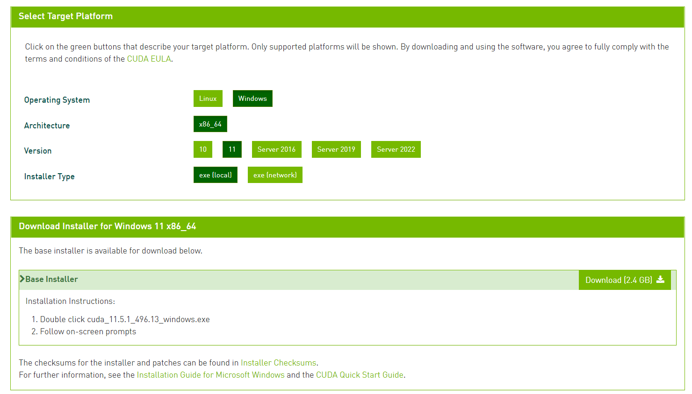

下载之后，安装到默认路径`C:\Program Files\NVIDIA GPU Computing Toolkit\CUDA`即可，不建议改换路径。如果之前也安装过CUDA，安装另一个版本时并不会自动删除原来版本，此时可以从此路径下自行删除。

安装过程中，一般会自动配置环境变量，我们可以自行删除上一个版本的环境变量。

我们可以自行检查一下环境变量是否配置好，如果未自动配置，我们需要手动将下面两个路径添加到环境变量中：

`C:\Program Files\NVIDIA GPU Computing Toolkit\CUDA\v11.5`

`C:\Program Files\NVIDIA GPU Computing Toolkit\CUDA\v11.5\lib\x64`

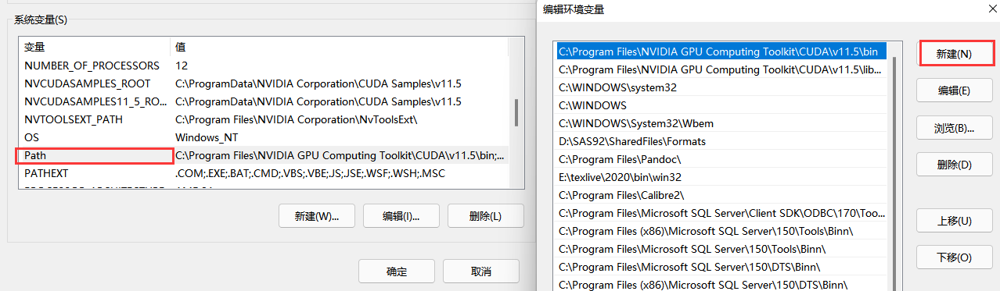

**第三步：验证**

安装之后，我们在命令行输入 `nvidia-smi` 或者 `nvcc -V` 即可查看CUDA版本号。如果显示结果如下，则CUDA安装成功

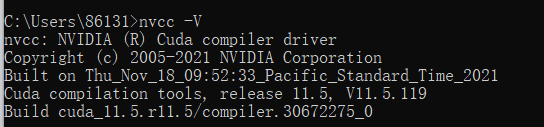

## 3. CUDNN的安装

**第一步：CUDNN安装包的下载**

Cudnn下载页面：https://developer.nvidia.com/rdp/cudnn-download

下载cuDNN是需要登录英伟达开发者账户的，注册一个并填写问卷就行。

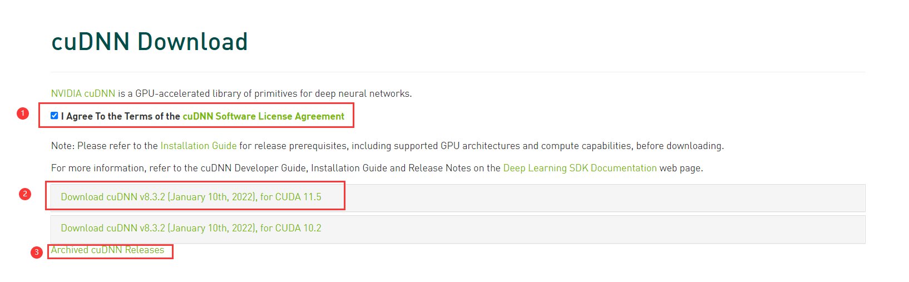

进入下载页面后，要勾选`I Agree To the Terms ....`，然后，就会自动弹出下载选项。我们需要**根据自己的CUDA版本下载对应的Cudaa**(这里以最上面的版本为例)，如果想要查看更多的版本，点击`Archived cuDNN Releases`即可。

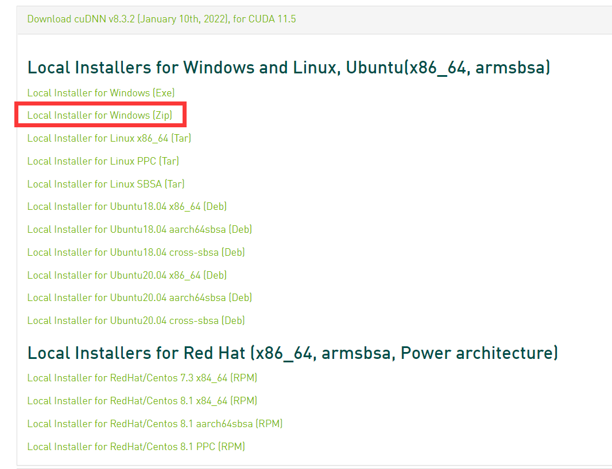

然后，选择自己需要的下载包，windows系统推荐`Local Installer for Windows (Zip)`

**第二步： CUDNN的安装**

解压cuDNN压缩包，可以看到bin、include、lib目录

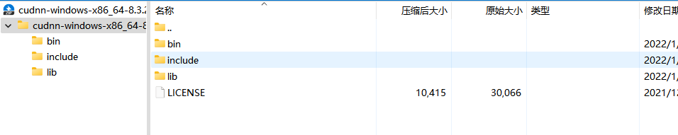

打开 `C:\Program Files\NVIDIA GPU Computing Toolkit\CUDA`

找到你安装的版本目录，打开，找到bin、include、lib目录，将cuDNN压缩包内**对应的文件**复制到bin、include、lib目录。

注意：是复制文件到bin、include、lib目录，不是复制目录。

复制完成之后，cudnn的安装就完成了。

**第三步：检测是否安装成功**

打开 C:\Program Files\NVIDIA GPU Computing Toolkit\CUDA\v11.5\extras\demo_suite

在此路径下打开powershell

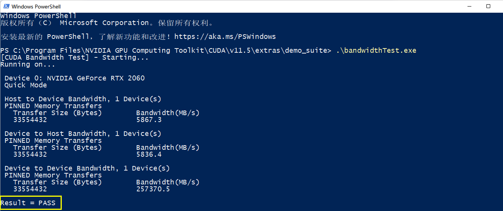

## 4. Pytorch的安装

**第一步：下载**

pytorch下载页面https://pytorch.org/

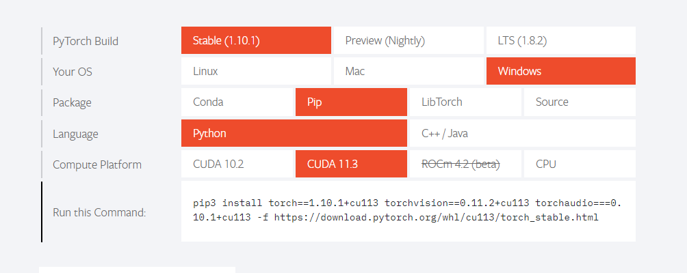

我们可以根据需要选择Conda下载或者Pip下载，注意要**尽量**保证Pytorch版本和CUDA版本相匹配，据测试CUDA11.5可以用CUDA11.3版本的Pytorch。

## 5. 检测最终效果

当CUDA、CUDNN和pytorch均已安装完成之后，我们可以借助以下方法检测pytorch是否可以使用GPU加速。

**第一步：命令行调用Python**

**第二步：导入torch包**：`import torch`

**第三步：调用函数：**`torch.cuda.is_available()`

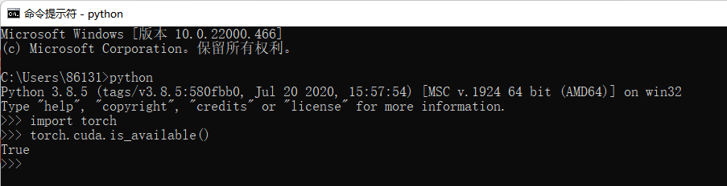

如果输出结果为True则大功告成！

