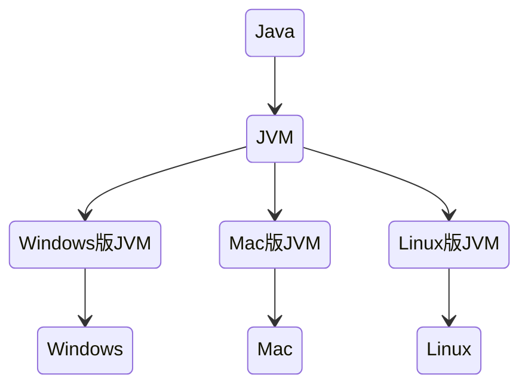
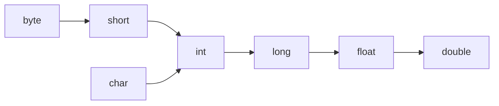

[TOC]


# Java学习笔记

## 1. Java语言介绍

### 1.1 Java语言跨平台原理




在需要运行Java应用程序的操作系统中，安装一个与操作系统对应的Java虚拟机即可。Java虚拟机(JVM)就像一个翻译一样，将java语言程序翻译成各种操作系统能够运行的程序。


### 1.2 JRE和JDK

#### 1.2.1 JRE(Java Runtime Environment)

java程序的运行时环境，包含JVM和java程序运行时所需要的核心类库。我们想要**运行**一个已有的java程序，那么只需要安装JRE即可。

#### 1.2.2 JDK(Java Development Kit)

Java程序开发工具包，包含JRE和开发人员使用的工具。其中，开发工具包括：编译工具(javac.exe)和运行工具(java.exe)。

我们如果想要开发java程序，就必须安装JDK

<center></center>


### 1.3 配置环境变量

#### 1.3.1 为什么要配置Path变量

为了在开发Java程序的时候，能够方便的使用javac和java命令，我们需要配置Path环境变量。否则，我们必须在JDK安装目录的bin目录下才可以使用。

#### 1.3.2 配置环境变量

参见：https://xiaotong-sun.gitee.io/2011732418.html

提示：如果命令提示符窗口是在配置前打开的，需要关闭该窗口，重新打开一个新的窗口测试。


## 2. java入门

### 2.1 java程序开发运行流程


### 2.2 HelloWorld案例

```java
// HelloWorld.java
public class HelloWorld {
    public static void main(String[] args) {
        System.out.println("HelloWorld");
    }
}
```

在命令提示符窗口，编译并运行

- 编译：javac HelloWorld.java
- 运行:  java HelloWorld


## 3. java基础语法

### 3.1 关键字

- 关键字的字母全部小写
- 常用的代码编辑器，针对关健字有特殊颜色标记。
- 例如：`public`, `class`, `static`, `void`等。


### 3.2 常量

常量：在程序运行过程中，其值不可以发生改变的量。

| **常量类型** |                **说明**                | **举例**       |
| :----------: | :------------------------------------: | :------------- |
|  字符串常量  |          用双引号括起来的内容          | "HelloWorld"   |
|   整数常量   |             不带小数的数字             | 666， -8       |
|   小数常量   |              带小数的数字              | 1.1， 3.14     |
|   字符常量   |          用单引号括起来的内容          | 'A', '0', '我' |
|   布尔常量   |            布尔值，表示真假            | true，false    |
|    空常量    | 一个特殊的值：空值(空常量不能直接输出) | null           |


### 3.3 数据类型

#### 3.3.1 类型

java是强类型语言，对于每一种数据都给出明确的数据类型，不同的数据类型分配不同的内存空间，因此它们表示的数据大小也是不一样的。

<center></center>


#### 3.3.2 内存占用和取值范围

<center></center>


### 3.4 变量

变量：在程序运行过程中，其值可以发生改变的量

从本质上讲，变量是内存中的一小块区域。

#### 3.4.1 变量定义

- 格式：数据类型 变量名 = 变量值
- 范例：`int a = 10`

**注意事项：**

1. 整数变量默认类型为int， 浮点数变量默认为double
2. 变量名字不能重复
3. 变量未赋值不能使用
4. long类型的变量定义时，为了防止整数过大，后面要加L
5. float类型的变量定义时，为了防止类型不兼容，后面要加F

```java
public class VariableDemo {
    public static void main(String[] args) {
        long l = 10000000000L;	// 不能这样声明：long l = 10000000000
        System.out.println(l);
        float f = 3.14f;		// 不能这样声明：float f = 3.14
        System.out.println(f);
    }
}
```


### 3.5 标识符

#### 3.5.1 规则

1. 由数字、字母、下划线(`_`)和美元符(`$`)组成
2. 不能以数字开头
3. 不能是关键字
4. 区分大小写


#### 3.5.2 常见命名约定

<center></center>


### 3.6 类型转换

#### 3.6.1 自动类型转换

将一个表示**数据范围小**的数值或变量赋值给另一个表示**数据范围大**的变量。




#### 3.6.2 强制类型转换

将一个表示**数据范围大**的数值或变量赋值给另一个表示**数据范围小**的变量。

- 格式：目标数据类型 变量名 = (目标数据类型)值或者变量
- 范例：`int k = (int)88.88`


### 3.7 算术运算符

| 符号 | 作用 |
| :--: | :--: |
|  +   |  加  |
|  -   |  减  |
|  *   |  乘  |
|  /   |  除  |
|  %   | 取余 |

注意：整数相除只能得到整数，要想得到小数，必须有浮点数的参与


#### 3.7.1 字符串的“+”操作

```java
public class VariableDemo {
    public static void main(String[] args) {
        System.out.println("hello" + "world");
        // "helloworld"
        System.out.println("helloWorld" + 666);
        // "helloWorld666"
        System.out.println("helloWorld" + 6 + 66);
        // "helloWorld666"
        System.out.println(1 + 99 + "hello");
        // "100hello"   !!!!
    }
}
```


### 3.8 逻辑运算符

| 符号 |   作用   |                   说明                   |
| :--: | :------: | :--------------------------------------: |
|  &   |  逻辑与  |           结果均为true则为true           |
|  \|  |  逻辑或  |          结果均为false则为false          |
|  ^   | 逻辑异或 |     结果不同则为true，相同则为false      |
|  !   |  逻辑非  | 结果为true则为false，结果为false则为true |


### 3.9 短路逻辑运算符

| 符号 |  作用  |           说明           |
| :--: | :----: | :----------------------: |
|  &&  | 短路与 | 如果左边为假，右边不执行 |
| \|\| | 短路或 |   左边为真，右边不执行   |


### 3.10 三元运算符

- 格式：关系表达式?表达式1：表达式2
- 范例：a>b?a:b;

计算规则：

1. 首先计算关系表达式的值
2. 如果值为true，表达式1的值就是运算结果
3. 如果值为false，表达式2的值就是运算结果
