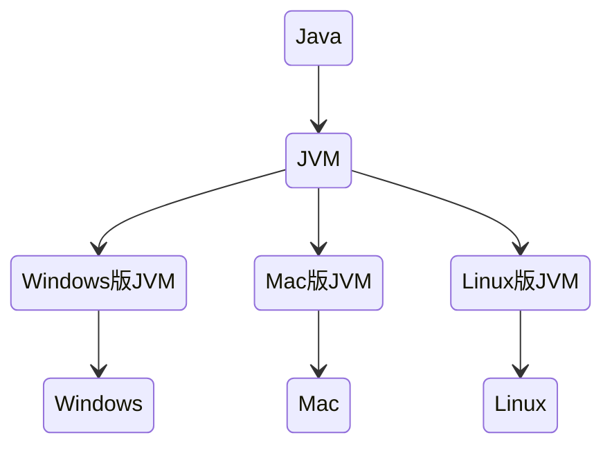
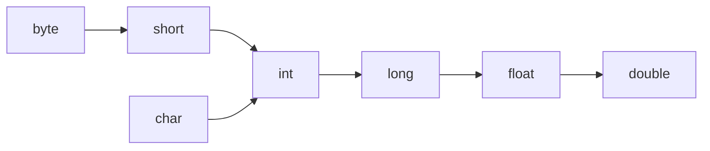

# Java学习笔记

## 1. Java语言介绍

### 1.1 Java语言跨平台原理




在需要运行Java应用程序的操作系统中，安装一个与操作系统对应的Java虚拟机即可。Java虚拟机(JVM)就像一个翻译一样，将java语言程序翻译成各种操作系统能够运行的程序。


### 1.2 JRE和JDK

#### 1.2.1 JRE(Java Runtime Environment)

java程序的运行时环境，包含JVM和java程序运行时所需要的核心类库。我们想要**运行**一个已有的java程序，那么只需要安装JRE即可。

#### 1.2.2 JDK(Java Development Kit)

Java程序开发工具包，包含JRE和开发人员使用的工具。其中，开发工具包括：编译工具(javac.exe)和运行工具(java.exe)。

我们如果想要开发java程序，就必须安装JDK

<center></center>


### 1.3 配置环境变量

#### 1.3.1 为什么要配置Path变量

为了在开发Java程序的时候，能够方便的使用javac和java命令，我们需要配置Path环境变量。否则，我们必须在JDK安装目录的bin目录下才可以使用。

#### 1.3.2 配置环境变量

参见：https://xiaotong-sun.gitee.io/2011732418.html

提示：如果命令提示符窗口是在配置前打开的，需要关闭该窗口，重新打开一个新的窗口测试。


## 2. java入门

### 2.1 java程序开发运行流程


### 2.2 HelloWorld案例

```java
// HelloWorld.java
public class HelloWorld {
    public static void main(String[] args) {
        System.out.println("HelloWorld");
    }
}
```

在命令提示符窗口，编译并运行

- 编译：javac HelloWorld.java
- 运行:  java HelloWorld


## 3. java基础语法

### 3.1 关键字

- 关键字的字母全部小写
- 常用的代码编辑器，针对关健字有特殊颜色标记。
- 例如：`public`, `class`, `static`, `void`等。


### 3.2 常量

常量：在程序运行过程中，其值不可以发生改变的量。

| **常量类型** |                **说明**                | **举例**       |
| :----------: | :------------------------------------: | :------------- |
|  字符串常量  |          用双引号括起来的内容          | "HelloWorld"   |
|   整数常量   |             不带小数的数字             | 666， -8       |
|   小数常量   |              带小数的数字              | 1.1， 3.14     |
|   字符常量   |          用单引号括起来的内容          | 'A', '0', '我' |
|   布尔常量   |            布尔值，表示真假            | true，false    |
|    空常量    | 一个特殊的值：空值(空常量不能直接输出) | null           |


### 3.3 数据类型

#### 3.3.1 类型

java是强类型语言，对于每一种数据都给出明确的数据类型，不同的数据类型分配不同的内存空间，因此它们表示的数据大小也是不一样的。

<center></center>


#### 3.3.2 内存占用和取值范围

<center></center>


### 3.4 变量

变量：在程序运行过程中，其值可以发生改变的量

从本质上讲，变量是内存中的一小块区域。

#### 3.4.1 变量定义

- 格式：数据类型 变量名 = 变量值
- 范例：`int a = 10`

**注意事项：**

1. 整数变量默认类型为int， 浮点数变量默认为double
2. 变量名字不能重复
3. 变量未赋值不能使用
4. long类型的变量定义时，为了防止整数过大，后面要加L
5. float类型的变量定义时，为了防止类型不兼容，后面要加F

```java
public class VariableDemo {
    public static void main(String[] args) {
        long l = 10000000000L;	// 不能这样声明：long l = 10000000000
        System.out.println(l);
        float f = 3.14f;		// 不能这样声明：float f = 3.14
        System.out.println(f);
    }
}
```


### 3.5 标识符

#### 3.5.1 规则

1. 由数字、字母、下划线(`_`)和美元符(`$`)组成
2. 不能以数字开头
3. 不能是关键字
4. 区分大小写


#### 3.5.2 常见命名约定

<center></center>


### 3.6 类型转换

#### 3.6.1 自动类型转换

将一个表示**数据范围小**的数值或变量赋值给另一个表示**数据范围大**的变量。




#### 3.6.2 强制类型转换

将一个表示**数据范围大**的数值或变量赋值给另一个表示**数据范围小**的变量。

- 格式：目标数据类型 变量名 = (目标数据类型)值或者变量
- 范例：`int k = (int)88.88`


### 3.7 算术运算符

| 符号 | 作用 |
| :--: | :--: |
|  +   |  加  |
|  -   |  减  |
|  *   |  乘  |
|  /   |  除  |
|  %   | 取余 |

注意：整数相除只能得到整数，要想得到小数，必须有浮点数的参与


#### 3.7.1 字符串的“+”操作

```java
public class VariableDemo {
    public static void main(String[] args) {
        System.out.println("hello" + "world");
        // "helloworld"
        System.out.println("helloWorld" + 666);
        // "helloWorld666"
        System.out.println("helloWorld" + 6 + 66);
        // "helloWorld666"
        System.out.println(1 + 99 + "hello");
        // "100hello"   !!!!
    }
}
```


### 3.8 逻辑运算符

| 符号 |   作用   |                   说明                   |
| :--: | :------: | :--------------------------------------: |
|  &   |  逻辑与  |           结果均为true则为true           |
|  \|  |  逻辑或  |          结果均为false则为false          |
|  ^   | 逻辑异或 |     结果不同则为true，相同则为false      |
|  !   |  逻辑非  | 结果为true则为false，结果为false则为true |


### 3.9 短路逻辑运算符

| 符号 |  作用  |           说明           |
| :--: | :----: | :----------------------: |
|  &&  | 短路与 | 如果左边为假，右边不执行 |
| \|\| | 短路或 |   左边为真，右边不执行   |


### 3.10 三元运算符

- 格式：关系表达式?表达式1：表达式2
- 范例：a>b?a:b;

计算规则：

1. 首先计算关系表达式的值
2. 如果值为true，表达式1的值就是运算结果
3. 如果值为false，表达式2的值就是运算结果


### 3.11 数据输入

**Scanner使用的基本步骤**

:one: 导包

```java
import java.util.Scanner;
// 导包的动作必须出现在类定义的上边
```

:two: 创建对象

```java
Scanner sc = new Scanner(System.in);
```

:three: 接收数据

```java
int i = sc.nextInt();
```


### 3.12 Random

作用：用于产生一个随机数

使用步骤:

:one: 导包

```java
import java.util.Random;
```

:two: 创建对象

```java
Random r = new Random();
```

:three: 获取随机数

```java
int number = r.nextInt(10);
// 获取随机数的范围为：[0,10), 包括0，但不包括10
```


### 3.13 数组

数据是一种用来存储==多个相同类型数据==的存储类型

#### 3.13.1 数组的定义格式

- 格式一： 数据类型`[]`  变量名
- 范例：`int[] arr`


- 格式二： 数据类型  变量名`[]`
- 范例：`int arr[]`

**注意：**这两种格式在使用上是等价的，但推荐第一种格式。


#### 3.13.2 数组的初始化

**动态初始化：**初始化时仅指定数组长度，由系统为数组分配初始值。

- 格式：数据类型`[]`  变量名 = new 数据类型`[数组长度]`
- 范例：`int[] arr = new int[3];`

**静态初始化：**初始化时，指定每个数组元素的初始值，由系统决定数组长度。

- 格式：数据类型`[]` 变量名 = new 数据类型`[]` {数据1， 数据2， 数据3}；
- 范例：`int[] arr = new int[] {1, 2, 3};`
- 简化格式：`int[] arr = {1, 2, 3};`


#### 3.13.3 内存分配

<center>


## 4. java流程控制

### 4.1 流程控制语句分类

- 顺序结构
- 分支结构`if`, `switch`
- 循环结构`for`, `while`, `do...while`


### 4.2 switch语句格式

```
switch(表达式) {
	case 值1:
		语句体1;
		break;
	case 值2:
		语句体2;
		break;
	...
	default:
		语句体n+1;
		break;
}
```

**注意事项： case穿透**

如果在一个语句体结束之后，没有break，就会继续执行下面的case，直到遇到break为止。合理利用case穿透现象可以简化程序。

```java
// case穿透现象的应用示例
switch(month) {
    case 1:
    case 2:
    case 12:
        System.out.println("冬季");
        break;
    case 3:
    case 4:
    case 5:
        System.out.println("春季");
        break;
}
```


## 5. IDEA的安装与使用


### 5.1 IDEA概述

IDEA是用于Java语言开发的集成环境，它是业界公认的目前用于java程序开发的最好的工具。

**集成环境：**把代码==编写、编译、执行、调试==等多种功能综合到一起的开发工具


### 5.2 IDEA创建项目流程

:one: 创建空项目

<center></center>

:two: 创建新模块

<center></center>

:three: 在模块下的src下创建一个包

<center></center>

:four: 在包下创建一个类

<center>

:five: 在类中编写代码

:six: 在idea中执行程序(生成的class文件在out目录下)

<center>


### 5.3 IDEA项目结构

<center>


### 5.4 IDEA中内容辅助键和快捷键

#### 5.4.1 内容辅助键

- 快速生成语句
    - 快速生成main()方法：`psvm，回车` 或者 `main， 回车`
    - 快速生成输出语句：`sout, 回车`
- 内容辅助键
    - `Ctrl + Alt + space`: 内容提示， 代码补全等(新版本可能无法使用，直接tab即可)。

#### 5.4.2 注释键

- 单行注释：选中代码，`ctrl + /`
- 多行注释：选中代码，`ctrl + shift + /`


### 5.5 IDEA中模块操作

- 新建模块：操作见上面创建项目

- 删除模块

    <center>

- 导入模块

    <center>


## 6. java初级进阶

### 6.1 方法

#### 6.1.1 方法概述

- ==方法==是将具有独立功能的代码块组织成为一个整体，使其具有特殊的代码集。
- 方法必须先创建才能使用，该过程成为==方法定义==
- 方法创建后并不是直接运行的，需要手动使用后才可以执行，该过程称为==方法调用==。


#### 6.1.2 方法定义和调用

- 定义的格式：

    ```java
    public static void 方法名() {
        // 方法体
    }
    ```

- 调用的格式：

    ```java
    方法名();
    ```

- 带参数方法的定义：

    ```java
    public static void isEvenNumber(int a, int b) {
        // 方法体
    }
    ```


#### 6.1.3 方法的注意事项

- 方法==不能嵌套定义==
- void表示无返回值，可以省略return， 也可以单独的书写return，后面不加数据。
- 定义方法时，要做到==两个明确==
    - 明确返回值类型
    - 明确参数类型和数量


#### 6.1.4 方法重载

**方法重载**指同一个类中定义的多个方法之间的关系，这些方法只有满足下列条件才相会构成重载

- 多个方法在==同一个类中==
- 多个方法具有==相同的方法名==
- 多个方法的==参数不相同==或者==类型不同==或者==数量不同==

**特点：**

1. 重载仅对应方法的定义，与方法的调用无关
2. 重载仅针对同一个类中方法的==名称与参数进行识别==，与==返回值无关==，不能通过返回值来判断方法是否重载。
3. 在调用时，java虚拟机会通过==参数的不同==来区分同名的方法。


方法重载范例；

```java
/* 示例一 */
public class MethodDemo {
    public static void fn(int a) {
        // 方法体
    }
    public static void fn(double a) {
        // 方法体
    }
}

/* 示例二 */
public class MethodDemo {
    public static float fn(int a) {
        // 方法体
    }
    public static int fn(int a, int b) {
        // 方法体
    }
}
```


### 6.2 Debug

**Debug:**是供程序员使用的程序调试工具，它可以用于==查看程序的执行流程==，也可以用于追踪程序的执行过程来==调试程序==。

Debug调试又称为断点调试，断点其实是一个标记，告诉我们从哪里查看。


### 6.3 类和对象

#### 6.3.1 类

类的重要性：是java程序的基本组成单位

类的定义：是对现实生活中一类具有==共同属性==和==行为==的事物的抽象，确定对象将会拥有的属性和行为

类的组成：

- 属性：在类中通过==成员变量==来体现(类中方法外的变量)
- 行为：在类中通过==成员方法==来体现。


#### 6.3.2 类的定义

- 步骤：

    ```mermaid
    graph LR;
    	定义类 --> 编写类的成员变量
    	编写类的成员变量 --> 编写类的成员方法
    ```

- 格式：

    ```java
    public class 类名 {
        // 成员变量
        数据类型 变量1;
        数据类型 变量2;
        ....
        // 成员方法
        方法1;
        方法2;
        ....
    }
    ```

- 范例：

    ```java
    public class Phone {
        String brand;
        int price;
        
        public void call() {
            System.out.println("call");
        }
        
        public void sendMessage() {
            System.out.println("message");
        }
    }
    ```


#### 6..3.3 对象

**创建对象：**

- 格式：类名 对象名 = new 类名();
- 范例：`Phone p = new Phone();`

**使用对象：**

1. 使用成员变量
    - 格式：对象名.变量名
    - 范例：`p.brand`
2. 使用成员方法
    - 格式：对象名.方法名
    - 范例：`p.call()`

```java
public class PhoneDemo {
    public static void main(String[] args) {
        Phone p = new Phone();
        p.brand = "小米";
        p.price = 2999;
        System.out.println(p.brand);
        System.out.println(p.price);
        p.call();
        p.sendMessage();
    }
}
```


#### 6.3.4 对象内存图及调用过程

<center>
    
    <br>
    <b>study方法调用完毕后，出栈，doHomework入栈 </b><br>
    
</center>


#### 6.3.5 成员变量和局部变量

<center>


### 6.4 封装

#### 6.4.1 private关键字

- 是一个==权限修饰符==
- 可以修饰成员变量和成员方法
- 作用是：保护成员不被别的类使用，被private修饰的成员只在本类中才能访问

针对private关键字修饰的成员变量，如果需要被其他类使用，必须提供相应的操作

- 提供“get变量名()”方法，获取成员变量的值，方法用public修饰
- 提供“set变量名(参数)",用于设置成员变量的值，方法用public修饰

==通过以上方式可以处理输入数据的安全问题==


范例：

```java
package com.itheima02;

public class Student {
    String name;
    private int age;

    public void setAge(int a) {
        if (a >= 120 || a <= 0) {
            System.out.println("你输入的年龄有误");
        } else {
            age = a;
        }
    }

    public int getAge() {
        return age;
    }

    public void show() {
        System.out.println(name + "," + age);
    }
}


public class StudentDemo {
    public static void main(String[] args) {
        Student stu = new Student();
        stu.name = "小明";
        stu.setAge(-30);
        stu.show();
        stu.setAge(30);
        stu.show();
        System.out.println("getAge方法测试结果：" + stu.getAge());
    }
}

// OUT
你输入的年龄有误
小明,0
小明,30
getAge方法测试结果：30
```


