# Java学习笔记

## 1. Java语言介绍

### 1.1 Java语言跨平台原理

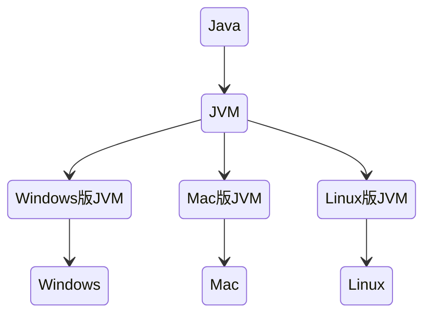
```mermaid
stateDiagram
    Java --> JVM
    JVM --> Windows版JVM
    Windows版JVM --> Windows
    JVM --> Mac版JVM
  Mac版JVM --> Mac
    JVM --> Linux版JVM
    Linux版JVM --> Linux
```


在需要运行Java应用程序的操作系统中，安装一个与操作系统对应的Java虚拟机即可。Java虚拟机(JVM)就像一个翻译一样，将java语言程序翻译成各种操作系统能够运行的程序。


### 1.2 JRE和JDK

#### 1.2.1 JRE(Java Runtime Environment)

java程序的运行时环境，包含JVM和java程序运行时所需要的核心类库。我们想要**运行**一个已有的java程序，那么只需要安装JRE即可。

#### 1.2.2 JDK(Java Development Kit)

Java程序开发工具包，包含JRE和开发人员使用的工具。其中，开发工具包括：编译工具(javac.exe)和运行工具(java.exe)。

我们如果想要开发java程序，就必须安装JDK

<center>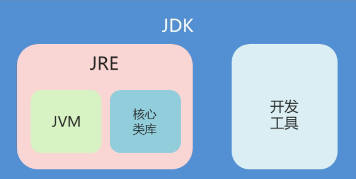</center>


### 1.3 配置环境变量

#### 1.3.1 为什么要配置Path变量

为了在开发Java程序的时候，能够方便的使用javac和java命令，我们需要配置Path环境变量。否则，我们必须在JDK安装目录的bin目录下才可以使用。

#### 1.3.2 配置环境变量

参见：https://xiaotong-sun.gitee.io/2011732418.html

提示：如果命令提示符窗口是在配置前打开的，需要关闭该窗口，重新打开一个新的窗口测试。


## 2. java入门

### 2.1 java程序开发运行流程

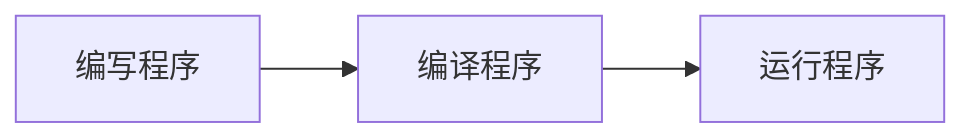
```mermaid
	graph LR;
	编写程序 --> 编译程序 --> 运行程序
```


### 2.2 HelloWorld案例

```java
// HelloWorld.java
public class HelloWorld {
    public static void main(String[] args) {
        System.out.println("HelloWorld");
    }
}
```

在命令提示符窗口，编译并运行

- 编译：javac HelloWorld.java
- 运行:  java HelloWorld


## 3. java基础语法

### 3.1 关键字

- 关键字的字母全部小写
- 常用的代码编辑器，针对关健字有特殊颜色标记。
- 例如：`public`, `class`, `static`, `void`等。


### 3.2 常量

常量：在程序运行过程中，其值不可以发生改变的量。

| **常量类型** |                **说明**                | **举例**       |
| :----------: | :------------------------------------: | :------------- |
|  字符串常量  |          用双引号括起来的内容          | "HelloWorld"   |
|   整数常量   |             不带小数的数字             | 666， -8       |
|   小数常量   |              带小数的数字              | 1.1， 3.14     |
|   字符常量   |          用单引号括起来的内容          | 'A', '0', '我' |
|   布尔常量   |            布尔值，表示真假            | true，false    |
|    空常量    | 一个特殊的值：空值(空常量不能直接输出) | null           |


### 3.3 数据类型

#### 3.3.1 类型

java是强类型语言，对于每一种数据都给出明确的数据类型，不同的数据类型分配不同的内存空间，因此它们表示的数据大小也是不一样的。

<center>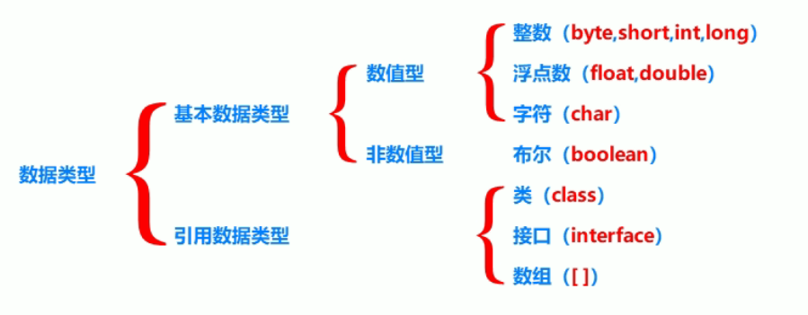</center>


#### 3.3.2 内存占用和取值范围

<center>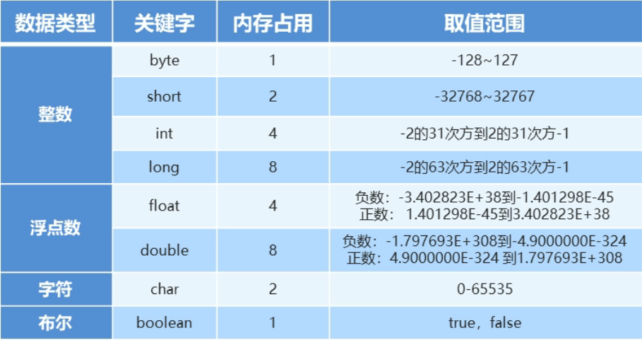</center>


### 3.4 变量

变量：在程序运行过程中，其值可以发生改变的量

从本质上讲，变量是内存中的一小块区域。

#### 3.4.1 变量定义

- 格式：数据类型 变量名 = 变量值
- 范例：`int a = 10`

**注意事项：**

1. 整数变量默认类型为int， 浮点数变量默认为double
2. 变量名字不能重复
3. 变量未赋值不能使用
4. long类型的变量定义时，为了防止整数过大，后面要加L
5. float类型的变量定义时，为了防止类型不兼容，后面要加F

```java
public class VariableDemo {
    public static void main(String[] args) {
        long l = 10000000000L;	// 不能这样声明：long l = 10000000000
        System.out.println(l);
        float f = 3.14f;		// 不能这样声明：float f = 3.14
        System.out.println(f);
    }
}
```


### 3.5 标识符

#### 3.5.1 规则

1. 由数字、字母、下划线(`_`)和美元符(`$`)组成
2. 不能以数字开头
3. 不能是关键字
4. 区分大小写


#### 3.5.2 常见命名约定

<center>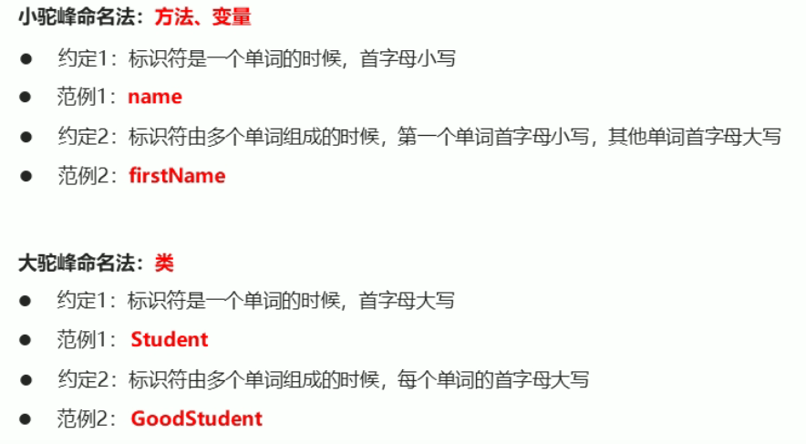</center>


### 3.6 类型转换

#### 3.6.1 自动类型转换

将一个表示**数据范围小**的数值或变量赋值给另一个表示**数据范围大**的变量。

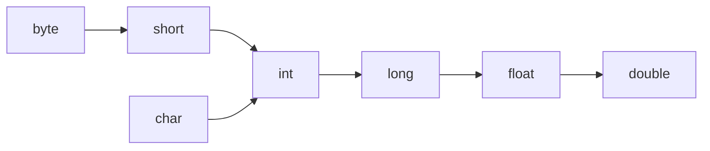
```mermaid
	graph LR;
		byte --> short
		short --> int
		char --> int
		int --> long
		long --> float
		float --> double
```


#### 3.6.2 强制类型转换

将一个表示**数据范围大**的数值或变量赋值给另一个表示**数据范围小**的变量。

- 格式：目标数据类型 变量名 = (目标数据类型)值或者变量
- 范例：`int k = (int)88.88`


### 3.7 算术运算符

| 符号 | 作用 |
| :--: | :--: |
|  +   |  加  |
|  -   |  减  |
|  *   |  乘  |
|  /   |  除  |
|  %   | 取余 |

注意：整数相除只能得到整数，要想得到小数，必须有浮点数的参与


#### 3.7.1 字符串的“+”操作

```java
public class VariableDemo {
    public static void main(String[] args) {
        System.out.println("hello" + "world");
        // "helloworld"
        System.out.println("helloWorld" + 666);
        // "helloWorld666"
        System.out.println("helloWorld" + 6 + 66);
        // "helloWorld666"
        System.out.println(1 + 99 + "hello");
        // "100hello"   !!!!
    }
}
```


### 3.8 逻辑运算符

| 符号 |   作用   |                   说明                   |
| :--: | :------: | :--------------------------------------: |
|  &   |  逻辑与  |           结果均为true则为true           |
|  \|  |  逻辑或  |          结果均为false则为false          |
|  ^   | 逻辑异或 |     结果不同则为true，相同则为false      |
|  !   |  逻辑非  | 结果为true则为false，结果为false则为true |


### 3.9 短路逻辑运算符

| 符号 |  作用  |           说明           |
| :--: | :----: | :----------------------: |
|  &&  | 短路与 | 如果左边为假，右边不执行 |
| \|\| | 短路或 |   左边为真，右边不执行   |


### 3.10 三元运算符

- 格式：关系表达式?表达式1：表达式2
- 范例：a>b?a:b;

计算规则：

1. 首先计算关系表达式的值
2. 如果值为true，表达式1的值就是运算结果
3. 如果值为false，表达式2的值就是运算结果


### 3.11 数据输入

**Scanner使用的基本步骤**

:one: 导包

```java
import java.util.Scanner;
// 导包的动作必须出现在类定义的上边
```

:two: 创建对象

```java
Scanner sc = new Scanner(System.in);
```

:three: 接收数据

```java
int i = sc.nextInt();
```


### 3.12 Random

作用：用于产生一个随机数

使用步骤:

:one: 导包

```java
import java.util.Random;
```

:two: 创建对象

```java
Random r = new Random();
```

:three: 获取随机数

```java
int number = r.nextInt(10);
// 获取随机数的范围为：[0,10), 包括0，但不包括10
```


### 3.13 数组

数据是一种用来存储==多个相同类型数据==的存储类型

#### 3.13.1 数组的定义格式

- 格式一： 数据类型`[]`  变量名
- 范例：`int[] arr`


- 格式二： 数据类型  变量名`[]`
- 范例：`int arr[]`

**注意：**这两种格式在使用上是等价的，但推荐第一种格式。


#### 3.13.2 数组的初始化

**动态初始化：**初始化时仅指定数组长度，由系统为数组分配初始值。

- 格式：数据类型`[]`  变量名 = new 数据类型`[数组长度]`
- 范例：`int[] arr = new int[3];`

**静态初始化：**初始化时，指定每个数组元素的初始值，由系统决定数组长度。

- 格式：数据类型`[]` 变量名 = new 数据类型`[]` {数据1， 数据2， 数据3}；
- 范例：`int[] arr = new int[] {1, 2, 3};`
- 简化格式：`int[] arr = {1, 2, 3};`


#### 3.13.3 内存分配

<center>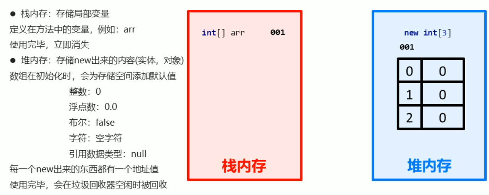


## 4. java流程控制

### 4.1 流程控制语句分类

- 顺序结构
- 分支结构`if`, `switch`
- 循环结构`for`, `while`, `do...while`


### 4.2 switch语句格式

```
switch(表达式) {
	case 值1:
		语句体1;
		break;
	case 值2:
		语句体2;
		break;
	...
	default:
		语句体n+1;
		break;
}
```

**注意事项： case穿透**

如果在一个语句体结束之后，没有break，就会继续执行下面的case，直到遇到break为止。合理利用case穿透现象可以简化程序。

```java
// case穿透现象的应用示例
switch(month) {
    case 1:
    case 2:
    case 12:
        System.out.println("冬季");
        break;
    case 3:
    case 4:
    case 5:
        System.out.println("春季");
        break;
}
```


## 5. IDEA的安装与使用


### 5.1 IDEA概述

IDEA是用于Java语言开发的集成环境，它是业界公认的目前用于java程序开发的最好的工具。

**集成环境：**把代码==编写、编译、执行、调试==等多种功能综合到一起的开发工具


### 5.2 IDEA创建项目流程

:one: 创建空项目

<center>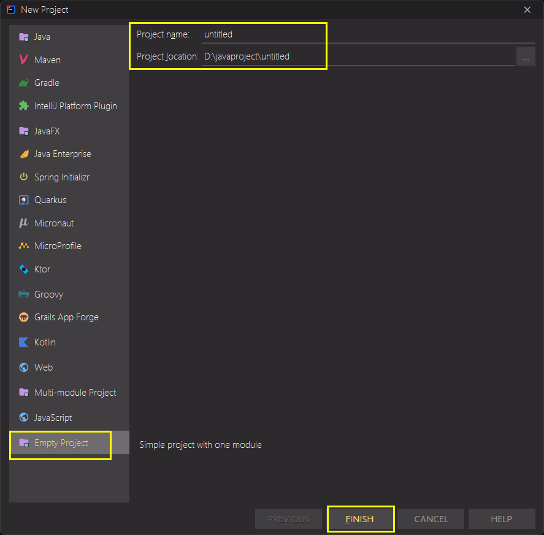</center>

:two: 创建新模块

<center>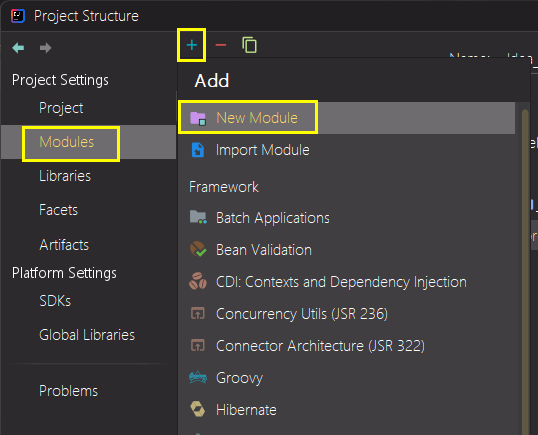</center>

:three: 在模块下的src下创建一个包

<center>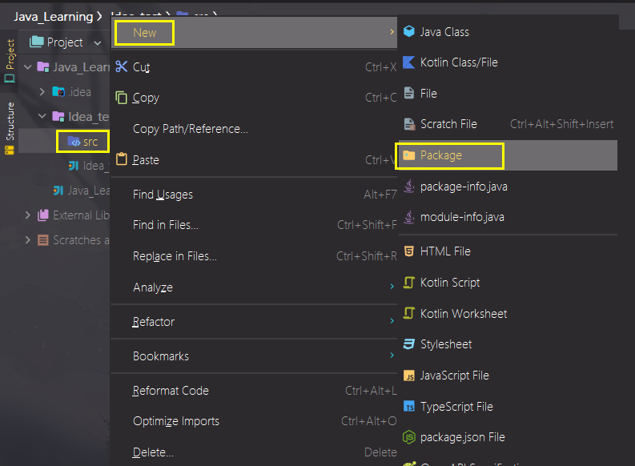</center>

:four: 在包下创建一个类

<center>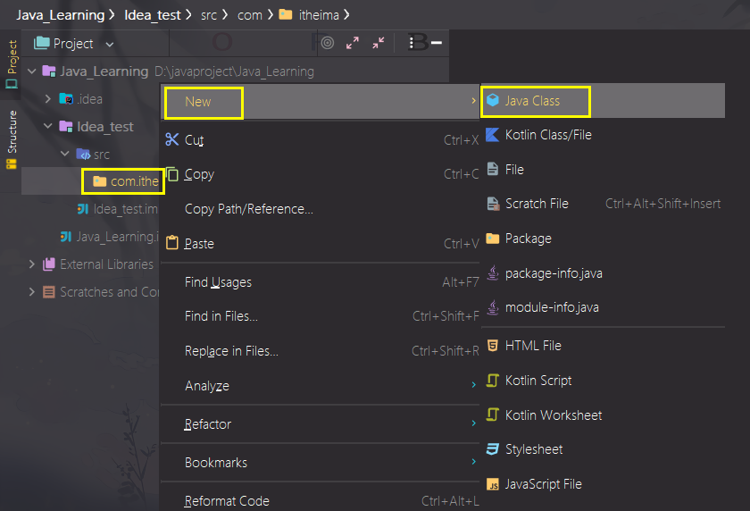

:five: 在类中编写代码

:six: 在idea中执行程序(生成的class文件在out目录下)

<center>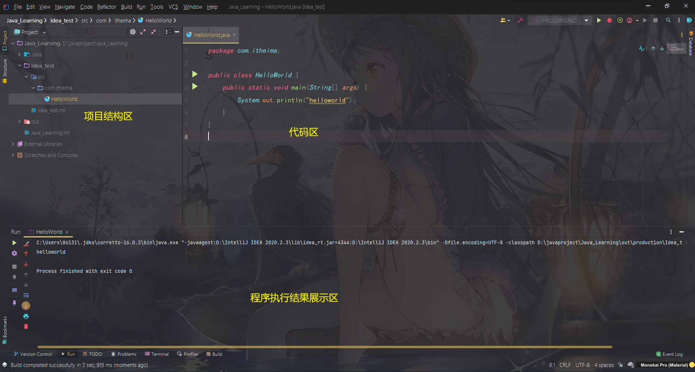


### 5.3 IDEA项目结构

<center>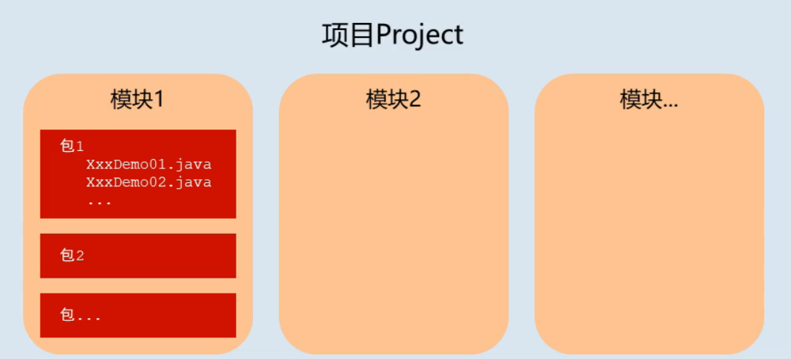


### 5.4 IDEA中内容辅助键和快捷键

#### 5.4.1 内容辅助键

- 快速生成语句
    - 快速生成main()方法：`psvm，回车` 或者 `main， 回车`
    - 快速生成输出语句：`sout, 回车`
- 内容辅助键
    - `Ctrl + Alt + space`: 内容提示， 代码补全等(新版本可能无法使用，直接tab即可)。

#### 5.4.2 注释键

- 单行注释：选中代码，`ctrl + /`
- 多行注释：选中代码，`ctrl + shift + /`


### 5.5 IDEA中模块操作

- 新建模块：操作见上面创建项目

- 删除模块

    <center>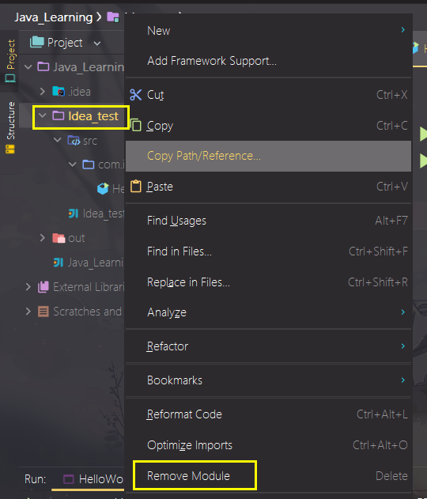

- 导入模块

    <center>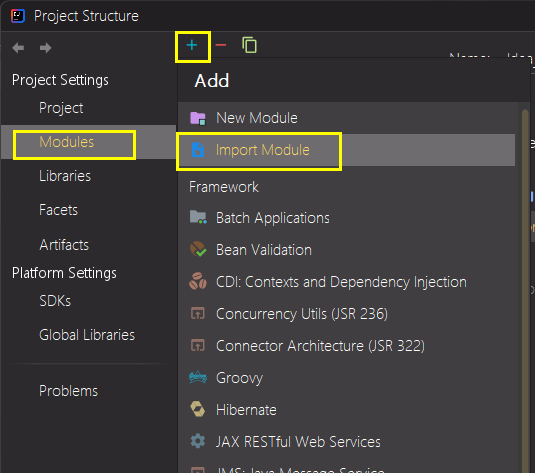


## 6. java初级进阶

### 6.1 方法

#### 6.1.1 方法概述

- ==方法==是将具有独立功能的代码块组织成为一个整体，使其具有特殊的代码集。
- 方法必须先创建才能使用，该过程成为==方法定义==
- 方法创建后并不是直接运行的，需要手动使用后才可以执行，该过程称为==方法调用==。


#### 6.1.2 方法定义和调用

- 定义的格式：

    ```java
    public static void 方法名() {
        // 方法体
    }
    ```

- 调用的格式：

    ```java
    方法名();
    ```

- 带参数方法的定义：

    ```java
    public static void isEvenNumber(int a, int b) {
        // 方法体
    }
    ```


#### 6.1.3 方法的注意事项

- 方法==不能嵌套定义==
- void表示无返回值，可以省略return， 也可以单独的书写return，后面不加数据。
- 定义方法时，要做到==两个明确==
    - 明确返回值类型
    - 明确参数类型和数量


#### 6.1.4 方法重载

**方法重载**指同一个类中定义的多个方法之间的关系，这些方法只有满足下列条件才相会构成重载

- 多个方法在==同一个类中==
- 多个方法具有==相同的方法名==
- 多个方法的==参数不相同==或者==类型不同==或者==数量不同==

**特点：**

1. 重载仅对应方法的定义，与方法的调用无关
2. 重载仅针对同一个类中方法的==名称与参数进行识别==，与==返回值无关==，不能通过返回值来判断方法是否重载。
3. 在调用时，java虚拟机会通过==参数的不同==来区分同名的方法。


方法重载范例；

```java
/* 示例一 */
public class MethodDemo {
    public static void fn(int a) {
        // 方法体
    }
    public static void fn(double a) {
        // 方法体
    }
}

/* 示例二 */
public class MethodDemo {
    public static float fn(int a) {
        // 方法体
    }
    public static int fn(int a, int b) {
        // 方法体
    }
}
```


### 6.2 Debug

**Debug:**是供程序员使用的程序调试工具，它可以用于==查看程序的执行流程==，也可以用于追踪程序的执行过程来==调试程序==。

Debug调试又称为断点调试，断点其实是一个标记，告诉我们从哪里查看。


### 6.3 类和对象

#### 6.3.1 类

类的重要性：是java程序的基本组成单位

类的定义：是对现实生活中一类具有==共同属性==和==行为==的事物的抽象，确定对象将会拥有的属性和行为

类的组成：

- 属性：在类中通过==成员变量==来体现(类中方法外的变量)
- 行为：在类中通过==成员方法==来体现。


#### 6.3.2 类的定义

- 步骤：

    ```mermaid
    graph LR;
    	定义类 --> 编写类的成员变量
    	编写类的成员变量 --> 编写类的成员方法
    ```

- 格式：

    ```java
    public class 类名 {
        // 成员变量
        数据类型 变量1;
        数据类型 变量2;
        ....
        // 成员方法
        方法1;
        方法2;
        ....
    }
    ```

- 范例：

    ```java
    public class Phone {
        String brand;
        int price;
        
        public void call() {
            System.out.println("call");
        }
        
        public void sendMessage() {
            System.out.println("message");
        }
    }
    ```


#### 6..3.3 对象

**创建对象：**

- 格式：类名 对象名 = new 类名();
- 范例：`Phone p = new Phone();`

**使用对象：**

1. 使用成员变量
    - 格式：对象名.变量名
    - 范例：`p.brand`
2. 使用成员方法
    - 格式：对象名.方法名
    - 范例：`p.call()`

```java
public class PhoneDemo {
    public static void main(String[] args) {
        Phone p = new Phone();
        p.brand = "小米";
        p.price = 2999;
        System.out.println(p.brand);
        System.out.println(p.price);
        p.call();
        p.sendMessage();
    }
}
```


#### 6.3.4 对象内存图及调用过程

<center>
    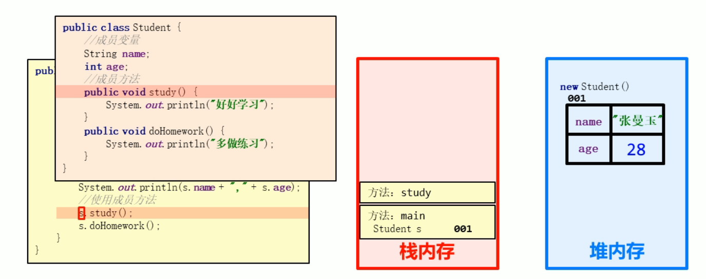
    <br>
    <b>study方法调用完毕后，出栈，doHomework入栈 </b><br>
    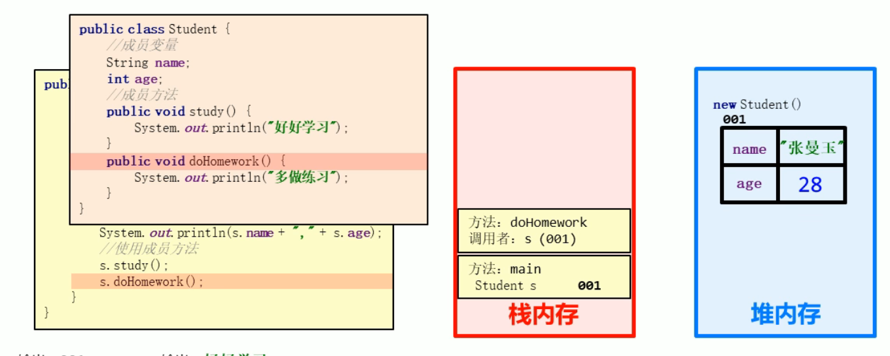
</center>


#### 6.3.5 成员变量和局部变量

<center>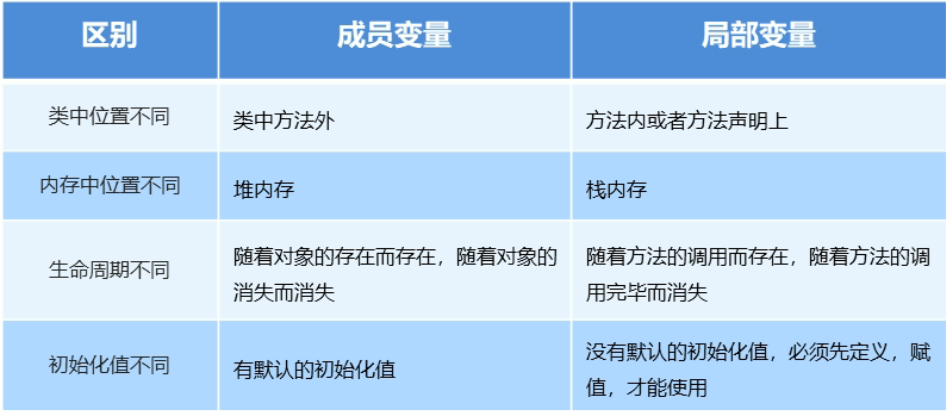


### 6.4 ==封装==

#### 6.4.1 private关键字

- 是一个==权限修饰符==
- 可以修饰成员变量和成员方法
- 作用是：保护成员不被别的类使用，被private修饰的成员只在本类中才能访问

针对private关键字修饰的成员变量，如果需要被其他类使用，必须提供相应的操作

- 提供“get变量名()”方法，获取成员变量的值，方法用public修饰
- 提供“set变量名(参数)",用于设置成员变量的值，方法用public修饰

==通过以上方式可以处理输入数据的安全问题==


范例：

```java
package com.itheima02;

public class Student {
    String name;
    private int age;

    public void setAge(int a) {
        if (a >= 120 || a <= 0) {
            System.out.println("你输入的年龄有误");
        } else {
            age = a;
        }
    }

    public int getAge() {
        return age;
    }

    public void show() {
        System.out.println(name + "," + age);
    }
}


public class StudentDemo {
    public static void main(String[] args) {
        Student stu = new Student();
        stu.name = "小明";
        stu.setAge(-30);
        stu.show();
        stu.setAge(30);
        stu.show();
        System.out.println("getAge方法测试结果：" + stu.getAge());
    }
}

// OUT
你输入的年龄有误
小明,0
小明,30
getAge方法测试结果：30
```


#### 6.4.2 this关健字

1. this修饰的变量用于指代==成员变量==
    - 方法的形参如果与成员变量同名，不带this修饰的变量指的是形参，而不是成员变量
    - 方法的形参没有与成员变量同名，不带this修饰的变量指的是成员变量
2. this解决==局部变量隐藏成员变量的问题==
3. this：代表所在类的对象引用。==方法被哪个对象调用，this就代表哪个对象==。


#### 6.4.3 封装的概念

<center>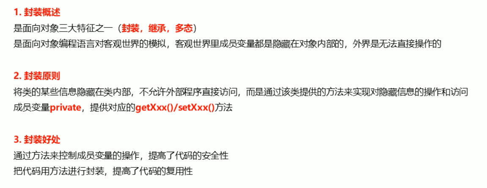


### 6.5 构造方法

构造方法是一种特殊方法，作用是在创建对象时完成对象数据的初始化。当一个类中没有构造方法，系统将默认给类一个无参的构造方法。·

**基本格式:**

```java
public class 类名 {
    修饰符 类名(参数) {
        //内容
    }
}
// 范例
public class Student {
    public Student() {
        //内容
    }
}
```


**注意事项：**

<center>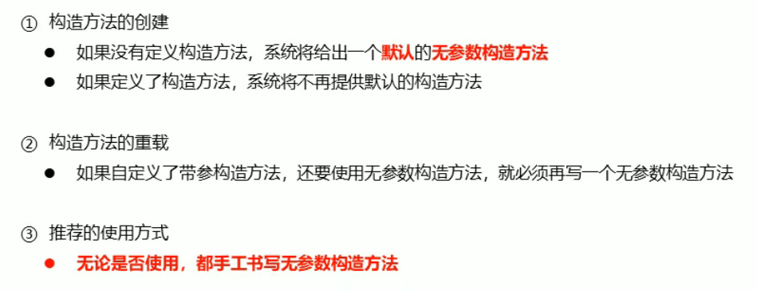


**标准类的制作：**

<center>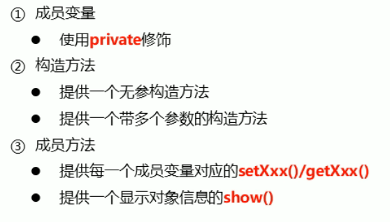

**范例：**

```java
package com.itheima;

public class Student {
    // 成员变量
    private String name;
    private int age;

    // 构造方法
    public Student() {
    }

    public Student(String name, int age) {
        this.name = name;
        this.age = age;
    }

    // 成员方法
    public void setName(String name) {
        this.name = name;
    }

    public String getName() {
        return name;
    }

    public void setAge(int age) {
        this.age = age;
    }

    public int getAge() {
        return age;
    }

    public void show() {
        System.out.println(name + "," + age);
    }
}


public class StudentDemo {
    public static void main(String[] args) {
        // 无参构造
        Student s1 = new Student();
        s1.setName("小明");
        s1.setAge(30);
        s1.show();

        // 带参构造
        Student s2 = new Student("小刚", 20);
        s2.show();
    }
}
```


### 6.6 API

#### 6.6.1 API概述

API(Application Programming Interface):应用程序编程接口（本质上就是一些接口类，这些类中定义好了一些有用的方法）

Java API：指的就是JDK中提供的各种功能的java类。我们可以通过==帮助文档==来查看这些类。java.lang包下的类不需要导包。


#### 6.6.2 如何使用帮助文档

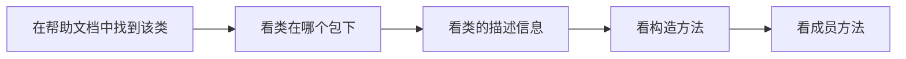
```mermaid
	graph LR;
		在帮助文档中找到该类 --> 看类在哪个包下
		看类在哪个包下 --> 看类的描述信息
		看类的描述信息 --> 看构造方法
		看构造方法 --> 看成员方法
```


### 6.7 String

#### 6.7.1 概述

<center>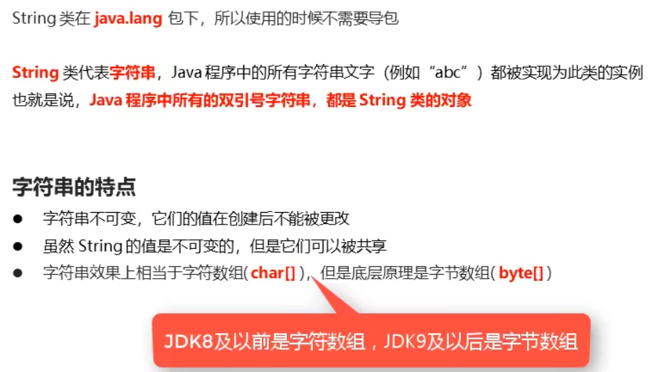


#### 6.7.2 构造方法：

<center>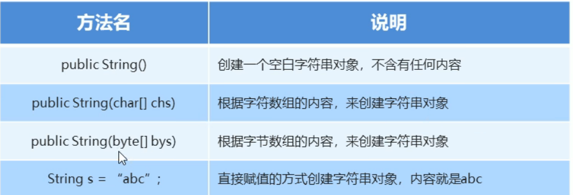


#### 6.7.3 String对象特点

1. 通过new创建的字符串对象，每一次new都会申请一个内存空间，即使内容相同，它们的地址也是不同的。
2. 通过`“”`方式给出的字符串，只要字符序列相同（顺序和大小写），无论在代码中出现几次，都只是一个String对象。


#### 6.7.4 字符串的比较

- 使用`==`作比较
    - 基本类型：比较的是==数据值==是否相同
    - 引用类型：比较的是==地址值==是否相同
- 使用`equals()`
    - 比较的是引用的内容是否相同。


#### 6.7.5 案例

##### 统计字符串中大写字母，小写字母，及数字个数。

```java
import java.util.Scanner;

public class StringCount {
    public static void main(String[] args) {
        Scanner sc = new Scanner(System.in);
        System.out.println("Please input the String:");
        String str = sc.nextLine();
        int count1 = 0, count2 = 0, count3 = 0;
        for (int i = 0; i < str.length(); i ++) {
            char ch = str.charAt(i);
            if (ch >= 'A' && ch <= 'Z') {
                count1 ++;
            }else if (ch >= 'a' && ch <= 'z') {
                count2 ++;
            } else if(ch >= '0' && ch <= '9') {
                count3 ++;
            }
        }
        System.out.println("大写字母：" + count1);
        System.out.println("小写字母：" + count2);
        System.out.println("数字：" + count3);
    }
}
```


##### 字符串反转

```java
import java.util.Scanner;

public class StringReverse {
    public static void main(String[] args) {
        Scanner sc = new Scanner(System.in);
        String str = sc.nextLine();
        String ans = reverse(str);
        System.out.println(ans);
    }

    public static String reverse(String str) {
        String ans = "";
        for (int i = str.length() - 1; i >= 0; i --) {
            ans += str.charAt(i);
        }
        return ans;
    }
}
```


### 6.8 StringBulider

#### 6.8.1 概述

<center>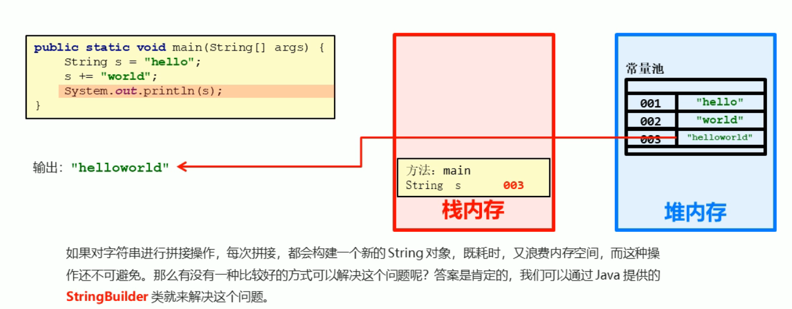
    <br><br>
    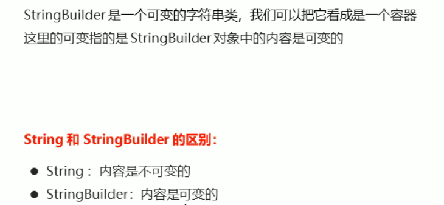


#### 6.8.2 范例

```java
// 范例1
public class StringBuilderDemo {
    public static void main(String[] args) {
        StringBuilder sb = new StringBuilder();
        // 链式编程
        sb.append("hello").append(" world").append(" 123");
        System.out.println(sb);
    }
}


// 范例2
public class StringBuilderDemo {
    public static void main(String[] args) {
        int[] arr = {1, 2, 3};
        System.out.println(arrayToString(arr));
        String str = "abcd";
        System.out.println(myRverse(str));
    }

    public static String arrayToString(int[] arr) {
        StringBuilder sb = new StringBuilder("[");
        for (int i = 0; i < arr.length; i ++) {
            sb.append(i);
            if (i < arr.length - 1) {
                sb.append(",");
            }
        }
        sb.append("]");
        return sb.toString();
    }

    public static String myRverse(String str) {
        StringBuilder sb = new StringBuilder(str);
        return sb.reverse().toString();
    }
}
```


<center>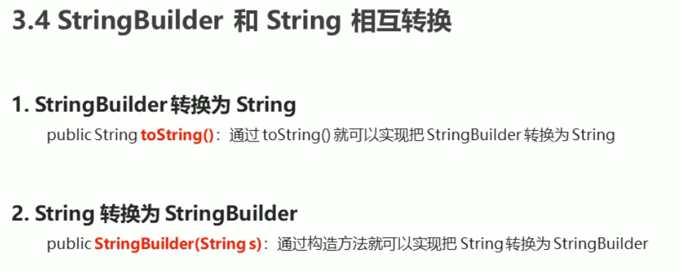


### 6.9 集合

#### 6.9.1 集合概述

集合类的特点：提供一种==存储空间可变==的存储模型，存储的数据容量可以发生改变。

**案例：集合存储学生对象，并遍历**

```java
// 定义学生类
public class Student {
    // 成员变量
    private String name;
    private int age;

    // 构造方法
    public Student() {
    }

    public Student(String name, int age) {
        this.name = name;
        this.age = age;
    }

    // 成员方法
    public void setName(String name) {
        this.name = name;
    }

    public String getName() {
        return name;
    }

    public void setAge(int age) {
        this.age = age;
    }

    public int getAge() {
        return age;
    }
}

// 遍历
public class ArrayListTest {
    public static void main(String[] args) {
        // 创建集合对象
        ArrayList<Student> array = new ArrayList<>();

        // 创建学生对象
        Student stu1 = new Student("小明", 18);
        Student stu2 = new Student("小刚", 13);
        Student stu3 = new Student("小李", 19);

        // 添加学生对象到集合中
        array.add(stu1);
        array.add(stu2);
        array.add(stu3);

        // 遍历集合
        for (int i = 0; i < array.size(); i++) {
            Student s = array.get(i);
            System.out.println(s.getName() + "," + s.getAge());
        }
    }
}
```


### 6.10 ==继承==

- java中类只支持单继承，不支持多继承
- java中类支持多层继承

#### 6.10.1 继承概述

继承是面向对象三大特征之一。可以使得子类具有父类的属性和方法，还可以在子类中重新定义，最佳属性和方法。

#### 6.10.2 格式

- 格式：public class 子类名 extends 父类名{}
- 范例：`public calss Zi extends Fu {}`
- Fu: 是父类，也称为基类、超类。
- Zi：是子类，也被称为派生类。


继承中子类的特点：

- 子类可以有父类的内容
- 子类可以有自己特有的内容

```java
// 父类
public class Fu {
    public void show() {
        System.out.println("show方法被调用");
    }
}

//子类
public class Zi extends Fu{
    public void method() {
        System.out.println("method方法被调用");
    }
}

// 测试类
public class Demo {
    public static void main(String[] args) {
        Fu f = new Fu();
        f.show();

        Zi z = new Zi();
        z.method();
        z.show();
    }
}
```


#### 6.10.3 继承的好处和缺点

<center>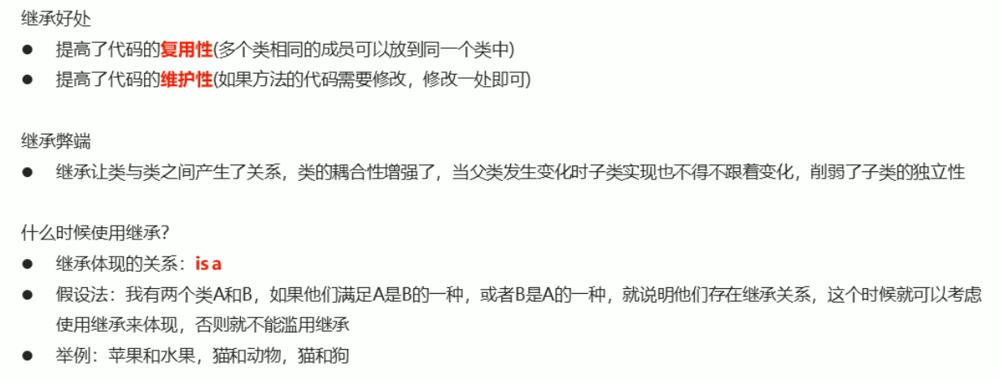


#### 6.10.4 继承中变量的访问特点

在子类方法中访问一个变量的查找顺序：

1. 子类方法内部局部范围查找
2. 子类成员范围查找
3. 父类成员方法查找
4. 如果都没有就报错（不考虑父类的父类）


#### 6.10.5 super

```java
// 父类
public class Fu {
    public int age = 40;
}

// 子类
public class Zi extends Fu {
    public int age = 20;

    public void show() {
        int age = 30;
        System.out.println(age);
        System.out.println(this.age); // 访问子类成员变量
        System.out.println(super.age); // 访问父类成员变量
    }
}

// 测试类
public class Demo {
    public static void main(String[] args) {
        Zi z = new Zi();
        z.show();
    }
}
```

<center>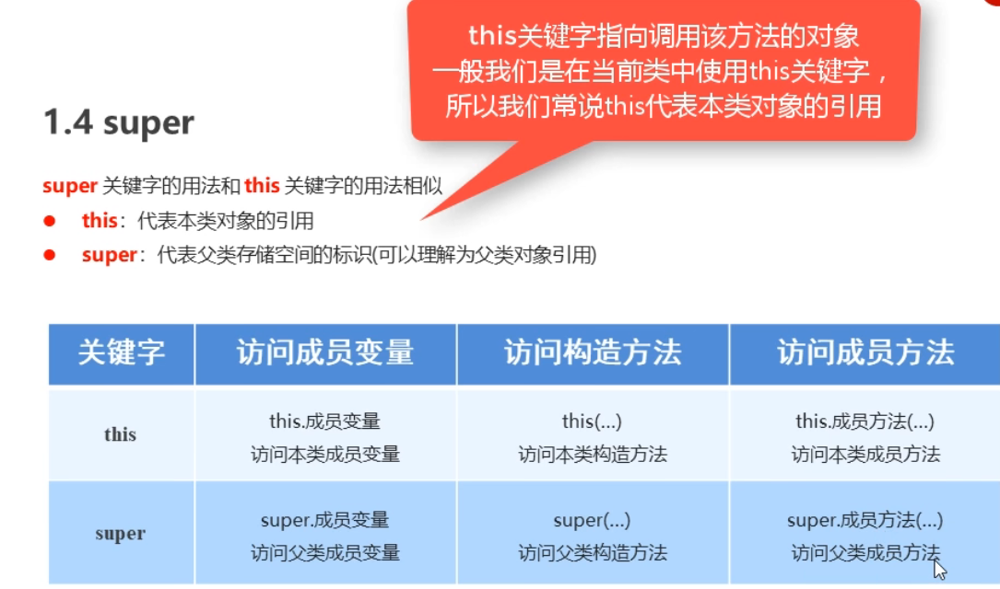


#### 6.10.6 继承中构造方法的访问特点

<center>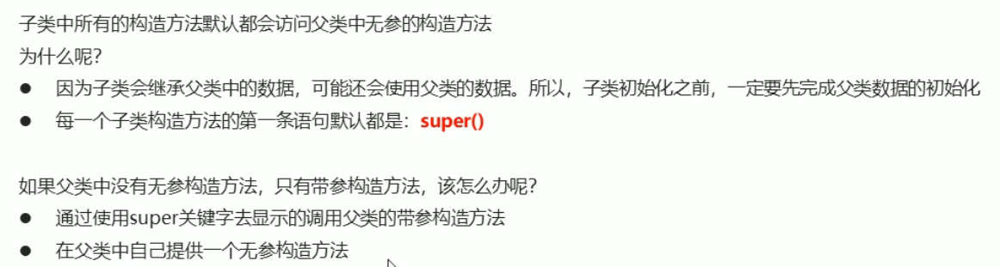


#### 6.10.7 继承中成员方法的访问特点

通过子类对象访问一个方法

- 子类成员范围查找
- 父类成员范围查找
- 都没有则报错（不考虑父类的父类）


#### 6.10.8 super内存图

<center>
    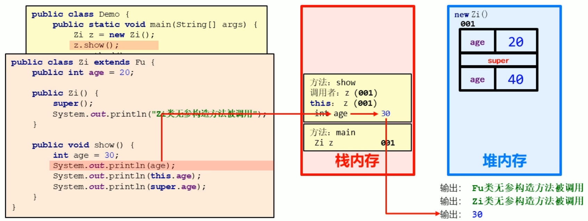
    <br><br>
    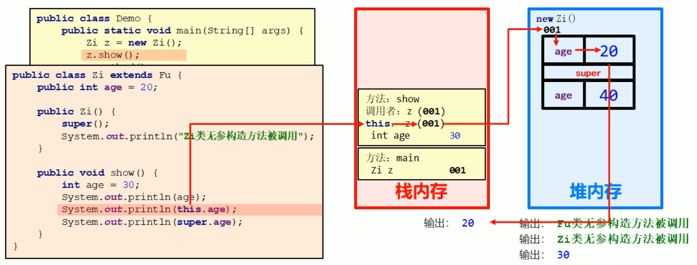
    <br><br>
    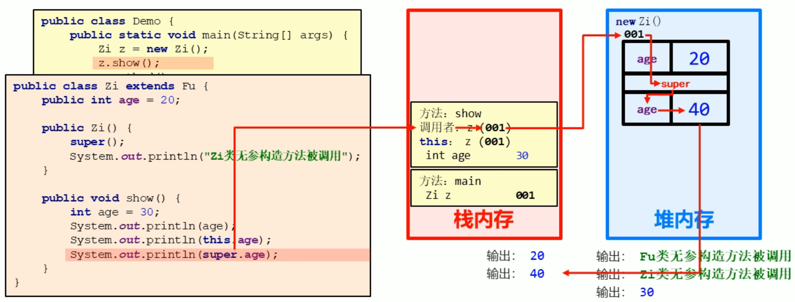


#### 6.10.9 方法重写

方法重写：子类中出现了和父类中一模一样的方法声明

方法重写的应用：当子类需要父类的功能，而功能主体子类有自己特有的内容时，可以重写父类中的方法，这样，既沿袭了父类的功能，又定义了子类特有的内容。

==@Override==

- 是一个注解。
- 可以帮助我们检查重写方法的方法声明的正确性。


**注意事项：**

1. 私有方法不能被重写（父类私有成员子类是不能继承的）
2. 子类方法访问权限不能更低(public  > 默认 > 私有)


### 6.11 包

#### 6.11.1 概述

包其实就是文件夹

作用：对类进行分类管理

包的定义格式

- 格式：package 包名； （多级包用`.`分开
- 范例：`package com.itheima;`

<center>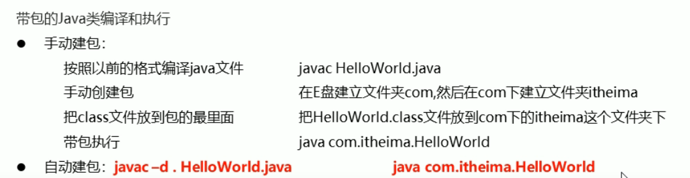


#### 6.11.2 导包

```java
// 格式
import cn.itcast.Teacher
```


### 6.12 修饰符

- 权限修饰符

    <center>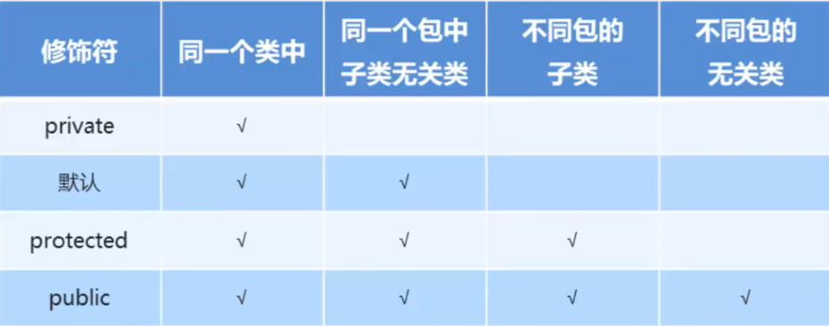

- 状态修饰符

    - final：是最终的意思，可以修饰成员方法，成员变量，类

        - 修饰方法时：表示该方法是最终方法，==不能被重写==
        - 修饰变量时：表示该变量是常量，==不能再次被赋值==
            - 变量是基本类型时：final修饰指的是==基本类型的数据值==不能发生改变。
            - 变量是引用类型时：final修饰指的是==引用类型的地址值==不能发生改变，但地址里面的内容是可以改变的。
        - 修饰类：表明该类是最终类，==不能被继承==

    - static：是静态的意思，可以修饰成员方法，成员变量（有点像全局变量的意思）

        - 被类的所有对象共享

        - 可以通过类名调用（推荐），也可以通过对象名调用

            <center>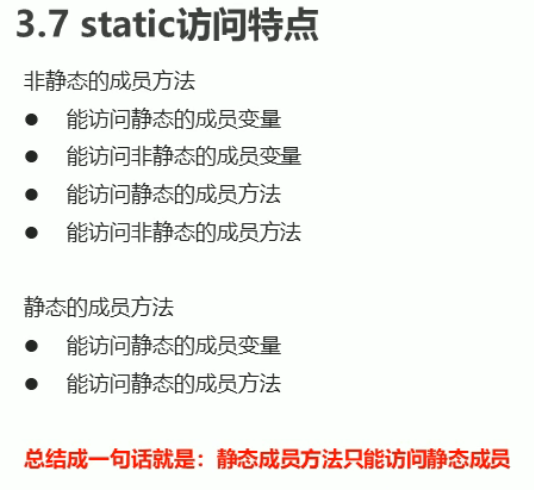


### 6.13 ==多态==

#### 6.13.1 多态概述

同一个对象，在不同时刻表现出来的不同状态

> 举例：学生
>
> 我们可以说学生是学生： `Student stu = new Student();`
>
> 我们也可以说学生是人：`Person stu = new Student();`
>
> 这里学生在不同时刻表现出来了不同的形态，这就是多态。


多态的前提和体现

- 有继承或实现的关系
- 有方法重写
- 有父类引用指向子类对象


#### 6.13.2 多态中成员访问特点

- 成员变量：编译看左边，执行也看左边
- 成员方法：编译看左边，执行看右边

为什么成员变量和成员方法的访问不一样呢？

- 因为成员方法有重写，而成员变量没有。


#### 6.13.3 多态的好处和弊端

- 好处：提高了程序的拓展性
    - 具体体现：定义方法时，使用父类型作为参数，将来在使用的时候，使用具体的子类型参与操作
- 弊端：不能使用子类的特有功能。


#### 6.13.4 多态中的转型

- 向上转型
    - 从子到父
    - 父类引用==指向==子类对象
- 向下转型
    - 从父到子
    - 父类引用==转为==子类对象


```java
public class Demo {
    public static void main(String[] args) {
        // 多态
    	Animal a = new Cat(); // 向上转型
        
        Cat c = (Cat)a; // 向下转型
        
    }
}
```


