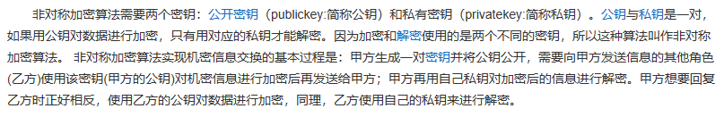

# Python爬虫

## 1. 爬虫基础

### 1.1 爬虫分类

- 通用爬虫：
    - 抓取系统的重要组成部分，抓取的是一整张页面数据。
- 聚焦爬虫：
    - 建立在通用爬虫基础之上，抓取的是页面中特定的局部内容。
- 增量式爬虫：
    - 检测网站中数据更新的情况，只会抓取网站中最新更新出来的数据。

### 1.2 反爬机制

门户网站，通过制定相应的策略或者技术手段，防止爬虫程序进行网站数据的爬取。

反爬机制的一个代表：robots.txt协议，它规定了网站中哪些数据可以被爬取哪些数据不可以被爬取，但是它是一种君子协议。

### 1.3 http&https协议

- http协议，是服务器和客户端进行数据交互的一种形式。

    - 常用请求头信息
        - User-Agent：请求载体(浏览器等发起请求的东西)的身份标识。
        - Connection：请求完毕后，是断开连接还是继续保持连接
    - 常用响应头信息
        - Content-Type：服务器响应回客户端的数据类型

- https协议，是一种安全的http协议，在传输数据的过程中进行了数据加密。

    - 数据加密方式

        - 对称密钥加密

        - 非对称密钥加密

            

        - 证书密钥加密

