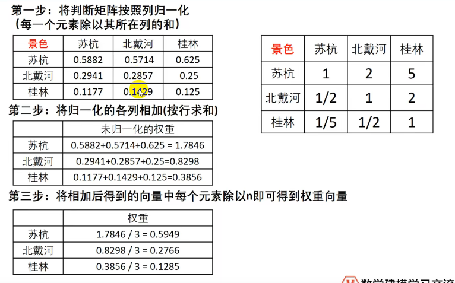

# 数学模型

## 1. 综合评价与决策方法

### 1.1 层次分析法

#### 1.1.1 用途

决策模型，用来决策多种方案中哪一种方案更好，或者评价多位运动员哪一位表现更好。

#### 1.1.2 示例

    
    
    
    
    
    
    
    
    
    

​    但是我们构造出来的判断矩阵(通过一致性检验)不一定是一致矩阵，那此时应该如何处理？                                       

     
     
     
     
     
     

通常我们采用第三种求权重的方法（小绿书上就是）

#### 1.1.3 一些补充

**绘图表示**

**骚操作**

